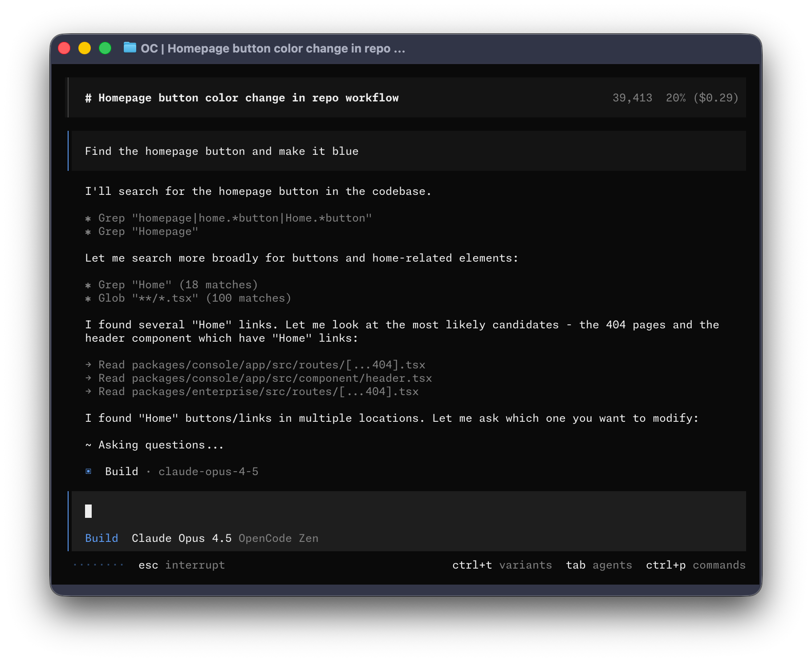

<p align="center">
  <a href="https://solace.ofharmony.ai">
    <picture>
      <source srcset="packages/console/app/src/asset/logo-ornate-dark.svg" media="(prefers-color-scheme: dark)">
      <source srcset="packages/console/app/src/asset/logo-ornate-light.svg" media="(prefers-color-scheme: light)">
      
    </picture>
  </a>
</p>
<p align="center">AI-kodeagent med åpen kildekode.</p>
<p align="center">
  <a href="https://github.com/SolaceHarmony/code-harmony/discussions"></a>
  <a href="https://www.npmjs.com/package/code-harmony"></a>
  <a href="https://github.com/SolaceHarmony/code-harmony/actions/workflows/publish.yml"></a>
</p>

<p align="center">
  <a href="README.md">English</a> |
  <a href="README.zh.md">简体中文</a> |
  <a href="README.zht.md">繁體中文</a> |
  <a href="README.ko.md">한국어</a> |
  <a href="README.de.md">Deutsch</a> |
  <a href="README.es.md">Español</a> |
  <a href="README.fr.md">Français</a> |
  <a href="README.it.md">Italiano</a> |
  <a href="README.da.md">Dansk</a> |
  <a href="README.ja.md">日本語</a> |
  <a href="README.pl.md">Polski</a> |
  <a href="README.ru.md">Русский</a> |
  <a href="README.ar.md">العربية</a> |
  <a href="README.no.md">Norsk</a> |
  <a href="README.br.md">Português (Brasil)</a>
</p>

[](https://solace.ofharmony.ai)

---

### Installasjon

```bash
# YOLO
curl -fsSL https://raw.githubusercontent.com/SolaceHarmony/code-harmony/dev/install | bash

# Pakkehåndterere
npm i -g code-harmony@latest        # eller bun/pnpm/yarn
scoop install code-harmony             # Windows
choco install code-harmony             # Windows
paru -S code-harmony-bin               # Arch Linux
mise use -g code-harmony               # alle OS
nix run nixpkgs#code-harmony           # eller github:SolaceHarmony/code-harmony for nyeste dev-branch
```

> [!TIP]
> Fjern versjoner eldre enn 0.1.x før du installerer.

### Desktop-app (BETA)

CodeHarmony er også tilgjengelig som en desktop-app. Last ned direkte fra [releases-siden](https://github.com/SolaceHarmony/code-harmony/releases) eller [solace.ofharmony.ai/download](https://github.com/SolaceHarmony/code-harmony/releases).

| Plattform             | Nedlasting                            |
| --------------------- | ------------------------------------- |
| macOS (Apple Silicon) | `code-harmony-desktop-darwin-aarch64.dmg` |
| macOS (Intel)         | `code-harmony-desktop-darwin-x64.dmg`     |
| Windows               | `code-harmony-desktop-windows-x64.exe`    |
| Linux                 | `.deb`, `.rpm` eller AppImage         |

```bash
# Windows (Scoop)
scoop bucket add extras; scoop install extras/code-harmony-desktop
```

#### Installasjonsmappe

Installasjonsskriptet bruker følgende prioritet for installasjonsstien:

1. `$CODE_HARMONY_INSTALL_DIR` - Egendefinert installasjonsmappe
2. `$XDG_BIN_DIR` - Sti som følger XDG Base Directory Specification
3. `$HOME/bin` - Standard brukerbinar-mappe (hvis den finnes eller kan opprettes)
4. `$HOME/.code-harmony/bin` - Standard fallback

```bash
# Eksempler
CODE_HARMONY_INSTALL_DIR=/usr/local/bin curl -fsSL https://raw.githubusercontent.com/SolaceHarmony/code-harmony/dev/install | bash
XDG_BIN_DIR=$HOME/.local/bin curl -fsSL https://raw.githubusercontent.com/SolaceHarmony/code-harmony/dev/install | bash
```

### Agents

CodeHarmony har to innebygde agents du kan bytte mellom med `Tab`-tasten.

- **build** - Standard, agent med full tilgang for utviklingsarbeid
- **plan** - Skrivebeskyttet agent for analyse og kodeutforsking
  - Nekter filendringer som standard
  - Spør om tillatelse før bash-kommandoer
  - Ideell for å utforske ukjente kodebaser eller planlegge endringer

Det finnes også en **general**-subagent for komplekse søk og flertrinnsoppgaver.
Den brukes internt og kan kalles via `@general` i meldinger.

Les mer om [agents](https://solace.ofharmony.ai/docs/agents).

### Dokumentasjon

For mer info om hvordan du konfigurerer CodeHarmony, [**se dokumentasjonen**](https://solace.ofharmony.ai/docs).

### Bidra

Hvis du vil bidra til CodeHarmony, les [contributing docs](./CONTRIBUTING.md) før du sender en pull request.

### Bygge på CodeHarmony

Hvis du jobber med et prosjekt som er relatert til CodeHarmony og bruker "opencode" som en del av navnet; for eksempel "opencode-dashboard" eller "opencode-mobile", legg inn en merknad i README som presiserer at det ikke er bygget av CodeHarmony-teamet og ikke er tilknyttet oss på noen måte.

### FAQ

#### Hvordan er dette forskjellig fra Claude Code?

Det er veldig likt Claude Code når det gjelder funksjonalitet. Her er de viktigste forskjellene:

- 100% open source
- Ikke knyttet til en bestemt leverandør. Selv om vi anbefaler modellene vi tilbyr gjennom [CodeHarmony Zen](https://solace.ofharmony.ai/zen); kan CodeHarmony brukes med Claude, OpenAI, Google eller til og med lokale modeller. Etter hvert som modellene utvikler seg vil gapene lukkes og prisene gå ned, så det er viktig å være provider-agnostic.
- LSP-støtte rett ut av boksen
- Fokus på TUI. CodeHarmony er bygget av neovim-brukere og skaperne av [terminal.shop](https://terminal.shop); vi kommer til å presse grensene for hva som er mulig i terminalen.
- Klient/server-arkitektur. Dette kan for eksempel la CodeHarmony kjøre på maskinen din, mens du styrer den eksternt fra en mobilapp. Det betyr at TUI-frontend'en bare er en av de mulige klientene.

---

**Bli med i fellesskapet** [Discord](https://github.com/SolaceHarmony/code-harmony/discussions) | [X.com](https://github.com/SolaceHarmony/code-harmony)
