# The CPU decode engine

How `liquid-audio` decodes LFM2.5-Audio on the CPU at real-time edge, and where it is going.

This document has two registers, kept strictly apart:

- **As-built** sections describe what is in the working tree *now*, verified against the
  source (`native/src/io/safetensors.cpp`, `native/src/model/lfm_model.cpp`,
  `native/src/runtime/voice_session.cpp`, `native/src/engine/flashkern_engine.cpp`,
  `src/native_voice.rs`, and `native/kernels/*`). If it says "as-built", the code
  does it.
- **The contract** and **Build order → Planned** sections describe *agreed design* that is
  not yet built. Nothing in a "planned" block is running today.

The kernel-level companion is `docs/FLASHKERN.md` (the Metal-idiom → NEON/AVX opcode map and
the full kernel inventory, incl. Group H). This document is about the *engine*: memory tiers,
the dispatch model, verification, and the build order.

---

## 0. As-built architecture (2026-07-16 working tree)

The shipped LFM2 CPU path is native from accepted text/PCM through emitted text/PCM.
Rust owns opaque lifecycle, platform audio, VAD/endpointing, settings, and the current
product observer adapter; it does not own weights, tensors, tokens, model state,
sampling, or model recurrence.

- `safetensors.cpp` loads main and codec sources into one byte-exact, page-table
  read-only image. `LfmModel` owns that image and binds frontend, Conformer,
  backbone, Depthformer, Mimi, and tokenizer plans directly from immutable typed
  byte views.
- `LfmConversation` owns BF16 KV/short-convolution state, frontend/Conformer/Mimi
  workspaces, bounded tokenizer storage, sampler PRNG, the monotonic context cursor,
  and sliding-window rollover. No Rust model object participates in a turn.
- `LfmSession` owns text/PCM admission, ticket/epoch correlation, reliable events,
  playback leases, interruption, stop, and the native generation loop. A C++
  coordinator advances recurrence; Rust never waits on or interprets a numerical
  completion.
- Flashkern owns one stable pthread per numerical lane. Typed audio encode,
  backbone, Depthformer, and Mimi requests enter that team and park on
  expected-value words between passes and at generation fences.
  `REQ_AUDIO_ENCODE` carries borrowed PCM/output spans through resample,
  valid-only BF16 frontend, and whole Conformer/adapter orchestration; its
  checkpoint-layout GEMMs run as in-ticket fixed-team substages. A fair
  model-owned expected-value gate serializes legal full-pass boundaries between
  conversations sharing the lane team.

There is no per-pass heap allocation, copied pass payload, Rust lane callback,
bounded spin, or polling. The engine has two descriptor-addressed ticket slots:
each request record borrows payload spans and each slot owns only its activation
scratch bank. A capacity-2 SQ/CQ hands an exact completion a private
generation-bearing permit for that same slot; the callback either resubmits it
atomically or releases it before waking its waiter. Packed `{generation,state}`
CAS transitions prevent slot theft and stale-destructor ABA, and `FREE` is the
final accounting publication edge. The session coordinator has not adopted that
callback yet: it synchronously parks for each exact CQ before submitting the
next pass. Moving that native state machine onto the landed continuation is the
remaining overlap/latency optimization, not a Rust recurrence or ownership gap.

Flashkern is the CPU executor, never the Metal executor. CPU kernels retain NEON,
BFMMLA/BFDOT, AVX2, and AVX-512-BF16 paths. Unsupported Metal selection fails
explicitly; a future MLX C++/Metal peer must preserve the same native model/session
boundary and may not fall back to Candle.

```mermaid
flowchart LR
    Host["Rust platform audio / control"] -->|"current adapter copies into capture lease"| Dock["native PCM + text dock"]
    Dock --> Session["native LfmSession<br/>tickets · epoch · recurrence"]
    Session --> Conv["native LfmConversation<br/>KV · conv · PRNG · rollover"]
    Conv --> Gate["fair expected-value model pass gate"]
    Gate -->|"128-byte SQ cell"| Bridge["native SQ/CQ + retained descriptor"]
    Bridge --> Team["fixed Flashkern pthread lanes"]
    Team --> Board["shared stage board<br/>atomic tile claims"]
    Board --> Kernels["AArch64 / x86_64 leaves"]
    Kernels -->|"exact completion doorbell"| Conv
    Conv -->|"Mimi PCM into playback lease"| Playback["native playback dock"]
    Playback -->|"current Vec/VoiceEvent observer bridge"| Host
```



`REQ_TOKEN_PASS` executes embedding lookup/provided embedding, the native
ShortConv/attention/MLP walk, final norm, and optional sampling in one team entry.
`REQ_DEPTH_FRAME` executes projection, every Depthformer codebook/layer, resident KV
recurrence, collective sampling, and sampled-embedding feedback.
`REQ_MIMI_DECODE` serializes conversation-local codec state through the same SQ/CQ
and writes directly into its retained playback reservation. `REQ_AUDIO_ENCODE`
precedes those passes without exposing mel rows, hidden rows, logits, codes, or
model pointers to Rust. Lower-level request kinds
remain fixture and implementation seams, not the production orchestration surface.

The idle contract is measured, not inferred. On the 2026-07-16 macOS run,
`engine_idle_zero_spin` measured **0.003%** process CPU before a pass and **0.004%**
afterward with eight lanes parked. Historical throughput measurements below remain
useful lineage; new latency numbers must name this executor and exact model/test
configuration.

## 1. The root cause this engine answers

CPU decode of LFM2.5-Audio-1.5B started at **0.13 tok/s** on strong Apple Silicon. Profiling
found the time was not in the math — it was in **weight movement**, three stacked copies of the
same sin on the `M==1` decode path, each hiding under the previous one:

1. `bf16_matmul(x, w.t()).contiguous()` — candle transpose-copied the *entire* weight per
   linear per token (`copy_strided_src` was ~97% of samples).
2. the GEMV kernel transposed `B` into a thread-local buffer every call (~0.6 GB/s effective
   on a ~200 GB/s machine).
3. everything single-threaded.

Two principles fell out and drive every design choice below:

- **Reads are the floor, weight movement is theft.** Touching the weights is compulsory
  physics (~3 GB/token dense ⇒ a ~10 ms/token floor on this memory system). Any *movement* on
  top of that read — memcpy, transpose, repack, staging, dtype copy — is pure waste. Kernels
  must consume weights in checkpoint-native layout.
- **The dispatch model is the intended execution model, not a demo.** Per-op candle
  fork/join (candle op → rayon fork/join → tensor alloc → bf16↔f32 cast, ~240 ops/token) is
  exactly what a GPU never does. A GPU enters once and data flows through shared state between
  stage fences. The CPU path is moving in that direction in layers: first threadgroup-style
  fused regions, now the resident native stage machine for the FFN MLP, and finally one
  full-pass engine entry.

Both were learned by measuring GB/s effective and sampling the live process, not by
theorizing. See `docs/FLASHKERN.md` for the kernel-side story.

---

## 2. The contract (AGREED DESIGN — not all built)

The settled architecture for the decode engine. This is the target; §4 says how much is
as-built. Read this as the spec, not the changelog.

1. **Weights.** ONE resident raw image for the process; the native loader owns a
   component-scoped `(Main|Codec, name) → (offset, dtype, shape)` catalog parsed
   straight from safetensors. This is as-built for LFM2. Candle is an offline
   oracle, not a production owner. Reads are the floor; any weight movement is
   theft on top of it.
2. **Compute.** resident bytes -> assembly vector registers -> f32 accumulates **in registers** -> one
   round-to-nearest-even → KB-scale bf16 activation writes. f32 never exists as *planes*, only
   as register accumulators (an rb-epilogue in every kernel). **KV planes are bf16** (torch's
   cache dtype — f32 KV was the wrong call twice over: memory *and* fidelity).
3. **Dispatch.** the native conversation submits and recurs full passes without a
   Rust model-progress edge. The persistent pinned P-core lane team runs the
   chain as a resident stage machine: publish stage state, bump epoch, workers
   pull tile indices with an atomic counter, and the last worker rings the native
   continuation. Sampling is an assembly collective; results land in native
   ring slots. The doorbell (epoch + reason word) is checked at the **pass boundary
   and nowhere inside**; event backpressure never touches it.
4. **Transport.** Rings + `(offset, len, epoch)` descriptors, no owned `Vec` payloads on hot
   surfaces.

For LFM2, weight/compute ownership, the typed audio-input request, and native
recurrence are built. The remaining contract gaps are adoption of the landed
capacity-2 completion callback by the native session coordinator, and replacement
of the legacy Rust `Vec`/`VoiceEvent` audio observer with the physical kcoro
audio-device adapter.
This statement does not include a native Moshi port.

**Lineage.** The learned lessons come from the sibling m2-bert-mlx project (same team as
LFM2-Audio / Hyena / Monarch): whole-conv-in-one-dispatch vs streamed split at sync
boundaries, exactly-one 1/N FFT normalization, double-double at the spectral multiply.
flashkern's `fanout`/`dd` ports already embody these.

---

## 3. Memory model (tiers)

Where every byte lives on the decode path, from the most durable to the most ephemeral.

### Tier 0 — Weights (AS-BUILT: one immutable combined image)

- `safetensors.cpp` opens and fingerprints every main and codec shard before
  allocation, computes checked 64-byte source bases, and allocates exactly one
  final image. Up to four workers issue retrying 8 MiB positioned reads directly
  into disjoint final spans; there is no chunk buffer or application payload
  `memcpy`.
- All workers join before error unwinding. Failures are selected in source/offset
  order, the same open handles are verified, alignment padding alone is zeroed,
  metadata is parsed, and exact dtype/rank/shape spans are validated. Source
  handles close before publication, after which `mprotect`/`VirtualProtect`
  makes the image read-only.
- `LfmModel` is the sole owner. Component-scoped names allow main and codec to
  overlap without opening a second image. Plans retain byte-addressed views;
  possibly unaligned checkpoint BF16 is never represented as a dereferenceable
  C++ `uint16_t*`. Architecture kernels unlift little-endian words in registers.
- `LfmModelMemoryV1` reports source, resident, directly bound, formula-derived,
  compatibility-copied, load-time, worker, and task counts. Formula-derived rope,
  frontend/FFT/window, Conformer denominator, and Mimi fold tables are counted
  separately. Layout, alignment, dtype, transpose, and framework-owner copies are
  forbidden. The production acceptance value is
  `compatibility_copied_bytes == 0`.

### Tier 1 — Per-conversation recurrence state (AS-BUILT; BF16)

`LfmConversation`, not a Rust `Cache`, owns the persistent model state:

- Every attention layer has fixed BF16 K/V planes sized for
  `[n_kv, configured_capacity + runway, head_dim]`; every ShortConv layer has its
  fixed carry. Depthformer and Mimi state are native and conversation-local.
- `LfmContextWindowState` tracks live `position`, physical `start`, monotonic
  `cursor`, and absolute `rope_base`. The runway is
  `min(configured_capacity, 256)`. Once capacity is full, admission drops the
  oldest logical rows; after the runway fills, retained K/V rows compact to row
  zero without reallocating. ShortConv carry is preserved.
- Whole text, PCM, and mixed text+PCM actions compute and reserve their total row
  requirement before the first backbone mutation. Token ids, frontend geometry,
  and Conformer output bounds fail before partial prefill.
- RoPE uses absolute positions. Retained key rows are never re-rotated; compacted
  BF16 rope rows move with the cache and new tail rows are generated through the
  architecture `lfm_rope_range_f32` leaf into preallocated scratch.

This is exact latest-window **activation-state continuation**. It is intentionally
not claimed to equal re-prefilling a raw truncated token tail: retained K/V rows
already encode attention to now-evicted history. Replay equivalence would require
retaining inputs and recomputing the whole tail.

### Tier 2 — Native scratch + fixed-lane generation fence (AS-BUILT)

- Engine attention, ShortConv, token, logits, Depthformer, and sampler planes are
  plan-owned. Frontend, resampler, Conformer, bounded tokenizer, Mimi, hidden,
  mel, and adapted planes are conversation-owned. Engine activation scratch is
  double-buffered per admitted ticket and only one bank is mounted on the lane
  board at a time. Session creation reserves the
  configured maximum PCM path before readiness; oversized or rate-changed work
  fails instead of growing scratch in a pass.
- Frontend power aliases the dead STFT real plane, valid mel writes directly into
  the BF16 Conformer destination, Conformer writes the native prefill plane, and
  Mimi writes PCM directly into a playback reservation. Weight planes are never
  widened, packed, transposed, or copied.
- Native generation fences use acquire/release generations and expected-value
  parks. The last lane performs the fixed serial transition and wakes only actual
  waiters. There is no spin budget or timed polling.
- One fair expected-value `ExecutionGate` belongs to the model. Conversations
  queue at legal pass boundaries; each conversation retains private state while
  each admitted engine ticket retains a separate transient scratch bank.

### Tier 3 — Transport (AS-BUILT native dock; legacy device adapter remains)

The native runtime/session owns bounded text commands, reliable event records,
generation-checked capture/playback lease pools, ticket correlation, interruption
epochs, and expected-value space/data doorbells. Reliable text and terminal records
park for capacity; telemetry alone may be lossy. A stale epoch may finish a pass but
cannot publish its value.

The remaining transport debt is outside model inference. Today
`NativeLfm2VoiceEngine` copies an existing Rust `Utterance.samples` slice into a
reserved native capture lease, and its playback thread copies a resolved native
PCM lease with `to_vec()` before projecting `Reply::Audio`/`VoiceEvent::Audio`
through a bounded crossbeam channel. The physical kcoro mic/speaker adapter must
fill/drain native leases directly and retire that legacy `Vec` observer bridge.

### Thread model (AS-BUILT)

- One stable pthread owns each Flashkern lane. The team enters once for a full
  token/Depthformer pass and checks interruption only at the pass boundary.
- A native session coordinator owns admission and recurrence; a native
  notification thread drains reliable records. Both use expected-value predicates.
  The coordinator currently waits for each exact engine completion before
  calling the next native transition. The capacity-2 callback path is landed in
  the engine but is not yet wired into this session state machine.
- Rust callback/playback threads only adapt native events and PCM to the existing
  product `VoiceEngine` surface. They do not submit model passes, hold KV, sample,
  tokenize, or advance recurrence.

---

## 4. What is on the live decode path today (AS-BUILT)

Verified in source. See `docs/FLASHKERN.md` for the native token and typed
Depthformer programs plus the lower-level kernel inventory.

| Region | As-built path | Where |
|---|---|---|
| resident weights | one combined main+codec read-only image; exact typed byte views bind every LFM2 consumer; BF16 unlift happens in registers | `native/src/io/safetensors.cpp`, `native/src/model/lfm_model.cpp` |
| resample + mel frontend | prepared workspaces inside model-correlated `REQ_AUDIO_ENCODE`; borrowed PCM spans produce direct valid-only BF16 mel with aliased activation planes | `native/src/frontend/lfm_frontend.cpp`, `native/src/engine/flashkern_engine.cpp`, `native/kernels/*/flashkern_frontend.S` |
| Conformer + adapter | exact image-bound plan and per-conversation workspace inside the same typed audio ticket; checkpoint-layout GEMMs use fixed-team substages and adapter rows land directly in the native prefill plane | `native/src/model/lfm_conformer.cpp`, `native/src/engine/flashkern_engine.cpp`, `native/kernels/*/flashkern_conformer.S` |
| tokenizer + turn grammar | native byte-BPE tokenizer, bounded per-conversation workspace, native control-token grammar | `native/src/model/lfm_tokenizer.cpp`, `native/src/model/lfm_model.cpp` |
| modality assembly + prefill | native text, PCM, and mixed-turn admission; rows are reserved atomically, then consumed as direct embedding/table views | `native/src/model/lfm_model.cpp` |
| backbone recurrence | `REQ_TOKEN_PASS` over direct checkpoint BF16; native KV/ShortConv state, grouped GQA, final norm, and text sampling | `native/src/engine/flashkern_engine.cpp`, `native/src/model/lfm_model.cpp` |
| context rollover | fixed capacity+runway BF16 state, monotonic cursor, absolute RoPE range generation, in-place compaction | `native/src/model/lfm_model.cpp`, `native/kernels/*/flashkern_rope.S` |
| audio frame | `REQ_DEPTH_FRAME`: projection, every Depthformer codebook/layer, KV recurrence, native sampling, embedding feedback | `native/src/engine/flashkern_engine.cpp` |
| Mimi decode | typed `REQ_MIMI_DECODE`; codec component views from the same image; conversation-local state; PCM writes directly into a playback lease | `native/src/mimi/`, `native/src/engine/flashkern_engine.cpp`, `native/src/runtime/voice_session.cpp` |
| generation/session | native ticketed text/PCM admission and recurrence, reliable events, interruption epochs, stop/join | `native/src/runtime/voice_session.cpp` |
| desktop production host | opaque native runtime/model/conversation/session; no Rust model construction or Candle fallback | `src/native_voice.rs`, `packages/desktop/src-tauri/src/voice/runtime.rs` |

### Default graph versus oracle graph

- The default `liquid-audio` feature graph contains the opaque native runtime and
  does not enable Candle or Moshi. Desktop LFM2 construction calls
  `NativeVoiceModel::open_with_config`; it never constructs `LFM2AudioModel`, a
  Candle device, or a Rust safetensors builder.
- Legacy Rust model, training, fixture capture, direct numerical rims, Candle, and
  Moshi are compiled only by the opt-in `oracle` feature and the workspace-only
  `liquid-audio-oracle` crate. They are comparison tools, not fallback branches.
- Native LFM2 CPU is the shipped voice model. Native Metal/MLX is not mounted and
  fails explicitly. The full Moshi-to-Flashkern port has **not** landed; Moshi is
  offline/oracle-only rather than silently routed through Candle.
- Multi-row prefill is native. Text embeddings remain resident views, provided
  embeddings remain borrowed views, and M≤4 checkpoint-BF16 kernels reuse each
  loaded weight vector across rows while committing causal KV/ShortConv state in
  exact row order.

---

## 5. Verification practices

The production graph is tested independently of the Candle oracle. Oracle parity
tests remain valuable during kernel development, but passing them cannot make an
oracle owner reachable from the release graph.

### Current focused production gates

The 2026-07-16 aarch64 run used:

```text
cargo test -p liquid-audio \
  --test native_voice_session --test native_mixed_turn \
  --test native_tokenizer --test native_context_rollover \
  --test native_safetensors -- --nocapture
```

It passed **32 tests** with two explicit opt-in gates ignored: 17/18 native image
and schema tests, 8/9 session/lease tests, 3/3 rollover tests, 2/2 mixed-turn
admission tests, and 2/2 native tokenizer tests. The session run measured 100,000
allocation-free ticket/lease cycles in 0.030 s (about 3.38 million cycles/s).
`engine_idle_zero_spin` separately passed at 0.003% cold-idle and 0.004%
post-pass process CPU with eight parked lanes. `cargo check -p liquid-audio
--no-default-features` also passed.

The ignored gates are explicit rather than silent: the one-million-cycle soak is
opt-in, and complete model memory accounting requires `LFM_MODEL_DIR` plus the
main and Mimi checkpoint. The latter asserts one lifecycle-owned image and
`compatibility_copied_bytes == 0` when the real fixture is supplied.

The rollover and model-schema fixtures also pass through the x86_64/Rosetta
build. They cover absolute RoPE range identity, latest-window retention,
whole-action admission with causal incremental eviction, shared-model conversation fairness, equal-byte-count
wrong dtypes/shapes, missing middle layers, and mixed vocabulary/codebook
rejection. Do not generalize that statement into a full native Moshi gate.

### Offline oracle gates

`liquid-audio-oracle` retains captured Candle/reference comparisons for frontend,
Conformer, ShortConv, GEMM/GEMV, Depthformer, Mimi, grouped GQA, and historical
seeded waveform output. Those fixtures arbitrate numerical ports but are not
linked by default and never run as a production fallback. Quote a fresh feature-
specific run rather than carrying an old crate-wide count forward.

---

## 6. Measured performance history

Real numbers only — measured on this machine, cited from the work that produced
them. Except for the final idle/lease rows, these are historical measurements from
the migration path, not claims about the current single-image end-to-end runtime.
Do not compare them across executors or extrapolate a current latency.

| Stage | Measurement | Note |
|---|---|---|
| CPU decode, start | **0.13 tok/s** | three stacked weight copies (§1) |
| GEMV kernel, 2048×8192 call | **57.7 ms → 1.2 ms** | native-layout dot + row-stream axpy + rayon N-fanout |
| CPU decode, after copies died | **~18.7 tok/s** | ~140×; the real-time sound test went un-runnable → passing |
| FFN block fused | **54 → 18 ms/token** | per-op fork/join → one dispatch, 3 barriers |
| resident native MLP stage machine | **~3.0 ms vs 16-34 ms** | focused debug parity signals, H=1024 I=4096, lanes=8; threadgroup+spin varies with contention |
| CPU decode, mixed text+audio | **~21–22 tok/s** | real-time edge |
| text-stretch | **~18 ms/token (~56 tok/s)** | |
| audio frame | **~50 ms** | 23 GB/s effective — headroom left; E-core barrier lockstep suspected |
| prefill | **~12 s historical baseline** | former mixed Candle/native path; not a current native prefill benchmark |
| e2e sound, CPU | **~52–60 s**, 2 audible turns | former oracle/product path |
| e2e sound, Metal | **~28–30 s**, mean latency ~1.3–1.6 s | oracle Metal path; native Metal is not shipped |
| parked native lanes, current | **0.003% cold / 0.004% post-pass CPU** | eight lanes, `engine_idle_zero_spin`, 2026-07-16 |
| native ticket/lease hot path, current | **3.38 M cycles/s** | 100,000 allocation-free cycles, debug test run |

---

## 7. Build order

1. **Fixed numerical executor and native SQ/CQ boundary: built.** Stable
   pthread lanes, zero-spin native expected-value waits, two pointer-stable
   per-ticket request/scratch slots, a capacity-2 native SQ/CQ, retained descriptors, native endpoint ownership,
   and deletion of the stackful runtime are live.
2. **One-image native LFM2 model: built.** The direct loader, typed BF16 views,
   frontend, Conformer, backbone, Depthformer, Mimi, tokenizer, per-conversation
   state, and memory accounting are mounted without a compatibility weight copy.
3. **Native session and atomic product cutover: built.** Native text/PCM/mixed
   admission, sampling, recurrence, tickets, epochs, reliable events, context
   rollover, shared-model fairness, and stop/join are live. The default graph and
   desktop construct only the opaque native LFM2 path; Candle/Moshi are oracle-only.
4. **Session continuation adoption: next.** The engine now has capacity 2,
   one scratch bank per admitted ticket, and an exact-CQ callback that retains
   and resubmits its generation-checked slot without Rust progress. Move the existing native session
   transitions off the synchronous compatibility call and onto that callback.
   Batched M≤4 prefill is already direct checkpoint BF16. This removes the parked
   coordinator from numerical progress; Rust already owns none of the recurrence.
5. **Physical kcoro audio-device adapter: next.** Have mic/speaker callbacks
   reserve and drain native PCM leases directly. Delete the `Utterance.samples`
   copy, playback `to_vec()`, crossbeam `Reply::Audio`, and legacy
   `VoiceEvent::Audio` observer bridge while preserving bounded reliable text and
   control projection.
6. **Native Moshi: subsequent independent tranche.** Port Moshi onto the same
   image/session discipline before making it selectable in production. The LFM2
   cutover neither implements Moshi nor permits a Candle fallback.
7. **Observation and durable context: later.** Project bounded ticket snapshots
   without gating progress, then add snapshot/WAL services on non-realtime workers.

Every rung lands with implementation-backed tests. Current evidence is recorded
in §5; keep feature graph, real-checkpoint accounting, both architecture suites,
zero-spin idle, interruption races, and ticket/lease soaks as explicit gates.
