# The CPU decode engine

How `liquid-audio` decodes LFM2.5-Audio on the CPU at real-time edge, and where it is going.

This document has two registers, kept strictly apart:

- **As-built** sections describe what is in the working tree *now*, verified against the
  source (`src/compute/flashkern/`, `src/model/lfm2_hf.rs`, `src/model/lfm2_audio.rs`,
  `src/compute/bf16_gemm.rs`, `native/kernels/*`). If it says "as-built", the code does it.
- **The contract** and **Build order → Planned** sections describe *agreed design* that is
  not yet built. Nothing in a "planned" block is running today.

The kernel-level companion is `docs/FLASHKERN.md` (the Metal-idiom → NEON/AVX opcode map and
the full kernel inventory, incl. Group H). This document is about the *engine*: memory tiers,
the dispatch model, verification, and the build order.

---

## 0. As-built architecture (2026-07-13)

The CPU engine now has two intentionally different schedulers:

- Flashkern owns one stable pthread per numerical lane. Every lane runs the same
  ordinary C++ pass program, claims disjoint tiles, and blocks on a cache-line-local
  expected-value word between passes and at straggler fences.
- kcoro_arena owns stackless coordination and a preallocated ticket slab. One full
  pass creates one ticket; lane 0 completes it only after the final fence, and an
  arena worker invokes the callback exactly once.

There is no stackful dispatcher, coroutine stack, architecture context switch,
per-tile channel message, bounded spin tier, or copied pass payload. The Rust rim
writes a pointer-stable request slot and currently blocks for the ticket callback.
Moving that recurrence into a native coordinator is the next control-plane step.

```mermaid
flowchart LR
    Rust["Rust rim<br/>write request slot"] --> Ticket["kcoro_arena pass ticket"]
    Ticket --> Doorbell["release increment lane words"]
    Doorbell --> Team["fixed Flashkern pthread lanes"]
    Team --> Board["shared stage board<br/>atomic tile claims"]
    Board --> Fence["generation fence<br/>expected-value park"]
    Fence --> Kernels["NEON / AVX / assembly"]
    Kernels --> Final["program-final fence"]
    Final --> CQ["intrusive completion queue"]
    CQ --> Coord["arena coordination worker callback"]
    Coord --> Rust
```

`REQ_TOKEN_PASS` executes embed, the native 16-layer ShortConv/attention/MLP walk,
final norm, and optional logits in one team entry. `REQ_MLP`, `REQ_CONV_LAYER`, and
`REQ_ATTN_LAYER` remain parity fixtures. `REQ_CALL` is the explicit migration debt:
Depthformer and fan-out Rust programs run on these same thread-stable lanes and use
the same zero-spin native fence, but must become typed C++ passes before Rust leaves
the token/frame recurrence loop.

The idle contract is measured, not inferred: the production-backed macOS test sees
0.002% process CPU with eight lanes parked both before and after a pass. Native MLP
bit parity still passes with the ticketed fixed executor. Historical performance
measurements remain in git history; new latency numbers must name this executor and
its exact model/test configuration.

## 1. The root cause this engine answers

CPU decode of LFM2.5-Audio-1.5B started at **0.13 tok/s** on strong Apple Silicon. Profiling
found the time was not in the math — it was in **weight movement**, three stacked copies of the
same sin on the `M==1` decode path, each hiding under the previous one:

1. `bf16_matmul(x, w.t()).contiguous()` — candle transpose-copied the *entire* weight per
   linear per token (`copy_strided_src` was ~97% of samples).
2. the GEMV kernel transposed `B` into a thread-local buffer every call (~0.6 GB/s effective
   on a ~200 GB/s machine).
3. everything single-threaded.

Two principles fell out and drive every design choice below:

- **Reads are the floor, weight movement is theft.** Touching the weights is compulsory
  physics (~3 GB/token dense ⇒ a ~10 ms/token floor on this memory system). Any *movement* on
  top of that read — memcpy, transpose, repack, staging, dtype copy — is pure waste. Kernels
  must consume weights in checkpoint-native layout.
- **The dispatch model is the intended execution model, not a demo.** Per-op candle
  fork/join (candle op → rayon fork/join → tensor alloc → bf16↔f32 cast, ~240 ops/token) is
  exactly what a GPU never does. A GPU enters once and data flows through shared state between
  stage fences. The CPU path is moving in that direction in layers: first threadgroup-style
  fused regions, now the resident native stage machine for the FFN MLP, and finally one
  full-pass engine entry.

Both were learned by measuring GB/s effective and sampling the live process, not by
theorizing. See `docs/FLASHKERN.md` for the kernel-side story.

---

## 2. The contract (AGREED DESIGN — not all built)

The settled architecture for the decode engine. This is the target; §4 says how much is
as-built. Read this as the spec, not the changelog.

1. **Weights.** ONE mmap buffer for the process; the engine owns a flat
   `name → (offset, shape)` table parsed straight from safetensors. candle stays only for
   prefill / Metal. Reads are the floor; any weight movement is theft on top of it.
2. **Compute.** mmap bytes → SIMD registers → f32 accumulates **in registers** → one
   round-to-nearest-even → KB-scale bf16 activation writes. f32 never exists as *planes*, only
   as register accumulators (an rb-epilogue in every kernel). **KV planes are bf16** (torch's
   cache dtype — f32 KV was the wrong call twice over: memory *and* fidelity).
3. **Dispatch.** `lfm_token_pass(ctx*)` — Rust hands off **once** per full pass (a text token,
   or a whole 8-codebook audio frame). The persistent pinned P-core lane team runs the chain as
   a resident stage machine: publish stage state, bump epoch, workers pull tile indices with an
   atomic counter, and the last worker rings the coordinator. Sampling lands on lane 0; results
   land in arena ring slots. The doorbell (epoch + reason word) is checked at the **pass
   boundary and nowhere inside**; event backpressure never touches it.
4. **Transport.** Rings + `(offset, len, epoch)` descriptors, no owned `Vec` payloads on hot
   surfaces.

**Lineage.** The learned lessons come from the sibling m2-bert-mlx project (same team as
LFM2-Audio / Hyena / Monarch): whole-conv-in-one-dispatch vs streamed split at sync
boundaries, exactly-one 1/N FFT normalization, double-double at the spectral multiply.
flashkern's `fanout`/`dd` ports already embody these.

---

## 3. Memory model (tiers)

Where every byte lives on the decode path, from the most durable to the most ephemeral.

### Tier 0 — Weights (AS-BUILT: candle mmap; PLANNED: engine weight table)

- **As-built.** Weights are memory-mapped by candle's safetensors `VarBuilder` at load
  (`src/loader.rs`), and stay bf16 on CPU. The fused/flash kernels read them **zero-copy in
  checkpoint layout**: `fused_mlp_decode` takes `storage_and_layout()` bf16 slices of the FFN
  weights; `DepthDecode` captures every depthformer tensor as a `PtrLen` (a raw
  `(ptr, len)` into candle's `Arc`-heap CPU storage — `src/compute/flashkern/decode.rs`). No
  transpose, no repack, no dtype copy. The `Bf16GemmNt` / `bf16_gemm_nt` path consumes the
  weight in its native `[N,K]` layout so `matmul_flat` / `linear_logits` never call `.t()` at
  `M ≤ 4`.
- **Planned.** The standalone engine weight table (one process mmap + flat
  `name → (offset, shape)`, candle dropped from the hot path) is *not* built; candle still owns
  the weight buffers.

### Tier 1 — Resident KV + cursors (AS-BUILT; bf16 on the CPU decode path)

The backbone KV cache is preallocated resident storage, **not** a per-step concat:

- `Cache.kvs: Vec<Option<KvSlot>>` (`src/model/lfm2_hf.rs`). A `KvSlot` is
  `{ k: Tensor, v: Tensor, len: usize }` over preallocated `[B, n_kv, cap, head_dim]` planes.
- **Append is in place.** `append_kv` allocates the resident planes with the incoming row dtype
  (`kf.dtype()`/`vf.dtype()`), `slice_set`s the step's rows at the cursor, and bumps `len`;
  reads are zero-copy `narrow(2, 0, len)` views. On the live CPU bf16 decode path the planes
  are bf16. Capacity starts at `need.next_power_of_two().max(256)` and doubles on demand (one
  narrow-copy, amortized O(1)).
- **Rollback is O(1)** — `snapshot`/`rollback` record and restore `len`; rows past the cursor
  are stale storage, never read. This backs speculative prefill (prefill the next utterance in
  the VAD pause; roll back if the user resumes).
- This deliberately **replaces** the reference `Tensor::cat(cache, new)` append, which recopied
  the whole accumulated cache per layer per token (plus a full-cache f32 re-upcast) and made
  decode degrade with context. An earlier `candle_nn::KvCache` swap was tried and **reverted**
  as a parity deviation; this resident slot is held to a stricter bar — with
  `grouped_gqa_decode = false` a greedy+seeded generate is **bit-identical** before/after the
  swap (wav hash), so the storage change is exact.
- The depthformer's own KV (in `DepthDecode`) is tiny resident bf16-bit `kplane`/`vplane`
  storage (`Vec<u16>`), cursor reset per frame — zero allocation per frame.

> **As-built nuance:** the backbone resident KV dtype follows the projection row dtype rather
> than forcing `DType::BF16` in `append_kv`. That is bf16 for the live CPU bf16 path; if a
> reference/device path produces f32 rows, the resident slot mirrors that path instead of
> silently changing numerics.

### Tier 2 — Native scratch + fixed-lane generation fence (AS-BUILT)

The in-dispatch working set — the CPU analog of GPU threadgroup memory:

- **Native fence** (`native/src/engine/flashkern_engine.cpp:569-589`): arrival and
  generation are acquire/release atomics. The last arriver runs the fixed serial
  transition, publishes the next generation, and rings only the other lanes.
- **Wait words**: each lane owns a cache-line-separated raw `uint32_t`. The kcoro
  host adapter checks the expected value under its park protocol and blocks
  immediately. There is no spin budget or timed poll.
- **Scratch**: the engine owns persistent `sc_*`, attention, token, and logits
  planes. Context build reserves model-shape storage; warmed passes do not allocate.
  `DepthDecode` still owns persistent Rust scratch until its typed native pass lands.

### Tier 3 — Transport (PLANNED — open items)

Rings + `(offset, len, epoch)` descriptors on the hot surfaces are **not built**. Today, decode
results cross back as candle `Tensor`s / `Vec`s at the region boundary.

### Thread model (AS-BUILT: fixed numerical lanes + stackless coordination)

- **As-built.** The resident stage machine is mandatory on supported targets. One
  stable pthread owns each lane; the team enters once for a full token pass and
  checks no stop condition inside it.
- **Coordination.** A separate one-worker `kc_runtime_t` delivers pass callbacks
  from a preallocated ticket completion queue. It never executes numerical frames.
- **Remaining Rust callback.** `DepthDecode::frame` uses `REQ_CALL` on the same
  fixed lane team. Its Rust body is non-suspending and must be ported to a typed
  C++ pass; there is no rayon or alternate dispatcher branch.

---

## 4. What is on the live decode path today (AS-BUILT)

Verified in source. See `docs/FLASHKERN.md` for the four flashkern kernels on the live path.

| Region | As-built path | Where |
|---|---|---|
| bf16 linears (prefill-scale `M`) | tightened NEON/AVX BFMMLA GEMM (`Bf16Gemm`) | `bf16_gemm.rs`, `linear.rs` |
| bf16 linears (decode, `M ≤ 4`) | native-layout `Bf16GemmNt` — no weight transpose (`bf16_matmul_nt`), fall-through to transposed GEMM if the strict nt gate is unmet | `bf16_gemm.rs`, `linear.rs` (`NT_MAX_ROWS = 4`) |
| backbone KV | resident `KvSlot` in-place append + narrow views (§3 tier 1) | `lfm2_hf.rs` |
| backbone GQA (decode, `seq==1`) | regrouped-`q` view against shared KV heads — **no `repeat_kv`** materialization; gated by `grouped_gqa_decode` | `lfm2_hf.rs` `Attention::forward` |
| ShortConv (decode) | fused `causal_conv1d_update` — flashkern NEON/AVX op on CPU, candle-flashfftconv (Metal JIT / scalar) otherwise; gated by `fused_conv_decode` | `flashkern/candle_ops.rs`, `lfm2_hf.rs` |
| backbone token (CPU decode, `b·s==1`) | one `REQ_TOKEN_PASS`: embed, native ShortConv/attention/MLP layer walk, final norm, optional logits | `native/src/engine/flashkern_engine.cpp`, `flashkern/native_engine.rs`, `lfm2_hf.rs` |
| audio frame (CPU, bf16) | `DepthDecode::frame` — the whole depthformer frame as ONE dispatch, sampling on lane 0 | `flashkern/decode.rs`, `lfm2_audio.rs` |
| prefill; all Metal | candle / candle-flashfftconv (unchanged) | — |

### Parity flags & seams (AS-BUILT)

Every fast path has a switch that drops to a reference the fast path must match — never an
ambient global; a per-`Cache` field or a per-model seam so tests A/B on the same weights:

- **`Cache.grouped_gqa_decode`** (default `true`). `false` runs the expanded `repeat_kv`
  form — the byte-parity reference. The grouped view computes the same per-head dot products;
  the GEMM reduction order differs, so it sits at the f32-ulp floor (`rel < 1e-5`, pinned by
  `grouped_gqa_matches_expanded_at_f32_ulp`). Ulps *can* flip a near-tied greedy argmax and
  *will* diverge sampled streams — so byte-parity oracles pin `false`.
- **`Cache.fused_conv_decode`** (default `true`). `false` runs the composed candle ShortConv
  ops — the reference the fused conv1d_update kernel must match.
- **`LFM2AudioModel::set_depth_flash_enabled(bool)`**. `false` drops the `DepthDecode` path
  and runs the candle depthformer op chain. The flash frame shares the *same seeded sampler*,
  so the RNG stream matches the candle path token-for-token.
- **`bf16_gemm_nt_available()`** is a *strict* gate (flashkern nt kernel built + FEAT present),
  distinct from the looser `bf16_gemm_available()` (also satisfied by the reference-only
  build). The nt paths gate on the strict one; the loose one would let them run with no kernel
  body.

---

## 5. Verification practices

The oracle that caught the real bugs, plus the standing parity tests.

### The wav-hash byte oracle

Greedy text + **seeded** audio ⇒ `shasum out.wav` is a byte-level, whole-pipeline parity gate.
It is cheap and decisive: run it before/after any numerics-adjacent change. It did real work —
it **split** the exact resident-KV append (bit-identical wav) from the grouped-GQA ulp
deviation (a different, equally-sensible slogan on a 96-token run), which is exactly why
`grouped_gqa_decode` exists as a flag with `false` pinned to byte-parity.

### Standing tests

- **Cross-op parity** (`flashkern/candle_ops.rs`): the flashkern conv1d_update op must agree
  with the candle-flashfftconv op it replaces on the CPU device — f32 tight (FMA-only slack),
  bf16 through the same rounding points.
- **Fused-block parity** (`flashkern/decode.rs`, `flashkern/native_engine.rs`):
  `fused_mlp_decode` vs the real candle op chain (through the actual `linear_forward`) at bf16
  resolution, across lane counts; native MLP vs the threadgroup port bit-for-bit.
- **Lane determinism / bit-parity** (`flashkern/decode.rs`): the same dispatch shape twice is
  bit-identical (fixed row ownership, fixed reduce order).
- **Pipeline parity** (`model/linear.rs`): synthetic tensors through the real `linear_forward`
  vs an f32 reference reproducing the kernel numerics — single linear, 2-layer stack, gated
  MLP, and the `M==1` decode GEMV.
- **GQA ulp bound** (`model/lfm2_hf.rs` `grouped_gqa_matches_expanded_at_f32_ulp`).
- **Kernel suites** (`flashkern/neon.rs`, `flashkern/x86.rs`): GEMM/GEMV/SMMLA/reductions/
  TBL/conv1d/FFT/double-double, feature-gated so they skip on CPUs lacking the extension.
- **e2e sound gates** (`e2e_voice_runtime`): audio audibly out the speaker, CPU and Metal.

The exact crate-wide count changes with feature gates and integration-test selection; quote a
fresh `cargo test` run when reviewing. The focused gates for this layer are the parity tests
listed above.

---

## 6. Measured performance history

Real numbers only — measured on this machine, cited from the work that produced them. Do not
extrapolate.

| Stage | Measurement | Note |
|---|---|---|
| CPU decode, start | **0.13 tok/s** | three stacked weight copies (§1) |
| GEMV kernel, 2048×8192 call | **57.7 ms → 1.2 ms** | native-layout dot + row-stream axpy + rayon N-fanout |
| CPU decode, after copies died | **~18.7 tok/s** | ~140×; the real-time sound test went un-runnable → passing |
| FFN block fused | **54 → 18 ms/token** | per-op fork/join → one dispatch, 3 barriers |
| resident native MLP stage machine | **~3.0 ms vs 16-34 ms** | focused debug parity signals, H=1024 I=4096, lanes=8; threadgroup+spin varies with contention |
| CPU decode, mixed text+audio | **~21–22 tok/s** | real-time edge |
| text-stretch | **~18 ms/token (~56 tok/s)** | |
| audio frame | **~50 ms** | 23 GB/s effective — headroom left; E-core barrier lockstep suspected |
| prefill | **~12 s** | still candle / Metal (known wall; §7) |
| e2e sound, CPU | **~52–60 s**, 2 audible turns | passes |
| e2e sound, Metal | **~28–30 s**, mean latency ~1.3–1.6 s | passes |

---

## 7. Build order

1. **Fixed numerical executor and kcoro+ ticket boundary: built.** Stable pthread
   lanes, zero-spin expected-value waits, pointer-stable request slots, exact
   arena-worker callbacks, and deletion of the stackful runtime are live.
2. **Typed native Depthformer/fan-out passes: next.** Port every `REQ_CALL` user,
   preserve bit and seeded-token parity, then delete the callback request kind and
   Rust lane trampolines.
3. **Native recurrence and parent action coordinator.** Let child ticket completion
   decide recur, switch conversation, interrupt, or stop without waking Rust. Add
   bounded submission only when more than one native producer exists.
4. **Complete native model path.** Finish the standalone weight table, sampler,
   Conformer, mel, codec, prefill, and remaining math described by migration
   documents 02 and 04 through 08. Candle is an oracle during migration, not a
   permanent production owner.
5. **Descriptor transport and multi-conversation scheduling.** Carry retained
   region descriptors across coarse subsystem boundaries, keep one scratch board
   single-pass, and interleave resident conversations only at full-pass tickets.
6. **Tauri observation and durable context.** Project bounded ticket snapshots
   without gating progress, then add snapshot/WAL services on non-realtime workers.

Every rung lands with implementation-backed tests. The current scheduler gates are
`kcoro_arena`'s normal suite, 100,000 terminal races, 100,000 ticket races,
Cargo ticket/wait-word linkage, native bit parity, zero-spin idle CPU, and the
source-contract test in `packages/app/src/context/voice.test.ts`.
