# The CPU decode engine

How `liquid-audio` decodes LFM2.5-Audio on the CPU at real-time edge, and where it is going.

This document has two registers, kept strictly apart:

- **As-built** sections describe what is in the working tree *now*, verified against the
  source (`src/compute/flashkern/`, `src/model/lfm2_hf.rs`, `src/model/lfm2_audio.rs`,
  `src/compute/bf16_gemm.rs`, `native/kernels/*`). If it says "as-built", the code does it.
- **The contract** and **Build order → Planned** sections describe *agreed design* that is
  not yet built. Nothing in a "planned" block is running today.

The kernel-level companion is `docs/FLASHKERN.md` (the Metal-idiom → NEON/AVX opcode map and
the full kernel inventory, incl. Group H). This document is about the *engine*: memory tiers,
the dispatch model, verification, and the build order.

---

## 0. As-built architecture (2026-07-15 working tree)

The CPU engine owns its model-pass scheduling domain entirely in native code:

- Flashkern owns one stable pthread per numerical lane. Every lane runs the same
  non-numerical C++ control program, claims disjoint tiles, calls architecture
  assembly, and blocks on a cache-line-local expected-value word between passes
  and at straggler fences.
- one native dispatcher consumes the private SQ, and the native submitter parks
  on the private CQ. The vendored C `kcoro_arena` ticket scheduler remains a
  conformance oracle; Rust kcoro is reserved for the outer PCM/control dock.

There is no stackful dispatcher, coroutine stack, architecture context switch,
per-tile channel message, copied pass payload, or per-pass heap allocation. The
C++ rim writes one borrowed request slot, creates a generation-protected descriptor
whose payload is `Engine*`, submits it to the native SQ, and waits on the native CQ
expected-value doorbell. The registered Rust submitter ABI is deleted.

The native lane idle wait and every C++ generation fence are zero-spin.
Depthformer now runs as typed `REQ_DEPTH_FRAME`; its former Rust `SpinBarrier`,
lane callback, and nested sampler ABI have been deleted.

Flashkern is the CPU executor, never the Metal executor. CPU kernels retain NEON,
BFMMLA/BFDOT, AVX2, and AVX-512-BF16 paths. The required GPU/matrix-coprocessor
backend is a separate future MLX C++/Metal engine; device routing stays above both.

```mermaid
flowchart LR
    Caller["temporary compatibility caller"] --> Rim["C++ single borrowed request slot"]
    Rim -->|"128-byte SQ cell"| Bridge["native SQ/CQ + retained descriptor"]
    Bridge --> Doorbell["release-publish generation + wake"]
    Doorbell --> Team["fixed Flashkern pthread lanes"]
    Team --> Board["shared stage board<br/>atomic tile claims"]
    Board --> Fence["generation fence<br/>expected-value park"]
    Fence --> Kernels["AArch64 / x86_64 assembly math"]
    Kernels --> Final["program-final fence"]
    Final --> CQ["128-byte CQ cell + doorbell"]
    CQ -->|"exact native wake"| Rim
    Rim --> Caller
```

`REQ_TOKEN_PASS` executes embed, the native 16-layer ShortConv/attention/MLP walk,
final norm, and optional logits in one team entry. `REQ_MLP`, `REQ_CONV_LAYER`, and
`REQ_ATTN_LAYER` remain parity fixtures. `REQ_DEPTH_FRAME` executes projection,
every Depthformer codebook/layer, resident KV recurrence, logits, native sampling,
and sampled-embedding feedback in one team entry. Request kind 5 and its generic
Rust lane callback are deleted. `REQ_GEMM`, `REQ_FFT_CONV_DD`, and `REQ_IRFFT_DD`
now own the former grid/fan-out call sites as typed pointer-borrowed native passes.
DD FFT convolution runs every radix-2 stage cooperatively across the fixed lane
team, with one shared scratch plane and a generation fence between stages.
`REQ_DEPTHWISE_STREAM` is the first prefill-scale operator translated from the
temporary Metal/reference implementation: one CPU ticket, split state/input
pointers, disjoint channel rows, and one final generation fence.

The idle contract is measured, not inferred: the production-backed macOS test sees
0.002% process CPU with eight lanes parked both before and after a pass. Native MLP
bit parity still passes through the native fixed executor. Historical performance
measurements remain in git history; new latency numbers must name this executor and
its exact model/test configuration.

## 1. The root cause this engine answers

CPU decode of LFM2.5-Audio-1.5B started at **0.13 tok/s** on strong Apple Silicon. Profiling
found the time was not in the math — it was in **weight movement**, three stacked copies of the
same sin on the `M==1` decode path, each hiding under the previous one:

1. `bf16_matmul(x, w.t()).contiguous()` — candle transpose-copied the *entire* weight per
   linear per token (`copy_strided_src` was ~97% of samples).
2. the GEMV kernel transposed `B` into a thread-local buffer every call (~0.6 GB/s effective
   on a ~200 GB/s machine).
3. everything single-threaded.

Two principles fell out and drive every design choice below:

- **Reads are the floor, weight movement is theft.** Touching the weights is compulsory
  physics (~3 GB/token dense ⇒ a ~10 ms/token floor on this memory system). Any *movement* on
  top of that read — memcpy, transpose, repack, staging, dtype copy — is pure waste. Kernels
  must consume weights in checkpoint-native layout.
- **The dispatch model is the intended execution model, not a demo.** Per-op candle
  fork/join (candle op → rayon fork/join → tensor alloc → bf16↔f32 cast, ~240 ops/token) is
  exactly what a GPU never does. A GPU enters once and data flows through shared state between
  stage fences. The CPU path is moving in that direction in layers: first threadgroup-style
  fused regions, now the resident native stage machine for the FFN MLP, and finally one
  full-pass engine entry.

Both were learned by measuring GB/s effective and sampling the live process, not by
theorizing. See `docs/FLASHKERN.md` for the kernel-side story.

---

## 2. The contract (AGREED DESIGN — not all built)

The settled architecture for the decode engine. This is the target; §4 says how much is
as-built. Read this as the spec, not the changelog.

1. **Weights.** ONE resident raw image for the process; the native loader owns a flat
   `name → (offset, shape)` table parsed straight from safetensors. Candle is a
   migration oracle, not a target production owner. Reads are the floor; any
   weight movement is theft on top of it.
2. **Compute.** resident bytes -> assembly vector registers -> f32 accumulates **in registers** -> one
   round-to-nearest-even → KB-scale bf16 activation writes. f32 never exists as *planes*, only
   as register accumulators (an rb-epilogue in every kernel). **KV planes are bf16** (torch's
   cache dtype — f32 KV was the wrong call twice over: memory *and* fidelity).
3. **Dispatch.** the native conversation submits and recurs full passes without a
   Rust model-progress edge. The persistent pinned P-core lane team runs the
   chain as a resident stage machine: publish stage state, bump epoch, workers
   pull tile indices with an atomic counter, and the last worker rings the native
   continuation. Sampling is an assembly collective; results land in native
   ring slots. The doorbell (epoch + reason word) is checked at the **pass boundary
   and nowhere inside**; event backpressure never touches it.
4. **Transport.** Rings + `(offset, len, epoch)` descriptors, no owned `Vec` payloads on hot
   surfaces.

**Lineage.** The learned lessons come from the sibling m2-bert-mlx project (same team as
LFM2-Audio / Hyena / Monarch): whole-conv-in-one-dispatch vs streamed split at sync
boundaries, exactly-one 1/N FFT normalization, double-double at the spectral multiply.
flashkern's `fanout`/`dd` ports already embody these.

---

## 3. Memory model (tiers)

Where every byte lives on the decode path, from the most durable to the most ephemeral.

### Tier 0 — Weights (AS-BUILT: native image plus counted compatibility copies)

- **As-built ownership.** `safetensors.cpp:480-519` reads all selected shards once
  into one 64-byte-aligned C++ allocation and builds immutable tensor descriptors
  over it. `ResidentWeights` owns that image for the model lifetime; production
  loading does not reparse or remap the checkpoint through Candle.
- **Current compatibility cost.** Components that still instantiate Candle modules
  call `ResidentWeights::candle_builder`. Every requested tensor is copied from the
  native image into Candle storage and counted at `compute/weights.rs:477-535`.
  `DepthDecode` and the native backbone context currently capture raw `PtrLen` views
  into those stable Candle storages, so they avoid per-pass transpose/repack but do
  not yet bind every weight directly from the native image.
- **Target.** Native model plans bind offsets in the resident C++ image directly.
  The counted compatibility copies and Candle weight owners are then deleted; mmap
  is not a requirement.

### Tier 1 — Resident KV + cursors (AS-BUILT; bf16 on the CPU decode path)

The backbone KV cache is preallocated resident storage, **not** a per-step concat:

- `Cache.kvs: Vec<Option<KvSlot>>` (`src/model/lfm2_hf.rs`). A `KvSlot` is
  `{ k: Tensor, v: Tensor, len: usize }` over preallocated `[B, n_kv, cap, head_dim]` planes.
- **Append is in place.** `append_kv` allocates the resident planes with the incoming row dtype
  (`kf.dtype()`/`vf.dtype()`), `slice_set`s the step's rows at the cursor, and bumps `len`;
  reads are zero-copy `narrow(2, 0, len)` views. On the live CPU bf16 decode path the planes
  are bf16. Capacity starts at `need.next_power_of_two().max(256)` and doubles on demand (one
  narrow-copy, amortized O(1)).
- **Rollback is O(1)** — `snapshot`/`rollback` record and restore `len`; rows past the cursor
  are stale storage, never read. This backs speculative prefill (prefill the next utterance in
  the VAD pause; roll back if the user resumes).
- This deliberately **replaces** the reference `Tensor::cat(cache, new)` append, which recopied
  the whole accumulated cache per layer per token (plus a full-cache f32 re-upcast) and made
  decode degrade with context. An earlier `candle_nn::KvCache` swap was tried and **reverted**
  as a parity deviation; this resident slot is held to a stricter bar — with
  `grouped_gqa_decode = false` a greedy+seeded generate is **bit-identical** before/after the
  swap (wav hash), so the storage change is exact.
- The depthformer's own KV is tiny resident bf16-bit `k_plane`/`v_plane` storage
  owned by each native `DepthPlan`, indexed by layer/KV head/codebook and reused
  without allocation for every frame.

> **As-built nuance:** the backbone resident KV dtype follows the projection row dtype rather
> than forcing `DType::BF16` in `append_kv`. That is bf16 for the live CPU bf16 path; if a
> reference/device path produces f32 rows, the resident slot mirrors that path instead of
> silently changing numerics.

### Tier 2 — Native scratch + fixed-lane generation fence (AS-BUILT)

The in-dispatch working set — the CPU analog of GPU threadgroup memory:

- **Native fence** (`native/src/engine/flashkern_engine.cpp:634-662`): arrival and
  generation are acquire/release atomics. The last arriver runs the fixed serial
  transition, publishes the next generation, and rings only the other lanes.
- **Wait words**: the engine prepares one shared dispatch word and one shared fence
  word. The kcoro host adapter checks the expected value under its park protocol
  and blocks immediately; the logical mask identifies actual fence waiters. There
  is no spin budget or timed poll in these native waits.
- **Scratch**: the engine owns persistent `sc_*`, attention, token, and logits
  planes plus every Depthformer activation, KV, and sampler plane. Plan build
  reserves model-shape storage; warmed passes do not allocate. Rust owns no
  Depthformer numerical scratch.

### Tier 3 — Transport (PARTLY BUILT)

The private 128-byte control SQ/CQ, expected-value doorbells, CQ reservation, and
generation-protected descriptor pool are mounted. The descriptor payload is still
only `Engine*`; numerical pointers remain in one borrowed C++ request slot, and
decode results still return to Candle `Tensor`/`Vec` owners at the outer region
boundary. Owned native pass slots and retained numerical region descriptors remain
open.

### Thread model (AS-BUILT: fixed numerical lanes + safe Rust coordination)

- **As-built.** The resident stage machine is mandatory on supported targets. One
  stable pthread owns each lane; the team enters once for a full token pass and
  checks no stop condition inside it.
- **Coordination.** One safe Rust `kcoro::Executor` worker runs the broker future;
  one dedicated Rust ingress thread blocks on CQ. The C arena runtime does not
  schedule production passes, and neither Rust thread executes numerical frames.
- **Typed numerical passes.** `DepthDecode::frame` is a pointer-only Rust rim over
  `REQ_DEPTH_FRAME`; GEMM, DD FFT convolution, DD inverse FFT, and streaming
  convolution have their own typed request records. The complete programs and
  all waits are native. No Rust closure executes on a compute lane.

---

## 4. What is on the live decode path today (AS-BUILT)

Verified in source. See `docs/FLASHKERN.md` for the native token and typed
Depthformer programs plus the lower-level kernel inventory.

| Region | As-built path | Where |
|---|---|---|
| bf16 linears (prefill-scale `M`) | one `REQ_GEMM`; fixed native lanes invoke NEON BFMMLA/BFDOT or x86 AVX2/AVX-512-BF16 leaves | `flashkern_gemm.h`, `native_engine.rs`, architecture TUs |
| bf16 linears (decode, `M ≤ 4`) | one `REQ_GEMM` over checkpoint-native `[N,K]`; no weight transpose | `bf16_gemm.rs`, `linear.rs` (`NT_MAX_ROWS = 4`) |
| backbone KV | resident `KvSlot` in-place append + narrow views (§3 tier 1) | `lfm2_hf.rs` |
| backbone GQA (decode, `seq==1`) | regrouped-`q` view against shared KV heads — **no `repeat_kv`** materialization; gated by `grouped_gqa_decode` | `lfm2_hf.rs` `Attention::forward` |
| ShortConv (CPU bf16 prefill/continuation) | one `REQ_DEPTHWISE_STREAM`; NEON/AVX rows read split state/input and write output/next-state directly | `flashkern/candle_ops.rs`, `native/include/flashkern_conv.h`, `flashkern_engine.cpp`, both architecture TUs |
| ShortConv (temporary Metal backend) | selected in `lfm2_hf.rs`, outside Flashkern; replaced by MLX C++/Metal | `lfm2_hf.rs`, optional `candle-flashfftconv` dependency |
| backbone token (CPU decode, `b·s==1`) | one `REQ_TOKEN_PASS`: embed, native ShortConv/attention/MLP layer walk, final norm, optional logits | `native/src/engine/flashkern_engine.cpp`, `flashkern/native_engine.rs`, `lfm2_hf.rs` |
| audio frame (CPU, bf16) | one `REQ_DEPTH_FRAME`: projection, all Depthformer codebooks/layers, KV recurrence, collective sampling, embedding feedback | `native/src/engine/flashkern_engine.cpp`, `flashkern/decode.rs`, `lfm2_audio.rs` |
| remaining prefill and Metal device graph | mixed Candle migration path; streaming CPU short-conv is already native | model modules; optional Metal dependency |

### Transitional parity seams (AS-BUILT debt)

The remaining cache flags predate the no-legacy rule. They may support focused
migration fixtures while their assembly replacements are being proven, but they
are not product fallback modes and are deleted with the Candle owners:

- **`Cache.grouped_gqa_decode`** (default `true`). `false` runs the expanded `repeat_kv`
  form — the byte-parity reference. The grouped view computes the same per-head dot products;
  the GEMM reduction order differs, so it sits at the f32-ulp floor (`rel < 1e-5`, pinned by
  `grouped_gqa_matches_expanded_at_f32_ulp`). Ulps *can* flip a near-tied greedy argmax and
  *will* diverge sampled streams — so byte-parity oracles pin `false`.
- **`Cache.fused_conv_decode`** (default `true`). `false` runs the composed candle ShortConv
  ops — the reference the fused conv1d_update kernel must match.
- The former model-level Depthformer/reference switch is deleted. Native-plan
  construction failure now rejects inference instead of selecting Candle.
- **`bf16_gemm_nt_available()`** is a *strict* gate (flashkern nt kernel built + FEAT present),
  distinct from the looser `bf16_gemm_available()` (also satisfied by the reference-only
  build). The nt paths gate on the strict one; the loose one would let them run with no kernel
  body.

---

## 5. Verification practices

The oracle that caught the real bugs, plus the standing parity tests.

### The wav-hash byte fixture

Greedy text + **seeded** audio produces a committed byte-level fixture. The
production binary does not execute a Candle reference mode to obtain it. It did real work —
it **split** the exact resident-KV append (bit-identical wav) from the grouped-GQA ulp
deviation (a different, equally-sensible slogan on a 96-token run), which is exactly why
`grouped_gqa_decode` exists as a flag with `false` pinned to byte-parity.

### Standing tests

- **Streaming-conv parity** (`flashkern/candle_ops.rs`, `flashkern/native_engine.rs`):
  split-buffer CPU results and next state match the reference contract across chunk
  boundaries; the engine snapshot proves one ticket/completion per invocation.
- **Fused-block parity** (`flashkern/decode.rs`, `flashkern/native_engine.rs`):
  `fused_mlp_decode` vs the real candle op chain (through the actual `linear_forward`) at bf16
  resolution, across lane counts; native MLP vs the threadgroup port bit-for-bit.
- **Lane determinism / bit-parity** (`flashkern/decode.rs`): the same dispatch shape twice is
  bit-identical (fixed row ownership, fixed reduce order).
- **Pipeline parity** (`model/linear.rs`): synthetic tensors through the real `linear_forward`
  vs an f32 reference reproducing the kernel numerics — single linear, 2-layer stack, gated
  MLP, and the `M==1` decode GEMV.
- **GQA ulp bound** (`model/lfm2_hf.rs` `grouped_gqa_matches_expanded_at_f32_ulp`).
- **Kernel suites** (`flashkern/neon.rs`, `flashkern/x86.rs`): GEMM/GEMV/SMMLA/reductions/
  TBL/conv1d/FFT/double-double, feature-gated so they skip on CPUs lacking the extension.
- **e2e sound gates** (`e2e_voice_runtime`): audio audibly out the speaker, CPU and Metal.

The exact crate-wide count changes with feature gates and integration-test selection; quote a
fresh `cargo test` run when reviewing. The focused gates for this layer are the parity tests
listed above.

---

## 6. Measured performance history

Real numbers only — measured on this machine, cited from the work that produced them. Do not
extrapolate.

| Stage | Measurement | Note |
|---|---|---|
| CPU decode, start | **0.13 tok/s** | three stacked weight copies (§1) |
| GEMV kernel, 2048×8192 call | **57.7 ms → 1.2 ms** | native-layout dot + row-stream axpy + rayon N-fanout |
| CPU decode, after copies died | **~18.7 tok/s** | ~140×; the real-time sound test went un-runnable → passing |
| FFN block fused | **54 → 18 ms/token** | per-op fork/join → one dispatch, 3 barriers |
| resident native MLP stage machine | **~3.0 ms vs 16-34 ms** | focused debug parity signals, H=1024 I=4096, lanes=8; threadgroup+spin varies with contention |
| CPU decode, mixed text+audio | **~21–22 tok/s** | real-time edge |
| text-stretch | **~18 ms/token (~56 tok/s)** | |
| audio frame | **~50 ms** | 23 GB/s effective — headroom left; E-core barrier lockstep suspected |
| prefill | **~12 s historical baseline** | still mixed; CPU streaming short-conv is native, remaining graph is migration work (§7) |
| e2e sound, CPU | **~52–60 s**, 2 audible turns | passes |
| e2e sound, Metal | **~28–30 s**, mean latency ~1.3–1.6 s | passes |

---

## 7. Build order

1. **Fixed numerical executor and native SQ/CQ boundary: built.** Stable
   pthread lanes, zero-spin native expected-value waits, one pointer-stable
   request slot, native SQ/CQ, retained descriptors, native endpoint ownership,
   and deletion of the stackful runtime are live.
2. **Typed native passes and callback deletion: built.** Depthformer, streaming
   convolution, GEMM/GEMV, DD FFT convolution, and DD inverse FFT use typed
   pointer-borrowed requests. `REQ_CALL`, `NativeEngine::run_lanes/grid`, and the
   exported callback fence are deleted.
3. **Native recurrence and parent action coordinator.** Move parent/child
   tickets, scope epochs, service classes, and recurrence into the native
   session. Native completion wakes that continuation directly. Rust kcoro docks
   PCM/control only; Tauri and serialized IPC remain outside progress.
4. **Complete native model path.** Build multi-token full/suffix prefill next,
   then finish Conformer, mel, codec, and remaining math described by migration
   documents 02 and 04 through 08. Candle is an oracle during migration, not a
   permanent production owner.
5. **Descriptor transport and multi-conversation scheduling.** Carry retained
   region descriptors across coarse subsystem boundaries, keep one scratch board
   single-pass, and interleave resident conversations only at full-pass tickets.
6. **Tauri observation and durable context.** Project bounded ticket snapshots
   without gating progress, then add snapshot/WAL services on non-realtime workers.

Every rung lands with implementation-backed tests. The current scheduler gates
cover the safe Rust kcoro executor/protocol suites, the C arena's conformance and
wait-word suites, 100,000 terminal races, Cargo linkage, native bridge races,
mounted numerical parity, zero-spin idle CPU, Rosetta, and the source-contract
test in `packages/app/src/context/voice.test.ts`.
