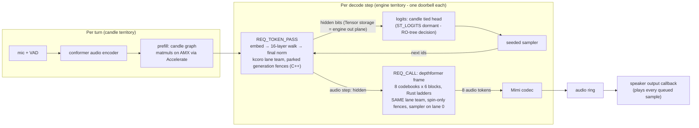
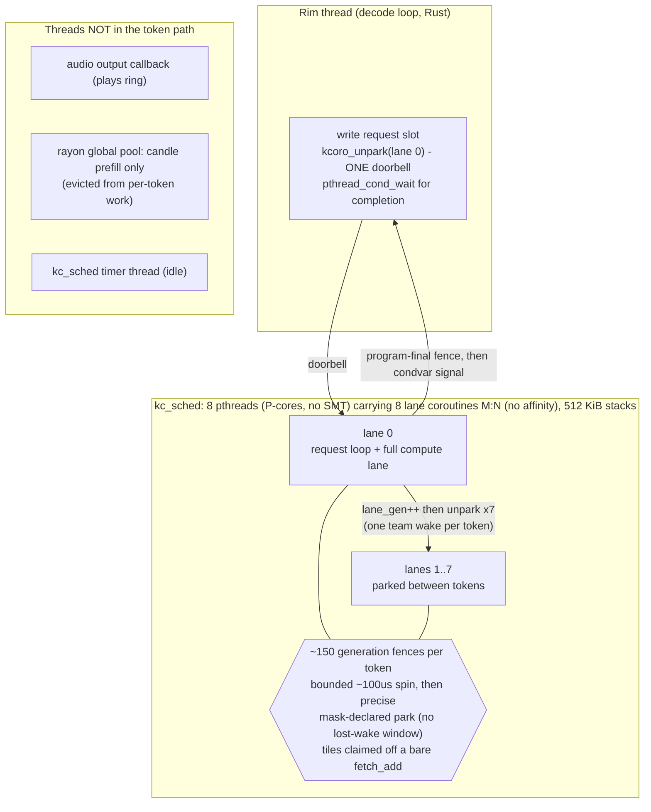

# The CPU decode engine

How `liquid-audio` decodes LFM2.5-Audio on the CPU at real-time edge, and where it is going.

This document has two registers, kept strictly apart:

- **As-built** sections describe what is in the working tree *now*, verified against the
  source (`src/compute/flashkern/`, `src/model/lfm2_hf.rs`, `src/model/lfm2_audio.rs`,
  `src/compute/bf16_gemm.rs`, `native/kernels/*`). If it says "as-built", the code does it.
- **The contract** and **Build order → Planned** sections describe *agreed design* that is
  not yet built. Nothing in a "planned" block is running today.

The kernel-level companion is `docs/FLASHKERN.md` (the Metal-idiom → NEON/AVX opcode map and
the full kernel inventory, incl. Group H). This document is about the *engine*: memory tiers,
the dispatch model, verification, and the build order.

---

## 0. As-built architecture (2026-07-09, end of the lane-team arc)

Both halves of every decode step run on ONE dispatcher: the kcoro lane team.
The backbone token is `REQ_TOKEN_PASS` (a C++ lane program resident in the engine);
the depthformer audio frame is `REQ_CALL` (the bit-pinned Rust ladders, dispatched as
a lane program on the same team). rayon executes nothing per-token and sizes nothing
per-token — its remaining tenancy is candle's prefill substrate and the fallback /
parity-reference paths.



The thread model: 8 pthreads (torch's P-core policy; the M2 Max has 12 cores /
12 hardware threads — no SMT — and the headroom belongs to the audio pipeline)
carrying 8 lane coroutines **M:N, with no affinity**: a lane that PARKS (in a
fence's slow path or between tokens) lands on kc_sched's global ready queue and
may resume on a different worker pthread. The engine's C++ programs are written
for that (no TLS across switches — the patch-0002 discipline). Rust `REQ_CALL`
programs are NOT: they never park mid-frame — their stage barriers are pure
spins — so a live Rust frame never migrates; the coroutine parks again only
after the Rust program returns. Between tokens the team parks; each token is one
rim doorbell, one team wake, ~150 in-arena fences (spin path), one condvar
completion. The measured wake budget is what killed the chop.



Request kinds: `REQ_TOKEN_PASS` (whole backbone token), `REQ_CALL` (generic
lane-uniform program — the depthformer rides this), `REQ_MLP` / `REQ_CONV_LAYER` /
`REQ_ATTN_LAYER` (per-block entries, kept for the bit-parity tests). The engine's
contract surface is deliberately thin — park/unpark doorbells plus fences — because
that is the exact seam the token-kernel/arena runtime (the GOSUB mainline; see the
kcoro repo's docs) will serve later: this whole dispatch layer is SCAFFOLDING WITH
RECEIPTS, kept excellent so voice ships while the correlation engine is built, and
its patch ledger (kcoro PATCHES.md 0001-0006) is the requirements spec for that
replacement.

Standing numbers (audible dual-path e2e, quiet M2 Max): CPU 24.3k-26.9k underrun
samples across thirteen consecutive runs, last-latency 913-1034 ms, mean 1151-1354 ms —
ahead of the Metal clean baseline (25,856 / 1656 ms). Bit-exactness: REF
`2f9c907a…` and PERF `45125c9e…` exact at every rung. Bandwidth ledger: ~66 GB/s
effective of a ~250 GB/s CPU share (~3 GB weight reads/token ⇒ physics floor
~12 ms/token ≈ 80 tok/s); the missing 4× is sync dead time (→ the frequency-band
split), per-core GEMV throughput, and the AMX fast tier — NOT lane count (12-lane
A/B measured catastrophic via rayon-pool resize + audio-pipeline starvation).

## 1. The root cause this engine answers

CPU decode of LFM2.5-Audio-1.5B started at **0.13 tok/s** on strong Apple Silicon. Profiling
found the time was not in the math — it was in **weight movement**, three stacked copies of the
same sin on the `M==1` decode path, each hiding under the previous one:

1. `bf16_matmul(x, w.t()).contiguous()` — candle transpose-copied the *entire* weight per
   linear per token (`copy_strided_src` was ~97% of samples).
2. the GEMV kernel transposed `B` into a thread-local buffer every call (~0.6 GB/s effective
   on a ~200 GB/s machine).
3. everything single-threaded.

Two principles fell out and drive every design choice below:

- **Reads are the floor, weight movement is theft.** Touching the weights is compulsory
  physics (~3 GB/token dense ⇒ a ~10 ms/token floor on this memory system). Any *movement* on
  top of that read — memcpy, transpose, repack, staging, dtype copy — is pure waste. Kernels
  must consume weights in checkpoint-native layout.
- **The dispatch model is the intended execution model, not a demo.** Per-op candle
  fork/join (candle op → rayon fork/join → tensor alloc → bf16↔f32 cast, ~240 ops/token) is
  exactly what a GPU never does. A GPU enters once and data flows through shared state between
  stage fences. The CPU path is moving in that direction in layers: first threadgroup-style
  fused regions, now the resident native stage machine for the FFN MLP, and finally one
  full-pass engine entry.

Both were learned by measuring GB/s effective and sampling the live process, not by
theorizing. See `docs/FLASHKERN.md` for the kernel-side story.

---

## 2. The contract (AGREED DESIGN — not all built)

The settled architecture for the decode engine. This is the target; §4 says how much is
as-built. Read this as the spec, not the changelog.

1. **Weights.** ONE mmap buffer for the process; the engine owns a flat
   `name → (offset, shape)` table parsed straight from safetensors. candle stays only for
   prefill / Metal. Reads are the floor; any weight movement is theft on top of it.
2. **Compute.** mmap bytes → SIMD registers → f32 accumulates **in registers** → one
   round-to-nearest-even → KB-scale bf16 activation writes. f32 never exists as *planes*, only
   as register accumulators (an rb-epilogue in every kernel). **KV planes are bf16** (torch's
   cache dtype — f32 KV was the wrong call twice over: memory *and* fidelity).
3. **Dispatch.** `lfm_token_pass(ctx*)` — Rust hands off **once** per full pass (a text token,
   or a whole 8-codebook audio frame). The persistent pinned P-core lane team runs the chain as
   a resident stage machine: publish stage state, bump epoch, workers pull tile indices with an
   atomic counter, and the last worker rings the coordinator. Sampling lands on lane 0; results
   land in arena ring slots. The doorbell (epoch + reason word) is checked at the **pass
   boundary and nowhere inside**; event backpressure never touches it.
4. **Transport.** Rings + `(offset, len, epoch)` descriptors, no owned `Vec` payloads on hot
   surfaces.

**Lineage.** The learned lessons come from the sibling m2-bert-mlx project (same team as
LFM2-Audio / Hyena / Monarch): whole-conv-in-one-dispatch vs streamed split at sync
boundaries, exactly-one 1/N FFT normalization, double-double at the spectral multiply.
flashkern's `fanout`/`dd` ports already embody these.

---

## 3. Memory model (tiers)

Where every byte lives on the decode path, from the most durable to the most ephemeral.

### Tier 0 — Weights (AS-BUILT: candle mmap; PLANNED: engine weight table)

- **As-built.** Weights are memory-mapped by candle's safetensors `VarBuilder` at load
  (`src/loader.rs`), and stay bf16 on CPU. The fused/flash kernels read them **zero-copy in
  checkpoint layout**: `fused_mlp_decode` takes `storage_and_layout()` bf16 slices of the FFN
  weights; `DepthDecode` captures every depthformer tensor as a `PtrLen` (a raw
  `(ptr, len)` into candle's `Arc`-heap CPU storage — `src/compute/flashkern/decode.rs`). No
  transpose, no repack, no dtype copy. The `Bf16GemmNt` / `bf16_gemm_nt` path consumes the
  weight in its native `[N,K]` layout so `matmul_flat` / `linear_logits` never call `.t()` at
  `M ≤ 4`.
- **Planned.** The standalone engine weight table (one process mmap + flat
  `name → (offset, shape)`, candle dropped from the hot path) is *not* built; candle still owns
  the weight buffers.

### Tier 1 — Resident KV + cursors (AS-BUILT; bf16 on the CPU decode path)

The backbone KV cache is preallocated resident storage, **not** a per-step concat:

- `Cache.kvs: Vec<Option<KvSlot>>` (`src/model/lfm2_hf.rs`). A `KvSlot` is
  `{ k: Tensor, v: Tensor, len: usize }` over preallocated `[B, n_kv, cap, head_dim]` planes.
- **Append is in place.** `append_kv` allocates the resident planes with the incoming row dtype
  (`kf.dtype()`/`vf.dtype()`), `slice_set`s the step's rows at the cursor, and bumps `len`;
  reads are zero-copy `narrow(2, 0, len)` views. On the live CPU bf16 decode path the planes
  are bf16. Capacity starts at `need.next_power_of_two().max(256)` and doubles on demand (one
  narrow-copy, amortized O(1)).
- **Rollback is O(1)** — `snapshot`/`rollback` record and restore `len`; rows past the cursor
  are stale storage, never read. This backs speculative prefill (prefill the next utterance in
  the VAD pause; roll back if the user resumes).
- This deliberately **replaces** the reference `Tensor::cat(cache, new)` append, which recopied
  the whole accumulated cache per layer per token (plus a full-cache f32 re-upcast) and made
  decode degrade with context. An earlier `candle_nn::KvCache` swap was tried and **reverted**
  as a parity deviation; this resident slot is held to a stricter bar — with
  `grouped_gqa_decode = false` a greedy+seeded generate is **bit-identical** before/after the
  swap (wav hash), so the storage change is exact.
- The depthformer's own KV (in `DepthDecode`) is tiny resident bf16-bit `kplane`/`vplane`
  storage (`Vec<u16>`), cursor reset per frame — zero allocation per frame.

> **As-built nuance:** the backbone resident KV dtype follows the projection row dtype rather
> than forcing `DType::BF16` in `append_kv`. That is bf16 for the live CPU bf16 path; if a
> reference/device path produces f32 rows, the resident slot mirrors that path instead of
> silently changing numerics.

### Tier 2 — Dispatch scratch + `Shared` + `SpinBarrier` (AS-BUILT)

The in-dispatch working set — the CPU analog of GPU threadgroup memory:

- **`SpinBarrier`** (`src/compute/flashkern/decode.rs`): a spinning generation barrier with
  `threadgroup_barrier(mem_threadgroup)` semantics. The generation flip is `AcqRel` so it
  publishes each stage's shared-memory writes to every lane — the GPU's fence contract. It
  spins (`std::hint::spin_loop`) rather than parks: `std::sync::Barrier` costs ~1–2 µs a
  crossing, and at hundreds of crossings per token that is real money.
- **`Shared<T>`** (`src/compute/flashkern/fanout.rs`): a `Send` raw-pointer wrapper over the scratch
  planes so lanes co-own disjoint slices without a borrow-checker fight; every write is
  lane-private, every read post-barrier.
- **Scratch** is mixed during migration: the native MLP engine owns persistent `sc_*` planes
  and grows them before publishing a pass (no allocation once warm for a fixed model/lane
  shape); the bit-identical threadgroup fallback still allocates `partials/xn/gu/t` per call.
  `DepthDecode` owns a persistent `DepthScratch` (all planes preallocated in `DepthDecode::new`,
  borrowed once per frame — zero allocation in the frame loop).

### Tier 3 — Transport (PLANNED — open items)

Rings + `(offset, len, epoch)` descriptors on the hot surfaces are **not built**. Today, decode
results cross back as candle `Tensor`s / `Vec`s at the region boundary.

### Thread model (AS-BUILT: mixed native stage machine + threadgroup regions)

- **As-built.** The backbone FFN block uses the resident native stage machine when
  `has_kcoro && has_native_engine && has_flashkern_*`: `process_engine()` writes one request,
  unparks the coordinator, and waits for the pass boundary. If the native engine is unavailable
  or reports failure, the same block takes the bit-identical threadgroup fallback.
- **Still threadgroup regions.** ShortConv decode and `DepthDecode::frame` still use the
  `rayon::scope` / shared-scratch / barrier model. The backbone token is still a candle forward
  with fused sub-regions spliced in; attention is not yet inside the full native token pass.
- **Planned.** A single persistent **pinned P-core** lane team owned by the engine, entered
  once per full token pass (`lfm_token_pass`), with the doorbell checked only at the pass
  boundary.

---

## 4. What is on the live decode path today (AS-BUILT)

Verified in source. See `docs/FLASHKERN.md` for the four flashkern kernels on the live path.

| Region | As-built path | Where |
|---|---|---|
| bf16 linears (prefill-scale `M`) | tightened NEON/AVX BFMMLA GEMM (`Bf16Gemm`) | `bf16_gemm.rs`, `linear.rs` |
| bf16 linears (decode, `M ≤ 4`) | native-layout `Bf16GemmNt` — no weight transpose (`bf16_matmul_nt`), fall-through to transposed GEMM if the strict nt gate is unmet | `bf16_gemm.rs`, `linear.rs` (`NT_MAX_ROWS = 4`) |
| backbone KV | resident `KvSlot` in-place append + narrow views (§3 tier 1) | `lfm2_hf.rs` |
| backbone GQA (decode, `seq==1`) | regrouped-`q` view against shared KV heads — **no `repeat_kv`** materialization; gated by `grouped_gqa_decode` | `lfm2_hf.rs` `Attention::forward` |
| ShortConv (decode) | fused `causal_conv1d_update` — flashkern NEON/AVX op on CPU, candle-flashfftconv (Metal JIT / scalar) otherwise; gated by `fused_conv_decode` | `flashkern/candle_ops.rs`, `lfm2_hf.rs` |
| backbone FFN block (CPU decode, `b·s==1`) | resident native stage machine via `native_engine::process_engine()` when built; bit-identical `fused_mlp_decode` threadgroup fallback | `native/src/engine/flashkern_engine.cpp`, `flashkern/native_engine.rs`, `flashkern/decode.rs`, `lfm2_hf.rs` |
| audio frame (CPU, bf16) | `DepthDecode::frame` — the whole depthformer frame as ONE dispatch, sampling on lane 0 | `flashkern/decode.rs`, `lfm2_audio.rs` |
| prefill; all Metal | candle / candle-flashfftconv (unchanged) | — |

### Parity flags & seams (AS-BUILT)

Every fast path has a switch that drops to a reference the fast path must match — never an
ambient global; a per-`Cache` field or a per-model seam so tests A/B on the same weights:

- **`Cache.grouped_gqa_decode`** (default `true`). `false` runs the expanded `repeat_kv`
  form — the byte-parity reference. The grouped view computes the same per-head dot products;
  the GEMM reduction order differs, so it sits at the f32-ulp floor (`rel < 1e-5`, pinned by
  `grouped_gqa_matches_expanded_at_f32_ulp`). Ulps *can* flip a near-tied greedy argmax and
  *will* diverge sampled streams — so byte-parity oracles pin `false`.
- **`Cache.fused_conv_decode`** (default `true`). `false` runs the composed candle ShortConv
  ops — the reference the fused conv1d_update kernel must match.
- **`LFM2AudioModel::set_depth_flash_enabled(bool)`**. `false` drops the `DepthDecode` path
  and runs the candle depthformer op chain. The flash frame shares the *same seeded sampler*,
  so the RNG stream matches the candle path token-for-token.
- **`bf16_gemm_nt_available()`** is a *strict* gate (flashkern nt kernel built + FEAT present),
  distinct from the looser `bf16_gemm_available()` (also satisfied by the reference-only
  build). The nt paths gate on the strict one; the loose one would let them run with no kernel
  body.

---

## 5. Verification practices

The oracle that caught the real bugs, plus the standing parity tests.

### The wav-hash byte oracle

Greedy text + **seeded** audio ⇒ `shasum out.wav` is a byte-level, whole-pipeline parity gate.
It is cheap and decisive: run it before/after any numerics-adjacent change. It did real work —
it **split** the exact resident-KV append (bit-identical wav) from the grouped-GQA ulp
deviation (a different, equally-sensible slogan on a 96-token run), which is exactly why
`grouped_gqa_decode` exists as a flag with `false` pinned to byte-parity.

### Standing tests

- **Cross-op parity** (`flashkern/candle_ops.rs`): the flashkern conv1d_update op must agree
  with the candle-flashfftconv op it replaces on the CPU device — f32 tight (FMA-only slack),
  bf16 through the same rounding points.
- **Fused-block parity** (`flashkern/decode.rs`, `flashkern/native_engine.rs`):
  `fused_mlp_decode` vs the real candle op chain (through the actual `linear_forward`) at bf16
  resolution, across lane counts; native MLP vs the threadgroup port bit-for-bit.
- **Lane determinism / bit-parity** (`flashkern/decode.rs`): the same dispatch shape twice is
  bit-identical (fixed row ownership, fixed reduce order).
- **Pipeline parity** (`model/linear.rs`): synthetic tensors through the real `linear_forward`
  vs an f32 reference reproducing the kernel numerics — single linear, 2-layer stack, gated
  MLP, and the `M==1` decode GEMV.
- **GQA ulp bound** (`model/lfm2_hf.rs` `grouped_gqa_matches_expanded_at_f32_ulp`).
- **Kernel suites** (`flashkern/neon.rs`, `flashkern/x86.rs`): GEMM/GEMV/SMMLA/reductions/
  TBL/conv1d/FFT/double-double, feature-gated so they skip on CPUs lacking the extension.
- **e2e sound gates** (`e2e_voice_runtime`): audio audibly out the speaker, CPU and Metal.

The exact crate-wide count changes with feature gates and integration-test selection; quote a
fresh `cargo test` run when reviewing. The focused gates for this layer are the parity tests
listed above.

---

## 6. Measured performance history

Real numbers only — measured on this machine, cited from the work that produced them. Do not
extrapolate.

| Stage | Measurement | Note |
|---|---|---|
| CPU decode, start | **0.13 tok/s** | three stacked weight copies (§1) |
| GEMV kernel, 2048×8192 call | **57.7 ms → 1.2 ms** | native-layout dot + row-stream axpy + rayon N-fanout |
| CPU decode, after copies died | **~18.7 tok/s** | ~140×; the real-time sound test went un-runnable → passing |
| FFN block fused | **54 → 18 ms/token** | per-op fork/join → one dispatch, 3 barriers |
| resident native MLP stage machine | **~3.0 ms vs 16-34 ms** | focused debug parity signals, H=1024 I=4096, lanes=8; threadgroup+spin varies with contention |
| CPU decode, mixed text+audio | **~21–22 tok/s** | real-time edge |
| text-stretch | **~18 ms/token (~56 tok/s)** | |
| audio frame | **~50 ms** | 23 GB/s effective — headroom left; E-core barrier lockstep suspected |
| prefill | **~12 s** | still candle / Metal (known wall; §7) |
| e2e sound, CPU | **~52–60 s**, 2 audible turns | passes |
| e2e sound, Metal | **~28–30 s**, mean latency ~1.3–1.6 s | passes |

---

## 7. Build order (AGREED) with as-built / planned split

The agreed order to reach the §2 contract. Depthformer was mounted first as the proof of shape
(one dispatch/frame, sampling inside).

1. **Kernels + fused regions on the live path.** ✅ **As-built.** nt matmul (no transpose),
   resident KV, fused FFN block, `DepthDecode` (whole depthformer frame), Group H, the parity
   seams. This is the §4 table.
2. **Native stage-machine skeleton.** ✅ **Partial as-built.** The resident C++ team is live for
   the backbone FFN MLP. ◻️ **Planned remainder:** weight table + arena + `lfm_token_pass(ctx*)`
   full-pass handback, no standalone weight table yet, no arena ring yet.
3. **Backbone attention folded into the fused dispatch.** ◻️ **Planned.** Today only the FFN
   block is fused on the backbone; attention and ShortConv are still per-op candle spliced
   around the resident-KV / grouped-GQA / fused-conv fast paths.
4. **rb-epilogues everywhere** (f32 only in registers; activation/KV planes bf16 unless a
   reference path deliberately mirrors a wider dtype). ◻️ **Planned.** Backbone and depth KV are
   bf16 on the live CPU decode path (§3 tier 1); remaining f32 planes are dispatch scratch and
   kernel accumulators.
5. **Transport rings** + `(offset, len, epoch)` descriptors. ◻️ **Planned** (§3 tier 3).

**Out of scope for now.** Prefill stays on the candle / Metal path (the ~12 s wall); the engine
targets the decode hot loop, not prefill.

---

*As-built claims verified against the working tree on branch
`claude/optimize-bf16-neon-kernel-52h791`. The contract (§2) is the target; the build-order
labels above identify which pieces are live now and which remain planned.*


**Byte-oracle baseline (re-armed 2026-07-08, post-E4 accel prefill):** reference chain
(`grouped_gqa_decode=false`, depth flash off, greedy text + seed-0 audio, 96 tokens,
assets/question.wav) ⇒ `shasum out.wav` = `2f9c907aad76919839993d9d92a53304b72f7608`.
Accel prefill is part of the reference chain (unconditional on macOS, f32 tier); any
future numerics-adjacent change must reproduce this hash with the flags off.

Run it exactly like this (the seam is `LFM2AudioModel::set_reference_numerics`, exposed
by the example as a flag — a plain run executes the PERF chain and hashes differently):

```
LFM_DEVICE=cpu cargo run --release --example generate -- --reference
shasum out.wav   # must print 2f9c907aad76919839993d9d92a53304b72f7608
```

Re-verified 2026-07-09 (post kcoro vendoring + native stage-machine wiring): exact match.

**Dual-path audible gate (scripts/gate.sh steps 4-5), clean-machine baseline 2026-07-09,
post token-pass + epoch-CAS stage board — two-turn e2e, same clip, speaker drained:**

| device | mean pause→first-audio | underrun samples | verdict |
|---|---|---|---|
| CPU (token-pass engine) | 1469 ms | 24,832 (~1.0 s) | clean |
| Metal (candle kernels) | 1656 ms | 25,856 (~1.1 s) | clean |

Correction for the record: the 167k-underrun Metal measurement that motivated the
CPU-default flip was taken while a release build ran concurrently — contention, not
Metal steady-state. The flip still stands (CPU leads both metrics on clean runs, idles
at zero, and carries the engine roadmap), but the honest margin is modest, not 7×.
Bench with the machine quiet or say so in the numbers.

## State of play (2026-07-09, end of token-pass arc) — the complete inventory

**Native math, live on the CPU decode path (all bit-proven by REF 2f9c907a… / PERF
45125c9e…):**
- REQ_TOKEN_PASS: ONE doorbell per decode token — embed (text row copy; audio =
  candle's exact sequential-bf16 sum(0), probe-pinned), every conv layer, every
  attention layer (incl. NeoX rope 3-round ladder, per-head qk-norm, in-place KV
  appends), final embedding-norm. Hidden state ping-pongs engine planes.
- Depthformer: FULLY native NEON (DepthDecode — 8 codebook steps × 6 blocks, one
  dispatch/frame, sampling on lane 0). Dispatch = rayon threadgroup + DISPATCH_LOCK,
  not yet the kcoro team.
- Resident bf16 KV planes (in-place append, O(1) rollback), in-place conv windows.
- AMX, via Accelerate (E4): ALL prefill matmuls rows>4 — measured 19-28×,
  ~1-1.5 TFLOP/s. Live since E4; unaffected by the engine work.

**Still candle inside the decode loop:** logits head (rank-1 h_last hits the BFMMLA
path — RO-tree ladder; options in task list), sampler (LogitsProcessor; ChaCha12 port
planned), two Tensor wraps + a rebuilt state array per token (rim overhead).
**Still candle at turn level:** conformer audio-in, prefill graph (Accelerate-backed),
Mimi codec.

**The open problem is DISPATCH, not math.** Pre-engine threadgroup build: 1508ms mean /
~24k underruns, consistently clean. Engine builds: bit-identical output, 1.7-2.2s /
102k-244k underruns with run-to-run variance = kcoro's wake path (lossy park_cv signal,
5ms timed-wait recovery; ~200 coordinator-published stages ⇒ ~400 wake opportunities
per token; a missed worker wake SERIALIZES a stage onto one lane). Tile-count
completion + epoch-CAS board fixed correctness; coordinator participation did not fix
the chop (183k/102k/138k across three runs — committed with data).

**The fix, per the original §2 design — BUILT 2026-07-09 (lane-uniform commit,
post-reorg):** every lane runs the ENTIRE pass program; stages are separated by
in-arena generation fences (bounded ~100µs spin, then a precise mask-declared park —
the park declaration and the waker's mask exchange are RMWs on one word, so there is
NO lost-wake window); tiles claim off a bare fetch_add counter (E-core stragglers
self-balance); each fence's last arriver runs the boundary's serial ladder exactly
once. Team parks once per token, wakes once per token. publish_stage / epoch-CAS
board / worker claim loops deleted. lfm_engine_new(workers) now = TOTAL lanes
(lane 0 = request loop + compute lane); the +1 core oversubscription is gone.
Numerics untouched (tile-count formulas verbatim; claim order is bit-irrelevant):
REF and PERF exact, 4/4 parity tests.

**Result — the variance is dead.** Four consecutive audible CPU e2e runs, quiet
machine: 25,600 / 24,832 / 26,112 / 26,880 underrun samples (was 102k-244k
run-to-run on identical bits), last-latency 913-939ms, mean 1151-1214ms. CPU now
leads the Metal clean baseline (25,856 / 1656ms) on both metrics. The ~25k floor is
the turn-1 prefill window, not decode.

**Rim cut — BUILT (same day):** the native step's per-token Rust work is now gate
checks, pointer captures, one FFI call, cursor advances. Killed per token: the
Vec<LayerState> rebuild (cache-resident StateTable, entries rewritten in place —
fresh captures stay, they self-heal against rollback clones/candle interleaves/KV
growth), the hidden out-buffer + bf16 conversion copy (the hidden Tensor's own
storage IS the engine's out plane), the audio offset-id Vec (stack). The one
remaining per-token allocation is the hidden Tensor's storage — that boundary dies
when the depthformer folds onto the lane team / ST_LOGITS revives. Ctx ownership is
single-tenant with an install id (second install refused + logged; only the owning
guard clears) — kills the two-model clobber; regression test
native_engine_ctx_single_tenant.

**kcoro patch 0005 — BUILT (same day):** precise parking in kc_sched. Wake tokens
under park_mu + Dekker re-check after the idle declaration + broadcast for
owner-only last_task slots; idle waits UNTIMED, the 5ms poll deleted. Wakes are now
µs-bounded; four CPU e2e runs under 0005: 24.3k-26.4k underruns, 917-988ms
last-latency — the band holds with the poll gone. PATCHES.md 0005 has the full
mechanism (upstream candidate, includes the workers==1 steal modulo-by-zero fix).

**DepthDecode fold — BUILT (same day, commit cc24540a):** REQ_CALL runs the Rust
frame program on the engine lanes (ladders untouched — anti-transcription-drift);
lane count now comes from lfm_engine_lanes, not rayon. SpinBarrier + DISPATCH_LOCK
survive only in the non-engine fallback. Both oracles exact through the new
dispatch; audible CPU e2e ×4 in-band. rayon is out of the per-token path. Audio
token budget raised to 2048 (audio spends tokens faster than text; 32,768-token
context is the ceiling) and the desktop crate's rotted test suite repaired (42/42).

**Build next:**
0. RAYON GONE — the control-plane goal (her directive): REQ_CALL keeps the
   depthformer's control flow in Rust (deliberate anti-transcription interim);
   the destination is a native control plane. Ladder: ~~delete the depthformer
   rayon-scope fallback~~ DONE (no-fallbacks doctrine — engine REQUIRED for
   depth-flash: `build_depth_flash` refuses without the engine and the candle
   reference chain runs loudly; `DepthDecode::frame` is engine-only, the
   rayon+DISPATCH_LOCK branch is deleted) → ST_LOGITS + ChaCha12 sampler native
   → kcoro-rs takes the control plane → rayon leaves Cargo.toml when candle CPU
   compute is fully demoted (prefill stays candle/Accelerate until then —
   turn-level, not token-level). Two-barrier doctrine stands: Rust lane programs
   spin pure (never enter kcoro — no frame migration); native programs
   bounded-spin then precisely park. Acceptance oracle: the PR-122 zero-spin
   criterion, now MEASURED LOCALLY on both trees (the arena import 8e19a35 is
   /proc-based — vacuous on macOS; the Darwin-real ports carry the verdict):
   kcoro `tests/test_zero_spin_idle.c` (fd7861f — 8 workers: cold idle 0.004%,
   post-burst 0.003%, 1-task/200ms trickle 0.089%) and this crate's
   `tests/engine_idle_zero_spin.rs` (8 engine lanes parked at the doorbell:
   cold 0.006%, after a full REQ_CALL pass 0.005%). kcoro-rs R1 must match.
1. Frequency-band split (her Hyena shape): lanes own heads/channels/FFN-bands
   END-TO-END, ~2 callback-joins per block instead of ~9 fences; reassembly =
   f32 partials + one RNE round (or online-softmax for KV-split attention).
   Changes reduction trees ⇒ fast-tier / deliberate hash re-arm.
2. ST_LOGITS ladder decision (Sydney's call: NT re-arm vs resident transpose vs
   RO intrinsic), then sampler v2 (ChaCha12), then Mimi (E5).
3. Voice layer: echo provenance (spec-09 W6), then duplex ingest — mic audio
   micro-prefilled into the KV planes at pass boundaries so the model attends to
   incoming speech mid-generation (the doorbell contract already checks there).
4. The GOSUB mainline — **kcoro-rs, the native Rust port** (supersedes the C
   arena rebuild; same design, memory-safe substrate). The convergence is total:
   patch 0001's gate IS std's thread parker, ticket/callback IS Waker, the token
   kernel IS a purpose-built executor (NOT tokio — ~1-2k lines), kc_op_t IS a
   Future, and kcoro_arena's hand-rolled continuation macros are what rustc's
   async lowering generates. Rungs: R1 lane team + precise parking + fences
   (ABI-compatible under this engine's doorbell) → R2 correlation-table ticket
   kernel (channels, per the zero-spin spec §22) → R3 explicit serde-able
   continuation records (hibernatable, VERSIONED token-routines — BizTalk
   dehydration; async state machines aren't serializable, so routines own their
   state enums) → R4 the engine rim natively on it, FFI seam retired.
   Requirements spec: kcoro PATCHES.md 0001-0006 + the kcoro_arena handoff §9 +
   the salvage verdict's contract tables. This engine's thin seam (park/unpark +
   fences) is exactly what R1 replaces from underneath.
