# The CPU decode engine

How `liquid-audio` decodes LFM2.5-Audio on the CPU at real-time edge, and where it is going.

This document has two registers, kept strictly apart:

- **As-built** sections describe what is in the working tree *now*, verified against the
  source (`native/src/io/safetensors.cpp`, `native/src/model/lfm_model.cpp`,
  `native/src/runtime/voice_session.cpp`, `native/src/engine/flashkern_engine.cpp`,
  `src/native_voice.rs`, and `native/kernels/*`). If it says "as-built", the code
  does it.
- **The contract** and **Build order → Planned** sections describe *agreed design* that is
  not yet built. Nothing in a "planned" block is running today.

The kernel-level companion is `docs/FLASHKERN.md` (the Metal-idiom → NEON/AVX opcode map and
the full kernel inventory, incl. Group H). This document is about the *engine*: memory tiers,
the dispatch model, verification, and the build order.

---

## 0. As-built architecture (2026-07-19 working tree)

The shipped LFM2 CPU path is native from accepted text/PCM through emitted text/PCM.
Rust owns opaque lifecycle, settings, and the product observer adapter. Native
code owns CoreAudio callbacks, exact Sesame evidence, and turn endpointing.
Rust does not own weights, tensors, tokens, model state, sampling, recurrence,
speech evidence, or turn boundaries.

- `safetensors.cpp` loads main and released `audio_detokenizer/` sources into one
  byte-exact, page-table read-only image. `LfmModel` owns that image and binds
  frontend, Conformer, backbone, Depthformer, audio-detokenizer, and tokenizer
  plans directly from immutable typed byte views.
- `LfmConversation` owns BF16 KV/short-convolution state,
  frontend/Conformer/audio-detokenizer
  workspaces, bounded tokenizer storage, sampler PRNG, the monotonic context cursor,
  and sliding-window rollover. No Rust model object participates in a turn.
- `LfmSession` owns text/PCM admission, ticket/epoch correlation, reliable events,
  playback leases, interruption, stop, and the native generation loop. A C++
  coordinator advances recurrence; Rust never waits on or interprets a numerical
  completion.
- kcoro owns one stable fixed-team worker per numerical lane. Typed audio encode,
  backbone, Depthformer, and audio-detokenizer requests enter that team as
  non-suspending
  generations. Every member returns; the final return publishes the exact
  completion callback. No operation member parks at a stage boundary.
  `REQ_AUDIO_ENCODE` carries borrowed PCM/output spans through resample,
  valid-only BF16 frontend, and whole Conformer/adapter orchestration; its
  checkpoint-layout GEMMs run as in-ticket fixed-team substages. A fair
  model-owned expected-value gate serializes legal full-pass boundaries between
  conversations sharing the lane team.

There is no per-pass heap allocation, copied pass payload, Rust lane callback,
bounded spin, or polling. The engine has two descriptor-addressed ticket slots:
each request record borrows payload spans and each slot owns only its activation
scratch bank. A capacity-2 SQ/CQ hands each completion an exact
generation-bearing permit. The bounded audio route releases that permit at every
coarse node, marks its pooled route record ready, and lets the native broker
reacquire capacity in FIFO/age-promoted order. Its exact-CQ callback performs no
submission, allocation, wait, or descriptor lock. Packed `{generation,state}`
CAS transitions prevent slot theft and stale-destructor ABA, and `FREE` is the
final accounting publication edge. Text and audio admission return a pooled
handle; terminal notification rings the session work doorbell and the
coordinator collects that exact generation. The coordinator never waits for a
numerical pass or holds a compute slot across an external-resource boundary.
The pooled route record/broker re-entry remains transitional: the numerical
bridge is already a saved stackless frame, and each multi-hop route still needs
its own reusable frame carrying the program counter and fixed locals.

Flashkern is the CPU executor, never the Metal executor. CPU kernels retain NEON,
BFMMLA/BFDOT, AVX2, and AVX-512-BF16 paths. Unsupported Metal selection fails
explicitly; a future MLX C++/Metal peer must preserve the same native model/session
boundary and may not fall back to Candle.

```mermaid
flowchart LR
    Host["Rust settings / control / observation"] --> Dock["native CoreAudio + circular capture/playback docks"]
    Dock --> Session["native LfmSession<br/>tickets · epoch · recurrence"]
    Session --> Conv["native LfmConversation<br/>KV · conv · PRNG · rollover"]
    Conv --> Gate["fair expected-value model pass gate"]
    Gate -->|"128-byte SQ cell"| Bridge["native SQ/CQ + retained descriptor"]
    Bridge --> Team["kcoro-owned fixed Flashkern team"]
    Team --> Board["shared stage board<br/>atomic tile claims"]
    Board --> Kernels["AArch64 / x86_64 leaves"]
    Kernels -->|"final-member callback"| Conv
    Conv -->|"LFM2.5 detokenizer + native device-rate resample into lease"| Playback["native playback dock"]
    Playback -->|"generation-checked borrowed span"| Device["CoreAudio device callback"]
```



`REQ_TOKEN_PASS` executes embedding lookup/provided embedding, the native
ShortConv/attention/MLP walk, final norm, and optional sampling in one team entry.
`REQ_DEPTH_FRAME` executes projection, every Depthformer codebook/layer, resident KV
recurrence, collective sampling, and sampled-embedding feedback.
`REQ_AUDIO_DETOKENIZE` serializes one conversation's causal detokenizer state
through the same SQ/CQ while its retained program partitions every separable
phase across the kcoro-owned fixed team. Final-member callbacks advance the
phase cursor; the former lane-zero whole-graph call no longer exists.
At 24 kHz it writes directly into the retained reservation; at another device
rate it decodes into conversation-owned codec scratch and the same route's native
retained streaming rate converter writes directly into the reservation. `REQ_AUDIO_ENCODE`
precedes those passes without exposing mel rows, hidden rows, logits, codes, or
model pointers to Rust. Lower-level request kinds
remain fixture and implementation seams, not the production orchestration surface.

The idle contract is measured, not inferred. On the 2026-07-16 macOS run,
`engine_idle_zero_spin` measured **0.003%** process CPU before a pass and **0.004%**
afterward with eight lanes parked. Historical throughput measurements below remain
useful lineage; new latency numbers must name this executor and exact model/test
configuration.

## 1. The root cause this engine answers

CPU decode of LFM2.5-Audio-1.5B started at **0.13 tok/s** on strong Apple Silicon. Profiling
found the time was not in the math — it was in **weight movement**, three stacked copies of the
same sin on the `M==1` decode path, each hiding under the previous one:

1. `bf16_matmul(x, w.t()).contiguous()` — candle transpose-copied the *entire* weight per
   linear per token (`copy_strided_src` was ~97% of samples).
2. the GEMV kernel transposed `B` into a thread-local buffer every call (~0.6 GB/s effective
   on a ~200 GB/s machine).
3. everything single-threaded.

Two principles fell out and drive every design choice below:

- **Reads are the floor, weight movement is theft.** Touching the weights is compulsory
  physics (~3 GB/token dense ⇒ a ~10 ms/token floor on this memory system). Any *movement* on
  top of that read — memcpy, transpose, repack, staging, dtype copy — is pure waste. Kernels
  must consume weights in checkpoint-native layout.
- **The dispatch model is the intended execution model, not a demo.** Per-op candle
  fork/join (candle op → rayon fork/join → tensor alloc → bf16↔f32 cast, ~240 ops/token) is
  exactly what a GPU never does. A GPU enters once and data flows through shared state between
  stage fences. The CPU path is moving in that direction in layers: first threadgroup-style
  fused regions, now the resident native stage machine for the FFN MLP, and finally one
  full-pass engine entry.

Both were learned by measuring GB/s effective and sampling the live process, not by
theorizing. See `docs/FLASHKERN.md` for the kernel-side story.

---

## 2. The contract (AGREED DESIGN — not all built)

The settled architecture for the decode engine. This is the target; §4 says how much is
as-built. Read this as the spec, not the changelog.

1. **Weights.** ONE resident raw image for the process; the native loader owns a
   component-scoped `(Main|Detokenizer, name) → (offset, dtype, shape)` catalog parsed
   straight from safetensors. This is as-built for LFM2. Candle is an offline
   oracle, not a production owner. Reads are the floor; any weight movement is
   theft on top of it.
2. **Compute.** resident bytes -> assembly vector registers -> f32 accumulates **in registers** -> one
   round-to-nearest-even → KB-scale bf16 activation writes. f32 never exists as *planes*, only
   as register accumulators (an rb-epilogue in every kernel). **KV planes are bf16** (torch's
   cache dtype — f32 KV was the wrong call twice over: memory *and* fidelity).
3. **Dispatch.** the native conversation submits and recurs full passes without a
   Rust model-progress edge. The resident fixed team runs the chain as a stage
   machine: publish stage state, bump generation, workers pull tile indices with
   an atomic counter, and the final member return resumes the native
   continuation. macOS placement is never assumed. Sampling is an assembly
   collective; results land in native ring slots. Interruption is applied at a
   complete pass boundary; event backpressure never touches a numerical stage.
4. **Transport.** Rings + `(offset, len, epoch)` descriptors, no owned `Vec` payloads on hot
   surfaces.

For LFM2, weight/compute ownership, typed audio input, native recurrence,
capacity-2 exact-completion routes, retained kcoro bridge/broker services, exact
Sesame turn policy, and direct native capture/playback spans are built. The
current engine is one fixed team; independent V2 block domains and native Moshi
remain separate future work.

**Lineage.** The learned lessons come from the sibling m2-bert-mlx project (same team as
LFM2-Audio / Hyena / Monarch): whole-conv-in-one-dispatch vs streamed split at sync
boundaries, exactly-one 1/N FFT normalization, double-double at the spectral multiply.
flashkern's `fanout`/`dd` ports already embody these.

---

## 3. Memory model (tiers)

Where every byte lives on the decode path, from the most durable to the most ephemeral.

### Tier 0 — Weights (AS-BUILT: one immutable combined image)

- `safetensors.cpp` opens and fingerprints every main and audio-detokenizer
  shard before
  allocation, computes checked 64-byte source bases, and allocates exactly one
  final image. Up to four workers issue retrying 8 MiB positioned reads directly
  into disjoint final spans; there is no chunk buffer or application payload
  `memcpy`.
- All workers join before error unwinding. Failures are selected in source/offset
  order, the same open handles are verified, alignment padding alone is zeroed,
  metadata is parsed, and exact dtype/rank/shape spans are validated. Source
  handles close before publication, after which `mprotect`/`VirtualProtect`
  makes the image read-only.
- `LfmModel` is the sole owner. Component-scoped names allow main and
  detokenizer keys to
  overlap without opening a second image. Plans retain byte-addressed views;
  possibly unaligned checkpoint BF16 is never represented as a dereferenceable
  C++ `uint16_t*`. Architecture kernels unlift little-endian words in registers.
- `LfmModelMemoryV1` reports source, resident, directly bound, formula-derived,
  compatibility-copied, load-time, worker, and task counts. Formula-derived rope,
  frontend/FFT/window, Conformer denominator, and detokenizer inverse-DFT/RoPE
  tables are counted
  separately. Layout, alignment, dtype, transpose, and framework-owner copies are
  forbidden. The production acceptance value is
  `compatibility_copied_bytes == 0`.

### Tier 1 — Per-conversation recurrence state (AS-BUILT; BF16)

`LfmConversation`, not a Rust `Cache`, owns the persistent model state:

- Every attention layer has fixed BF16 K/V planes sized for
  `[n_kv, configured_capacity + runway, head_dim]`; every ShortConv layer has its
  fixed carry. Depthformer and audio-detokenizer state are native and
  conversation-local.
- `LfmContextWindowState` tracks live `position`, physical `start`, monotonic
  `cursor`, and absolute `rope_base`. The runway is
  `min(configured_capacity, 256)`. Once capacity is full, admission drops the
  oldest logical rows; after the runway fills, retained K/V rows compact to row
  zero without reallocating. ShortConv carry is preserved.
- Whole text, PCM, and mixed text+PCM actions compute and reserve their total row
  requirement before the first backbone mutation. Token ids, frontend geometry,
  and Conformer output bounds fail before partial prefill.
- RoPE uses absolute positions. Retained key rows are never re-rotated; compacted
  BF16 rope rows move with the cache and new tail rows are generated through the
  architecture `lfm_rope_range_f32` leaf into preallocated scratch.

This is exact latest-window **activation-state continuation**. It is intentionally
not claimed to equal re-prefilling a raw truncated token tail: retained K/V rows
already encode attention to now-evicted history. Replay equivalence would require
retaining inputs and recomputing the whole tail.

### Tier 2 — Native scratch + fixed-lane generation fence (AS-BUILT)

- Engine attention, ShortConv, token, logits, Depthformer, and sampler planes are
  plan-owned. Frontend, resampler, Conformer, bounded tokenizer,
  audio-detokenizer, hidden,
  mel, and adapted planes are conversation-owned. Engine activation scratch is
  double-buffered per admitted ticket and only one bank is mounted on the lane
  board at a time. Session creation reserves the
  configured maximum PCM path before readiness; oversized or rate-changed work
  fails instead of growing scratch in a pass.
- Frontend power aliases the dead STFT real plane, valid mel writes directly into
  the BF16 Conformer destination, and Conformer writes the native prefill plane.
  M≤4 prefill linears publish their exact-RNE BF16 results directly into strided
  `stage`, ShortConv, and Q/K/V consumer planes; no `bcxf`, `projf`, or `qkvf`
  activation plane survives. The detokenizer writes direct at 24 kHz; otherwise
  native detokenizer scratch feeds the
  prepared output resampler, which writes the device-rate playback reservation.
  Weight planes are never widened, packed, transposed, or copied.
- Native team generations use release/acquire publication plus generation-stamped
  entered/returned evidence. The final member publishes one completion callback;
  there is no numerical fence waiter, spin budget, or timed polling.
- One fair expected-value `ExecutionGate` belongs to the model. Conversations
  queue at legal pass boundaries; each conversation retains private state while
  each admitted engine ticket retains a separate transient scratch bank.

### Tier 3 — Transport (AS-BUILT native dock)

The native runtime/session owns bounded text commands, reliable event records,
generation-checked circular capture storage and playback leases, ticket
correlation, interruption epochs, and exact data/space edges. Reliable text and
terminal records suspend as durable state when capacity is unavailable;
telemetry alone may be lossy. A stale epoch may finish a pass but cannot publish
its value.

The native AUHAL microphone callback asks CoreAudio to render directly into a
reserved circular-arena span, then publishes one typed chunk/XRUN record. The
exact Sesame detector and sample-clock policy consume that native storage.
Native playback resolves its generation-checked lease only inside the AUHAL
callback, renders directly into the device buffer, and releases the exact
ticket. No Rust PCM endpoint, ring, utterance `Vec`, VAD buffer, or audio event
payload remains.

### Thread model (AS-BUILT)

- `kc_team` owns each stable Flashkern member. One generation executes one
  non-suspending stage; the final return resumes the retained continuation.
- Native coordinator/delivery/bridge/route services own admission, recurrence,
  reliable events, and exact completion collection. Suspended actions are
  records, not attached threads or waiters.
- The native session owns the CoreAudio units and both PCM dock endpoints. Safe
  Rust retained services hold only an opaque platform-audio handle and project
  bounded events/control; they do not touch device PCM, submit model passes,
  hold model state, sample, tokenize, or advance recurrence.

---

## 4. What is on the live decode path today (AS-BUILT)

Verified in source. See `docs/FLASHKERN.md` for the native token and typed
Depthformer programs plus the lower-level kernel inventory.

| Region | As-built path | Where |
|---|---|---|
| resident weights | one combined main+detokenizer read-only image; exact typed byte views bind every LFM2.5 consumer; BF16 unlift happens in registers | `native/src/io/safetensors.cpp`, `native/src/model/lfm_model.cpp` |
| resample + mel frontend | prepared workspaces inside model-correlated `REQ_AUDIO_ENCODE`; borrowed PCM spans produce direct valid-only BF16 mel with aliased activation planes | `native/src/frontend/lfm_frontend.cpp`, `native/src/engine/flashkern_engine.cpp`, `native/kernels/*/flashkern_frontend.S` |
| Conformer + adapter | exact image-bound plan and per-conversation workspace inside the same typed audio ticket; checkpoint-layout GEMMs use fixed-team substages and adapter rows land directly in the native prefill plane | `native/src/model/lfm_conformer.cpp`, `native/src/engine/flashkern_engine.cpp`, `native/kernels/*/flashkern_conformer.S` |
| tokenizer + turn grammar | native byte-BPE tokenizer, bounded per-conversation workspace, native control-token grammar | `native/src/model/lfm_tokenizer.cpp`, `native/src/model/lfm_model.cpp` |
| modality assembly + prefill | native text, PCM, and mixed-turn admission; rows are reserved atomically, then consumed as direct embedding/table views | `native/src/model/lfm_model.cpp` |
| backbone recurrence | `REQ_TOKEN_PASS` over direct checkpoint BF16; native KV/ShortConv state, grouped GQA, final norm, and text sampling | `native/src/engine/flashkern_engine.cpp`, `native/src/model/lfm_model.cpp` |
| context rollover | fixed capacity+runway BF16 state, monotonic cursor, absolute RoPE range generation, in-place compaction | `native/src/model/lfm_model.cpp`, `native/kernels/*/flashkern_rope.S` |
| audio frame | `REQ_DEPTH_FRAME`: projection, every Depthformer codebook/layer, KV recurrence, native sampling, embedding feedback | `native/src/engine/flashkern_engine.cpp` |
| LFM2.5 audio detokenizer | typed retained `REQ_AUDIO_DETOKENIZE` program; required F32 detokenizer views from the same image; paired AArch64/x86_64 assembly owns every non-opaque payload operation; register/cache FIFO materializes only at causal state, quorum, AMX, or vForce seams; PCM writes directly into a playback lease | `native/src/detokenizer/`, `native/kernels/*/flashkern_detokenizer.S`, `native/src/engine/flashkern_engine.cpp`, `native/src/runtime/voice_session.cpp` |
| Mimi | retained native archive with a distinct `MIMI` image component; no LFM2.5 loader or route edge; reserved for native Moshi | `native/src/mimi/`, `docs/MIMI_PORT.md` |
| generation/session | native ticketed text/PCM admission and recurrence, reliable events, interruption epochs, stop/join | `native/src/runtime/voice_session.cpp` |
| desktop production host | opaque native runtime/model/conversation/session; no Rust model construction or Candle fallback | `src/native_voice.rs`, `packages/desktop/src-tauri/src/voice/runtime.rs` |

### Default graph versus oracle graph

- The default `liquid-audio` feature graph contains the opaque native runtime and
  does not enable Candle or Moshi. Desktop LFM2 construction calls
  `NativeVoiceModel::open_with_config`; it never constructs `LFM2AudioModel`, a
  Candle device, or a Rust safetensors builder.
- Legacy Rust model, training, fixture capture, direct numerical rims, Candle, and
  Moshi are compiled only by the opt-in `oracle` feature and the workspace-only
  `liquid-audio-oracle` crate. They are comparison tools, not fallback branches.
- Native LFM2 CPU is the shipped voice model. Native Metal/MLX is not mounted and
  fails explicitly. The full Moshi-to-Flashkern port has **not** landed; Moshi is
  offline/oracle-only rather than silently routed through Candle.
- Multi-row prefill is native. Text embeddings remain resident views, provided
  embeddings remain borrowed views, and M≤4 checkpoint-BF16 kernels reuse each
  loaded weight vector across rows while committing causal KV/ShortConv state in
  exact row order.

---

## 5. Verification practices

The production graph is tested independently of the Candle oracle. Oracle parity
tests remain valuable during kernel development, but passing them cannot make an
oracle owner reachable from the release graph.

### Current focused production gates

The 2026-07-16 aarch64 run used:

```text
cargo test -p liquid-audio \
  --test native_voice_session --test native_mixed_turn \
  --test native_tokenizer --test native_context_rollover \
  --test native_safetensors -- --nocapture
```

It passed **32 tests** with two explicit opt-in gates ignored: 17/18 native image
and schema tests, 8/9 session/lease tests, 3/3 rollover tests, 2/2 mixed-turn
admission tests, and 2/2 native tokenizer tests. The session run measured 100,000
allocation-free ticket/lease cycles in 0.030 s (about 3.38 million cycles/s).
`engine_idle_zero_spin` separately passed at 0.003% cold-idle and 0.004%
post-pass process CPU with eight parked lanes. `cargo check -p liquid-audio
--no-default-features` also passed.

The ignored gates are explicit rather than silent: the one-million-cycle soak is
opt-in, and complete model memory accounting requires `LFM_MODEL_DIR` plus the
main and released audio-detokenizer checkpoint. The latter asserts one
lifecycle-owned image and
`compatibility_copied_bytes == 0` when the real fixture is supplied.

The rollover and model-schema fixtures also pass through the x86_64/Rosetta
build. They cover absolute RoPE range identity, latest-window retention,
whole-action admission with causal incremental eviction, shared-model conversation fairness, equal-byte-count
wrong dtypes/shapes, missing middle layers, and mixed vocabulary/codebook
rejection. Do not generalize that statement into a full native Moshi gate.

### Offline oracle gates

`liquid-audio-oracle` retains captured Candle/reference comparisons for frontend,
Conformer, ShortConv, GEMM/GEMV, Depthformer, Mimi, grouped GQA, and historical
seeded waveform output. Those fixtures arbitrate numerical ports but are not
linked by default and never run as a production fallback. Quote a fresh feature-
specific run rather than carrying an old crate-wide count forward.

---

## 6. Measured performance history

Real numbers only — measured on this machine, cited from the work that produced
them. Except for the final idle/lease rows, these are historical measurements from
the migration path, not claims about the current single-image end-to-end runtime.
Do not compare them across executors or extrapolate a current latency.

| Stage | Measurement | Note |
|---|---|---|
| CPU decode, start | **0.13 tok/s** | three stacked weight copies (§1) |
| GEMV kernel, 2048×8192 call | **57.7 ms → 1.2 ms** | native-layout dot + row-stream axpy + rayon N-fanout |
| CPU decode, after copies died | **~18.7 tok/s** | ~140×; the real-time sound test went un-runnable → passing |
| FFN block fused | **54 → 18 ms/token** | per-op fork/join → one dispatch, 3 barriers |
| resident native MLP stage machine | **~3.0 ms vs 16-34 ms** | focused debug parity signals, H=1024 I=4096, lanes=8; threadgroup+spin varies with contention |
| CPU decode, mixed text+audio | **~21–22 tok/s** | real-time edge |
| text-stretch | **~18 ms/token (~56 tok/s)** | |
| audio frame | **~50 ms** | 23 GB/s effective — headroom left; E-core barrier lockstep suspected |
| prefill | **~12 s historical baseline** | former mixed Candle/native path; not a current native prefill benchmark |
| e2e sound, CPU | **~52–60 s**, 2 audible turns | former oracle/product path |
| e2e sound, Metal | **~28–30 s**, mean latency ~1.3–1.6 s | oracle Metal path; native Metal is not shipped |
| parked native lanes, current | **0.003% cold / 0.004% post-pass CPU** | eight lanes, `engine_idle_zero_spin`, 2026-07-16 |
| native ticket/lease hot path, current | **3.38 M cycles/s** | 100,000 allocation-free cycles, debug test run |

---

## 7. Build order

1. **Fixed numerical executor and native SQ/CQ boundary: built.** Stable
   kcoro-owned team members, callback-completed generations, two pointer-stable
   per-ticket request/scratch slots, a capacity-2 native SQ/CQ, retained descriptors, native endpoint ownership,
   and deletion of the stackful runtime are live.
2. **One-image native LFM2 model: built.** The direct loader, typed BF16 views,
   frontend, Conformer, backbone, Depthformer, audio detokenizer, tokenizer,
   per-conversation
   state, and memory accounting are mounted without a compatibility weight copy.
3. **Native session and atomic product cutover: built.** Native text/PCM/mixed
   admission, sampling, recurrence, tickets, epochs, reliable events, context
   rollover, shared-model fairness, and stop/join are live. The default graph and
   desktop construct only the opaque native LFM2 path; Candle/Moshi are oracle-only.
4. **Session continuation adoption: built.** The
   engine has capacity 2, one scratch bank per admitted program, a fixed route
   pool, and an expected-value broker. Exact-CQ releases the slot before the next
   node becomes ready, so peers may queue without Rust progress. A
   coordinator-owned `SessionAction` collects text and audio terminal handles
   after a doorbell edge. Batched M≤4 prefill is already direct checkpoint BF16.
5. **Physical kcoro audio-device adapter: built for LFM2 on macOS.** Native
   AUHAL callbacks render capture directly into the mirrored circular arena and
   drain native playback reservations into CoreAudio. Exact Sesame turn policy,
   ticket/generation retirement, and device faults stay inside the session.
   Unsupported platforms fail setup rather than selecting a Rust fallback.
6. **Native Moshi: subsequent independent tranche.** Port Moshi onto the same
   image/session discipline before making it selectable in production. The LFM2
   cutover neither implements Moshi nor permits a Candle fallback.
7. **Observation and durable context: later.** Project bounded ticket snapshots
   without gating progress, then add snapshot/WAL services on non-realtime workers.

Every rung lands with implementation-backed tests. Current evidence is recorded
in §5; keep feature graph, real-checkpoint accounting, both architecture suites,
zero-spin idle, interruption races, and ticket/lease soaks as explicit gates.
