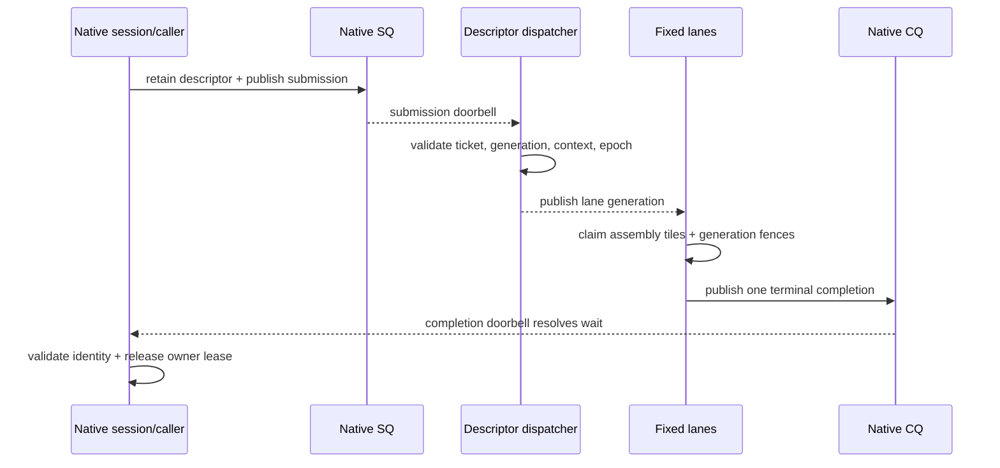

# Flashkern engine design

Status: current implementation plus explicitly marked next steps.

## Boundary

Flashkern is the CPU inference device:

- native C++ owns the engine object, plans, request/pass slots, descriptors,
  queues, fixed threads, barriers, scratch, and lifecycle;
- architecture assembly owns numerical values;
- Rust currently wraps the opaque engine for compatibility/tests and will
  ultimately dock PCM/control only;
- Metal is not part of Flashkern.

## Current Command Flow

`bridge_main` is at
`native/src/engine/flashkern_engine.cpp:1898-1951`. `submit_pass` is at
`1954-2003`. The Rust submitter callback and Rust coordinator module are gone.

The current bridge capacity is one and descriptor capacity is eight. Accepted
submission owns a queue descriptor lease until CQ consumption; the caller owns
the original lease until exact completion. Both releases are counted and the
slot generation advances only after the final release callback returns.

## Fixed Lanes

`lfm_engine_new` creates:

- one mechanical SQ dispatcher thread;
- one stable OS thread per logical lane;
- one cache-line-isolated dispatch wait word;
- one cache-line-isolated fence wait word;
- one shared stage claim counter and logical fence generation.

Every lane executes the same nested pass program. A stage publishes immutable
kind/count/grain, then lanes fetch-add disjoint tiles. The last fence arriver
runs the bounded serial transition and wakes only declared waiters. There is no
spin tier and no coroutine context switch inside the lane team.

## Math ABI

C++ routes pointers, dimensions, strides, and stage identity. It does not own
the numerical ladder.

Current hand-written assembly files include:

- `native/kernels/aarch64/flashkern_math.S`
- `native/kernels/x86_64/flashkern_math.S`
- `native/kernels/{aarch64,x86_64}/flashkern_prng.S`
- `native/kernels/{aarch64,x86_64}/flashkern_rope.S`

`flashkern_math.S` currently owns reciprocal RMS scaling, fixed-order f32
reduction, strided BF16 sum-of-squares, BF16 bias addition, and exact BF16 NeoX
rotary. Existing value-producing C++ code elsewhere in the engine and
architecture `.cpp` files is migration debt and must move to assembly; it is not
a sanctioned fallback tier.

Production assembly leaves:

- never allocate, throw, call Rust, publish a ticket, inspect stop state, or
  perform I/O;
- receive counted raw planes whose lifetime is retained by the pass slot;
- write only declared disjoint destinations or a fence-owned serial result;
- preserve the documented rounding and reduction order;
- expose the same C ABI on AArch64 and x86_64.

AMX/Accelerate remains the Apple matrix coprocessor. Its invocation must sit
behind the architecture math ABI; C++ may select the leaf but may not prepare or
evaluate model values in the pass scheduler.

## State And Memory

The engine currently owns grow-only vectors for model plans and scratch. Final
design requires all model-sized allocation before readiness:

- immutable model and Depthformer plans;
- per-lane panels and temporary accumulators;
- QKV, attention, FFN, logits, sampler, FFT, and codec scratch;
- generation-protected pass slots and descriptor table;
- conversation-owned KV, convolution carry, sampler and codec state.

No pass may resize a vector, allocate a stack-dependent variable-length buffer,
or throw across `extern "C"`. Plan construction tracks maxima across every layer,
not only the final layer geometry.

Weights remain views into the resident aligned model image. Activations and
state mutate in declared native buffers. SQ/CQ records contain only fixed control
facts and IDs.

## Recurrence

The synchronous `submit_pass` helper is a transitional API around the already
native ring. Final recurrence belongs to a native session continuation:

1. acquire a pass slot;
2. retain model/conversation/input/output leases;
3. publish native SQ;
4. park on exact CQ promise;
5. arbitrate terminal facts and commit/rollback state;
6. release slot leases;
7. enqueue the next native action or park for PCM/control data.

Rust is not step 4 or step 7. The outer Rust kcoro runtime handles only audio
stream and control-ring continuations.

## Teardown

Stop closes bridge admission and wakes submission/completion waiters. Accepted
work settles. The dispatcher joins before lane retirement; lanes join before
wait-word release; the bridge destroys only when submissions, completions,
active waits, and descriptor leases are all zero.

Safe Rust wrappers serialize temporary compatibility calls with `pass_lock`.
The raw C ABI independently claims `pass_claimed` before touching shared request
state, so concurrent raw callers receive `-EBUSY` before payload mutation.

## Verification

Current tests include:

- `raw_engine_owns_its_sq_cq_without_rust_progress`;
- `native_engine_bridge_and_fence_soak` (10,000 passes);
- exact MLP, conv, attention, PRNG, sampler, FFT, GEMM, and plan-lifetime tests;
- `scalar_assembly_math_abi_is_bit_exact_without_simd_feature_gates`;
- native AArch64 and local Rosetta x86_64 execution.

Required cutover gates:

1. one million passes with exact descriptor/slot settlement;
2. stop during every submit/dispatch/fence/CQ phase;
3. zero allocation after readiness;
4. no C++ production numerical expressions;
5. no Rust model/numerical symbol in the release graph;
6. two or more conversations scheduled fairly over one model image;
7. p50/p95/p99/max callback and pass latency against frozen baselines;
8. ASan, UBSan, Linux TSan, AArch64, x86_64, and Rosetta gates.
