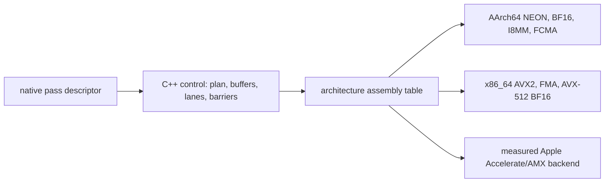

# Flashkern CPU Assembly Contract

Status: current inventory and migration ledger.

Flashkern is the CPU compute device for EmberHarmony voice. It is not a Rust
tensor library, a C++ numerical library, or a Metal backend.

## Boundary

- Native C++ loads and validates model images, binds pointers, owns buffers and
  plans, schedules fixed lanes, crosses barriers, and calls assembly symbols.
- AArch64 and x86_64 `.S` files perform every numerical operation.
- Rust owns no model or PCM payload and calls no numerical leaf. Its final role
  is settings, opaque handles, control, and observation; native code owns OS
  audio streams and PCM docks.
- Flashkern is CPU-only. The Apple GPU peer will use MLX C++/Metal as a separate
  device engine selected above Flashkern.
- Apple Accelerate may be selected for a measured GEMM shape as an opaque
  machine-code/AMX backend behind an architecture assembly thunk. Selection
  happens at model open; C++ still performs no arithmetic and unsupported
  shapes do not silently fall back.



## Current Pass Shape

`native/src/engine/flashkern_engine.cpp` owns a fixed lane team. Each lane runs
the same control program, claims disjoint tiles, invokes assembly leaves, and
returns once. The final member return invokes the ticket continuation; no lane
waits at an operation fence. The private model SQ/CQ correlates an exact ticket
with one fixed engine-owned pass slot, without a descriptor registry or mutex.
No model pass calls Rust.

Mounted typed requests include:

- `REQ_TOKEN_PASS`: embedding, backbone blocks, final norm, optional logits;
- `REQ_DEPTH_FRAME`: Depthformer projection, layers, sampling, recurrence;
- `REQ_DEPTHWISE_STREAM`: split-state streaming depthwise convolution;
- `REQ_GEMM`: KN/NK matrix and GEMV shapes;
- `REQ_FFT_CONV_DD` and `REQ_IRFFT_DD`: cooperative FFT grids;
- focused MLP, attention, convolution, PRNG, and sampler parity requests.

Some numerical bodies called by these requests still live in C++ today. That is
migration debt, not the contract. Each body is deleted when its paired assembly
implementation passes both architecture gates.

## Assembly Families Mounted

| Family | ABI | AArch64 | x86_64 | Notes |
|---|---|---|---|---|
| ChaCha20 block | `flashkern_prng.h` | `flashkern_prng.S` | `flashkern_prng.S` | hot refill is assembly; Apple entropy thunk calls `SecRandomCopyBytes` |
| RoPE table | `flashkern_rope.h` | `flashkern_rope.S` | `flashkern_rope.S` | table generation does not enter Rust |
| scalar/reduction math | `flashkern_math.h` | `flashkern_math.S` | `flashkern_math.S` | inverse RMS, fixed-order sum, BF16 stride sumsq, bias, NeoX rotation |
| sampler leaves | `flashkern_sampler.h` | `flashkern_sampler.S` | `flashkern_sampler.S` | argmax, BF16 scale, threshold traversal, ordered sum, prefix pick |

The sampler assembly includes its own f32 range reduction and degree-six
exponential polynomial. It imports no libm numerical symbol and preserves the
pinned seeded stream on Apple Silicon and x86_64 under Rosetta.

## C++ Numerical Debt

The following production families still have numerical bodies in
`native/kernels/aarch64/flashkern_neon.cpp` and
`native/kernels/x86_64/flashkern_x86.cpp`:

| Family | Representative symbols | Required assembly shape |
|---|---|---|
| BF16 GEMM/GEMV | `lfm_bf16_gemm_f32_v2`, `lfm_bf16_gemv_f32`, `lfm_bf16_gemm_nt_f32` | direct checkpoint-layout row streaming for decode and multi-row prefill; no packed or widened weight image |
| integer GEMM | `lfm_s8_gemm_s32` | I8MM/AVX-512 integer tiles |
| reductions/permutation | `lfm_reduce_*`, `lfm_permute_u8` | vector lanes with fixed tail order |
| convolution | `lfm_depthwise_*`, `lfm_conv1d_update_*` | row-owned streaming kernels; destination writes only |
| FFT and DD | `lfm_fft_radix2_f32`, `lfm_dd_*`, `lfm_complex_mul_f32` | cooperative radix stages and error-free transforms |
| reciprocal/sqrt | `lfm_recip_f32`, `lfm_rsqrt_f32` | architecture estimate plus recorded Newton ladder |
| decode primitives | `lfm_bf16_rmsnorm`, `lfm_bf16_add`, `lfm_swiglu_bf16` | fixed BF16 rounding ladder |
| attention | `lfm_softmax_scaled_f32`, `lfm_attn_qk_*`, `lfm_attn_av_*`, `lfm_rope_i_f32` | head-owned dot/softmax/value/rotation stages |
| dtype conversion | `lfm_bf16_to_f32`, `lfm_f32_to_bf16` | exact shift-expand and RNE store |

Additional numerical C++ debt remains in:

- `native/src/engine/flashkern_engine.cpp`: top-k heap/serial sampler routing,
  double-double FFT arithmetic, twiddle generation, and residual expressions;
- `native/src/detokenizer/lfm_detokenizer.cpp`: current LFM2.5 output
  embedding, ShortConv, GQA, projection, polar-spectrum, inverse-DFT, and
  overlap-add arithmetic. Large dense stages may remain behind the measured
  Accelerate/AMX seam; all other payload calculations require paired assembly
  leaves and cooperative fixed-team scheduling.
- `native/src/mimi/*.cpp`: retained future-Moshi codec GEMM, activation,
  normalization, convolution, transformer, quantizer, and SeaNet arithmetic.
  This archive is not mounted by LFM2.5;
- `native/src/tirex/tirex2_slstm.cpp`: recurrent gates and normalization.

C++ control loops may remain only after every payload calculation inside them is
an assembly call. A `.cpp` file with no non-numerical role is deleted completely.

## Assembly ABI Rules

Every numerical ABI is a fixed C-compatible function over pointers and scalar
shape facts. It has no tensor object, allocator, callback, exception, or virtual
dispatch.

Rules:

1. Input and output extents are validated before the lane team starts.
2. Every destination and scratch plane is allocated/reserved at plan creation.
3. A leaf never allocates, blocks, takes a mutex, rings a host callback, or polls
   cancellation.
4. Stop/interrupt is observed at one full-pass boundary, never per operation.
5. Weights are consumed in checkpoint-native layout unless a measured packed
   plan is created once at model open and retained.
6. BF16 conversion and accumulation order are part of the kernel contract.
7. AArch64 and x86_64 expose the same symbol and semantic contract; unsupported
   ISA selection fails before model readiness.
8. No scalar portability fallback is linked into the product archive.

## Threadgroup Equivalence

The CPU lane team mirrors a GPU threadgroup without pretending the CPU is a GPU:

| GPU concept | Flashkern |
|---|---|
| command buffer | native pass descriptor |
| threadgroup | fixed lane team |
| thread position | lane ID plus atomic tile claim |
| threadgroup memory | engine-owned scratch planes |
| threadgroup barrier | expected-value generation fence |
| completion event | one native CQ record and doorbell |
| device recurrence | native completion continuation submitting the next pass |

Tickets exist at pass/command granularity. Tiles are atomic claims and stages are
generation fences. A ticket per tile would recreate the dispatch overhead this
engine exists to remove.

## Memory Law

Weights, activations, KV, logits, codec state, and sampler state stay in native
regions. Queues carry descriptor IDs, generations, extents, and compact control
facts.

Allowed payload writes:

1. one named copy from an ephemeral hardware callback buffer into a Rust-owned
   PCM ring;
2. assembly destination writes declared by a pass plan.

There is no pass-payload `Vec`, tensor reconstruction, transpose copy, descriptor
copy mode, or per-hop allocation. Mutable state is updated in place after the
owning pass has exclusive lease authority.

## Numerical Parity

Parity belongs to stored fixtures, not to a production Candle call.

Each assembly family must have:

- fixed input/output fixture bytes generated from a pinned oracle commit;
- AArch64 execution on Apple Silicon;
- x86_64 execution on native CI and locally through Rosetta;
- edge fixtures for zero lengths, tails, ties, NaN policy, stale generations,
  and maximum supported shapes where relevant;
- bit-exact equality when the model contract requires exact BF16/f32 order;
- a recorded tolerance and reason only where ISA accumulation order differs;
- disassembly evidence that intended opcodes are present;
- pass accounting and zero-live-descriptor teardown assertions.

The test oracle may contain scalar C++ or Rust under `cfg(test)` or in a separate
test archive. It is never linked into the release product and is deleted when a
stored fixture makes it redundant.

## Build and Source Gate

`crates/liquid-audio/build.rs` currently compiles the paired architecture `.S`
files beside transitional architecture `.cpp` files. The migration completes
when those `.cpp` files are either non-numerical dispatch only or deleted.

The final gate fails on production Rust/C++ source containing:

- Candle or a tensor type;
- floating-point payload arithmetic;
- `<arm_neon.h>` or `<immintrin.h>` intrinsics;
- scalar/vector libm calls;
- model/codec/DSP `CustomOp` wrappers;
- per-pass allocation or scratch growth;
- a Rust model-pass callback or token/logit FFI surface.

Required commands while migrating:

```bash
cargo test -p liquid-audio --lib -- --nocapture
cargo test -p liquid-audio --tests -- --nocapture
cargo test -p kcoro-sys -p liquid-audio --target x86_64-apple-darwin -- --test-threads=1
git diff --check
```

The authoritative scheduling and host-boundary contracts are
[`ENGINE_DESIGN.md`](ENGINE_DESIGN.md),
[`RUST_DELETION_PLAN.md`](RUST_DELETION_PLAN.md), and
[`docs/native/KCORO_ARENA_INTEGRATION.md`](../../../docs/native/KCORO_ARENA_INTEGRATION.md).
