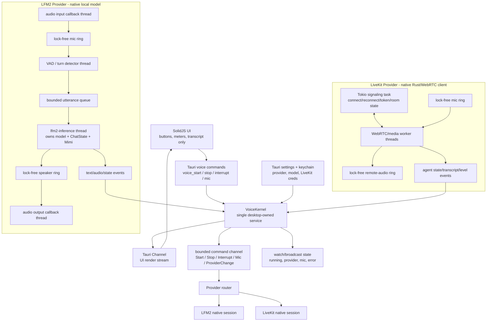
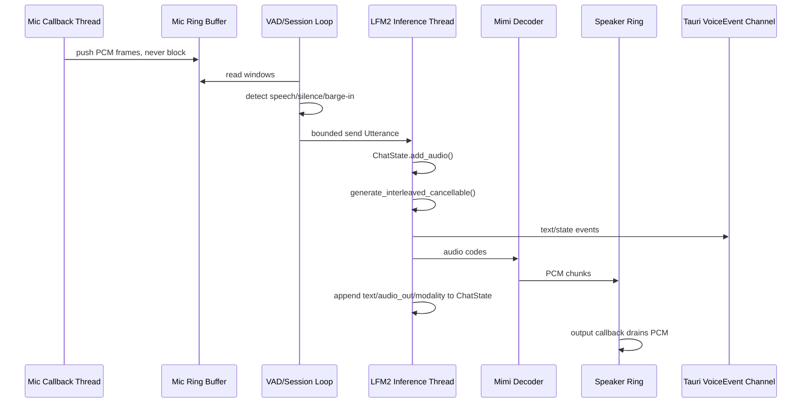
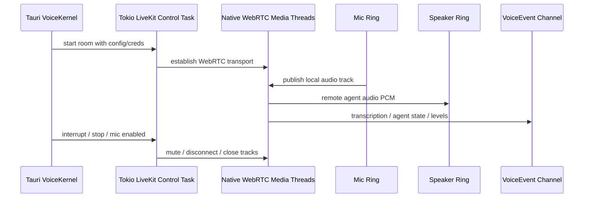

You’re right about the desired shape. The voice layer should be one native desktop kernel with two provider backends, not “SolidJS owns LiveKit, Rust owns LFM2.”

Rust’s closest `asyncio` equivalent is **Tokio**. Tauri already has it. But for realtime audio, the split should be:

- **Tokio async tasks** for control-plane work: commands, config, LiveKit signaling, reconnects, token/config loading.
- **Dedicated OS threads** for hot realtime work: LFM2 inference, audio callbacks, WebRTC/media callbacks.
- **Bounded non-blocking channels/rings** between them: not unbounded queues, not frontend state as coordination.

Current gap: LFM2 mostly follows this. LiveKit does not. LiveKit is still JS/webview-owned via `livekit-client`.

**Target Desktop Voice Kernel**

**LFM2 Kernel Loop**

**LiveKit Native Loop**

The rule I’d use:

- SolidJS never owns a `Room`.
- SolidJS never owns mic truth.
- SolidJS never decides provider availability.
- SolidJS sends intent and renders state.
- Tauri owns provider lifecycle.
- LFM2 and LiveKit both become `VoiceProviderSession` implementations under one `VoiceKernel`.

Current code still violates that on the LiveKit side: [voice.tsx](/Volumes/stuff/Projects/agentsdevelopment/emberharmony/packages/app/src/context/voice.tsx:4) imports `livekit-client`, constructs `new Room`, connects it, mutes it, and renders `RoomAudioRenderer`. That keeps SolidJS as the LiveKit media kernel.

For the buffer model, I would not keep the current shape as-is. The current LFM2 path uses `crossbeam_channel::unbounded` for inference events and `Arc<Mutex<Vec/VecDeque>>` around CPAL buffers. The target should be bounded:

- `tokio::sync::mpsc` for command/control.
- `tokio::sync::watch` for current state.
- `tokio::sync::broadcast` or bounded `mpsc` for UI event fanout.
- `ringbuf`/`rtrb` style lock-free SPSC rings for mic and speaker PCM.
- bounded utterance queue, probably size `1`, so barge-in replaces or cancels instead of piling up stale speech.

So yes: Rust has the async equivalent. But the correct architecture is not “make everything async.” It is **Tokio for orchestration, native threads for realtime work, lock-free bounded buffers for audio, and SolidJS as a display/control surface only.**
