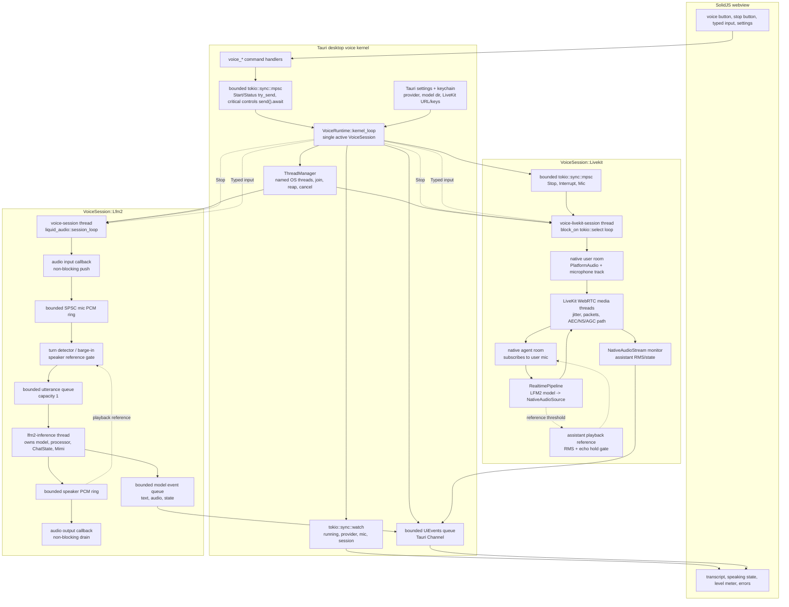
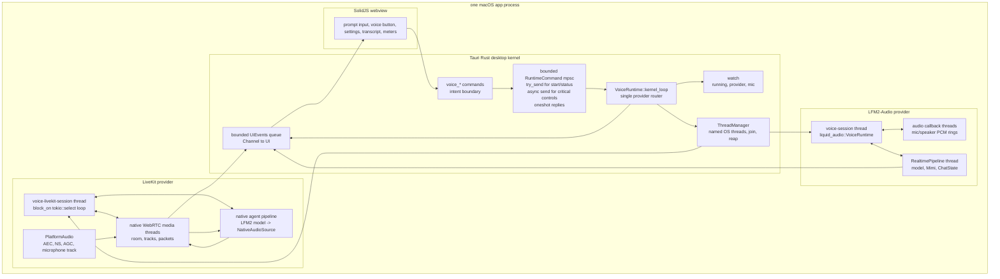
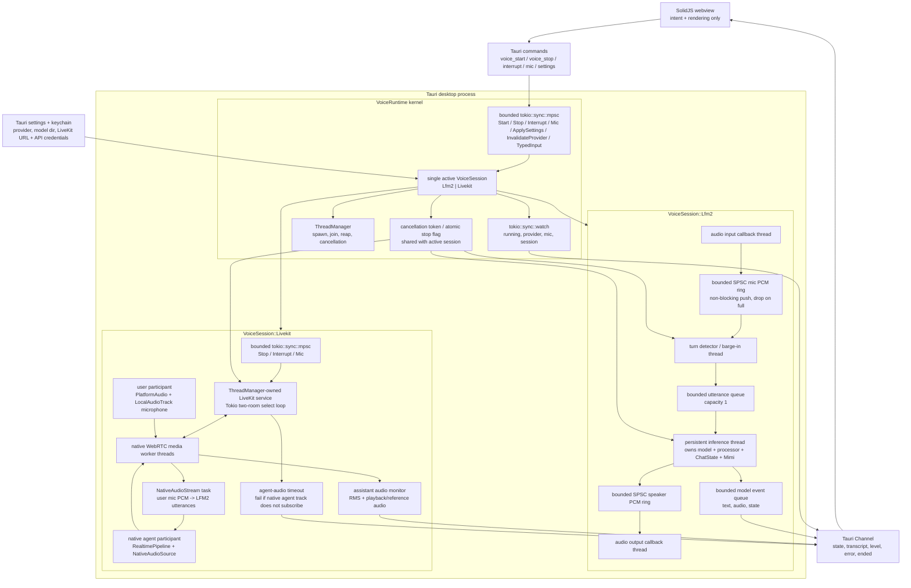
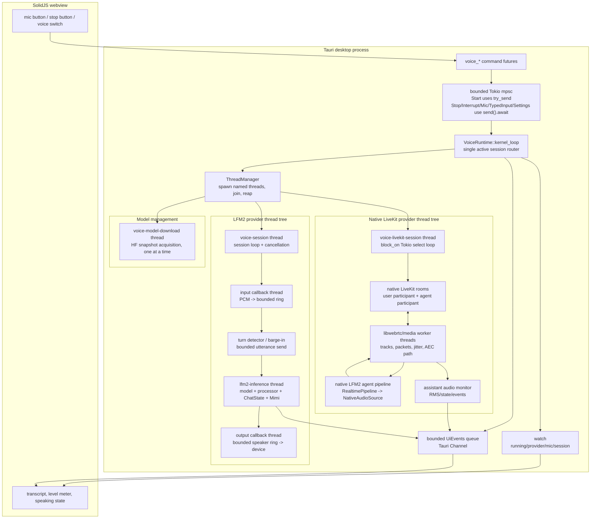
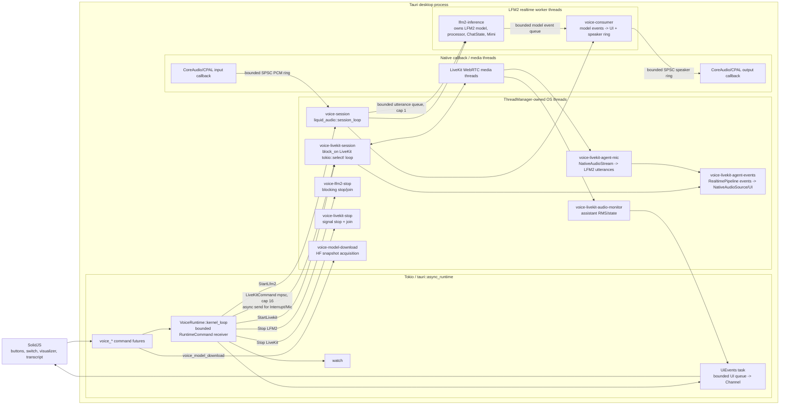
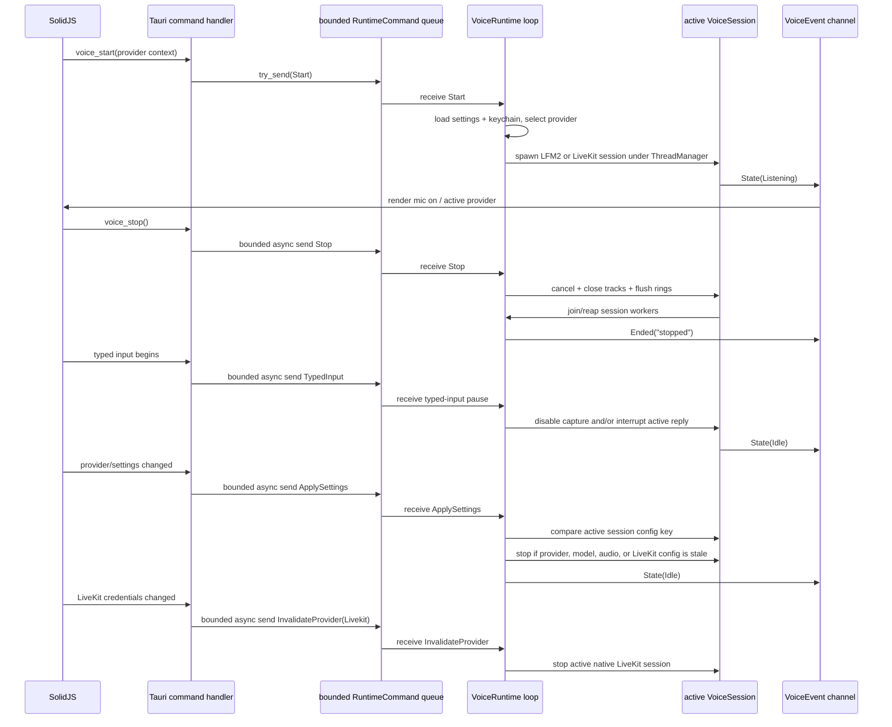
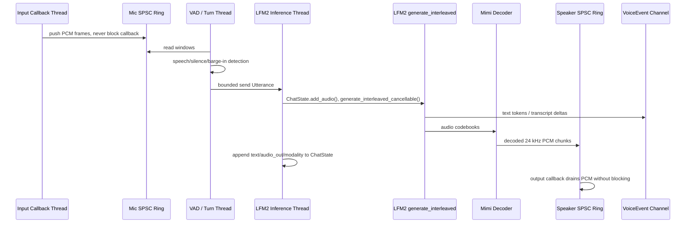
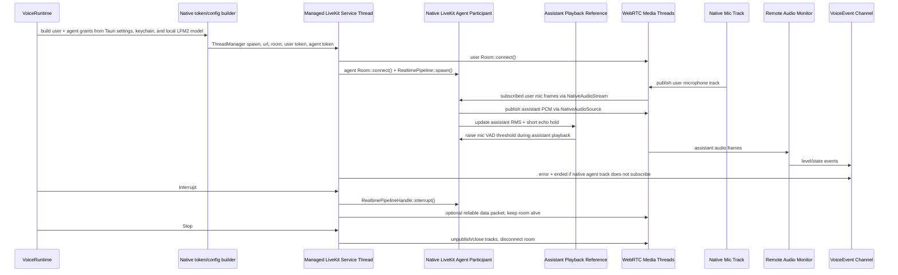

# Desktop Voice Kernel Layout

The desktop voice layer should be one native Tauri/Rust kernel with two provider backends:
local LFM2-Audio and native LiveKit/WebRTC. SolidJS is the control surface and renderer; it
does not own a LiveKit `Room`, microphone truth, provider availability, stop semantics, or
audio buffering.

Rust has language-level `async`/`await`; Tokio is the closest practical equivalent to Python's
`asyncio` here. Tauri already runs on Tokio, so the right split is:

- Tokio tasks for control-plane work: Tauri commands, settings, keychain credentials, LiveKit
  signaling, reconnects, token/config minting, and event fanout.
- Dedicated OS threads for realtime work: audio callbacks, turn detection, LFM2 inference,
  decode/playback, and native WebRTC/media workers.
- Bounded non-blocking buffers between them: no unbounded queues, no frontend state as a kernel,
  no sidecar process IPC for voice.

Tokio should not own the realtime hot path. The async runtime schedules control work and applies
backpressure; the model loop, audio callbacks, and media callbacks run on named threads with
bounded queues between them.

Tauri commands are still the webview-to-Rust app bridge. The part that must not exist is a
forked voice worker or process-level IPC below that bridge. Once a voice command reaches Rust,
provider lifecycle and audio flow stay inside the Tauri process.

## Unified Kernel Loop



This is the intended desktop shape: one process, one kernel loop, one active provider at a time.
Tokio is Rust's closest equivalent to Python `asyncio` for command handling, settings, LiveKit
signaling, `select!`, `mpsc`, `watch`, and oneshot replies. The realtime audio/model work stays
on named OS threads and native callback/media threads. The boundary between those worlds is a
bounded buffer, not a fork, not HTTP, and not SolidJS state.

## Single Process Map



There is no forked voice worker in this map. There is also no HTTP or process IPC layer between
Tauri and the active voice provider. The only webview boundary is the normal Tauri command/event
surface: SolidJS sends intent, and Rust owns the provider loop.

## Kernel Ownership



## Provider Kernel Loop



Both providers hang off the same Tauri-owned kernel. LiveKit is not a separate frontend mode; it
is another native session implementation under `VoiceSession`. The UI can choose LFM2 or LiveKit,
but it does not become the owner of the microphone, room, tracks, model loop, or stop semantics.

## Runtime Thread/Task Topology



No `fork`, no sidecar, and no HTTP/IPC boundary exists below the Tauri command bridge in this
layout. The two acceptable forms of concurrency are: Tokio tasks for async control/network work,
and named native threads/callbacks for realtime work. Every handoff is bounded; if a queue is full,
the producer gets backpressure or cancellation instead of growing latency.

The shared named-thread owner lives in `src/voice/threads.rs`. `runtime.rs`, `model.rs`, and the
LiveKit helper loops all use that same `ThreadManager` instead of carrying local handle lists.

## Kernel Loop



Stop is not a UI affordance. It is a kernel command. The stop button must cancel generation,
mute or close capture, flush pending PCM, close LiveKit tracks/room when selected, join owned
threads, and emit one terminal event. If a user types while the mic is on, the same kernel path
should pause capture and interrupt any speaking turn before the typed request runs, so voice does
not keep listening to the user's keyboard-driven interaction or its own output.

## LFM2 Model Loop



The LFM2 thread owns the model, processor, generation state, ChatState, and Mimi decoder. The
audio callbacks do not call into the model. They only push/pull bounded PCM buffers. Barge-in
sets cancellation, clears stale playback, and lets the inference loop return `Interrupted`
instead of stacking old turns.

## LiveKit Native Loop



LiveKit is still a provider, but it is not a frontend-owned provider. Rust owns room connection,
token/config, mic publication, interrupt packets, stop teardown, and remote-audio monitoring.
LFM2 uses its speaker/playback PCM as reference audio for VAD gating, so the assistant's own
output has to clear a higher echo floor before it is treated as user barge-in. LiveKit enables
WebRTC echo cancellation/noise suppression/AGC through `PlatformAudio`, and the native LiveKit
agent path also mirrors the local playback-reference gate by raising its mic VAD threshold while
assistant PCM is being published through `NativeAudioSource`. A future true AEC pass for the local
CPAL path would be sample-accurate cancellation, not a change in ownership.

## Channel Choices

```text
start/status commands tokio::sync::mpsc, bounded, try_send/backpressure
critical controls     same bounded mpsc, async send().await for Stop/Interrupt/Mic/TypedInput
state snapshot        tokio::sync::watch
UI event stream       tauri::ipc::Channel<VoiceEvent> fed from bounded internal queues
provider completion   internal RuntimeCommand::Reap self-wake from LFM2/LiveKit threads
model downloads       Tauri-managed ModelDownloadRuntime, one active HF snapshot worker
delegated turns       BridgeState-owned async task, one active handoff per voice session
LFM2 utterances       crossbeam_channel::bounded, capacity 1
LFM2 model events     crossbeam_channel::bounded
PCM mic/speaker       custom bounded SPSC PcmRing, atomics + non-blocking callbacks
shutdown/cancel       Arc<AtomicBool> at sync/realtime boundaries
one-shot replies      tokio::sync::oneshot
```

The architecture is therefore not "make everything async." It is Tokio for orchestration, native
threads for realtime work, bounded buffers for audio and events, and SolidJS as a display/control
surface only.
