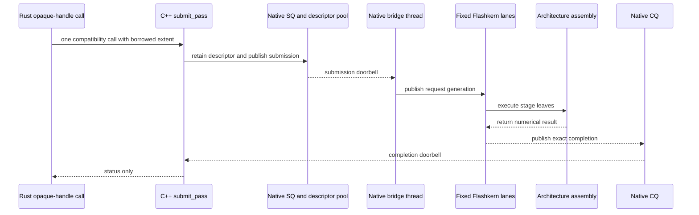
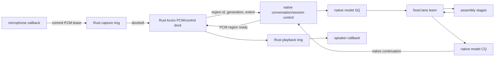
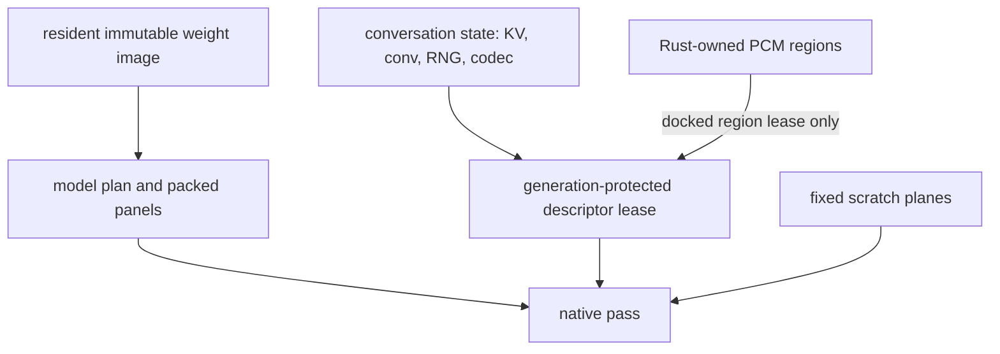

# kcoro and Flashkern Integration Runbook

Status: current implementation map plus migration gates.

This runbook answers one question: where does asynchronous coordination end and
numerical inference begin? The answer is intentionally strict.

## Contract

- Rust owns OS audio streams, PCM rings, settings, and Tauri projection.
- Rust kcoro coordinates only asynchronous PCM/control I/O.
- Native C++ owns handles, plans, queues, barriers, buffer lifetimes, and model
  recurrence control.
- AArch64/x86_64 assembly owns all math.
- The native model SQ/CQ is internal to the native runtime. Rust does not broker
  model passes.
- Progress is callback/doorbell driven. There is no polling or bounded spin.
- A callback that makes progress is reliable and exact-once. Telemetry is
  observational, sampled, coalescible, and never on the progress path.

`kcoro` therefore names two related but different substrates:

1. `crates/kcoro-sys/vendor/kcoro_arena` supplies native expected-value waits,
   tickets, and lifecycle primitives used by the C++ control runtime.
2. `crates/kcoro` supplies Rust continuations for the PCM/control docking layer
   and future Tauri-side parallel work. It does not become an inference engine.

## As-Built Native Pass

The current native pass no longer crosses Rust for progress.



The outer Rust call is presently blocking because it preserves borrowed-buffer
lifetime for compatibility. That is not a Rust coordinator and it does not
choose the next model pass. The final native conversation owns persistent
buffers and recurrence, eliminating the per-pass host call entirely.

Current source:

- bridge records and descriptor ABI:
  `crates/liquid-audio/native/include/lfm_kernel_bridge.h`;
- rings, doorbells, descriptor leases:
  `crates/liquid-audio/native/src/runtime/kernel_bridge.cpp`;
- bridge consumer and native submission:
  `bridge_main` and `submit_pass` in
  `crates/liquid-audio/native/src/engine/flashkern_engine.cpp`;
- fixed lanes and generation fence: `lane_main`, `run_stage`, and `lane_fence`
  in the same file;
- Rust compatibility wrapper:
  `crates/liquid-audio/src/compute/flashkern/native_engine.rs`;
- Rust bridge bindings:
  `crates/liquid-audio/src/compute/flashkern/bridge.rs`, test-only.

## Final Continuous Flow



Model recurrence can issue more token, frame, codec, or predictive work while
Rust audio continuations handle independent PCM and control edges. Completion
order need not equal submission order across conversations. Identity, epoch,
generation, and parent scope route every completion to its exact continuation.

## Three Queue Classes

Do not merge these queues merely because each uses a ring.

| Queue | Producer/consumer | Payload | Progress owner |
|---|---|---|---|
| native model SQ/CQ | native control and Flashkern | compact pass records and descriptor IDs | native continuation |
| Rust/native PCM dock | Rust audio host and native session | region lease identity, extent, epoch | Rust kcoro I/O continuation |
| Tauri observer queue | native/Rust runtime and webview | bounded metadata snapshots | nobody; lossy observer only |

The first queue is not public IPC. The second is not a tensor channel. The third
can drop or coalesce without affecting audio or model progress.

## Scope Semantics

Three states must remain distinct:

- **park**: the parent waits for a child completion; children continue;
- **pause**: scheduling is inhibited while state and registrations remain live;
- **cancel**: the scope epoch changes, descendants become stale, and terminal
  callbacks resolve exactly once.

Stopping speech does not synchronously preempt an assembly instruction. It marks
the publication epoch stale immediately. The active full pass reaches its fence,
may commit model thought state according to conversation policy, cannot publish
stale audio, and rings its terminal completion. Speculative branches roll back
instead of committing.

## Assembly Ownership

The completed production source graph has no numerical Rust or C++ body.

### C++ may

- validate sizes, alignments, capabilities, and epochs;
- own allocations outside passes;
- build immutable plans and bind function pointers;
- move descriptor identities through rings;
- claim work indices and cross barriers;
- invoke assembly ABI functions;
- select an Apple Accelerate/AMX backend at model-open time from measured profile
  data without performing arithmetic itself.

### C++ may not

- add, multiply, normalize, convert, reduce, sample, convolve, rotate, transform,
  quantize, or otherwise numerically mutate model/audio payloads;
- contain SIMD intrinsics as a production kernel implementation;
- call scalar libm from a production numerical loop;
- use Candle, Eigen, MLX-CPU, or generic tensor objects;
- allocate or resize scratch during a pass.

### Rust may not

- own a tensor, logit plane, KV cache, sampler state, model token buffer, or model
  pass descriptor;
- expose a generic numerical FFI wrapper;
- decide token/frame recurrence;
- execute DSP, model, sampler, or codec arithmetic.

Test-only scalar oracles may exist in an explicitly excluded test target. They
cannot link into the product archive.

## Mounted Assembly Families

| Family | Assembly source | Current status |
|---|---|---|
| ChaCha20 block and Apple entropy thunk | `native/kernels/{aarch64,x86_64}/flashkern_prng.S` | mounted |
| RoPE table generation | `native/kernels/{aarch64,x86_64}/flashkern_rope.S` | mounted |
| scalar reductions, inverse RMS, BF16 bias/NeoX rotation | `native/kernels/{aarch64,x86_64}/flashkern_math.S` | mounted |
| sampler argmax, scaling, threshold, exponentiation, ordered sum, prefix selection | `native/kernels/{aarch64,x86_64}/flashkern_sampler.S` | mounted; no external numerical symbol |
| GEMM, attention, activation, convolution, FFT, Mimi | architecture `.cpp` and native C++ sources | migration debt |

The sampler includes a local f32 range-reduced degree-six exponential in each
architecture object. It imports no libm numerical symbol and preserves the
pinned seeded sampler stream on Apple Silicon and x86_64 under Rosetta.

## Buffer and Lease Rules



- A descriptor moves by identity; its payload does not move through a channel.
- A pass retains every source/destination lease until its CQ cell is consumed.
- Scratch capacity is fixed before submission.
- Recycle increments generation before a slot can be reused.
- Shutdown closes admission, drains terminal completions, joins workers, proves
  zero live leases, then destroys storage.
- Raw payload `memcpy` is limited to named hardware ingress and declared assembly
  destination writes.

## Native Recurrence

One conversation has one native recurrence state containing:

- current modality and token/frame cursor;
- KV and short-convolution cursor/state;
- sampler CSPRNG image;
- codec state;
- interrupt/publication epoch;
- active candidate or speculative mark;
- pending native continuation identity.

A completion may directly enqueue the next native pass. Rust is informed only
when PCM/control ownership crosses the docking boundary or when a sampled
observer event is emitted.

Predictive listening uses the same mechanism. A draft owns a candidate epoch;
resumed speech cancels that epoch; terminal arbitration decides commit versus
rollback without routing through Tauri.

## Migration Order

1. Keep the direct native SQ/CQ mount and delete all remaining Rust model-pass
   routing.
2. Move every architecture `.cpp` numerical family into paired AArch64/x86_64
   `.S` objects. Remove each C++ body after parity passes.
3. Bind the full model from the resident safetensors image and move conversation
   state plus recurrence behind opaque native handles.
4. Port mel, Conformer, adapter, Mimi, and remaining generation code; delete the
   corresponding Rust/Candle sources in the same gate.
5. Mount Rust kcoro PCM/control docking rings and reduce the desktop Rust layer to
   streams, settings, handles, and event projection.
6. Add the separate MLX C++/Metal device engine. Do not add Metal to Flashkern.
7. Remove Candle dependencies and verify the product symbol graph.

## Gates

Run after every numerical family:

```bash
cargo test -p liquid-audio --lib -- --nocapture
cargo test -p liquid-audio --tests -- --nocapture
./crates/liquid-audio/scripts/test-rosetta.sh
git diff --check
```

The family gate must prove:

- fixed fixture parity on AArch64 and x86_64;
- deterministic pass/fence counts where promised;
- no per-pass allocation;
- no Rust callback or Tauri event required for progress;
- no stale publication after interrupt;
- zero live descriptors and continuations at teardown;
- source/disassembly shows the production numerical body in `.S`;
- the replaced Rust/C++ numerical body is deleted, not retained as fallback.

Final release gates add one-million-pass soak, completion/cancel/stop races,
idle-CPU measurement, PCM underrun/overrun accounting, and a product-binary audit
for Candle, Rust tensor, scalar libm, and disallowed C++ numerical symbols.
