# kcoro_arena Integration Runbook

This is the handoff document for bringing the stackless `kcoro_arena` runtime
into EmberHarmony without losing the native engine's existing performance and
ownership rules. It is written for a future engineer or coding agent arriving
without the history of the implementation.

The product-level design that uses this substrate for many conversation images,
copy-on-write advisors, hibernation, and macro batching lives in
[`10-stateful-multi-agent-runtime.md`](../../specs/10-stateful-multi-agent-runtime.md).

## Baseline and status

- EmberHarmony inspected at commit `0c7d579b`.
- Standalone `kcoro_arena` inspected at commit
  `447d04f0246bb22569d38cdd222a579a1d2b6ec4` in
  `/Volumes/stuff/Projects/kotlinmania/kcoro_arena`.
- The stackless runtime is **not integrated into EmberHarmony yet**.
- EmberHarmony production code still vendors the older **stackful** kcoro under
  `crates/kcoro-sys/vendor/kcoro`.
- The migration must preserve the private `lfm_engine_*` C ABI first. Rust,
  Tauri, and Bun should not need to know which coroutine implementation is
  behind it.

The standalone checkout is a development source, not a build dependency. Never
add a machine-local path or symlink to it. Vendor a clean snapshot into this
repository and record the source commit.

## Source reading map

Read these files in order before changing the integration:

1. [`flashkern_engine.cpp`](../../crates/liquid-audio/native/src/engine/flashkern_engine.cpp)
   for the live request slot, lane program, generation fence, context table, and
   C ABI.
2. [`native_engine.rs`](../../crates/liquid-audio/src/compute/flashkern/native_engine.rs)
   for the Rust pass lock, pointer captures, context guard, and FFI lifetimes.
3. [`lfm2_hf.rs`](../../crates/liquid-audio/src/model/lfm2_hf.rs) for model-context
   installation and per-token state capture.
4. [`realtime.rs`](../../crates/liquid-audio/src/runtime/realtime.rs) for the
   existing Rust worker, epoch, interrupt, and shutdown behavior that the first
   arena migration must leave alone.
5. [`kcoro-sys/build.rs`](../../crates/kcoro-sys/build.rs) for the runtime sources
   actually linked into EmberHarmony.
6. [`engine.rs`](../../crates/liquid-audio/src/compute/flashkern/engine.rs) only as
   historical/reference evidence for channel behavior. It is not the live mount.
7. [`ENGINE_DESIGN.md`](../../crates/liquid-audio/docs/ENGINE_DESIGN.md) for the
   broader CPU-as-GPU target, while observing the current/target distinction in
   this runbook.
8. [`rust-voice.yml`](../../.github/workflows/rust-voice.yml) for the platforms and
   test commands that currently gate the native stack.

## Read this first

There are three facts that prevent the wrong implementation:

1. `crates/liquid-audio/native/src/engine/flashkern_engine.cpp` is the live CPU
   engine. It executes one whole backbone token on a persistent native lane team.
2. `crates/liquid-audio/src/compute/flashkern/engine.rs` is a prototype/reference
   channel engine. It is not the production mount and should not receive new hot
   paths.
3. The old runtime saves C/C++ stacks. The new runtime does not. A function that
   calls `kcoro_park()` in a nested C++ frame cannot be moved to `kcoro_arena` by
   changing includes and symbols. Every suspension point must become explicit
   state in a persistent lane frame.

When documentation disagrees with source, use this order of authority:

1. Current source, build scripts, and passing tests.
2. This integration runbook for the kcoro migration boundary.
3. Adjacent design documents under `crates/liquid-audio/docs/`.
4. Historical claims in the standalone runtime.

`ENGINE_DESIGN.md` intentionally mixes target architecture with as-built notes.
In particular, its single contiguous mutable arena and direct mmap `WeightTable`
remain target work. The current engine has several grow-on-build C++ vectors and
borrows pointers from Rust-owned tensor storage.

At the pinned standalone commit, `docs/KCORO_RUNTIME_BACKPORT.md` is stale: its
"Not Yet Claimed" section says timers, scopes, durability, workflows, and host
contracts are absent, while the canonical headers, core source list, and tests
at that same commit contain them. Use `include/kcoro_arena.h`, linked symbols,
and production-backed tests as the capability truth. Update the stale
standalone status page before copying documentation into EmberHarmony.

## System boundary

The initial integration belongs entirely below the Rust native-engine rim.

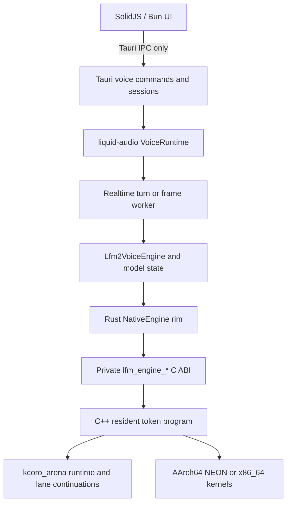

Hard boundaries:

- Bun/TypeScript never links kcoro and never receives native pointers.
- Tauri owns desktop sessions, permissions, app-data paths, and remote transport.
- `liquid-audio` owns model state, the private native ABI, and the CPU engine.
- `kcoro-sys` compiles and links the C runtime. It remains a build/link crate;
  it does not need to expose a general safe Rust coroutine API.
- The first migration does not replace `RealtimePipeline`, PCM rings, CPAL, or
  LiveKit. Those are separate control and media boundaries.

## What should use kcoro_arena

| Area | Use it? | Reason |
|---|---:|---|
| Persistent native lane team | Yes, first | Replaces 512 KiB stackful lane stacks with explicit continuations while preserving one-doorbell passes. |
| Stage barriers | Yes, after wake audit | `koro_sched_wake` targets the correct continuation, but the current runtime broadcasts to every sleeping OS worker for each enqueue. Preserve the doorbell semantics and fix or bound that herd before claiming latency parity. |
| Per-tile dispatch | No | Tiles stay on the shared atomic claim counter. A channel hop per tile recreates the stutter already removed. |
| Native subsystem commands | Later, selectively | Channels are appropriate for coarse requests whose lifetime or backpressure needs arbitration. |
| Weight and activation handoff | Regions/descriptors only at boundaries | Hot kernels continue to receive direct pointers into stable storage. |
| PCM callback rings | No migration for its own sake | The existing fixed rings are the right primitive for the real-time callback path. |
| Rust realtime worker | Not in the first migration | Its epoch, shutdown, and backpressure behavior is already explicit and tested. |
| Durable session/agent orchestration | Later, gated | WAL, durable messages, and serializable workflows belong above inference, never inside a token pass. Production disk sync and bounded snapshot compaction must land first. |

## Current production truth

### Runtime and build

`crates/kcoro-sys/build.rs` currently compiles the old runtime's channels,
scheduler, dispatcher, and architecture context-switch assembly. The native
engine includes old kcoro headers and creates a `kc_dispatcher_t`.

At engine creation:

- one coroutine is lane 0 and the request coordinator;
- lanes 1 through N-1 are worker coroutines;
- each coroutine receives a 512 KiB stack;
- dispatcher thread count equals total lane count;
- idle coroutines park;
- the Rust caller writes one request slot, rings lane 0, and blocks on a pthread
  condition variable until the pass-completion signal.

### Live token path

The live route is:

```text
Lfm2 model
  -> native_token_pass
  -> process_engine().token_pass
  -> lfm_engine_token_pass
  -> REQ_TOKEN_PASS
  -> lane_program on every lane
  -> embed, every backbone layer, final norm, logits
  -> one completion handback to Rust
```

Sampling remains at the Rust rim for RNG parity. Cancellation and shutdown are
observed at a full pass boundary, not in every tile or SIMD operation.

### The separate REQ_CALL surface

`REQ_CALL` is also production code. `NativeEngine::run_lanes` and `grid`, the
DepthDecode frame, and several NEON/x86/fanout grids dispatch caller-supplied
Rust functions over the same native lane team. The callback context is borrowed
for the blocking `lfm_engine_call` and every lane invokes the Rust trampoline
once.

This surface has a stricter contract than the C++ token program:

- the Rust callback must not park or call any kcoro API;
- it must not call the engine recursively;
- cross-lane synchronization uses Rust `SpinBarrier`, not `lfm_lane_fence`;
- a panic aborts instead of unwinding across the C ABI;
- all logical lanes must run concurrently because a spinning lane cannot give
  its worker back to the scheduler.

The C++ comments that describe `REQ_CALL` programs as using
`lfm_lane_fence` are stale relative to the Rust contract and current call sites.
Update them during migration.

The stackless mapping is a non-suspending `LanePc::Call` state. Each lane calls
the Rust trampoline to completion on its OS worker stack, then enters the normal
stackless program-final fence. No lane may return `NULL` while a Rust frame is
live. Configure exactly one nonzero runtime worker per logical lane for this
surface; fewer workers can deadlock a spin barrier.

### Current scheduler shape

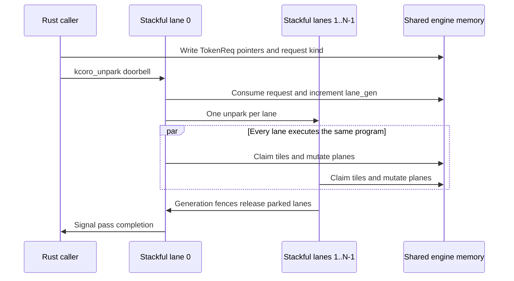

The external request slot and condvar are not the source of per-operation
overhead. They occur once per full native pass. The hot stage path has no
channel, waiter allocation, or descriptor copy.

## Memory and ownership

### Lifetime stack

This is the useful way to reason about every pointer crossing the ABI:

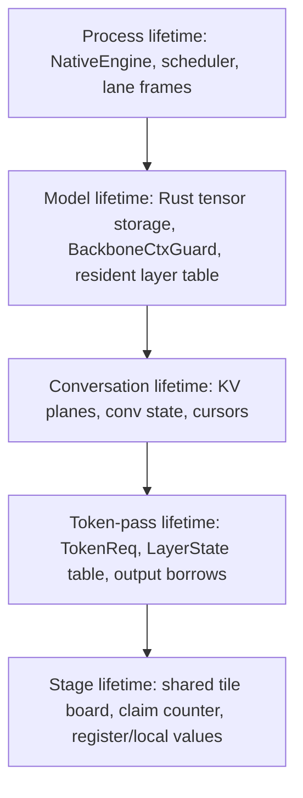

A pointer may only point outward to an equal or longer lifetime. For example, a
pass may borrow a conversation KV plane, but the resident model table must not
retain a pointer to a per-pass `LayerState` array.

### Current memory map

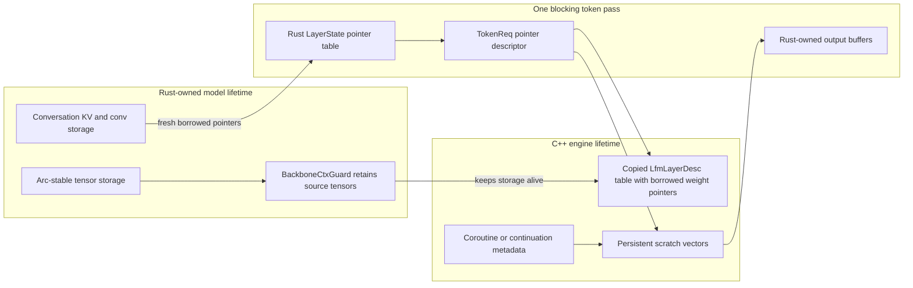

| Memory | Owner | Lifetime | Native access | Copy rule |
|---|---|---|---|---|
| Model weights | Rust model and retained tensors | Model context | Read-only borrowed pointers in `LfmLayerDesc` | Never stage or repack in the token hot path. |
| Resident layer descriptors | C++ `Engine` | Installed context | Direct indexed reads | The small descriptors are copied once at context build. Payloads are not. |
| Scratch planes | C++ `Engine` | Engine/context | Mutated in place | Current implementation uses multiple vectors sized at context build. Target is one aligned arena. |
| KV and conv state | Rust conversation caches | Conversation | Fresh pointers captured for each blocking pass | Mutated in place. Capacity must be ensured before pointer capture. |
| `TokenReq` and `LayerState` | Rust caller, borrowed by C++ | Blocking call | Read-only descriptor fields | No retention after completion. |
| Hidden/logit outputs | Rust caller | Blocking call and later sampling | Written directly | No return payload copy. |
| Lane state | Runtime plus C++ engine | Engine | Scheduler and barrier mutation | Becomes explicit `LaneFrame` state in the stackless port. |

Zero-copy does not mean that every `memcpy` instruction is forbidden. A copy is
legitimate when it is the model operation itself, such as loading an embedding
row into the mutable hidden plane or appending newly computed K/V rows to the
cache. A copy is suspect when it only transports an unchanged payload between
workers or subsystems. Review each copy under that distinction:

- **Allowed semantic write:** embedding row to hidden scratch, K/V append, fixed
  snapshot requested by an API.
- **Rejected transport staging:** copying a weight, activation, PCM block, or
  job payload merely because a queue or callback expects ownership.
- **Boundary descriptor copy:** copying a small pointer/offset/length descriptor
  once is acceptable when it does not happen per tile and has measured value.

### Target contiguous mutable arena

The kcoro migration does not itself create the model arena, but it must not make
that later work harder.

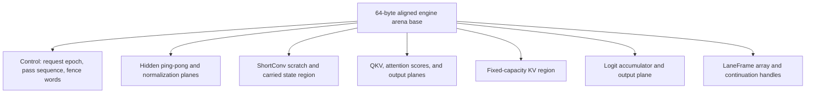

Target kernel arguments are offsets from this base or read-only weight pointers.
Arena capacity changes require an engine/context rebuild. There is no vector
growth while a pass is executing.

## From saved stacks to explicit lane frames

The largest conceptual change is where suspended state lives.

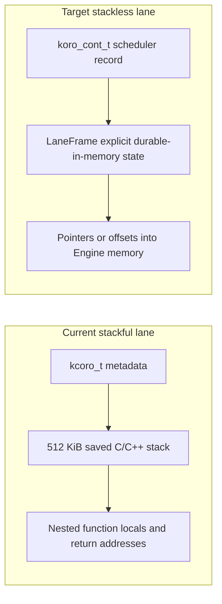

The new runtime may resume a lane on a different worker thread. Therefore:

- no lane state may live in thread-local storage;
- no pointer to a C/C++ stack local may survive a suspension;
- no lock may be held when the step function returns `NULL`;
- SIMD kernels and tile loops must finish before suspension;
- every layer index, stage ID, fence generation, hidden-plane selection, and
  pending completion action needed after suspension belongs in `LaneFrame`.

The rewrite is larger than replacing `lane_main`. A fence can currently suspend
under this call tower:

```text
lane_main
  -> lane_program
    -> run_token_pass
      -> run_conv_block or run_attn_block
        -> run_mlp
          -> run_stage
            -> lane_fence
```

Those orchestration frames and their locals are presently preserved by the 512
KiB coroutine stack. The stackless port must flatten the entire tower into
explicit program counters and frame fields. Leaf tile bodies, SIMD kernels, and
helpers that always return without suspension can remain ordinary functions.

A schematic frame is:

```cpp
enum class LanePc : uint32_t {
    Boot,
    Idle,
    EnterStage,
    RunTiles,
    AdvanceProgram,
    FinalFence,
    Retire,
};

struct LaneFrame {
    Engine* engine;
    koro_cont_t* self;
    uint32_t lane;
    LanePc pc;
    uint64_t seen_pass;
    uint64_t waiting_fence;
    size_t layer;
    uint32_t stage;
    bool hidden_is_h0;
};
```

This is a shape, not a drop-in definition. Add only state that truly crosses a
suspension. Values derived cheaply from stable `Engine` state can be recomputed.

## Target stackless execution

### Lane bootstrap

`kc_runtime_spawn` does not return a continuation handle. Each lane publishes
the `koro_cont_t *` passed to its first step into its own `LaneFrame::self`.

1. Create one explicit `kc_runtime_t` with a nonzero
   `worker_count == lanes_total`. The runtime interprets `worker_count == 0` as
   **one worker**, not automatic CPU detection.
2. Spawn N lane step functions, each with a stable `LaneFrame` argument.
3. On first entry, each lane stores `self`, increments an engine `booted` count,
   and suspends in `Idle`.
4. Call `kc_runtime_run_until_idle` during engine construction.
5. Refuse construction unless all N handles were published and all lanes are
   waiting.
6. Start accepting `lfm_engine_*` requests only after this gate.

Assert through `kc_runtime_snapshot_get` that the started worker count equals
the engine lane count. This is a correctness requirement for `REQ_CALL`, not
only a performance preference.

Do not use the process-default `koro_go` runtime for the engine. EmberHarmony
needs an explicit runtime whose lifecycle is owned by `Engine`.

### Lane state machine

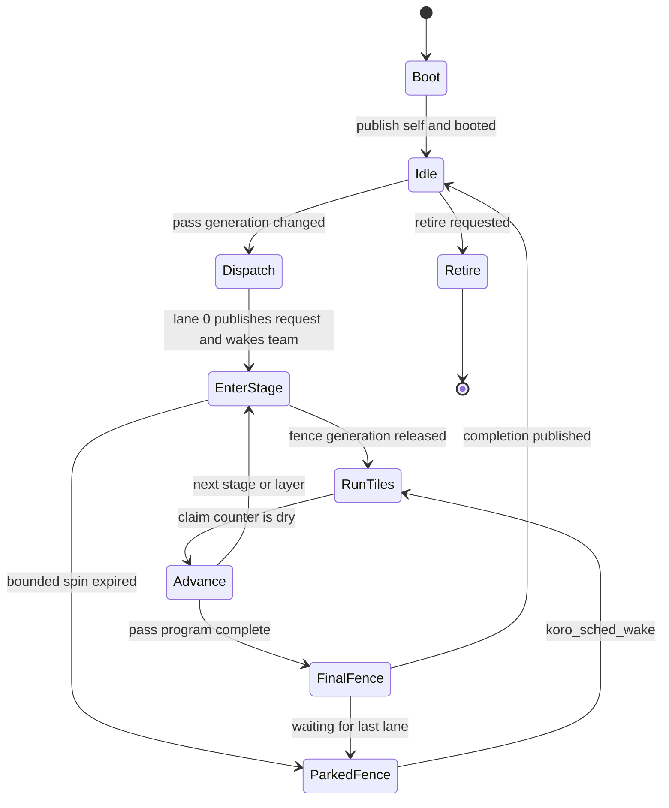

The step function should be a manual state machine. The protothread macros are
useful for ordinary channel operations, but the engine already has a generated
stage program and nested C++ helpers. A manual `switch (frame.pc)` makes the
saved state and legal suspension points reviewable.

### One-token workflow after migration

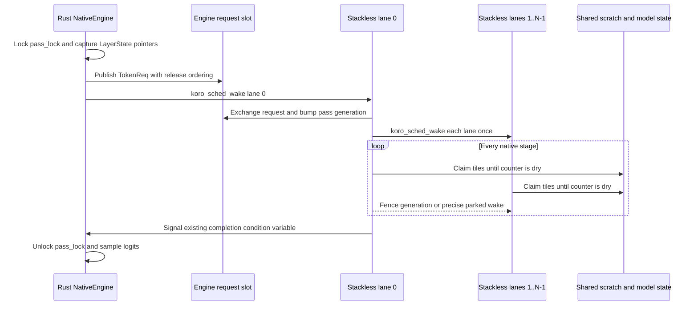

The Rust call remains blocking during the first migration. That keeps all
borrowed request pointers valid and avoids changing the public model behavior.

## Barrier mechanics

The current generation fence is worth preserving. It has one bounded spin per
stage boundary, then an exact park. It does not spin while the engine is idle.

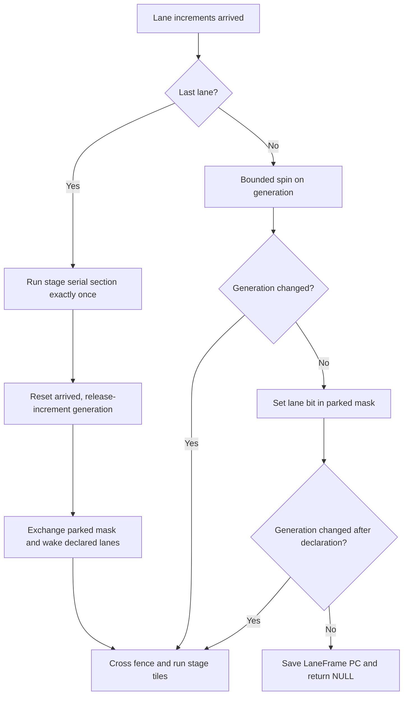

For the stackless port, replace `kcoro_park()` with a return to the scheduler:

1. Save the observed fence generation and the resume PC in `LaneFrame`.
2. Set the lane's park bit with acquire/release ordering.
3. Recheck generation after declaring the park.
4. If it advanced, clear the declaration and continue without suspending.
5. Otherwise return `NULL` from the top-level lane step.
6. The last arriver increments generation before exchanging the park mask.
7. It calls `koro_sched_wake(frame.self)` only for declared lanes.
8. A resumed lane rechecks generation before entering the next stage.

The full-step doorbell rule still applies. Cancellation and stop are checked at
the token/frame pass boundary. They are not added to `run_tile`, inner GEMV
loops, or every barrier.

### Scheduler wake caveat

The continuation wake protocol itself is sound: a wake racing a running step
sets `wake_pending`, suspension consumes that token, and the intrusive ready
queue does not allocate on enqueue. That proves lost-wake safety and keeps a
zero-allocation pass possible.

The OS-worker wake is not yet precise. `queue_locked` calls
`KC_COND_BROADCAST` for every enqueued continuation. Workers,
`run_until_idle`, and `join_all` all wait on the same runtime condition
variable. At a pass start or fence release, waking N-1 lane continuations can
therefore generate repeated broadcasts that wake all sleeping workers to
compete for one queue entry at a time. A continuation-targeted doorbell is not
the same thing as a targeted pthread wake.

Do not change that broadcast to `signal` in isolation: the shared condition
variable means a signal may wake a lifecycle waiter instead of a worker. Fix
the ownership first, for example with separate work-available and state-change
condition variables, or a counting work semaphore plus a lifecycle condition.
Then signal one worker for one newly runnable continuation and broadcast only
for stop or lifecycle transitions. Re-run the lost-wake and teardown races after
any such change.

## Old-to-new runtime map

| Current stackful concept | Stackless replacement | Integration note |
|---|---|---|
| `kc_dispatcher_new(workers)` | `kc_runtime_create` plus `kc_runtime_start` | Runtime is an `Engine` member, not a global. |
| `kc_dispatcher_spawn_co` | `kc_runtime_spawn` | Lane publishes its own continuation pointer during bootstrap. |
| `kcoro_t *` | `koro_cont_t *` plus `LaneFrame` | Runtime owns the continuation; C++ owns stable frame storage. |
| 512 KiB coroutine stack | Explicit frame fields | No nested frame survives suspension. |
| `kcoro_park()` | Save PC and return `NULL` | Only from the top-level lane step. |
| `kcoro_unpark(co)` | `koro_sched_wake(cont)` | Safe continuation doorbell; current OS-worker broadcast behavior still needs Phase C measurement or repair. |
| `kc_dispatcher_release` | Lane retire, `join_all`, `request_stop`, `join`, `destroy` | Retire raw-waiting lanes before stopping workers. |
| Copy-mode channel job | Shared stage board or region descriptor | Never restore per-tile channels. |
| Process-global scheduler helpers | Explicit `kc_runtime_t` | Legacy helpers are unsuitable for engine ownership. |

## Channels, descriptors, scopes, and actors

Use each primitive at the granularity it was built for.

### Channels

- Rendezvous: exact handoff between coarse native tasks.
- Bounded FIFO: commands where backpressure is part of correctness.
- Unlimited: control streams that must not reject. Payload descriptors and arena
  segments reclaim as values drain, but the descriptor-pointer ring doubles and
  never shrinks. Its metadata allocation remains at historical peak depth, so
  this is not bounded by current queue depth without an explicit high-water
  budget or an upstream shrink/rebuild policy.
- Conflated: state such as latest configuration or latest meter value where an
  older queued value should be released.

Do not put `TileJob` back on a channel. The stage board and claim counter are
already the fused dispatch primitive.

### Descriptors and regions

Use `kc_descriptor_create_region` for a same-process payload whose storage is
already stable. The descriptor retains the registered region; it does not copy
the payload. Use `kc_descriptor_create_copy` only when the producer cannot keep
storage alive and an owned copy is explicitly required.

For cross-process or durable references, use `kc_shared_payload`:

```text
provider_id, region_id, offset, length, format, generation
```

Raw virtual addresses never enter a WAL record or wire frame. The host provider
must reject stale generations and keep a region registered while leases exist.

### Scopes and cancellation

A future native voice-session mapping may use:

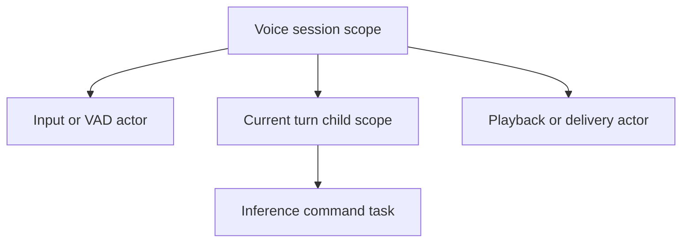

Canceling a turn sets the pass-boundary stop reason and prevents the next pass.
It does not interrupt an in-flight SIMD stage. Closing a session cancels child
scopes, joins them, and only then releases regions and engine context.

This is a later control-plane integration. Keep the existing Rust
`WorkerSignals` epoch and shutdown behavior until an implementation-backed test
proves the native replacement preserves it.

## Durable workflows in EmberHarmony

Durability belongs at turn, tool, and session granularity. A token is ephemeral
compute. Writing every token, PCM frame, barrier, or KV update to a WAL would
destroy latency and produce the wrong recovery semantics.

Good durable events include:

- a committed user turn;
- a tool/agent command that must survive process restart;
- a reply ready for external delivery;
- acknowledgement from a remote consumer;
- retry, dead-letter, compensation, or session-terminal transitions.

Do not persist:

- native addresses;
- continuation pointers;
- model weights or scratch;
- live KV-cache pointers;
- per-token stage state;
- ordinary PCM ring contents.

### Durable turn transaction

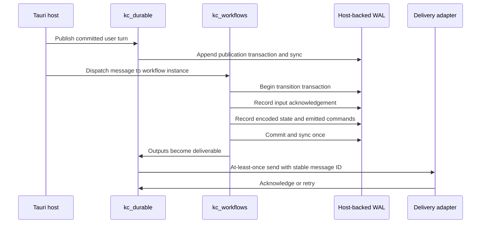

The atomic unit is input acknowledgement plus workflow state plus emitted
messages. External delivery is at-least-once, so every side-effecting consumer
must use the stable message ID or an idempotency key.

### Example voice workflow

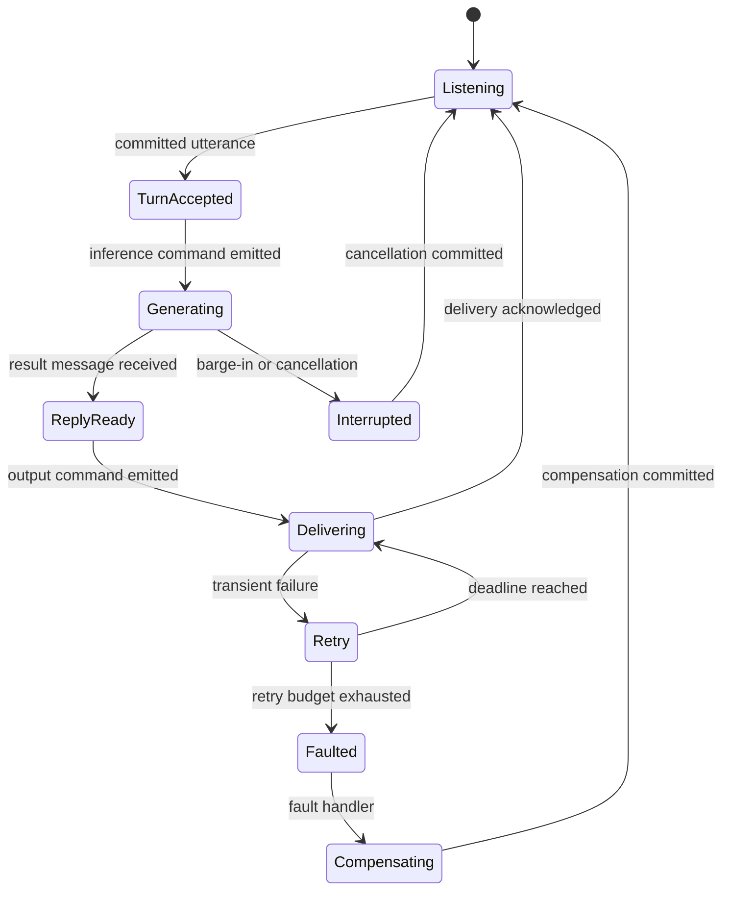

The workflow stores IDs, state ID, encoded state, correlation sets, retry data,
and pending commands. It never stores a Rust closure, C++ function address, or
coroutine frame. Definitions and migrations must be registered before recovery.

## Host adapters

The core intentionally uses direct link-time host contracts rather than a hot
path vtable.

### Platform adapter

For current macOS and Linux builds, compile the standalone POSIX adapter in
`port/posix.c` alongside the core. It supplies `kc_port_*` mutex, condition,
thread, clock, CPU-count, and yield functions. Keep the portable core and POSIX
adapter as separate archives so the core symbol audit remains meaningful.

The stackless runtime needs no context-switch assembly. Architecture assembly
remains only where a compute kernel itself requires it.

### Storage adapter

At the pinned runtime commit, the only implementation of `kc_store_*` is
`tests/store_memory.c`. The WAL, recovery, crash injection, and 100-cycle soak
prove in-memory protocol behavior; they have not exercised a filesystem,
kernel writeback, drive cache, process kill, or power loss. Do not present those
tests as production disk durability.

Tauri should own the app-data location and open storage handles. The host must
implement `kc_store_size/read/append/sync/truncate`. No filesystem path belongs
in the kcoro core or token engine. `kc_store_sync` is the commit boundary and
must fail if the requested durability cannot be established.

On macOS, a power-loss durability contract requires the host adapter to use
`fcntl(fd, F_FULLFSYNC)` or a demonstrably equivalent mechanism. Darwin defines
that operation as `fsync` plus asking the drive to flush to media. Do not
silently downgrade to plain `fsync` or assume a language runtime's generic
`sync_all` has stronger semantics without verifying its implementation. Other
platform adapters need an equally explicit contract, including directory sync
when atomic file replacement is part of snapshot publication.

The current snapshot format has an additional blocker. Every
`kc_wal_snapshot_write` appends a complete image to one snapshot store.
Recovery scans every complete frame, keeps the newest, and truncates only a
torn tail. Old complete images are never removed, so repeated checkpoints grow
the snapshot store without bound even though the WAL itself is truncated.

The five-function store API can truncate only the tail. It cannot remove old
prefix frames while preserving the previous synced snapshot until its
replacement is durable. Before Phase F, add a safe compaction protocol such as
A/B snapshot stores with generation selection, or extend the host contract with
atomic replacement/reset semantics. Test failures at every write, sync, swap,
directory-sync, and old-store reclamation boundary. Repeated checkpoint tests
must assert a bounded on-disk footprint.

### Transport adapter

Use `kc_transport_*` only for durable remote delivery that needs connection
identity, acknowledgement, reconnect, and backpressure. It is not a replacement
for every Tauri command or LiveKit media packet.

The payload passed to `kc_transport_send` is valid only for that synchronous
call. An asynchronous adapter must retain a region lease or make its own owned
copy before returning.

### Shared-region provider

Use `kc_region_provider_*` when another process, plugin, or transport must resolve
a stable region reference. Same-process engine pointers should stay direct and
be protected by their existing Rust/C++ lifetimes.

## Repository integration

### Intended source layout

```text
crates/kcoro-sys/
  Cargo.toml
  build.rs
  src/lib.rs
  vendor/
    kcoro_arena/
      UPSTREAM_COMMIT
      LICENSE
      include/
      core/
      port/
      scripts/
      tests/
```

Vendor only source, license, scripts needed for audits, and tests useful for
provenance. Exclude `.git` and generated `build/` trees.

### Build changes

1. Move the current runtime to `vendor/kcoro_legacy` while the migration is
   under comparison.
2. Vendor the pinned stackless snapshot as `vendor/kcoro_arena`.
3. Make `kcoro-sys/build.rs` select one backend per build. Do not link both
   runtimes into the same binary.
4. Compile the portable core source list from its `core/Makefile` as C11.
5. Compile `port/posix.c` separately for the current supported host targets.
6. Remove `kc_ctx_switch.S` from the stackless backend.
7. Point `liquid-audio/build.rs` at the arena include directory.
8. Keep `kcoro_sys::link_anchor()` so Cargo link metadata remains forced.
9. Preserve all `lfm_engine_*` symbol names during the scheduler migration.

Build old and new backends as separate CI matrix entries for A/B parity. Once
the new backend passes every gate, delete the legacy feature and tree in a
separate cleanup commit.

### C++ adapter boundary

Introduce a private C++ scheduler adapter near the engine rather than spreading
`kc_runtime_*` calls through model code. Its responsibilities are:

- create/start the explicit runtime;
- own stable `LaneFrame` storage;
- bootstrap and retain lane continuation handles while lanes are active;
- ring external and barrier doorbells;
- expose runtime/admin snapshots for tests;
- retire every lane and perform ordered shutdown.

Keep stage math, `LfmLayerDesc`, `LfmLayerState`, `TokenReq`, and all Rust-facing
C ABI declarations unchanged in the first pass.

## Migration phases

### Phase A: Vendor and build without mounting

- Add the pinned source snapshot and provenance file.
- Build core plus POSIX adapter in `kcoro-sys`.
- Run the standalone runtime tests from the vendored source.
- Add a link-surface and core OS-symbol audit to CI.
- Do not change the live engine yet.

Gate: both the legacy EmberHarmony build and standalone arena suites are green.

### Phase B: Full stackless lane-program rewrite behind a build selector

- Add explicit `kc_runtime_t` ownership to `Engine` or its private adapter.
- Add one `LaneFrame` per logical lane.
- Flatten the full `lane_program` call tower and every nested fence suspension
  into top-level stackless steps. This is a control-program rewrite, not a
  symbol migration.
- Map `REQ_CALL` to one non-suspending Rust callback state followed by the
  stackless final fence; preserve its spin-only and no-reentry contract.
- Preserve request slot, pass lock, completion condvar, and `lfm_engine_*` ABI.
- Preserve one team-generation wake per pass, implemented as one precise
  continuation wake for each parked lane, plus bounded-spin/park generation
  fences. Fix or explicitly gate the underlying OS-worker broadcast herd.

Gate: native layer, token, `REQ_CALL` grid, and DepthDecode parity tests pass
under both backends.

### Phase C: Adversarial lifecycle and performance parity

- Delay arbitrary lanes at every fence.
- Wake before, during, and after waiter declaration.
- Repeat idle/start/complete cycles at least 100,000 times.
- Stop while idle and while a full pass is in flight.
- Prove exactly one completion signal per request.
- Assert runtime snapshots contain no live operations, continuations, regions,
  descriptors, or scopes after teardown.
- Measure pass latency, per-fence p50/p95/p99, wake requests, pthread wakeups,
  ready-queue lock contention, voluntary/involuntary context switches, idle CPU,
  and allocations. Compare the old signal-one scheduler against the arena
  backend at the real lane count.
- Fail the gate if repeated condition broadcasts create a thundering-herd
  latency regression, even when numerical and lifecycle tests remain green.

Gate: no regression outside the agreed measurement envelope and no spin while
idle.

### Phase D: Remove stackful runtime

- Make the arena backend unconditional.
- Remove legacy context-switch assembly and stack-size configuration.
- Remove old runtime patches that no longer apply.
- Update comments that mention `kcoro_t`, `kcoro_park`, or dispatcher ownership.

Gate: `rg` finds old API names only in explicit historical documentation.

### Phase E: Finish the fixed engine arena

- Replace grow-on-build vectors with one aligned allocation and checked offsets.
- Move conversation KV/conv storage only when the ownership design can preserve
  rollback and multiturn semantics.
- Replace Rust tensor pointer capture with a direct read-only weight table only
  after loader and numerical parity are proven.

Gate: allocation counter remains zero for every in-flight pass and all pointers
remain stable until context teardown.

### Phase F: Add coarse control and durability only where needed

- Block this phase until a production disk adapter and bounded snapshot
  compaction protocol exist.
- Introduce region descriptors at native subsystem boundaries.
- Map session/turn lifetime to scopes after existing Rust interrupt tests have a
  native equivalent.
- Add Tauri-owned store, transport, and region adapters.
- Persist turn/tool/session workflows, never token execution.

Gate: crash injection, real process-kill/reopen tests, bounded repeated
checkpoints, platform sync tests, and idempotent redelivery pass before enabling
the feature in normal desktop sessions.

## Shutdown and unload

There are three different teardown boundaries. Do not conflate them.

### Turn or session stop

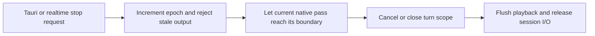

This normally leaves the process-wide model and native lane runtime alive for
the next turn.

### Model context unload

1. Stop submitting passes for that model.
2. Acquire/observe the Rust pass lock so no call is in flight.
3. Call `lfm_ctx_clear` through the matching `BackboneCtxGuard` ID.
4. Only then release Rust tensor storage and conversation caches.
5. Keep the process engine alive if another model may be installed later.

### Engine/process shutdown

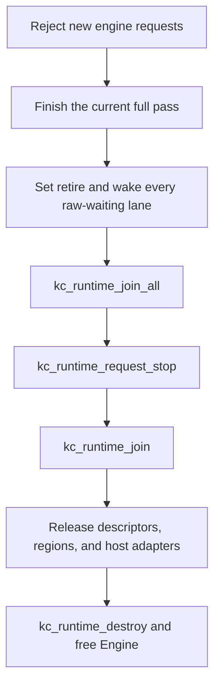

Raw lane waits are not channel operations, so explicitly wake lanes after
setting `retire`; do not assume runtime stop will execute their final state.

For durable services, stop delivery pumps first, checkpoint if requested, close
workflow mutation, destroy workflows/durable state, then close WAL and adapter
handles.

## Verification gates

### Standalone arena before vendoring

Run in `/Volumes/stuff/Projects/kotlinmania/kcoro_arena`:

```bash
make clean
make test
make -C tests test-full
make test-race
make test-soak
make check-symbols
make check-licenses
```

Run the standalone ASan/UBSan suite as documented by that repository:

```bash
make clean
ASAN_OPTIONS=halt_on_error=1 UBSAN_OPTIONS=halt_on_error=1 \
  make DEBUG=1 \
  EXTRA_CFLAGS='-fsanitize=address,undefined' \
  EXTRA_LDFLAGS='-fsanitize=address,undefined' test
```

Run ThreadSanitizer separately from the 100,000-iteration `test-race` logic
gate. TSan is useful on macOS as well as Linux:

```bash
make clean
TSAN_OPTIONS=halt_on_error=1 \
  make CC=clang DEBUG=1 \
  EXTRA_CFLAGS='-fsanitize=thread' \
  EXTRA_LDFLAGS='-fsanitize=thread' test
```

macOS is not the LeakSanitizer gate. Keep Linux ASan leak detection, TSan, and
the WAL/snapshot fuzz smoke run in CI, while retaining macOS TSan because it can
expose Darwin-specific scheduler races.

The standalone repository contains `.github/workflows/ci.yml`, but at the
pinned baseline its local Git repository has no remote. Treat that workflow as
an authored gate, not evidence of a successful remote CI run, until it executes
on both Linux architectures and the sanitizer/fuzz jobs report green.

### EmberHarmony build and parity

Run from the repository root:

```bash
cargo build -p kcoro-sys
cargo build -p liquid-audio --all-targets
cargo test -p liquid-audio --lib native_engine -- --nocapture
cargo test -p liquid-audio --test engine_idle_zero_spin -- --nocapture
cargo test -p liquid-audio --lib -- --nocapture
cargo build --manifest-path packages/desktop/src-tauri/Cargo.toml
```

Run the Metal library suite on macOS even though this migration targets the CPU
engine. It proves the build selector did not damage the deployed alternate path.

The current `rust-voice.yml` runs `cargo build --all-targets`, then only
`cargo test --lib`. Building all targets compiles integration tests but does not
execute them. Add explicit CI steps on both Linux and macOS for
`engine_idle_zero_spin` and the new arena lifecycle test; do not rely on the
build step as test evidence.

### New integration tests required

- place the engine lifecycle coverage under `crates/liquid-audio/tests/` and
  invoke each file explicitly from `rust-voice.yml` on both matrix targets;
- all lane handles publish before the first request is accepted;
- runtime snapshots report exactly `lanes_total` nonzero workers;
- a doorbell arriving just before a lane suspends is not lost;
- the last fence arriver wakes only declared sleepers;
- work enqueue wakes do not broadcast every sleeping worker per continuation;
- a continuation may resume on a different worker without changing output;
- each request emits exactly one completion;
- `REQ_CALL` completes every Rust lane callback without a nested park or engine
  reentry, and its spin barriers make progress at the configured worker count;
- shutdown at idle does not hang;
- shutdown during a pass completes that pass and runs no queued next pass;
- context clear waits for the blocking pass and leaves no borrowed weight pointer;
- idle worker CPU remains near zero;
- no heap allocation occurs between pass doorbell and completion;
- native attention, conv, MLP, full-token, and DepthDecode parity remains pinned;
- AArch64 and x86_64 builds both compile and execute the selected backend.

## Review checklist

Reject an integration change if any answer is wrong or unclear:

- Is this the live native engine, not the Rust prototype?
- Is there exactly one kcoro backend linked into the binary?
- Does every suspension return from the top-level lane step?
- Has the complete nested lane-program call tower been flattened at suspension
  points, rather than only replacing `lane_main`?
- Is every value needed after suspension in stable engine/frame memory?
- Can a lane resume on another OS worker safely?
- Are locks released before suspension?
- Does `REQ_CALL` remain non-suspending, spin-only, and non-reentrant?
- Is runtime worker count explicitly nonzero and equal to lane count?
- Is there still no channel or allocation per tile?
- Does one runnable continuation avoid waking every sleeping worker?
- Are weights read directly from stable storage?
- Are mutable state planes changed in place?
- Is cancellation checked at the full-pass boundary?
- Does the Rust blocking call retain every borrowed pointer until completion?
- Does model context clear happen before source tensor release?
- Are raw pointers absent from durable records and transport frames?
- Is durability outside token, barrier, and PCM hot loops?
- Is `kc_store_sync` backed by the platform's promised media-durability
  operation rather than an unverified generic flush?
- Can repeated snapshots compact without discarding the previous durable image,
  and is disk usage bounded under checkpoint soak?
- Is unlimited-channel high-water metadata included in memory budgets?
- Do teardown snapshots prove zero live runtime objects?
- Are the source commit and license recorded in the vendored tree?

## Short implementation brief

The first useful PR should do only this:

1. Vendor `kcoro_arena` at the pinned commit under `crates/kcoro-sys`.
2. Add an arena backend build selector and CI for its standalone tests.
3. Split work availability from lifecycle notification in the arena scheduler,
   then prove signal-one enqueue preserves lost-wake and teardown behavior.
4. Add a private C++ `ArenaScheduler` with explicit runtime ownership and lane
   bootstrap, but leave it unmounted.
5. Add tests for lane handle publication, external wake, migration between
   workers, idle CPU, and ordered shutdown.

The next PR rewrites the lane program as a state machine behind the preserved
`lfm_engine_*` ABI. Do not combine that rewrite with the contiguous model arena,
durable workflows, Rust realtime replacement, or new numerical kernels. Those
are separate proofs.

Track snapshot A/B replacement or atomic host reset as a separate upstream
blocker for Phase F. It need not delay the in-memory engine scheduler migration,
but durability must not ship before it and a real disk adapter exist.
