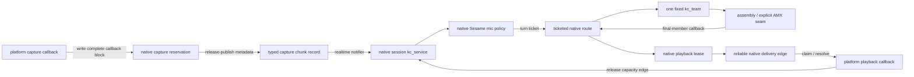

# kcoro and Flashkern Integration Runbook

Status: current implementation map plus open release gates.

This runbook describes the production ownership boundary. It is not a migration
proposal and it does not preserve deleted bridge or coroutine implementations.

## Contract

- Rust owns platform audio callbacks, opaque native-handle lifetime, controls,
  telemetry, and UI projection.
- Native C++ owns the immutable checkpoint image, pointer/stride views, plans,
  activation arenas, PCM arenas, conversations, sessions, routing, recurrence,
  and model tickets.
- `kcoro-sys/vendor/kcoro_arena` owns resident coordination workers, retained
  stackless services, realtime notifier edges, fixed scopes, correlated
  deadlines, and the fixed numerical team.
- Architecture assembly is the primary numerical implementation. Apple
  Accelerate/AMX is permitted only behind an explicit matrix ABI. Remaining
  value-producing C++ is migration debt, not a fallback tier.
- No production path loads safetensors in Rust or constructs a framework tensor.
  A model value is a validated non-owning byte view into the one sealed native
  image.
- Progress is caused by a published callback, completion, capacity, control, or
  correlated deadline edge. There is no polling or bounded spin.

`kcoro-sys` contains both the native runtime build and its Rust docking
wrappers. Model-pass bridge implementation is native.

## Live Runtime Construction

The product enters through `lfm_runtime_create`. The runtime internally calls
`lfm_engine_new_status`, then constructs the kcoro coordination runtime. The
engine constructor is private implementation detail.

An engine currently owns:

- one `kc_team` with the configured fixed lane count;
- one one-worker control `kc_runtime`;
- retained bridge, route, and team-supervisor `kc_service` continuations;
- one native SQ/CQ bridge and generation-protected pass/route records;
- one correlated deadline source for team-generation supervision.

The product runtime separately owns the retained session coordinator and
delivery services. `kc_service` does not create a thread: it is permanently
assigned to one runtime worker and becomes runnable through its ready bit.
Realtime producers use retained notifier leases whose notify operation is
bounded, lock-free, allocation-free, and never invokes the callback inline.

Flashkern V2 is still one team. Source fields that describe logical blocks or
collect block counters do not create two independent `BlockDomain` teams and do
not permit two simultaneous numerical programs. Two independent four-lane
domains remain future work.

## End-to-End Audio Flow



The callback source PCM is borrowed only for the synchronous format/downmix
write. Native code reserves the exact destination spans in its preallocated
circular arena, performs the architecture conversion directly into those spans,
and publishes one metadata record. A block that cannot be admitted produces an
explicit sequenced gap/XRUN record; no prefix is silently spliced to a suffix.

Playback stays native until the hardware callback claims its exact reliable
`PLAYBACK_READY` identity, resolves a borrowed span, writes the device buffer,
and releases the lease. Lease release publishes the capacity edge that can
resume the native session. PCM never travels through stdout, a temporary WAV,
or an event payload. WAV files produced by an explicit truth-gate run are
post-retirement evidence only.

## Sesame Turn Policy

The native session owns the recovered Sesame detector and samples microphone
evidence every 20 ms of incoming samples. The numerical detector uses the
256-sample Blackman-windowed 600–2400 Hz band, magnitude smoothing, dB mapping,
and adaptive byte-range classifier implemented by the paired
`flashkern_sesame.S` leaves.

Speech durations are sample-clock state:

- 200 ms prepare gate;
- 500 ms endpoint commit;
- 300 ms minimum utterance;
- 30 s forced endpoint.

Pause preparation and commit are dual-gated: the matching amount of
detector-classified silence must arrive and the correlated monotonic deadline
child for the same pause generation must expire. Resumed speech advances the
pause generation and structurally cancels its children. Timer callbacks carry
identity and publish a dormant record; they never inspect a conversation or
advance inference inline.

The current prepare edge records durable policy readiness only. Candidate-owned
activation scratch and speculative model execution have not landed and must not
be inferred from the name of the gate.

The detector maintains separate mic and playback adaptive state and its tests
exercise both. The production session currently invokes only
`LFM_SESAME_STREAM_MIC`; it does not yet feed playback evidence into the
detector. Playback-aware Sesame/echo classification is therefore an open gate.
Rust RMS values are output/latency telemetry and must not be described as the
turn detector.

## Retained State Instead of Waiters

No operation owns a blocked stack. Values that must survive a callback return
live in a bounded retained record:

- a `kc_service` context for host/session state machines;
- a sealed `kc_fixed_scope` plus generation-stamped child leases for turn
  deadline ownership;
- an engine pass slot and program cursor for a numerical continuation;
- a route record for resource and recurrence state;
- a generation-protected capture or playback lease for PCM ownership.

The service callback drains a durable predicate, publishes a successor edge if
work remains, and returns. The fixed team runs one generation. Its final member
return invokes the completion callback, which either dispatches the next eager
stage or publishes the terminal ticket. No caller waits for a stage, and there
is no per-operation completion channel.

`kc_fixed_scope` is an ownership graph, not a scheduler. Its child table is
sealed at setup. A failed functional child cancels live siblings; lossy
telemetry children retire independently; the final child publishes the one
parent-ready edge. There are no child joins, waiter stacks, actor queues, or
generic channels.

## Tickets and Publication

The canonical ticket is
`{runtime_epoch, sequence, generation, kind}`. Product, kcoro, and Flashkern
share the same ticket kinds, including session, turn, pass, workflow, control,
and deadline. A callback may use an immutable ticket value or retained notifier
state; it may not retain a pointer into route, conversation, scratch, or a
caller's stack.

Submission order need not equal completion order across conversations. Exact
ticket, parent, epoch, scope generation, domain, team generation, and arm
generation decide ownership. A stale callback can publish a wake hint, but the
consumer rejects its identity before touching successor state.

Reliable progress records include transcript text, playback-ready identity,
errors, turn terminal, and stopped. Telemetry may be coalesced or dropped. A
reliable callback rejection is a terminal host fault; it cannot silently turn
future native progress into a self-rescheduling loop.

## Fixed-Team Execution

`kc_team` owns stable, non-stealing members. Only one generation is active on
the current team:

1. the engine seals the active pass/program descriptor;
2. it arms correlated hard supervision;
3. it release-publishes a strictly increasing generation;
4. every member records entry, claims disjoint numerical tiles, runs its full
   leaf without yielding, records return, and becomes available;
5. the final return retires the deadline and invokes exactly one completion
   callback;
6. that callback advances the durable program or settles its CQ record.

Members do not wait at an internal barrier. The final-return count is the
quorum edge. Idle team members may enter kcoro's expected-value dormancy only
when no generation is runnable; that is a kernel-owned zero-instruction park,
not a polling waiter attached to an operation.

## Deadline Supervision

`kc_deadline_source` is a fixed readiness-time pool. On macOS each slot uses a
GCD one-shot based on monotonic `dispatch_time`; wall-clock timers are forbidden
for speech and numerical liveness. Non-Apple production construction fails with
`LFM_STATUS_UNSUPPORTED` before work is admitted. A deterministic manual source
exists only behind private test constructors.

Every Flashkern generation currently has a hard-only one-second deadline.
Completion and expiry race through one terminal CAS. If expiry wins, the
supervisor snapshots generation-stamped per-member entry/return masks, copies
ticket lineage and stage/shape evidence into reserved storage, suppresses all
CQ/recurrence/scratch retirement, and aborts. Stateful numerical work is not
retried.

This mechanism has landed, but release supervision is not complete:

- the reserved fatal capsule is only in process memory when `abort()` executes;
  a durable platform crash sink/export must make it observable;
- the one-second value is a provisional floor. Per-stage/shape budgets must be
  frozen from the target million-generation benchmark before tightening;
- soft targeted nudges and full-team rebroadcast are not production behavior.

## Memory and Numerical Boundaries

- `safetensors.cpp` opens and validates the checkpoint sources and reads them
  directly into one final immutable image.
- Plans bind dtype/shape/stride pointer views. The name `LfmTensorView` in the
  private loader ABI denotes metadata over bytes; it is not an owning tensor or
  a framework numerical object.
- Model weights are never widened, transposed, aligned, or repacked for
  convenience. Formula-changing immutable tables are separately accounted.
- Activation and PCM arenas are allocated and sealed before readiness. A pass
  may reuse dead planes according to declared liveness, but may not grow or
  materialize an intermediate tensor.
- Assembly leaves own tiles and register-resident intermediate values. Values
  crossing a team-generation boundary are compactly materialized into the
  declared native arena because no caller or lane stack survives that return.
- Apple Accelerate/AMX is an explicit large-matrix seam. The scheduler passes
  raw views and dimensions; it does not stage weights or emulate tensor ops.

## Shutdown

Stop closes producer and route admission, advances the publication epoch, and
requests retirement of retained services and deadline sources. Hardware
callbacks are disconnected before their notifier and PCM endpoints are
destroyed. Already-admitted work settles exactly once; stale work cannot
publish. Deadline cancellation acknowledges asynchronous handlers before
storage is freed.

Administrative joins occur only after progress admission is closed. They prove
that services, team members, tickets, route slots, PCM leases, and notifier
publishers have retired; a join is never used to drive inference.

## Verification Gates

Run the implementation-backed suites from the repository root:

```bash
cargo test -p kcoro-sys
cargo test -p liquid-audio --lib
cargo test -p liquid-audio --tests
git diff --check
```

The ignored real-checkpoint truth gate must also be invoked explicitly with the
model and `question.wav` fixture. It drives typed input, two audio turns on one
conversation, and a two-engine audio-token exchange through native capture and
playback leases. An OS one-shot is a failing watchdog only; it never advances
the test state machine.

Release still requires:

- zero compatibility-copied weight bytes, with a positive test proving the
  tally can fail;
- no post-readiness allocation, model-file read, or weight materialization;
- deterministic full-output evidence and exact lease/ticket retirement;
- one-million healthy team generations with no deadline fire;
- calibrated hard budgets and observable fatal diagnostics;
- playback-fed Sesame evidence and echo traces;
- AArch64 plus x86_64/Rosetta numerical and lifecycle gates;
- a product linkage audit proving no Candle numerical symbols.
