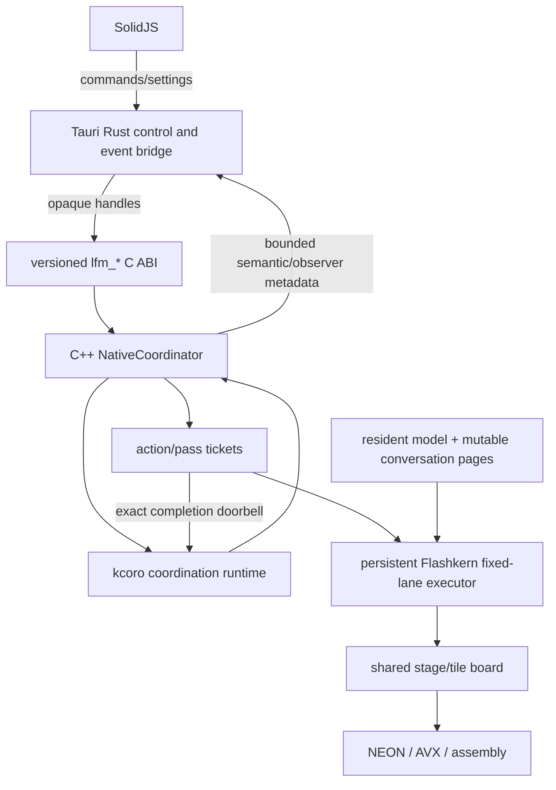
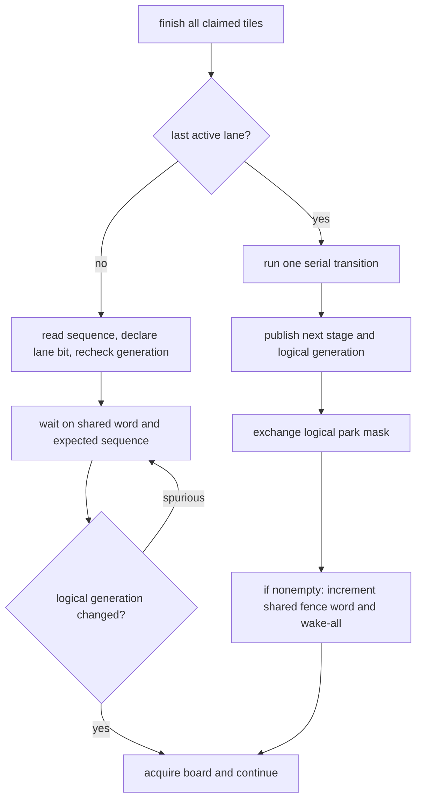

# kcoro_arena Integration Runbook

Status: live implementation runbook, verified against committed source on
2026-07-13.

Audit ancestry: EmberHarmony `321538f11749`; `kcoro_arena` `447d04f0246b`.
Pinned implementation: upstream arena `bd530f4c9196` (ticket/wait implementation
`bcdc03d1a073`), Ember vendor `8d510f83`, shared-doorbell executor `d2c43abd`,
and percentile harness `3625df4e`.

Normative design:

- [`specs/11-kcoro-native-migration.md`](../../specs/11-kcoro-native-migration.md)
- [scheduler, passes, tickets, and recurrence](../../specs/11-kcoro-native-migration/03-scheduler-passes-and-recurrence.md)
- [SIMD and zero-spin waits](../../specs/11-kcoro-native-migration/09-simd-kernels-and-wait-primitives.md)
- [ticketed Tauri observation](../../specs/11-kcoro-native-migration/12-ticketed-orchestration-and-observability.md)
- [stateful multi-agent runtime](../../specs/10-stateful-multi-agent-runtime.md)

Upstream design:

- `/Volumes/stuff/Projects/kotlinmania/kcoro_arena/docs/GPU_KERNEL_CONTRACT.md`
- `/Volumes/stuff/Projects/kotlinmania/kcoro_arena/docs/TICKETS_AND_CALLBACKS.md`

This runbook tells the implementer how those decisions map onto the current
source. It does not preserve the discarded stackless-`LaneFrame` design.

## Read This First

Six facts prevent the wrong integration:

1. `crates/liquid-audio/native/src/engine/flashkern_engine.cpp` is the live CPU
   engine. The duplicate Rust engine has been deleted; git history is the archive.
2. kcoro coordination and Flashkern compute are different executors. General
   stackless continuations may migrate; fixed numerical lanes may not.
3. Removing 512 KiB stackful coroutine stacks does not require flattening the
   six-deep C++ lane call tower. Fixed workers retain ordinary OS stacks and
   block on shared dispatch/fence generation words.
4. The current single-pass executor reads one pointer-stable, engine-owned request
   slot and completes one preallocated single-shot ticket. It never uses
   copy-mode `KORO_SEND`. Cross-executor payloads must use retained descriptors,
   never copied message bodies.
5. Stop and interrupt are checked once after a complete pass. No inner kernel,
   tile, layer, or barrier polls them.
6. Legal image capture requires zero active passes. Coordination and conversation
   state must serialize; fixed numerical call stacks are empty at that boundary
   and never belong in a conversation image.

No old runtime tree, fallback feature, copied reference crate, or alternate
product backend is kept after its replacement gate. Git commits are the archive.

## Source Reading Map

Read in this order before editing:

1. `crates/liquid-audio/native/src/engine/flashkern_engine.cpp`
   - `Pass`: line 76
   - `Stage`: line 113
   - `Fence`: line 128
   - engine/lane ownership: line 306
   - `lane_fence`/`run_stage`: lines 622 and 658
   - nested lane program and wait loop: lines 993 and 1029
   - callback/ticket submission: lines 1073 and 1085
   - fixed-lane construction/destruction: lines 1154 and 1243
   - transitional `REQ_CALL`: line 1200
2. `crates/liquid-audio/src/compute/flashkern/native_engine.rs`
   - private FFI starts at line 112
   - `run_lanes`: line 452
   - process-wide engine: line 611
3. `crates/liquid-audio/src/model/lfm2_audio.rs`
   - sampler: lines 199-270
   - native one-token rim: lines 1428-1480
   - Rust recurrence: lines 1630-1743
4. `crates/liquid-audio/src/runtime/realtime.rs`
   - turn/frame lifecycle and interruption
   - conversation marks and speculative prepare
5. `crates/kcoro-sys/build.rs:8-43`
   - the vendored stackless arena core and POSIX adapter; no context-switch
     assembly or old dispatcher is linked
6. Upstream `kcoro_arena`
   - `core/src/kc_runtime.c:225`, `253`, `318`, and `327` for work signaling,
     wake-token arbitration, suspension, and worker truth
   - `core/src/kc_ticket.c:83`, `286`, `366`, and `427` for slab allocation,
     generation-checked completion arbitration, and callback delivery
   - `port/posix.c:156-305` for expected-value wait-word preparation and waits
   - `core/src/kc_op.c:79-95` and `188-235` for terminal arbitration
   - `core/src/kcoro_stackless.c:94-119` and `203-250` for copy-mode sends
   - `core/src/kc_actor.c:33-55` for actor fairness debt
   - `core/src/kc_wal.c:535-580` for append-only snapshots

When a cited source moves, update this runbook in the same change.

## Target Boundary



Hard boundaries:

- TypeScript/Bun sees commands, semantic events, and bounded value snapshots.
- Rust sees opaque handles, persisted settings, statuses, and borrowed callback
  views. It sees no weight, activation, PCM, KV, pass descriptor, or ticket
  handle.
- C++ owns loading, plans, state, recurrence, pass submission, callbacks, and
  context switching.
- SIMD/assembly or an explicitly approved Apple native-library adapter owns
  production arithmetic.
- kcoro owns coarse readiness and exact completion, not numerical tiles.

## Current Production Truth

The live engine now uses the first kcoro+ executor slice:

- every numerical lane owns one stable pthread and an ordinary native call stack;
- no stackful coroutine, 512 KiB saved stack, dispatcher, or context-switch
  assembly remains in the product build;
- the executor owns two cache-line-isolated `uint32_t` doorbells, one shared
  dispatch word and one shared fence word, with opaque handles prepared before
  workers start;
- pass and barrier waits use `kc_port_wait_u32(handle, expected, 0)`. On the
  audited host the handle binds directly to Darwin's address-wait API; hot waits
  and wakes perform no registry search, allocation, or spin loop;
- the last fence arriver release-publishes the next generation, exchanges the
  logical park mask, and for a nonempty mask increments the shared fence word and
  performs one address wake-all;
- Rust invokes one control C ABI call. C++ acquires the raw single-pass claim
  before writing its engine-owned request slot and creates one arena ticket per
  full pass; lane 0 publishes completion only after the program-final fence;
- the callback runs on the arena coordination worker, never on a compute lane;
- request, weight, activation, KV, and scratch payloads remain pointer-resident;
  ticket delivery copies only fixed event metadata;
- snapshot counters distinguish one host fence-wake call from the logical waiter
  population represented by the park-mask bits;
- sampling and recurrence still return to Rust;
- transitional `REQ_CALL` still runs Rust callbacks on thread-stable native lanes
  until Depthformer and fan-out programs become typed C++ passes.

The atomic tile claim remains the GPU-like micro-scheduler. Stop and interruption
remain full-pass decisions; no numerical operation polls a cancellation flag.

## Current kcoro_arena Truth

The upstream stackless runtime now has the first kcoro+ production primitives:

- a wake racing a running continuation stores `wake_pending` at
  `core/src/kc_runtime.c:228-246`;
- suspension publishes `WAITING`, consumes the token, and requeues exactly once
  at `286-300`;
- operations claim one terminal cause and one publisher;
- channel waiter lists retain `kc_op *`, not callback/context pairs;
- timers block on the earliest deadline;
- descriptors carry generation-protected IDs and retained regions;
- work arrivals signal one worker while lifecycle predicates use a separate
  condition, removing the shared work/lifecycle wake herd;
- a preallocated ticket slab carries generation identity, deadline/cancel state,
  descriptor leases, and one reserved terminal-delivery reference;
- an intrusive completion queue delivers callbacks on arena workers exactly once;
- `run_until_idle` remains busy until the reserved delivery reference has recycled
  its slot, preventing transient `EAGAIN` on a one-slot slab;
- the POSIX host adapter implements expected-value `uint32_t` waits, precise
  one/all wakes, timeout, and blocked-waiter teardown;
- WAL/workflow/transport code is present and tested against in-memory adapters.

It also has known gaps that must be repaired before the product mount:

| Gap | Evidence | Required repair |
|---|---|---|
| descriptor copy in send | `kcoro_stackless.c:94-107`, select at `216-230` | retain and transfer an existing descriptor lease |
| arbitrary predicate park | `include/kcoro_stackless.h:125-133`; request-stop only sweeps registered operations at `core/src/kc_runtime.c:437-455` | remove canonical raw wait; every park registers a producer doorbell; destroy-time forced wake is not stop semantics |
| actor monopolization | `core/src/kc_actor.c:33-55` drains while ready | message/time quantum and fair yield |
| capability overclaim | `kc_admin.c:11-18` | derive bits from configured services |
| stop traversal | `core/src/kc_runtime.c:437-455` repeatedly searches/cancels operations | one bounded detach/claim pass including tickets |
| unlimited pointer ring | `core/src/kc_chan_stackless.c:48-59` grows/copies and never shrinks | reclaimable segments or declared retained-capacity bound |
| append-only snapshots | `core/src/kc_wal.c:535-580` | immutable base/delta objects and A/B manifests |
| durable history scan | `core/src/kc_durable.c:101-106`, `568-598` | route-ready and ID indexes plus retention/payload reclamation |
| callbacks under workflow lock | `core/src/kc_workflow.c:505-619`, called under locks at `778-813` and `823-850` | prepare callbacks outside lock, generation-check, then durable commit |

## Executor Decision

### Coordination executor

Use explicit `kc_runtime_t` for:

- session and conversation actors;
- action/pass parent-child tickets;
- timers, deadlines, cancellation, and scopes;
- audio/VAD coordination outside hardware callbacks;
- completion publication and native recurrence;
- notification and telemetry projection;
- snapshot capture requests and durable-ticket waits.

Continuations run bounded steps, park when no work exists, and may resume on
another coordination worker.

### Fixed compute executor

Use one persistent OS worker per logical Flashkern lane. Lane `i` remains lane
`i`. Workers share an immutable plan, pass pointer, stage board, scratch planes,
and ticket completion ring.

```c++
struct FlashkernExecutor {
    NativeThread *workers;
    LaneState *lanes;
    StageBoard board;
    SubmissionQueue submissions;
    CompletionQueue completions;
    const ModelKernelTable *kernels;
    void *scratch;
    uint32_t lane_count;
};
```

The nested `lane_program -> run_token_pass -> block -> run_mlp -> run_stage`
calls remain ordinary C++. Removing saved coroutine stacks deletes 512 KiB per
lane without creating explicit replicas of every nested local and return PC.
That memory reduction is secondary: the architectural reason is that legal
checkpoint capture occurs only when no pass is active, so none of these ordinary
call frames is conversation state that must migrate or serialize.

Stable lane affinity is a host policy. Stable logical identity is mandatory.

## Pass Slot And Pointer Ownership

Each session owns a bounded preallocated pass-slot pool. A slot contains a small
descriptor and generation; it points to retained model/context/input/output
regions.

```c++
struct PassDescriptor {
    uint32_t size;
    PassKind kind;
    uint64_t pass_id;
    uint64_t conversation_id;
    uint64_t epoch;
    const ModelPlan *model;
    ConversationState *state;
    const void *input;
    void *output;
    void *scratch;
    uint32_t input_count;
    uint32_t flags;
    uint32_t generation;
};
```

The submission queue stores `PassDescriptor *` or its retained `kc_descriptor_t *`.
It never stages the structure through a malloced waiter buffer. The child pass
ticket retains every referenced region until its configured completion target is
consumed or the result lease is transferred.

### SQ/CQ command boundary

The fixed executor is driven by a submission queue/completion queue pair:

```text
coordination actors -> MPSC broker admission -> SPSC SQ -> fixed lane team
fixed lane team -> SPSC CQ -> coordination completion continuation
```

The MPSC broker queue is the scheduling frontier, not the SQ. The broker is the
SQ's only producer and publishes at most one dispatched pass to the one-board
executor. The completing executor is the CQ's only logical producer and one
native continuation is its consumer. Both queues transfer retained pointers,
use generation-protected cache-line-separated sequences, and allocate/copy
nothing after warmup. CQ capacity and completion-target delivery are reserved
before SQ publication.

The endpoints are single-owner, not permanently thread-affine. The last-arriving
lane may vary, but a second pass cannot dispatch until coordination consumes the
prior CQ entry. CQ-producer ownership therefore transfers through the CQ-consume
and next-SQ-publication acquire/release edges; two lanes never publish CQ entries
concurrently. Overlapped executors require independent SQ/CQ pairs.

The CQ doorbell is progress-bearing: it wakes native coordination to commit,
mark stale, recur, or switch contexts. Tauri and visualizer callbacks are
observational projections after that decision. They may coalesce or drop and are
never the callback that makes computation progress.

After warmup:

- pass submission allocates zero bytes;
- no payload or pass descriptor is copied at a queue hop;
- weights and context pages stay at stable addresses;
- kernels write final scratch/context/playback destinations;
- pass/ticket slot exhaustion returns bounded backpressure.

## Ticket And Callback Flow

One turn/frame/workflow action is a parent ticket. Every complete model pass is
a single-shot child ticket.

```mermaid
sequenceDiagram
    participant A as Action continuation
    participant T as Child pass ticket
    participant E as Fixed executor
    participant L as Active lanes
    participant C as Completion continuation

    A->>T: create with parent, epoch, descriptor lease
    A->>E: enqueue ticket/pass pointer
    E->>L: publish command generation
    L->>L: execute every pass stage
    L->>T: claim DISPATCHED -> COMPLETING
    L->>C: enqueue ticket pointer and ring once
    C->>T: commit or mark stale; publish terminal
    C->>A: consume terminal event and wake parent once
    A->>A: recur, switch context, join, or stop
```

The last compute lane never invokes Rust, Tauri, storage, or arbitrary callback
code. It only publishes writes, enqueues the existing ticket pointer, and rings
one coordination doorbell.

The coordination completion handler records numerical execution, state
disposition, publication, and terminal cause independently:

```text
not_dispatched + none        + none      + canceled/timed_out/rejected
completed      + committed   + committed + success
completed      + committed   + stale     + stale_epoch/stop
completed      + rolled_back + stale     + stale_epoch
failed         + rolled_back + none      + fault
failed         + poisoned    + none      + fault
```

For a dispatched ticket, `kc_ticket_cancel` returning `1` means the cancellation
request was newly accepted; it does not mean an active numerical pass was
aborted or that cancellation itself published the terminal event. The full pass
still calls `kc_ticket_complete`, which returns `1` when it publishes exactly one
terminal event as canceled/stale. Consequently `complete_rc + cancel_rc == 1`
is not this API's race invariant. The gate is: completion publishes once;
cancel returns `0` or `1`; the callback is success iff no cancel request won and
canceled iff one did; both outcomes occur across the stress run.

A ticket is not reset for recurrence. The parent creates the next child ticket,
which gives every completion-target delivery a distinct identity and precise
readiness edge. The current retained-pointer API prevents slab reuse while a
legal caller can dereference a ticket. Arena commit `bcdc03d1a073` also
implements generation-checked `complete_id`/`cancel_id`; the future broker must
use those APIs when it transports IDs. Generation is not a substitute for
retaining a pointer in code that already owns one.

## Zero-Spin Stage Barrier

`FENCE_SPIN` is deleted. The fixed executor owns one cache-line-isolated shared
dispatch word and one shared fence word. The board retains a separate logical
stage generation plus a park mask; the mounted engine currently supports at most
32 lanes because that mask is `uint32_t`.



The host adapter prepares an opaque handle backed by a direct futex, supported
platform wait, or condition-variable fallback. A C++ adapter may
use `std::atomic_ref<uint32_t>::wait/notify` over the aligned raw word only after
the selected library implementation is audited to block immediately with no
pre-block spin tier; it cannot cast the word to a separate `std::atomic` object.
A platform that cannot block conformingly does not advertise the fixed-executor
capability. It does not fall back to `PAUSE`, `YIELD`, WFE/UMWAIT time budgets,
repeated loads, or timed polling.

The private board uses cache-line-aligned raw integer words through one lock-free
`kc_atomic_*` helper family shared by C and C++. Preparation binds the raw
`uint32_t *` identity to the handle; hot wait/wake calls take only the handle and
expected value. Ordinary wakes do not mutate the sequence; exact-once handle
release may publish one terminal increment to drain an entered waiter. No code
casts between C11 `_Atomic` and C++ `std::atomic` layouts, and assembly does not
touch board synchronization words.

Prepare both shared words during executor creation; barrier and idle waits
allocate nothing and use no deadline. Shutdown advances and wakes the dispatch
word, joins all fixed workers, releases both handles exactly once, and only then
frees the board. A stop request during a pass does not wake the fence word early.

The expected fence sequence is read before a non-last lane publishes its park
bit. It then rechecks logical generation. If the last lane has already advanced,
the lane clears its bit and continues; if the address advances during wait entry,
changed-before-wait returns immediately.

The last lane release-publishes the next board state and exchanges the park mask.
A nonempty mask causes one shared address wake, while the mask population records
the logical peers that declared a park. This is separate from the coordination
worker domain, where one ready continuation signals only one worker.

The plan must also minimize true barriers. Lane-local chains stay fused; a
barrier exists only for cross-lane data dependency, active-mask change, scratch
ownership transfer, or one serial transition. Record declared stages, true
barriers, wait registrations, host blocks, and wakes per pass. Zero-spin with a
barrier per tiny operator is still a failed design.

Memory ordering is part of the ABI: the broker writes pass/first-stage state,
release-publishes generation, then advances the shared dispatch word; each lane's
stage countdown is acquire-release so the last lane observes every tile write;
the last lane release-publishes next-stage state before advancing the shared
fence word; and ticket completion release-publishes final output before
coordination reads it. Sleeping or a spurious wake cannot weaken those edges.

## Full-Pass Interrupt And Recurrence

An interrupt or stop atomically advances `requested_epoch` and rings the action
coordinator. A queued stale child is canceled before dispatch. An active child
finishes one complete pass. Its coordination completion handler commits or marks
stale and prevents another old-epoch child from being created.

No tile, kernel, layer, SIMD loop, or stage barrier checks the control epoch.

At a committed boundary, the coordinator may:

- sample and append a token;
- dispatch Depthformer or codec;
- recur immediately on the same context;
- switch to another hot context sharing the same weights;
- fork an advisor branch from copy-on-write pages;
- satisfy a cognitive ticket join;
- accept a quiescent checkpoint capture;
- stop.

One fixed stage board admits one full pass at a time. A native `KernelBroker`
actor is its sole command producer. Session, frame, and cognitive actors feed
bounded ticket pointers to the broker; the selected pointer crosses an SPSC
command handoff and completion returns over a separate SPSC pointer ring. The
broker enforces deadline classes, maximum consecutive passes, time quanta, age
promotion, and stale/stop priority at pass boundaries.

Multiple conversations are simultaneously resident and interleaved, not raced
through one scratch board. Concurrent passes require explicitly independent
executors with separate workers, boards, scratch, and broker bindings.

Rust is not awakened per token or frame. Semantic UI events are side effects
after the native orchestration decision.

## `REQ_CALL` Removal

`REQ_CALL` currently executes Rust callbacks on compute lanes and is still used
by the production Depthformer/fan-out path. It is explicit migration debt, not a
second executor: the callback runs on the same thread-stable fixed lanes and may
use the same native fence. Until each caller is ported, it obeys these constraints:

- callback is non-suspending and non-reentrant;
- it cannot unwind across C;
- it cannot call kcoro, storage, Tauri, or recurrence;
- lane count remains stable for the complete call.

Port every production callback to a typed native pass. Delete `REQ_CALL`, the
Rust trampoline, and compatibility request kind after the last fixture/parity
gate. At `d2c43abd`, expected-value waits, fixed lanes, and deletion of the saved
stacks, dispatcher, and context-switch assembly are complete and do not depend
on flattening the ordinary callback stack. Do not reintroduce the old executor
or retain a production selector.

## Channels, Descriptors, Scopes, And Actors

Use channels only for coarse work:

- rendezvous for exact native handoff;
- bounded FIFO where backpressure is correctness;
- conflated for latest settings or telemetry;
- unlimited only with explicit peak-capacity retention policy until segmented
  reclamation lands.

Do not put a tile or pass payload on a copy-mode channel.

Use registered regions and descriptors for stable same-process storage. Add a
canonical send/select operation that retains an existing descriptor lease. A
copied descriptor is appropriate only when a small control producer cannot keep
its bytes alive.

Scopes own action/branch lifetime. Actors park on mailbox receive when empty and
yield after a configured message/time quantum. A callback that may block uses a
dedicated executor or host adapter.

The time quantum is checked between callbacks and cannot preempt arbitrary C
code. A callback overrun is counted and applies the configured continue,
actor-close, or scope-fault policy after return. Hard latency therefore requires
the callback itself to remain bounded or to offload and return.

Every legal park owns an operation/ticket/waker. Remove raw predicate waits from
canonical use so runtime stop can cancel all parked work exactly.

## Durability Boundary

WAL and snapshots never run on compute, audio, pass completion, or ordinary
coordination workers.

The WAL stores small transactional facts:

- external input acceptance and acknowledgement;
- workflow state transitions;
- emitted messages/commands;
- stable ticket/correlation IDs;
- checkpoint association and hibernate/restore lifecycle.

Conversation images store model state. They use semantic dirty ranges,
copy-on-write page generations, immutable base/delta objects, and A/B manifests.
The current append-only `kc_wal_snapshot_write` path is not suitable for
long-running conversation images.

A bounded low-priority storage executor owns append, CRC, sync, snapshot write,
and compaction. In-memory `accepted` and storage `durable` are separate ticket
events. Explicit hibernation and external commitments wait for durable; periodic
continuity capture may coalesce or skip.

On macOS, power-loss durability means `F_FULLFSYNC` or a proven equivalent, not
plain process-visible write completion.

## Tauri Observation

Reliable voice semantics and lossy kernel observation use separate capacities:

- state/text/turn/error/stopped remain ordered semantic events;
- ticket phase, active lanes, queue depth, and timings are sampled/coalesced
  observer values;
- observer full/closed/panic drops or unregisters telemetry only;
- no observer result gates recurrence or stops the native session.

The native five-bar widget uses capture RMS while listening, lane activity while
thinking, playback RMS while speaking, and zero while idle. It does not display
fabricated work or receive per-tile events.

See document 12 for C ABI, Tauri commands, TypeScript IDs, and tests.

## Repository Integration

Final relevant layout:

```text
crates/kcoro-sys/
  vendor/kcoro_arena/        pinned source and license
  build.rs                   builds selected coord/kernel/durable archives

crates/liquid-audio/native/
  include/lfm_voice.h
  src/runtime/
    native_coordinator.{h,cpp}
    flashkern_executor.{h,cpp}
    ticket_bridge.{h,cpp}
    wait.{h,cpp}
    notification.{h,cpp}
  src/engine/flashkern_engine.cpp
  kernels/{aarch64,x86_64}/

packages/desktop/src-tauri/src/voice/native/
  config.rs
  event.rs
  observe.rs
  status.rs
  session.rs
```

Build rules:

```text
lfm_voice_coord      movable coordination, tickets, channels, actors, timers
lfm_voice_exec       fixed SQ/CQ executor, board, wait adapter, completion ingress
lfm_voice_kernels    numerical C++/SIMD/assembly leaves; no kcoro symbols
lfm_voice_durable    WAL/workflow/image services; outside realtime dependency graph
lfm_voice_core       model/session/frontend/codec coordinator and immutable plans
lfm_voice            approved public C ABI product
```

1. Vendor one pinned kcoro source snapshot with provenance; never link a
   machine-local checkout or symlink.
2. Do not link old and new runtimes into one product binary.
3. Build portable core and host adapter separately; release symbol audit rejects
   direct OS calls in the portable archive.
4. Remove old context-switch assembly when fixed lanes no longer use stackful
   kcoro.
5. Key object/archive paths by compiler, target, debug/release, sanitizer, and
   ABI-affecting flags. Normal and sanitizer builds must not require `make clean`
   to avoid stale archive links.
6. Export only approved `lfm_*` C symbols. Rust never calls a kernel symbol.
7. Delete the old runtime tree and build selector when the replacement gate
   passes.
8. Reject kcoro/channel/WAL/callback symbols from `lfm_voice_kernels`. The
   executor shell owns the narrow ticket/CQ integration; numerical kernels never
   route a stage fence through a channel.

## Implementation Phases

### Phase A: Upstream kernel repairs

Status: **partially implemented at upstream `bd530f4c9196`.** Work/lifecycle
wake domains, prepared zero-spin wait handles, ticket slab/completion queue,
generation-checked ticket-ID completion/cancel, ticket snapshots, exact callback
delivery, lease-before-recycle teardown, completion-drain budgeting, and
build-configuration identity are committed and tested. Descriptor-transfer
send/select, actor fairness, operation-backed raw wait removal, and the remaining
capability audit are still open.

- split coordination work and lifecycle waits;
- replace all three shared-CV sites (`queue_locked`, `finish_cont`, and
  `suspend_cont`) with signal-one work permits plus predicate-aware lifecycle
  notification and wake accounting;
- add zero-spin wait-word port contract;
- add descriptor-transfer send/select;
- add ticket slab, completion ring, callbacks, and snapshots;
- add actor fairness and operation-backed waits;
- make capabilities truthful;
- key build outputs by configuration.

Gate: upstream normal, ASan/UBSan, TSan, 100,000 terminal race, symbol, idle CPU,
and alternating-build tests pass.

### Phase B: Vendor and mount the coordination shell

Status: **initial production mount implemented at `8d510f83` and `d2c43abd`.**
`kcoro-sys` vendors upstream `bd530f4c9196`, builds the stackless core and POSIX
adapter, and has no old stackful source tree. Flashkern creates an explicit
one-worker arena runtime,
allocates pass tickets from its slab, and receives terminal callbacks through the
arena completion queue. Splitting durable services from the final product link is
still open.

- vendor/pin repaired kcoro_arena;
- build `lfm_voice_coord + lfm_voice_exec + lfm_voice_kernels` without forcing
  durable code into the realtime archive;
- add `NativeCoordinator`, ticket pools, pass slots, and completion ring;
- leave current numerical engine behavior unchanged until lifecycle tests pass.

Gate: explicit runtime lifecycle, retained-ticket reuse safety,
generation-checked ID resolution, exact callback, observer isolation, and
teardown tests pass with no product fallback.

### Phase C: Remove production `REQ_CALL` and Rust recurrence

Status: **not complete.** `REQ_CALL`, Depthformer/fan-out Rust callbacks,
sampling, and recurrence remain the intentional migration boundary.

- port every Rust lane callback into a typed native pass, including Depthformer
  and fan-out users;
- move sampling/modality/depth/codec recurrence to the native coordinator;
- retain `REQ_CALL` only in an isolated fixture harness while independent parity
  fixtures are captured;
- delete `REQ_CALL`, Rust lane trampolines, and the production callback request
  kind; the saved lane stacks are already gone;
- alternate multiple conversations at full-pass boundaries.

Gate: attention/token/Depthformer/fan-out parity, 1,000 recurrent tokens with
zero Rust crossings per token, two-context isolation with shared weight
addresses, and no production `REQ_CALL` or Rust numerical callback symbol.

### Phase D: Convert Flashkern to fixed zero-spin workers

Status: **executor conversion implemented at `d2c43abd`; full product gate still
open.** The engine owns fixed pthread lanes, shared expected-value dispatch/fence
doorbells, generation fences, pointer-stable request slots, and pass-granularity
tickets.
The dispatcher, saved stacks, old vendor tree, and context-switch assembly are
deleted. The raw C ABI also owns an atomic single-pass claim acquired before any
shared request payload write, and completion callbacks validate the submitted
epoch. Million-pass lifecycle soak, tail-latency closure, and removal of the
blocking Rust handback remain.

Implemented:

- immediate expected-value wait words preserve the generation/last-arriver proof;
- stable fixed workers preserve the nested C++ lane program and tile board;
- one engine-owned request slot is handed off by pointer and one reserved arena
  completion is returned per pass;
- the stackful dispatcher, 512 KiB saved lane stacks, context-switch assembly,
  old vendor tree, and compatibility selector are deleted.

Remaining:

- move submission ownership from the blocking Rust rim to `NativeCoordinator`;
- add a bounded SQ only when multiple native producers require one; the current
  single-producer/single-pass engine does not need a copied queue;
- require the future broker to use the committed generation-checked ticket-ID
  APIs before it accepts IDs;
- complete the million-pass, interrupt-boundary, and tail-latency gates;
- finish the full token/frame latency gate. The committed fused-MLP evidence
  reports G3 p50 `0.439 ms`, p95 `0.524 ms`, and p99 `0.574 ms` versus G0
  `0.330/0.576/0.732 ms`; the median remains slower while both tails improve.
  Plan-level barrier fusion is next. G3 remains open for full-pass evidence.

Gate: one million pass cycles, one host wake per nonempty logical fence mask,
zero wait spin, zero hot allocations/copies, full-pass interrupt response, SQ/CQ
race coverage, and the tail-latency budget.

### Phase E: Tauri and visualizer projection

- add bounded semantic native sink;
- add independent coalesced observer sink and status snapshots;
- add Tauri kernel status/observe/unobserve commands;
- update TypeScript state and native meter in place;
- delete old local Rust runtime/event ownership after the full native gates.

Gate: observer overflow/close/panic has no effect on model output or session
lifetime; UI rate and memory remain bounded; visualizer sources are truthful.

### Phase F: Durable contexts and workflows

- add two bounded checkpoint staging slots;
- add semantic dirty generations and copy-on-write pages;
- implement immutable base/delta objects, A/B manifests, and compaction;
- add real durable host adapter and storage executor;
- associate durable workflow/ticket facts through the WAL;
- reclaim durable message history and index route-ready work.

Gate: crash injection at every write/sync/publish boundary, real process-kill
recovery, exact continuation, bounded disk/RAM, and no speech interference.

## Shutdown And Unload

### Session stop

1. Advance stop epoch and stop accepting actions.
2. Cancel queued child tickets before dispatch.
3. Let one active full pass complete and publish committed/stale according to
   policy.
4. Stop recurrence and close action scopes/mailboxes.
5. Drain reliable semantic terminal events; detach lossy observers.
6. Join fixed executor participation for the session and coordination children.
7. Prove zero live pass slots, tickets, descriptor leases, callbacks, and audio
   blocks before session destroy.

### Model/context unload

- reject new passes;
- wait for tickets retaining the context/model;
- quiesce at a full-pass boundary;
- detach conversation pointers from active plans;
- release context pages, then model plan/weights only after all sessions are
  gone.

### Runtime destroy

- request stop;
- stop storage/observer producers before destroying their sinks;
- join fixed workers, coordination workers, timer service, and storage writer;
- destroy only after admin snapshots report no live objects;
- no callback may occur after detach/join returns.

## Verification Commands

Upstream:

```bash
cd /Volumes/stuff/Projects/kotlinmania/kcoro_arena
make clean
make test
make -C tests test-full
make test-race
make test-soak
make check-symbols
make check-licenses
```

EmberHarmony:

```bash
cargo build -p kcoro-sys
cargo build -p liquid-audio --all-targets
cargo test -p liquid-audio --lib -- --nocapture
cargo test -p liquid-audio --tests -- --nocapture
cargo build --manifest-path packages/desktop/src-tauri/Cargo.toml
cd packages/app
bun test src/context/voice.test.ts
```

CI must execute integration binaries explicitly. `cargo build --all-targets`
only compiles them. Checkpoint-dependent and audible-output e2e tests are
explicitly ignored in the hermetic suite and must be invoked with `--ignored`
on hosts that provide their documented model and hardware prerequisites.

## Required Tests

### Coordination and tickets

- wake before/during/after suspend resumes once;
- one ready continuation signals one worker;
- complete/cancel/timeout/stop/destroy races publish one terminal ticket and one
  callback;
- retained ticket pointers prevent slot reuse while held; committed
  ticket-ID completion/cancel rejects stale generations, and any future
  subscription lookup must do the same before retaining the resolved object;
- actor flood cannot starve completion, timer, or stop;
- stop with queued prepare skips prepare;
- teardown reaches zero live objects.

### Fixed executor

- all workers publish stable lane identity before readiness;
- source/disassembly contains no spin wait;
- every barrier interleaving crosses generation exactly once;
- each nonempty fence park mask produces one shared host wake and its population
  equals the logical waiter counter;
- one million pass cycles produce one completion each;
- no allocation or payload copy occurs between submit and callback;
- pointer poisoning/address tracing proves descriptor/regions are retained;
- stop before dispatch enters no kernel; stop during pass permits one complete
  pass and no old-epoch recurrence;
- NEON and x86 numerical parity remains pinned.

### Product and observer

- 1,000-token recurrence has no Rust/Tauri crossing per token;
- multiple conversations switch at pass boundaries with shared weights;
- reliable semantic events stay ordered under telemetry flood;
- observer close/full/panic does not change output/session state;
- UI receives at most configured Hz and retains bounded memory;
- listening/thinking/speaking/idle select capture/compute/playback/zero signals;
- session quit produces no callback after destroy.

### Durability

- accepted and durable ticket edges are distinct;
- previous A/B manifest survives every crash boundary;
- pending deltas coalesce without losing ancestor-required dirty state;
- compaction bounds disk and retains one known-good image;
- real macOS adapter exercises promised durable sync;
- forced snapshot/WAL activity causes no playback underrun or pass p99
  regression outside the approved budget.

## Review Checklist

Reject an implementation if any answer is unclear:

- Is this the live C++ engine rather than the Rust prototype?
- Are kcoro coordination workers and fixed compute workers separate?
- Do fixed lanes retain ordinary C++ stacks and stable identity?
- Is there no `LaneFrame` control rewrite or movable compute continuation?
- Does every wait register/recheck/block immediately with no spin tier?
- Does one coordination enqueue wake one worker?
- Does one nonempty stage park mask cause one shared host wake, with logical
  waiter accounting equal to its population?
- Is a pass submitted as a retained pointer descriptor?
- Does every accepted pass own one single-shot child ticket?
- Does the completion callback run on coordination, outside locks, never on a
  compute/audio/store thread?
- Can callback recurrence proceed without Rust/Tauri?
- Are stop/interrupt checked only after a full pass?
- Is there still no channel, allocation, callback, or cancellation load per tile?
- Are weights read directly and mutable destinations written in place?
- Is `REQ_CALL` absent from the product path?
- Can an observer fail without affecting inference?
- Are reliable semantic and lossy telemetry capacities separate?
- Are checkpoint accepted and durable separate ticket edges?
- Are images bounded base/delta objects with A/B publication rather than an
  append-only snapshot stream?
- Are raw pointers/callbacks absent from durable records?
- Does teardown prove zero tickets, descriptors, continuations, lanes, and
  callbacks?
- Are replaced sources deleted rather than retained as fallback?

## Implementation Ledger

Completed in upstream `bcdc03d1a073`, vendor `8d510f83`, and executor
`d2c43abd`:

1. Split coordination work/lifecycle conditions and signal one work permit.
2. Add zero-spin expected-value wait words to the host-port contract.
3. Add a preallocated, generation-tagged ticket slab with exact arena-worker
   callbacks, retained-pointer reuse safety, and pointer descriptor leases.
4. Vendor the active arena runtime into `kcoro-sys` and delete the old runtime.
5. Replace Flashkern's stackful dispatcher with stable fixed lanes while
   preserving its ordinary nested C++ pass program.
6. Add production-backed Cargo tests for ticket delivery and wait-word lifecycle,
   native bit parity, zero-spin idle measurement, and source-contract checks.
7. Release ticket descriptor/result leases before slab reuse or lifecycle
   publication; a blocking host-release regression proves `join_all` still sees
   the ticket.
8. Prepare the shared dispatch/fence host wait handles once, exchange the logical
   fence park mask, and fan its peers out with one host wake; remove the
   process-global address registry from the hot path.
9. Enforce the single request slot in the raw C ABI before payload mutation and
   reject stale completion epochs.

Still required before native recurrence and orchestration can move over:

1. Add existing-descriptor channel send/select rather than copy-mode `KORO_SEND`.
2. Finish actor fairness, operation-backed raw waits, and truthful capabilities.
3. Port `REQ_CALL` users into typed native passes and delete the Rust numerical
   callbacks.
4. Add the native parent-action coordinator, multiple conversation actors, Tauri
   observer projection, and durable context services in their gated phases.
5. Add the million-pass executor soak. Alternating normal/sanitizer build
   identity is already gated upstream at `bd530f4c9196`.

### Verification recorded 2026-07-13

These results apply to upstream `bd530f4c9196` and Ember executor `d2c43abd`
with percentile harness `3625df4e`:

- Upstream `make test`, `make -C tests test-full`, public-symbol, and license
  gates pass.
- The race gate passes 100,000 existing operation arbitrations plus 100,000
  pass-ticket complete/cancel arbitrations. The full upstream suite also passes
  under ASan/UBSan and macOS TSan.
- Cargo executes the real vendored ticket lifecycle and wait-word tests through
  `kcoro-sys`; no test-only replacement runtime is linked.
- `liquid-audio` passes 170 library tests on CPU and 171 with Metal. Its
  hermetic integration suite, native MLP/attention/conv parity tests, desktop
  Tauri link build, and all 71 Bun voice-boundary checks pass. Checkpoint and
  physical-speaker tests remain explicitly ignored until their required model
  assets or hardware are supplied.
- A production-backed fixed-lane soak completes 10,000 request-slot, fence,
  ticket, callback, and slab-reuse cycles in 1.129 seconds on the audited host
  after direct wait handles replaced registry lookup.
- Eight idle fixed lanes measure approximately 0.005-0.006% process CPU before
  and after a real native pass on the audited Apple Silicon host.
- The committed raw-sample reports are
  [`G0_FENCE_SPIN_321538F1.md`](baselines/G0_FENCE_SPIN_321538F1.md) and
  [`G3_SHARED_DOORBELLS_D2C43ABD.md`](baselines/G3_SHARED_DOORBELLS_D2C43ABD.md).
  Across five 1,000-pass runs, median run-level G3 versus G0 is p50 `0.439` vs
  `0.330 ms`, p95 `0.524` vs `0.576 ms`, and p99 `0.574` vs `0.732 ms`. The
  slower median keeps the product-default G3 latency gate open; the improved
  tail is positive evidence. Full token/frame percentiles remain open and are
  not grounds to restore polling.
