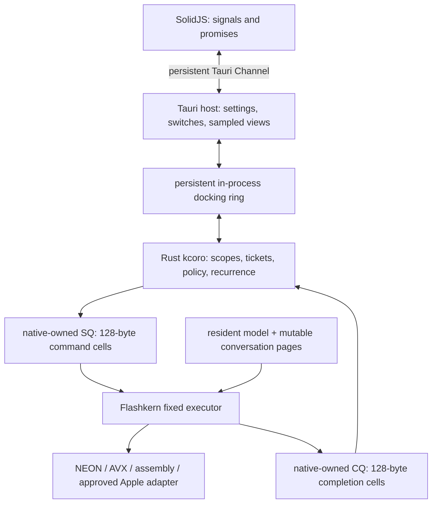
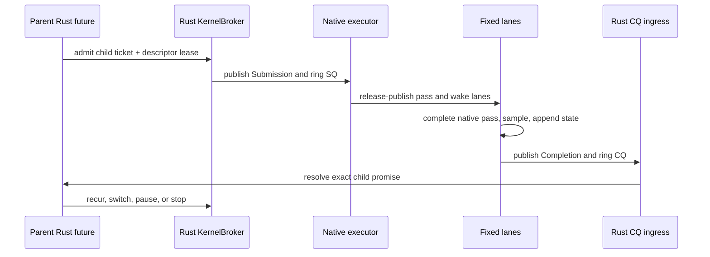

# kcoro / Flashkern Integration Runbook

Status: live implementation runbook, verified against committed source on
2026-07-14.

Pinned foundations:

- upstream `kcoro_arena` `bd530f4c9196` (ticket/wait repair `bcdc03d1a073`);
- Ember vendor `8d510f83`;
- fixed shared-doorbell Flashkern executor `d2c43abd`;
- percentile harness `3625df4e`;
- Rust kcoro coordinator foundation `3a5b1431`;
- native SQ/CQ bridge `2a2adcea` and Flashkern mount `95069bd5`;
- retained native descriptor pool `fa35a624`;
- production Rust broker/CQ ingress mount `4f06a3d5`.

Normative design:

- [`specs/11-kcoro-native-migration.md`](../../specs/11-kcoro-native-migration.md)
- [scheduler, passes, tickets, and recurrence](../../specs/11-kcoro-native-migration/03-scheduler-passes-and-recurrence.md)
- [SIMD and zero-spin waits](../../specs/11-kcoro-native-migration/09-simd-kernels-and-wait-primitives.md)
- [ticketed Tauri observation](../../specs/11-kcoro-native-migration/12-ticketed-orchestration-and-observability.md)
- [coordination contract](../../specs/11-kcoro-native-migration/13-coordination-contract.md)
- [stateful multi-agent runtime](../../specs/10-stateful-multi-agent-runtime.md)

This file is the source-facing mount guide. It describes one current tree and
one target. Replaced designs are in Git history, not parallel source or legacy
sections.

## Target Laws

These eight laws govern product cutover. They are not claims that the current
hybrid already satisfies every boundary; the source-pinned mounted truth follows
immediately afterward.

1. `flashkern_engine.cpp` is the live CPU executor. Its fixed numerical lanes
   keep ordinary C++ stacks. They do not become Rust futures or stackless lane
   frames, and Flashkern never owns Metal dispatch. Apple GPU execution is a
   separate future MLX C++/Metal device backend selected above the CPU kernel.
2. `crates/kcoro` is the target product policy scheduler. At cutover it owns Rust
   futures, scopes, tickets, promises, service policy, and recurrence decisions.
3. `kcoro_arena` is the C conformance oracle and current native wait-word
   substrate. Its ticket/actor runtime is no longer on Flashkern's production
   pass path and is not the target product policy owner.
4. Tauri is a host, not a scheduler. Realtime progress cannot require a Tauri
   task, webview IPC, telemetry delivery, polling, or a monitoring loop.
5. At cutover C++ owns every numerical pointer and operation, including sampling
   and state append. Rust receives compact terminal facts and at most eight
   token/codebook IDs, never logits or model state.
6. Target SQ/CQ cells copy small control records. Pass descriptors, weights,
   activations, KV, PCM, mel, codec state, and snapshot pages stay in native
   memory and are named by generation-protected IDs.
7. Target stop and interrupt are checked at complete-pass boundaries. Inner
   kernels, tiles, stages, and barriers do not poll cancellation.
8. A legal target checkpoint has zero active passes. Rust future state and native
   compute stacks are not serialized; explicit conversation pages and workflow
   state are.

## Current Production Truth

The production path is still transitional:

- `NativeEngine` in
  `crates/liquid-audio/src/compute/flashkern/native_engine.rs:244-826` wraps one
  process-wide native engine and serializes blocking calls with `pass_lock`;
- `submit_pass` at
  `crates/liquid-audio/native/src/engine/flashkern_engine.cpp:1142-1190` creates
  one retained descriptor and invokes the registered Rust submit callback;
- `coordinator.rs:304-380` admits a generation-protected preallocated result
  slot and gives one broker future sole ownership of SQ submission;
- `coordinator.rs:383-431` gives one dedicated ingress thread sole ownership of
  the blocking CQ edge. It validates ticket/conversation/epoch, resolves the
  exact result slot, and wakes the broker continuation;
- the compatibility C++ caller remains blocked on that result slot solely so
  its borrowed model, state, and result pointers remain live. C++ no longer
  submits SQ cells or waits on CQ directly;
- `bridge_main` at `flashkern_engine.cpp:1629-1682` validates the native
  descriptor generation and rings the fixed lanes; lane 0 publishes the exact
  completion at `1573-1602`;
- the native engine has one pointer-stable `Pass` at line 94, one `Stage` board
  at line 131, one `Fence` at line 146, and one single-pass claim;
- `lane_fence` at line 735 performs immediate expected-value blocking with no
  spin tier; `run_stage` at line 771 retains atomic tile fan-out;
- request kind 5, `REQ_CALL`, `lfm_engine_call`, `lfm_lane_fence`, and the Rust
  `run_lanes/grid` trampolines are deleted; no Rust frame enters a compute lane;
- `REQ_DEPTH_FRAME` is the typed native Depthformer program; Rust installs
  descriptor tables and submits one pointer-borrowed frame ticket;
- `REQ_DEPTHWISE_STREAM` is the typed CPU streaming-convolution program; it
  borrows split state/input/weight planes, writes independent output/state
  planes, and uses one pass ticket rather than one ticket per channel or cell;
- `REQ_GEMM`, `REQ_FFT_CONV_DD`, and `REQ_IRFFT_DD` own the former callback
  grids as typed pointer-borrowed programs with one completion per whole grid;
  DD FFT convolution uses the complete fixed lane team, one shared work plane,
  and one zero-spin generation fence after each radix-2 butterfly stage;
- sampling math and PRNG consumption now run on the fixed native lane team;
  opaque stream ownership, turn/frame policy, audio ownership, and large parts
  of model inference still live in Rust/Candle;
- Rust now owns the first production pass broker and CQ ingress, but service
  classes, scope wake propagation, child recurrence, native audio, and the Tauri
  docking ring are not mounted.

### Mounted Pass Sequence (`4f06a3d5`)

This is the exact production Flashkern pass edge today. It is callback-driven and
has no queue-monitor polling, but it is still synchronous at the outer C++/Rust rim
so borrowed inputs, outputs, state, and request fields cannot expire before completion.

```mermaid
sequenceDiagram
    participant Caller as Rust/Candle caller
    participant Cpp as C++ request rim
    participant Slot as Rust result slot
    participant Broker as Rust broker future
    participant Bridge as Native bridge and descriptor pool
    participant Dispatch as C++ bridge dispatcher
    participant Lanes as Fixed Flashkern lanes
    participant Ingress as Rust CQ ingress

    Caller->>Cpp: blocking typed FFI with borrowed buffers
    Cpp->>Cpp: claim and fill the single engine request slot
    Cpp->>Bridge: create descriptor with payload = Engine* and owner lease
    Cpp->>Slot: invoke registered Rust submitter
    Note over Cpp,Slot: C++ remains blocked until the result slot resolves
    Slot->>Slot: acquire generation slot and copy Submission
    Slot->>Broker: enqueue slot Key and wake executor
    Slot-->>Slot: block on precreated Condvar
    Broker->>Bridge: publish 128-byte SQ cell, retain queue lease, ring doorbell
    Broker-->>Broker: await completion Edge
    Bridge->>Dispatch: blocking wait_submission returns one cell
    Dispatch->>Bridge: descriptor_get and mounted-field validation
    Dispatch->>Lanes: publish request and generation, wake fixed team
    Lanes->>Lanes: execute pass and program-final fence
    Lanes->>Bridge: lane 0 publishes 128-byte CQ cell and rings doorbell
    Bridge->>Ingress: blocking wait_completion consumes cell and queue lease
    Ingress->>Slot: validate ticket/conversation/epoch, store result, notify one
    Ingress->>Broker: signal completion Edge
    Slot-->>Cpp: submitter returns Completion
    Cpp->>Bridge: release owner descriptor lease
    Cpp-->>Caller: return status; borrowed buffers may leave scope
```

| Mounted fact | Value at `4f06a3d5` | Source |
|---|---|---|
| Native SQ/CQ capacity | `1` | `flashkern_engine.cpp:1766-1770` |
| Native descriptor slots | `8` | `flashkern_engine.cpp:1766-1770` |
| Rust result/ring slots | `8` | `native_engine.rs:391` |
| Rust coordination threads | one `kcoro-kernel` worker plus one `kcoro-cq` ingress | `coordinator.rs:463-527` |
| Active native work | one `PassClaim`, one pending Rust command, one fixed board | `flashkern_engine.cpp:397-414`; `coordinator.rs:283-301` |
| Submission policy | `RUN_PASS`, `INTERACTIVE`, `pass_budget = 1`; no parent or deadline | `flashkern_engine.cpp:1162-1174` |
| Descriptor payload | `Engine*` plus request kind; numerical pointers remain in the borrowed engine request slot | `flashkern_engine.cpp:1148-1159` |
| Successful completion | `completed + committed + committed + success`, no inline token/codebook result | `flashkern_engine.cpp:1059-1078` |
| Sampling, recurrence, and scope policy | text and Depthformer sampling execute inside their typed native passes; outer turn recurrence remains in the Rust caller; service queues, child tickets, and scope doorbells are not mounted | `flashkern_engine.cpp:run_sampler`, `run_depth_frame`; `coordinator.rs:343-380` and the open work below |
| Remaining active spin | none in native dispatch or typed numerical waits; no generic callback request remains | `flashkern_engine.cpp:lane_fence`, `lane_program` |

No Tauri edge, queue-monitor polling loop, or payload copy through SQ/CQ appears
in this sequence. Native lane idle and C++ generation fences block without spin.
The KN GEMM leaves still own thread-local panel vectors that resize and repack on
first/new shapes; document 09 tracks their replacement with plan-owned prepacked
weights and reserved lane scratch. The mount is not yet asynchronous multi-conversation
execution: bridge capacity and native request ownership still enforce one pass,
even though multiple immutable backbone and Depthformer plans now coexist.

## Implemented Rust Foundation

Commit `3a5b1431` adds a dependency-free coordination kernel:

| Property | Source | Gate |
|---|---|---|
| explicit fixed capacity and dedicated workers | `crates/kcoro/src/executor.rs:197-313` | zero workers/capacity/drain are rejected |
| no concurrent poll and no resume-time waker allocation | `executor.rs:324-573` | 10,000 self-wakes across four workers |
| exact terminal arbitration | `crates/kcoro/src/promise.rs:68-139` | 100,000 two-cause races; one winner every iteration |
| stop closes admission before teardown | `executor.rs:281-313`, `324-366` | concurrent spawn/stop/join stress |
| bounded edge-woken SPSC endpoints | `crates/kcoro/src/ring.rs:141-307` | full, wrap, close, and parked-receiver tests |
| inherited pause/cancel epochs | `crates/kcoro/src/scope.rs:61-110` | parent pause/cancel and sibling isolation tests |
| versioned control cells | `crates/kcoro/src/protocol.rs:135-260` | size/alignment and terminal-fact tests |

The first mount deliberately does not yet provide:

- scope-change wake propagation;
- deadline/interactive/background queue arbitration;
- worker affinity or platform QoS;
- Flashkern child-ticket ownership;
- asynchronous owned pass slots or multiple in-flight conversations;
- Tauri docking-ring mounting.

Those are mount work, not reasons to put model math into Rust.

## Target Boundary



Hard boundaries:

- web code sees commands, semantic events, and bounded snapshots;
- Tauri sees docking tokens and host-safe values, never progress-bearing native
  tickets or payloads;
- Rust kcoro sees ticket IDs, descriptor IDs, epochs, service classes,
  deadlines, causes, and compact token IDs;
- C++ sees native descriptor slots, pointers, plans, and mutable model state;
- fixed lanes publish one CQ edge and never invoke arbitrary Rust;
- numerical kernels know nothing about kcoro, Tauri, WAL, tickets, or callbacks.

## Target Runtime Topology

Use three worker domains:

| Domain | Owner | Work | Forbidden work |
|---|---|---|---|
| coordination | `crates/kcoro` | scopes, tickets, broker decisions, timers, context switches, semantic ordering | model math, PCM processing, blocking disk I/O, Tauri IPC |
| compute | Flashkern | complete pass stages and SIMD/assembly fan-out | general futures, channels, storage, Tauri callbacks, cancellation polling |
| native devices | platform adapter | audio callbacks, VAD reflex, ring publication/playback drain | model orchestration, allocation, disk, UI callbacks |

A fourth low-priority writer domain owns WAL/checkpoint I/O when durability is
mounted. It never shares workers with the first three.

Coordinator worker count and fixed lane count are separate persisted settings.
Zero is invalid unless a versioned config field explicitly defines an `auto`
mode and Tauri resolves it to a concrete nonzero value before runtime creation.

## Control Records

The canonical Rust layout is in `crates/kcoro/src/protocol.rs`.

`Submission` is 128 bytes and 64-byte aligned. It carries:

- ABI size/version;
- ticket and parent IDs;
- conversation and scope epoch;
- native descriptor slot/generation;
- command kind and service class;
- flags, pass budget, and deadline.

`Completion` is 128 bytes and 64-byte aligned. It carries:

- ABI size/version;
- ticket, conversation, epoch, and pass IDs;
- execution, state, publication, and cause as independent facts;
- status and flags;
- result kind, count, and up to eight inline `u32` results.

It does not carry timing telemetry. Queue, compute, and callback latency belong
in the sampled observer plane. It does not carry a parent ID because the target
Rust ticket table owns that relation. The mounted path leaves `parent` zero and
has no production parent/child table yet.

The private C header mirrors these fields with `_Static_assert` / C++
`static_assert` checks for size, alignment, and offsets at
`native/include/lfm_kernel_bridge.h:224-257`. Public ABI structs may
not embed Rust atomics, C `_Atomic`, or C++ `std::atomic`; native ring atomics
remain private to their implementation owner.

## Private Native Bridge

The kernel ring is a private control ABI under
`crates/liquid-audio/native/include/`; it is not a generic tensor API.

Mounted behavior:

1. Native code owns SQ/CQ storage and the exact atomic implementation.
2. Rust submits one fixed `Submission` cell. `EAGAIN` occurs before native
   descriptor ownership transfer.
3. `kernel_bridge.cpp:63-82` validates record shape, ticket shape, command and
   service ranges, pass budget, and descriptor presence. Submission retains the
   generation-checked descriptor at `469-503`; `bridge_main` validates the live
   descriptor view, `RUN_PASS`, budget one, pass-ticket kind, nonzero epoch,
   engine identity, and request kind at `flashkern_engine.cpp:1106-1129`.
4. The mounted bridge has one board and SQ/CQ capacity one. Its CQ reservation
   exists before SQ
   publication.
5. Lane 0 after the program-final fence release-publishes one
   `Completion`, advances a doorbell word, and wakes the prepared waiter.
6. A dedicated Rust ingress thread blocks in the native expected-value wait
   adapter. It does not poll. Capacity one means each successful wait consumes
   one completion, resolves one result slot, and signals the broker edge.
7. Runtime stop wakes the ingress wait, rejects new SQ submissions, lets one
   active pass reach its boundary, drains terminal completions, then joins.

The mounted bridge does not yet compare `epoch` against a scope-control word;
nonzero epoch is the current native admission check. Scope epoch arbitration is
open work and must not be inferred from the ABI field alone.

The ingress thread is part of the runtime kernel, not Tauri. This shape avoids
executing a Rust callback on the final compute lane while still making the CQ
doorbell the only cause of forward progress.

Mounted private leaf operations (`2a2adcea`, `95069bd5`, `fa35a624`):

```c
int lfm_kernel_bridge_create(const LfmKernelBridgeConfigV1 *,
                             LfmKernelBridge **out);
int lfm_kernel_bridge_descriptor_create(LfmKernelBridge *,
                                        const LfmKernelDescriptorSpecV1 *,
                                        KcDescriptorIdV1 *out);
int lfm_kernel_bridge_descriptor_retain(LfmKernelBridge *, KcDescriptorIdV1);
int lfm_kernel_bridge_descriptor_get(LfmKernelBridge *, KcDescriptorIdV1,
                                     LfmKernelDescriptorViewV1 *out);
int lfm_kernel_bridge_descriptor_release(LfmKernelBridge *, KcDescriptorIdV1);
int lfm_kernel_bridge_submit(LfmKernelBridge *, const KcSubmissionV1 *);
int lfm_kernel_bridge_wait_submission(LfmKernelBridge *, KcSubmissionV1 *out,
                                      uint64_t deadline_ns);
int lfm_kernel_bridge_publish_completion(LfmKernelBridge *,
                                         const KcCompletionV1 *);
int lfm_kernel_bridge_wait_completion(LfmKernelBridge *, KcCompletionV1 *out,
                                      uint64_t deadline_ns);
void lfm_kernel_bridge_request_stop(LfmKernelBridge *);
int lfm_kernel_bridge_snapshot(LfmKernelBridge *, LfmKernelBridgeSnapshotV1 *);
int lfm_kernel_bridge_destroy(LfmKernelBridge *);

void *lfm_engine_bridge(void *engine);
int lfm_engine_set_submitter(void *engine, LfmKernelSubmitFn, void *context);
int lfm_engine_clear_submitter(void *engine, void *context);
void lfm_engine_request_stop(void *engine);
```

`lfm_kernel_bridge_wait_completion` is a blocking edge wait, not a status query. It
returns one already published cell, stop, timeout for a declared timer, or a
typed fault. A zero-duration retry loop is forbidden.

The retained descriptor slot pool is mounted at `fa35a624`. Accepted pass
submissions retain a queue lease until CQ consumption; the original owner lease
is released when the blocking C++ callback returns. Slot generations never wrap:
a slot retires at `UINT32_MAX` rather than admitting an ABA identity.

## Target Broker And Ticket Flow

The mounted sequence above has one broker but no production parent/child ticket
tree or service-class admission queues. The target adds one Rust `KernelBroker`
future per fixed board. Session, frame, advisor, and maintenance futures submit
child tickets to bounded service-class queues; the broker alone publishes SQ
commands.



Rules:

- a child ticket is single-shot and never reset for recurrence;
- Rust ticket identity is runtime epoch + sequence + generation + kind;
- the ticket retains an opaque native descriptor lease until CQ consumption;
- the descriptor retains model, conversation, input/output, scratch, and
  provider regions through completion;
- bounded admission failure leaves ticket and lease ownership with the caller;
- the broker never copies descriptor or payload bytes;
- sampling and state append occur natively before CQ publication;
- parent/child relation lives in Rust and is not repeated in the hot CQ cell;
- service classes are deadline, interactive, and background, with consecutive
  pass limits, context quantum, and age promotion;
- a completion flood receives bounded drain per wake and cannot starve scope
  control, timers, or another conversation indefinitely.

## Target Park, Pause, And Cancel

Do not collapse these operations:

- **park:** one future awaits a promise; its children continue because they may
  be what resolves it;
- **pause:** a scope and descendants stop admitting work at their next legal
  boundary; state and continuation frames remain resumable;
- **cancel:** a scope epoch advances permanently, queued children terminate, and
  one in-flight native pass may complete only to publish a stale/rolled-back
  terminal record.

`Scope` at `crates/kcoro/src/scope.rs:61-110` implements inherited control words.
The mount must add one exact control doorbell. Updating the word is O(1) and
nonblocking; a bounded coordinator continuation propagates terminal work. It may
not linearly wait through each child before stop takes effect.

Native barge-in is a reflex: VAD advances output epoch and flushes stale output
first, then publishes a completion to Rust. The Tauri stop button enters through
the docking ring and has global scope. Neither waits on the other.

## Fixed Executor And Barrier

The fixed lane team remains ordinary C++:

- `Engine` at `flashkern_engine.cpp:321` owns stable workers, shared pass/stage
  state, scratch, and prepared wait words;
- `lane_program` at line 1009 executes a complete typed request;
- `lane_fence` at line 634 records arrival and the logical waiter mask, rechecks
  generation, and blocks immediately;
- the last arriver release-publishes generation, exchanges the waiter mask, and
  performs one wake-all only when the mask is nonempty;
- `run_stage` at line 670 uses an atomic tile claim and disjoint destinations;
- stop, Tauri, Rust futures, WAL, and telemetry never enter an inner stage.

No spin tier, `PAUSE`, `YIELD`, WFE budget, UMWAIT budget, or timed polling is
added. A measured short barrier is a reason to fuse stages or improve native
wait primitives, not permission to burn cores.

## Target Full-Pass Interruption

Every submission carries a scope/output epoch. On stop or interrupt:

1. Rust updates the scope word and rings one control doorbell, or native VAD
   advances the output epoch as a local reflex.
2. The broker rejects queued old-epoch work before dispatch.
3. One already dispatched pass reaches a valid full-pass boundary.
4. CQ publication reports all four facts separately.
5. Continuous committed thought may be
   `completed + committed + stale`; speculative work may be
   `completed + rolled_back + stale`.
6. The Rust continuation creates no additional old-epoch child.

Nothing claims that a GEMV or attention kernel was canceled halfway through.

## Typed Callback Removal

Complete in the current branch working tree; record the immutable commit hash
when this tranche lands. `REQ_CALL`, `lfm_engine_call`, `lfm_lane_fence`,
`NativeEngine::run_lanes`, and `NativeEngine::grid` are absent. Their four GEMM
and two DD FFT callers are typed C++ programs. Independent fixtures cover KN/NK
matrix layouts, GEMV, DD precision, native claim arbitration, exact ticket
counts, physical one-lane/four-lane bit parity, exact stage-fence accounting, and
descriptor teardown. There is no compatibility feature; Git history is the archive.

## Target Tauri Docking Ring

Tauri and Rust kcoro are in one process but have different responsibilities.
Use one persistent bounded docking ring in each direction:

- commands down: privacy gate, attention gate, start, stop, typed input,
  priority, settings update, observer attach/detach;
- values up: semantic state/text/error events and coalesced observer snapshots.

The webview uses persistent Tauri Channels and promises. It may close, stall, or
reload without blocking the coordinator. Telemetry is lossy and coalesced.
Reliable semantic sink failure follows explicit session policy, never an
accidental full telemetry queue.

The microphone is a native device. Tauri's mic switch controls the privacy gate:
off means the OS stream is stopped and no samples enter a ring. Attention is a
separate coordinator policy that can suppress model submission while capture
continues for barge-in/reference logic.

## Role Of kcoro_arena

Keep `crates/kcoro-sys` while it supplies native expected-value waits and
cross-language ticket/wait conformance fixtures. The C ticket scheduler is not
on the production pass path. Its source proves
valuable failure classes:

- exact terminal claim/publish;
- wake-before-suspend arbitration;
- generation-checked ticket reuse;
- descriptor leases;
- signal-one work versus lifecycle notification;
- complete/cancel/timeout/close/stop races;
- wait-word teardown.

Do not build new product actors, recurrence, descriptor-transfer channels, or
workflow policy on the C scheduler. Port relevant tests to Rust and keep the C
suite as an oracle. When Flashkern no longer requires C ticket policy, shrink
the linked production subset to native wait/bridge primitives; do not leave two
policy schedulers active.

Durability remains separate. C WAL/workflow code and Rust/C++ checkpoint writers
cannot run on coordination, audio, or compute workers. Conversation images use
the immutable base/delta and A/B manifest design in spec 10, not the C arena's
append-only snapshot function.

## Implementation Sequence

### A. C oracle and fixed executor

Status: complete at `bd530f4c9196`, `8d510f83`, and `d2c43abd`.

- exact tickets/waits and C Cargo tests;
- fixed ordinary-stack lanes;
- shared zero-spin dispatch/fence words;
- stackful dispatcher and saved-stack deletion;
- baseline wake/latency harness.

### B. Rust coordination foundation

Status: complete at `3a5b1431`.

- fixed-capacity executor and exact promises;
- bounded SPSC edge semantics;
- inherited scope words;
- versioned command/completion cells;
- CI workflow execution configured for Linux and macOS; a passing remote run of
  the mounted commit remains a cutover gate.

### C. Private bridge and conformance

Status: native leaf and retained descriptors complete at `2a2adcea`,
`95069bd5`, and `fa35a624`.

Completed:

1. C11/C++ mirror of `Submission`/`Completion`, with size, alignment, and offset
   checks against Rust.
2. Native-owned bounded SPSC SQ/CQ with admission-time CQ reservation and
   prepared expected-value doorbells.
3. Full, wrap, out-of-order, incompatible-ABI, stop, and 1,000 submit/stop race
   tests across the real FFI.
4. Production Flashkern dispatch through an explicit fixed descriptor pool;
   accepted SQ entries retain their descriptor until CQ consumption, stale
   generations fail, and release callbacks finish before slot reuse.
5. 10,000-pass mounted debug/release/arm64/x86-Rosetta soaks, numerical parity,
   raw concurrent-admission rejection, and 0.001-0.004% idle CPU evidence.
6. Native C++ bridge-harness ASan+UBSan and TSan soaks. Whole-program Rust TSan
   remains a separate required gate; the local sanitizer-built standard-library
   binary faults before test startup and is not counted as passing evidence.

Open:

1. Add stable-address and zero-payload-copy counters to the product snapshot.
2. Promote the borrowed engine request slot to an owned native pass-slot pool.

Gate: no payload copy, no polling, one CQ reservation per accepted SQ entry,
one exact Rust result-slot resolution, zero callback execution on a compute lane.
The first exact Rust result routing and descriptor-pool evidence have passed;
scope and product recurrence gates remain in section D.

### D. Rust broker mount

Status: first single-board mount complete at `4f06a3d5`; scheduling and
recurrence policy remain open.

1. **Done (`4f06a3d5`):** add one fixed-capacity broker as sole SQ producer and
   one dedicated ingress thread as sole CQ consumer.
2. **Done (`4f06a3d5`):** route each C++ callback through a preallocated,
   generation-protected Rust result slot; ingress resolves it exactly once and
   wakes the broker continuation with register/recheck semantics.
3. **Done (`4f06a3d5`):** clear the callback, stop bridge admission, join CQ
   ingress and Rust workers, then allow native dispatcher/lane destruction.
4. Add bounded deadline/interactive/background admission.
5. Compare output, state, wake counts, allocations, and p50/p95/p99/max against
   the frozen blocking baseline.
6. Add scope doorbell, pause/resume/cancel, and stop-before-queued-prepare gates.
7. Move child ticket ownership and recurrence policy into Rust. The duplicate C
   ticket policy callback was removed from the mounted path at `95069bd5`.
8. Replace borrowed request pointers with owned native pass slots, then remove
   the compatibility caller's synchronous lifetime guard.

Gate: one million pass cycles, 100,000 stop/complete races, no continuation
overlap, bounded drain fairness, zero idle polling, and no teardown leaks.

### E. Typed native passes and Candle removal

Status: in progress.

- Native PRNG and sampling landed 2026-07-14: Apple system entropy seeds a
  pointer-free ChaCha20 state, architecture assembly expands the hot stream,
  and `run_sampler` consumes pointer-borrowed logits as a fixed-lane collective.
  Text sampling runs inside `REQ_TOKEN_PASS`; typed `REQ_DEPTH_FRAME` enters the
  same collective for every codebook inside one outer frame ticket.
  `REQ_PRNG` and standalone `REQ_SAMPLE` remain conformance/fallback leaves;
  integrated sampling creates no ticket per draw or codebook.
- Depthformer and every former `REQ_CALL` body are ported to typed native passes;
- CPU bf16 streaming short-conv is ported as `REQ_DEPTHWISE_STREAM`; keep the
  temporary Metal route outside Flashkern until the separate MLX C++ backend lands;
- move the opaque sampler image from the Rust generation rim into native
  conversation state, then keep state append, mel, Conformer, Depthformer,
  Mimi, and Moshi numerical work native;
- let Rust consume only compact result IDs and choose the next typed pass;
- delete blocking per-pass wrappers, Rust model workers, and Candle owners only
  after each independent gate passes;
- retain no old implementation feature or backup crate.

### F. Native audio, docking, and observer

Status: open.

- move capture/playback/VAD/endpointing below the ring;
- mount Tauri privacy and attention controls through the docking ring;
- keep native barge-in reflex local and report it through CQ;
- add reliable semantic projection and independent lossy observer projection;
- update the existing architecture document and visualizer in place.

### G. Durable conversation images

Status: open after in-memory quiesce and context switching pass.

- accepted and durable are separate ticket edges;
- snapshot pages use bounded staging, cumulative deltas, and A/B manifests;
- WAL stores transactional facts and checkpoint associations, not model pages;
- macOS durable sync uses `F_FULLFSYNC`;
- the lazy writer has independent low-priority workers and cannot steal audio,
  coordination, or compute capacity.

## Current NativeEngine Teardown

The process engine is stored in a `OnceLock` and normally lives until process
exit (`native_engine.rs:824-846`). Its implemented `Drop` path, exercised by
directly owned test engines, is:

1. acquire `pass_lock`, so no safe caller or borrowed request is active;
2. clear the registered C++ submitter/context pair;
3. request bridge stop, closing admission and waking SQ/CQ waiters;
4. close the Rust broker sender and join the blocking CQ ingress;
5. terminally resolve any queued result slots, signal the broker edge, then join
   the broker task and kcoro executor;
6. enter `lfm_engine_free`, join the mechanical bridge dispatcher, retire and
   wake the fixed lanes, then join every lane;
7. destroy the bridge only after queues, waits, and descriptor leases settle;
8. release the prepared fence/dispatch waits and delete the engine.

Sources: `native_engine.rs:802-820`, `coordinator.rs:147-153`, `542-568`, and
`flashkern_engine.cpp:1336-1350`.

## Target Session Shutdown Order

Target session stop:

1. advance root cancel epoch and ring the control doorbell;
2. stop native capture admission and flush stale output epoch;
3. reject queued old-epoch broker entries;
4. let one active pass publish its terminal CQ cell;
5. drain CQ and resolve every accepted child ticket;
6. close semantic/observer producers and detach Tauri observers;
7. request native bridge stop and wake the CQ ingress wait;
8. join ingress, Rust coordinator workers, native device workers, and fixed lanes;
9. prove zero live tickets, pass slots, descriptor leases, callbacks, and audio
   reservations;
10. destroy session, conversation, model, then runtime in ownership order.

No `Drop` or destructor blocks from its own callback/worker. Public lifecycle is
explicit `request_stop`, `join`, then `destroy`.

## Verification Commands

From repository root:

```bash
cargo test -p kcoro
cargo test -p kcoro --release
cargo clippy -p kcoro --all-targets -- -D warnings
cargo test -p kcoro-sys --tests -- --nocapture
cargo test -p liquid-audio --lib -- --nocapture
cargo test -p liquid-audio --tests -- --nocapture
cargo build --manifest-path packages/desktop/src-tauri/Cargo.toml
```

Local Apple Silicon x86 smoke:

```bash
crates/liquid-audio/scripts/test-rosetta.sh
crates/liquid-audio/scripts/test-rosetta.sh --require-avx2
```

The default Rosetta gate checks x86 build/link/ABI/scheduler behavior. The
`--require-avx2` mode must fail when Rosetta does not expose AVX2; SIMD numerical
correctness still requires a feature-advertising x86 host.

Required bridge gates after Phase C:

- C/C++/Rust record size, alignment, and offset parity;
- SQ/CQ full, wrap, close, stale generation, and stop races;
- 100,000 complete/cancel/timeout/stop terminal arbitrations;
- ASan/UBSan and Linux/macOS TSan where supported;
- zero payload-copy instrumentation and stable descriptor addresses;
- idle CPU at measurement noise and no timed status polling;
- callback-to-continuation p50/p95/p99/max by turn and frame chain;
- bounded completion drain under flood;
- no callback-after-join or live object after teardown.

## Review Checklist

Before approving scheduler work, answer yes to each applicable item:

- Is `crates/kcoro` the only product policy scheduler?
- Is Tauri outside every progress-bearing edge?
- Is every wait callback/doorbell/promise driven, with register/recheck and no
  monitor loop?
- Are fixed compute lanes stable ordinary-stack workers?
- Does one Rust broker own each fixed board?
- Does each accepted SQ entry already own CQ capacity and a retained descriptor?
- Do command cells carry only IDs/scalars while payload pointers remain native?
- Does native code sample and append state before CQ publication?
- Does the CQ preserve execution, state, publication, and cause separately?
- Can stop initiate with one scope-word update and one doorbell?
- Are park, pause, and cancel distinct?
- Can children continue while a parent is parked on their promise?
- Is an in-flight pass allowed to finish but forbidden from old-epoch recurrence?
- Are observer and semantic projections separate from progress?
- Does the symbol audit continue to prove `REQ_CALL` and Rust lane trampolines absent?
- Are current and target claims labeled honestly with immutable commit evidence?
- Are replaced implementations deleted rather than retained as fallbacks?
- Do CI jobs execute the Rust coordinator, C oracle, native integration, and
  architecture-specific paths rather than only compiling them?

## Evidence Ledger

Implemented and pinned:

- C terminal/wait substrate: `bd530f4c9196` / `bcdc03d1a073`;
- Ember vendor: `8d510f83`;
- fixed zero-spin executor: `d2c43abd`;
- percentile harness: `3625df4e`;
- Rust coordinator foundation: `3a5b1431`;
- native SQ/CQ leaf and ABI gates: `2a2adcea`;
- production Flashkern bridge mount and C ticket-runtime deletion: `95069bd5`;
- retained descriptor lifecycle: `fa35a624`;
- production Rust SQ broker and dedicated CQ ingress: `4f06a3d5`;
- Rust gates: 7 executor/lifecycle tests, 2 scope tests, 4 SQ/CQ/protocol
  tests, and 2 terminal tests including 100,000 races;
- C Cargo gates: ticket lifecycle and wait-word tests;
- local mounted-path gates: 10,000 debug/release/arm64/x86-Rosetta passes plus
  exact descriptor/result accounting and 0.001-0.004% idle CPU;
- local native bridge sanitizer gates: ASan+UBSan and TSan at 10,000 passes;
- CI: `.github/workflows/rust-voice.yml` is configured to execute both
  coordinator suites on Linux and macOS. A passing remote run containing
  `4f06a3d5` remains required before product cutover.

Still required before product cutover:

1. owned native pass slots and removal of the synchronous borrowed-pointer rim;
2. scope doorbell propagation and service-class fairness;
3. Rust-owned child-ticket recurrence and multi-conversation policy;
4. native multi-token prefill and conversation-owned cache/state marks;
5. native audio/VAD and Tauri docking-ring mount;
6. complete LFM2/Moshi Candle removal;
7. million-pass, latency, app, and full product teardown evidence.
