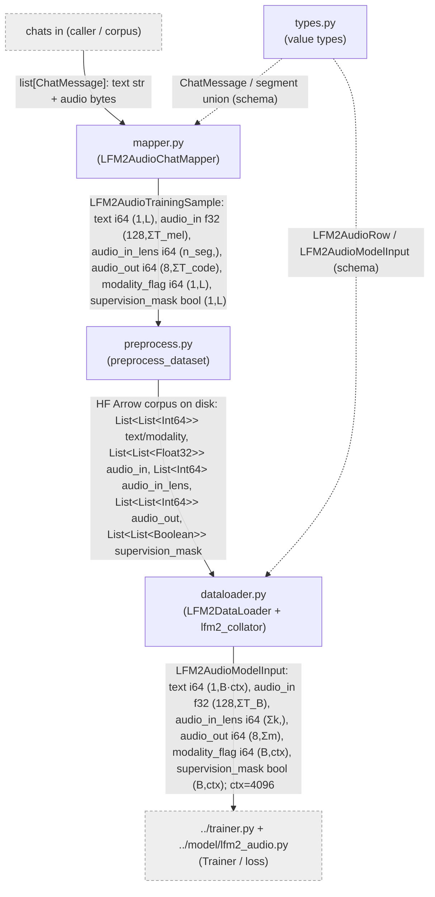

# Training data pipeline

`liquid_audio/data/` is the **offline training-data subsystem** of LFM2.5-Audio: it turns raw multi-turn, multi-modal chats (`list[ChatMessage]`, text `str` + encoded-audio `bytes`) into the packed six-tensor batches the trainer's loss runs over. One mapper linearizes a conversation into parallel tensors (text ids, audio-in mel, Mimi audio-out codes, per-position modality flag + supervision mask); a preprocess step bakes those samples into an on-disk HuggingFace Arrow corpus; a dataloader reads the corpus back, right-pads to `context_length=4096`, and collates rows into a batched `LFM2AudioModelInput`. A shared `types.py` defines the value vocabulary (chat segments + the three pipeline-stage bundles) that everything here passes around.

> **Off the inference path.** Every component in this folder is **training-only**. None of it runs at chat/generate time — the inference path builds model inputs through `processor.py`/`ChatState`, not these dataclasses. The bundles produced here feed `LFM2AudioModel.forward`/`logits` for *loss*, plus the `Trainer`. They are documented for completeness, not as a live inference dependency.

## Flow

Solid edges are the data path (chat → packed sample → Arrow corpus → batch). Dashed edges from `types.py` are the **schema contract** (it carries no data and does no compute — `mapper`/`dataloader` produce and consume its dataclasses). The two grey stubs are the neighboring folders: chats enter from the caller/corpus; the collated `LFM2AudioModelInput` leaves to the trainer + model loss one level up.

## Components

| Component | File | dtype in → out | Role | Spec |
|---|---|---|---|---|
| `data_types` | `data/types.py` | `list[ChatMessage]` (text `str` + audio `bytes`) → the three six-tensor bundles `LFM2AudioTrainingSample` → `LFM2AudioRow` → `LFM2AudioModelInput` (text i64 `(B,L)`, audio_in f32 `(128,ΣT)`, audio_in_lens i64 `(n_seg,)`, audio_out i64 `(8+,L_ao)`, modality_flag i64 `(B,L)`, supervision_mask bool `(B,L)`) | Pure dataclass vocabulary: chat-segment union + the three pipeline-stage bundles; no compute, just the load-bearing field schema. | [./types.md](./types.md) |
| `data_mapper` | `data/mapper.py` | `list[ChatMessage]` → `LFM2AudioTrainingSample`: text i64 `(1,L_text)`, audio_in f32 `(128,ΣT_mel)`, audio_in_lens i64 `(n_seg,)`, audio_out i64 `(8,ΣT_code)`, modality_flag i64 `(1,L)`, supervision_mask bool `(1,L)` | Chat → one packed supervised sample: tokenizes text, mels audio-in, Mimi-encodes audio-out (+EOAudio), builds per-position modality flag + supervision mask, 6-text/12-audio interleave. | [./mapper.md](./mapper.md) |
| `data_preprocess` | `data/preprocess.py` | `LFM2AudioTrainingSample` (per chat) → HF Arrow dataset on disk: `List<List<Int64>>` text/modality, `List<List<Float32>>` audio_in, `List<Int64>` audio_in_lens, `List<List<Int64>>` audio_out, `List<List<Boolean>>` supervision_mask (one row/sample) | Offline corpus builder: maps chats through the mapper, applies `max_context_length` skip, writes kept samples as a real `datasets.Dataset` (Arrow IPC shard + `dataset_info.json` + `state.json`) via `save_to_disk`. | [./preprocess.md](./preprocess.md) |
| `data_dataloader` | `data/dataloader.py` | Arrow columns per row (text i64 `(1,n)`, audio_in f32 `(128,ΣT)`, audio_in_lens i64 `(k,)`, audio_out i64 `(codebooks,m)`, modality_flag i64 `(1,n)`, supervision_mask bool `(1,n)`) → `LFM2AudioModelInput`: text i64 `(1,B·ctx)`, audio_in f32 `(128,ΣT_B)`, audio_in_lens i64 `(Σk,)`, audio_out i64 `(codebooks,Σm)`, modality_flag i64 `(B,ctx)`, supervision_mask bool `(B,ctx)`; `ctx=4096` | Map-style training `Dataset`: dtype-casts Arrow columns to torch, right-pads per-position sequences (text/modality/supervision) to `context_length=4096`, and `lfm2_collator` concatenates rows into a batched bundle. | [./dataloader.md](./dataloader.md) |

## How it fits

**Enters:** a `list[ChatMessage]` per conversation — `str` text and raw **encoded-audio `bytes`** — handed in by the corpus-build caller. This is the boundary where decoded audio, mel features, and codec codes do *not* yet exist; the mapper is what materializes them.

**Leaves:** a batched **`LFM2AudioModelInput`** — `text` int64 `(1, B·ctx)`, `audio_in` f32 `(128, ΣT_B)`, `audio_in_lens` int64 `(Σk,)`, `audio_out` int64 `(codebooks=8, Σm)`, `modality_flag` int64 `(B, ctx=4096)`, `supervision_mask` bool `(B, ctx)`. Note the **concat-not-stack** collation: `text`/`audio_in`/`audio_out` flatten on `dim=1` (the model re-segments them via `modality_flag` + `audio_in_lens`), while `modality_flag`/`supervision_mask` become a true `(B, ctx)` matrix.

**Connects to:**
- **Upstream** — the caller/corpus driver supplies chats; within this folder the mapper additionally depends on `processor.py` (tokenizer / mel front-end / Mimi codec — see `../processor.md`) and `utils.py` (`LFMModality`, `mel2emb_len`) to do the actual packing. Those are *callees*, not part of the data folder's own staging.
- **Downstream** — the [`../model/lfm2_audio.md`](../model/lfm2_audio.md) backbone (`_prefill` scatters `text`/`audio_in`/`audio_out` embeddings by `modality_flag`; `forward` builds the CE-loss masks from `supervision_mask`) and the [`../trainer.md`](../trainer.md) loop (moves the bundle with `.to(device)` and calls the model). The folder hands off exactly the `LFM2AudioModelInput` contract; everything past the hand-off is the **training/loss** subsystem, which is itself off the LFM2-Audio inference path.

The `modality_flag` field is the alignment key for the whole bundle — its per-position `LFMModality` value (TEXT=1 / AUDIO_IN=2 / AUDIO_OUT=3) is what lets the model un-flatten the concatenated streams. The schema is asserted hard downstream (cross-field counting identities in `lfm2_audio.py`), so the six-tensor contract defined in `types.py` is the real invariant this folder exists to uphold.
