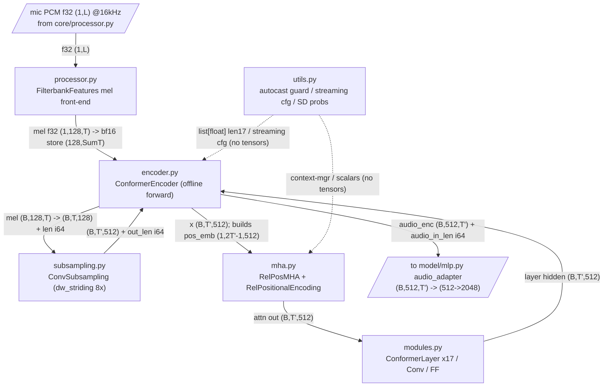

# FastConformer audio encoder

This folder is the **audio-IN** front-end of LFM2.5-Audio: it turns microphone PCM into context-aware frame embeddings the LFM2 backbone can read. Mic audio is meled (`processor.py`), subsampled 8x and lifted to `d_model=512` (`subsampling.py`), then run through N=17 macaron ConformerLayers with Transformer-XL relative-position attention (`encoder.py`, `modules.py`, `mha.py`); `utils.py` holds NeMo cast/streaming/regularization config that is inert at inference. This is what lets the model **listen** — it is *not* the Mimi codec (that is the audio-OUT path); mic audio never touches the codec, only audio-OUT codes round-trip through Mimi.

## Folder wiring

Solid edges carry activation tensors; dashed edges (`utils.py`) are config/guard handshakes that carry no tensors. `encoder.py` is the orchestrator — it calls `subsampling.py` once, builds the single rel-pos table in `mha.py`, then threads `pos_emb` through 17 `modules.py` ConformerLayers (each of which calls back into `mha.py` for self-attention). The `mic` and `adapter` nodes are edge stubs to the neighboring folders (`core/processor.py` upstream, `model/mlp.py` audio_adapter downstream).

## Components

| Component | File | dtype in -> out | Role | Spec |
|---|---|---|---|---|
| FilterbankFeatures | `processor.py` | f32 `(1,L)` PCM @16kHz -> f32 mel `(1,128,T)`; cast bf16 `(128,SumT)` on store | Mel front-end: preemphasis -> STFT(512/160) -> power -> slaney 128-bin mel -> log(x+2^-24) -> per-feature ddof=1 normalize; **precision-pinned f32** | [./processor.md](./processor.md) |
| ConformerEncoder | `encoder.py` | model dtype mel `(B,128,T)` + i64 len -> model dtype `audio_enc (B,512,T')` + i64 `audio_in_len` | Audio-IN encoder orchestrator: 8x subsample -> centered rel-pos -> N=17 macaron ConformerLayers (pre-LN). **Offline forward only** (single unpadded clip, att_context `[-1,-1]`, masks None) | [./encoder.md](./encoder.md) |
| ConvSubsampling | `subsampling.py` | model dtype `(B,T,128)` + i64 len -> model dtype `(B,T',512)` + i64 out_len | dw_striding pre-encoder: Conv2d stem + 2 depthwise/pointwise blocks (8x time+freq down) -> flatten `256*16=4096` -> Linear -> 512; `calc_length` frame math, length-aware masking | [./subsampling.md](./subsampling.md) |
| RelPosMHA + RelPositionalEncoding | `mha.py` | model dtype `x=(B,T',512)`, `pos_emb=(1,2T'-1,512)` -> `(B,T',512)`; softmax upcast f32 | Transformer-XL relative-position self-attention: centered 2L-1 sinusoid table + `rel_shift` matrix_ac/bd, shared `pos_bias_u/v`, h=8, d_k=64. Only global token mixing in the encoder | [./mha.md](./mha.md) |
| ConformerLayer / Conv / FF | `modules.py` | model dtype `x=(B,T',512)`, `pos_emb=(1,2T'-1,512)`, masks None -> `(B,T',512)` | The 17-deep body: macaron `FF/2 -> rel-pos MHSA -> gated depthwise conv -> FF/2` (pre-LN, fc_factor 0.5); conv = pointwise -> GLU -> depthwise k=9 -> BatchNorm -> SiLU -> pointwise; plus streaming CausalConv1D | [./modules.md](./modules.md) |
| conformer_utils | `utils.py` | config scalars + autocast-dtype enum (no tensors) -> context manager / `list[float]` len=17 / dataclass | NeMo cast/streaming/regularization helpers: `avoid_float16_autocast_context` guard, `CacheAwareStreamingConfig`, `compute_stochastic_depth_drop_probs`. **Config/guard layer — carries no tensors** | [./utils.md](./utils.md) |

## How it fits

**What enters:** f32 mic PCM `(1,L)` at 16 kHz arrives from `core/processor.py` (resampled by `ChatState.add_audio`). `processor.py` turns it into a precision-pinned f32 log-mel spectrogram `(1,128,T)`, which `ChatState.audio_in` stores as bf16 `(128,SumT)`. At forward time, `model/lfm2_audio.py` pads the per-clip mel list, casts to model dtype, and hands `(B,128,T)` + int64 lengths to `ConformerEncoder`.

**What leaves:** `ConformerEncoder` emits `audio_enc (B,512,T')` in model dtype plus int64 `audio_in_len`, where `T' = ceil(T/8)`. That output is unpadded and concatenated to `(SumT',512)`, then fed to the `audio_adapter` MLP in `model/mlp.py` (512 -> 2048, GELU-erf), whose `(SumT',2048)` is scattered into the AUDIO_IN slots of the LFM2 backbone token stream.

**Upstream folder:** `core/` (`processor.py`, mic capture and resample). **Downstream folder:** `model/` (`mlp.py` audio_adapter, then the LFM2 backbone). The pipeline reads end-to-end as: mic -> mel -> subsample -> 17 conformer layers -> audio_adapter -> backbone.

## Inference-path notes

All six components are **on** the LFM2-Audio inference path, but several sub-features within them are dormant at inference and are present only for NeMo fidelity / inventory parity:

- **Streaming / cache-aware path is off.** The encoder runs the **offline** forward only — one unpadded clip, full attention context `[-1,-1]`, `_create_masks` returns `(None, None)`. `CacheAwareStreamingConfig`, `CausalConv1D`'s causal behavior, the chunked triangular masks, and the `MaskedConvSequential` length tracking exist to support streaming/padded batches but never gate a tensor op at inference. (Do not feed a zero-padded batch into the Rust `forward` — the per-clip path is what is verified.)
- **`utils.py` is effectively inert.** With no `torch.autocast` block active, `avoid_float16_autocast_context()` returns `nullcontext()`; with `stochastic_depth_drop_prob = 0.0`, the drop-prob schedule is all zeros and no layer is dropped (stochastic depth is training-only). The numerically load-bearing f32 attention-score upcast lives in `mha.py`, not in this helper.
- **Training-only bits dropped/dormant:** dither and narrowband augmentation in `processor.py`, NeMo uniform `reset_parameters` in `subsampling.py`, and layer-drop in `encoder.py` are all `self.training`-gated and never fire at inference.
- **No vocabulary / special tokens here.** This is a pure feature encoder with no codes and no EOAudio — those live on the audio-OUT depthformer/Mimi side, which is a separate path entirely.
