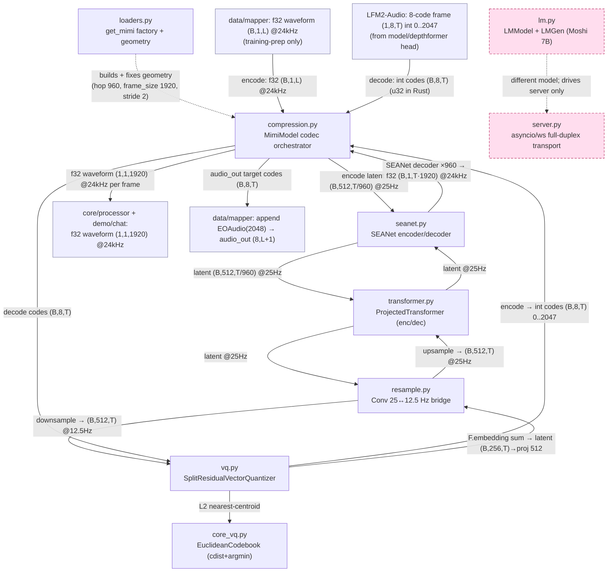

# Kyutai Moshi stack (codec on-path; LM + transport off-path)

This folder is the vendored Kyutai `moshi/` subtree. For LFM2-Audio only **one thing here is on the inference path: the Mimi neural audio codec** — the learned, streaming residual-VQ transform between a 24 kHz waveform and an 8-codebook stack of discrete integer codes. LFM2-Audio borrows Mimi as a *peripheral the processor owns* (it has its own backbone + depthformer language model), using `mimi.decode` to turn generated 8-code frames back into waveform on the demo/processor audio-out path, and `mimi.encode` at training-data prep to mint `audio_out` target codes. The rest of the subtree — the Moshi 7B multi-stream LM (`lm.py`), the asyncio WebSocket transport (`server.py`), the conditioners, and the clients — was vendored wholesale and is **a different model / off-path reference only**, kept for provenance and as the conceptual full-duplex shell.

## Component wiring

Nodes are labeled with their source filename; edges carry the dtype+shape that flows between them. The two directions of the codec are split: the **decode** edges (codes → waveform) are the LFM2-Audio inference path; the **encode** edges (waveform → codes) run only at training-data prep. Pink dashed nodes are **off the LFM2-Audio inference path**.

> Geometry pinned by `loaders.py`: `SAMPLE_RATE=24000`, `FRAME_RATE=12.5`, `hop_length=960` (⇒ 25 Hz encoder rate), `frame_size=1920` (one code column = 1920 samples = 80 ms), framerate-bridge stride `25/12.5 = 2`. `EOAudio=2048` is a **model-side** sentinel from LFM2-Audio's depthformer head — Mimi itself only ever emits/consumes codes `0..2047`.

## Components

| Component | File | dtype in → out | Role | Spec |
|---|---|---|---|---|
| `moshi_loaders` | `models/loaders.py` | `(filename\|None, device, num_codebooks=8)` → configured `MimiModel`; bf16/f32 weights | Mimi factory: assembles SEANet enc/dec + 2× `ProjectedTransformer` + `SplitResidualVectorQuantizer` from frozen kwargs dicts, sets `set_num_codebooks(8)`, fixes rate geometry. **On-path** (build only; off-path `CheckpointInfo`/`get_moshi_lm` also live here). | [./models/loaders.md](./models/loaders.md) |
| `moshi_compression` | `models/compression.py` | decode: int codes `(B,8,T)` 0..2047 → f32 waveform `(B,1,T·1920)` @24kHz · encode: f32 `(B,1,L)` @24kHz → int codes `(B,8,T)` | `MimiModel` codec orchestrator: SEANet enc/dec + enc/dec transformers + split-RVQ + 25↔12.5 Hz conv resample; `encode`/`decode`/`forward` + CUDAGraphed streaming state. **On-path (decode).** | [./models/compression.md](./models/compression.md) |
| `moshi_seanet` | `modules/seanet.py` | decoder: latent `(B,512,t)` @25Hz → waveform `(B,1,t·960)` f32 @24kHz · encoder: waveform `(B,1,T)` f32 → latent `(B,512,T/960)` @25Hz | Causal conv codec ends: encoder strides 24 kHz → 512-dim 25 Hz latent (hop 960); mirror decoder inverts it. ELU, dilated residual blocks, weight-norm folded, `true_skip` identity. **Decoder on-path; encoder is training-prep.** | [./modules/seanet.md](./modules/seanet.md) |
| `moshi_vq` | `quantization/vq.py` | encode: latent `(B,512,T)` → codes `(B,8,T)` int64 0..2047 · decode: codes → latent `(B,512,T)` | `SplitResidualVectorQuantizer` (`rvq_first` semantic n_q=1 + `rvq_rest` acoustic) + `ResidualVectorQuantizer`; 512↔256 input/output proj; `cdist`+`argmin` nearest-centroid via `core_vq` `EuclideanCodebook`. **On-path.** | [./quantization/vq.md](./quantization/vq.md) |
| `moshi_lm` | `models/lm.py` | codes int64 `[B,n_q+1,T]` (train) · `LMGen.step` `[B,K_in,1]` → `LMOutput.logits` `[B,dep_q,T,card]` + text logits · `LMGen` frame `[B,n_q+1,1]` | Moshi 7B multi-stream LM (text + n_q audio streams) + depformer head + `LMGen` streaming driver. **A DIFFERENT model from LFM2-Audio — reference only (off-path).** | [./models/lm.md](./models/lm.md) |
| `moshi_server` | `server.py` | Opus bytes (ws) → sphn-decoded f32 PCM `(1,1,1920)` @24kHz → Opus audio bytes (ws `\x01`) + UTF-8 text-token bytes (ws `\x02`) | `asyncio`+`aiohttp` full-duplex WebSocket transport for Moshi 7B: `recv_loop`/`opus_loop`/`send_loop` driving `mimi.encode`→`lm_gen.step`→`mimi.decode` per 1920-sample frame. **Off the LFM2-Audio path (not ported to Rust).** | [./server.md](./server.md) |

Supporting on-path modules pulled in by the codec (own specs in this folder): [`modules/resample.md`](./modules/resample.md) (the learnt `ConvDownsample1d`/`ConvTrUpsample1d` 25↔12.5 Hz bridge), [`modules/transformer.md`](./modules/transformer.md) (the enc/dec `ProjectedTransformer`s at 25 Hz), [`modules/conv.md`](./modules/conv.md), [`modules/streaming.md`](./modules/streaming.md), [`modules/rope.md`](./modules/rope.md), and [`quantization/core_vq.md`](./quantization/core_vq.md)/[`quantization/base.md`](./quantization/base.md). Off-path-only specs also present: [`models/lm_utils.md`](./models/lm_utils.md), [`models/tts.md`](./models/tts.md), the [`conditioners/`](./conditioners/) set, the `client*.md` / `run_inference.md` / `run_tts.md` Moshi tooling, and most of [`utils/`](./utils/).

## How it fits

**On the LFM2-Audio inference path, this folder is a pure codec sink.** What enters is the audio-out token stream from the language model: integer code frames `(B,8,T)` with values `0..2047` (cast to `u32` on the Rust/candle side), produced one 8-vector column at a time by [`model/lfm2_audio`](../model/lfm2_audio.md)'s depthformer head and assembled into codes by [`core_processor`](../processor.md). Those codes flow into `compression.py` (`MimiModel.decode`) → `vq.py` (dequantize + sum + 256→512 proj) → `resample.py` (12.5→25 Hz upsample) → `transformer.py` (decoder transformer) → `seanet.py` (×960 decoder upsample). What leaves is **f32 PCM waveform `(1,1,1920)` @ 24 kHz per frame**, returned through `compression.py` to [`core_processor`](../processor.md) (Mimi is the fallback vocoder when no LFM2 ISTFT detokenizer ships) and the demo audio sink ([`demo/chat`](../demo/chat.md)), which plays each 1920-sample chunk inside `mimi.streaming(1)`.

The **encode** direction (waveform → codes) is a separate, training-only edge: [`data/mapper`](../data/mapper.md) resamples reference speech to 24 kHz and calls `mimi.encode` to mint the `audio_out` target codes, then appends `EOAudio=2048` — it never runs at inference. So upstream of the codec is the LM/processor (decode) and the data mapper (encode); downstream is the processor + demo audio sink (decode) and the mapper's training targets (encode).

## Off-path components (explicit)

The following live in this folder only because the Kyutai subtree was vendored whole; **none is reached by LFM2-Audio inference**:

- **`models/lm.py` (Moshi 7B `LMModel` + `LMGen`)** — a *different* speech LM. LFM2-Audio uses its own backbone + depthformer and a synchronous streaming generator, never `lm_gen.step`.
- **`server.py`** — `asyncio`/`aiohttp` full-duplex Opus WebSocket transport for that Moshi LM; not ported to Rust (no async runtime), kept as the conceptual full-duplex reference.
- **`conditioners/` (`base.md`, `text.md`, `tensors.md`)**, **`models/tts.md`**, **`models/lm_utils.md`**, and the **`client*` / `run_inference` / `run_tts`** tooling — Moshi-LM conditioning, TTS, and client/demo plumbing.
- **The SEANet *encoder*** (and `MimiModel.encode`) — on the codec, but only on the *training-data-prep* path, not at inference.
- **Off-path helpers inside on-path files** — `loaders.py`'s `CheckpointInfo` / `get_moshi_lm` / `get_conditioner*` / LoRA helpers, and the `CUDAGraphed` wrapping (GPU-only, latency, numerically irrelevant; absent in the eager candle Rust port).
