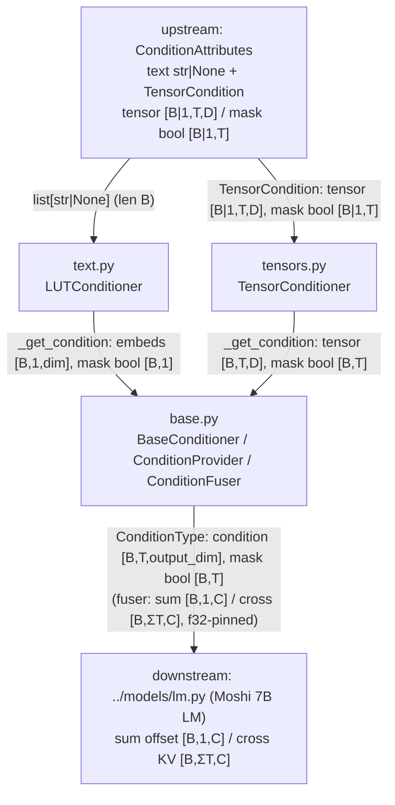

# LM conditioners (off-path)

This folder is the **conditioning framework** vendored from Kyutai's Moshi / Meta's AudioCraft: it turns *external attributes* (a categorical text string, a pre-computed dense feature tensor) into dense `[B, T, output_dim]` embeddings and *fuses* them into a generative LM's stream as an additive offset (`sum`) or a cross-attention KV source (`cross`). It is the conditioning backbone of the **Moshi 7B multi-stream LM** and the Moshi `TTSModel`, reached only through `../models/lm.py` and `../models/tts.py`.

> **Off the LFM2-Audio inference path.** LFM2.5-Audio never instantiates any of this — it builds its own backbone + depthformer and fuses modalities by **index-scatter on a modality flag** (`../../processor.md`, `../../model/lfm2_audio.md`), not via a `ConditionProvider`/`ConditionFuser`. Nothing in `processor.py` / `model/lfm2_audio.py` imports the conditioners. There is no Rust port: the whole `liquid_audio/moshi/**` tree is "reused as the `moshi` crate, not re-ported" (PYTHON_VS_RUST.md §4), and the `moshi` crate is loaded only for the Mimi codec — `grep -ri condition` over `liquid-audio-rs/src/` returns nothing. Documented here for inventory completeness only.

## Component flow

The two concrete embedders (`text.py`, `tensors.py`) are both `BaseConditioner` subclasses defined in `base.py`; they supply the abstract `prepare` / `_get_condition` hooks, and `base.py`'s inherited `forward` does the shared `output_proj` (`dim → output_dim`, biasless `Linear`) + masked learnt-padding blend. `ConditionProvider` (in `base.py`) collates a batch and runs every conditioner; `ConditionFuser` (in `base.py`) combines the resulting `(condition, mask)` pairs into the LM's `sum` offset and `cross` KV source. There is **no attention, RoPE, RMSNorm/LayerNorm, convolution, activation, quantization, or sampling** anywhere in this folder — the only numerically interesting op is the masked blend.

## Components

| Component | File | dtype in → out | Role | Spec |
|---|---|---|---|---|
| `LUTConditioner` | `text.py` | `list[str\|None]` (len B) → `ConditionType(condition model-dtype bf16/f32 [B,1,output_dim], mask bool [B,1])` | Lookup-table **text** conditioner: `NoopTokenizer` (hash/index per attribute string) → `nn.Embedding` → biasless `Linear` → masked `learnt_padding` blend. | [./text.md](./text.md) |
| `TensorConditioner` | `tensors.py` | `TensorCondition(tensor model-dtype/f32 [B\|1,T,D], mask bool [B\|1,T])` → `ConditionType(condition model-dtype/f32 [B,T,output_dim], mask bool [B,T])` | Raw-tensor conditioner: device-move + identity rewrap of `(tensor, mask)`; projection/blend inherited from `BaseConditioner`. "Does basically nothing." | [./tensors.md](./tensors.md) |
| `BaseConditioner` / `ConditionProvider` / `ConditionFuser` | `base.py` | per-attribute `cond [B,T,dim]` + `mask bool [B,T]` → `ConditionType(condition [B,T,output_dim], mask bool [B,T])`; fuser → `sum [B,1,C]` / `cross [B,ΣT,C]` (f32-pinned, cast to LM dtype at boundary) | Conditioning framework: per-attribute embed+project+masked-pad, batch collate+run, and sum/cross/prepend fusion. | [./base.md](./base.md) |

## How it fits

**Enters:** a batch of `ConditionAttributes` assembled by a Moshi dataset/runner — a `text` dict of `str|None` attribute strings (len `B`), plus a `TensorCondition` dict of dense `[B|1, T, D]` feature tensors with bool `[B|1, T]` masks. `text.py` consumes the strings, `tensors.py` consumes the tensors, and `ConditionProvider._collate_*` (in `base.py`) right-pads them into batched tensors.

**Leaves:** per-attribute `ConditionType(condition, mask)` pairs — `condition` is model-dtype `[B, T, output_dim]`, `mask` is bool `[B, T]` — which `ConditionFuser` reduces to a `sum_condition` additive offset `[B, 1, C]` and/or a `cross_attention_src` KV source `[B, ΣT, C]`. The provider is **pinned to float32** at the LM level (`lm.py:228`), and `sum`/`cross` are cast back to the LM's compute dtype at the boundary (`lm.py:393`, `lm.py:618-621`); the sinusoidal pos-emb added to `cross` is likewise built in f32 then cast (half-split `[cos, sin]` layout — *not* interleaved RoPE).

**Upstream folder:** loaders in [`../models/loaders.md`](../models/loaders.md) (`get_conditioner_provider` / `get_condition_fuser`) build the `ConditionProvider` / `ConditionFuser` instances; the sinusoidal helper `create_sin_embedding` comes from [`../modules/transformer.md`](../modules/transformer.md). **Downstream folder:** [`../models/lm.md`](../models/lm.md) is the only real consumer (`LMModel.forward` / `LMGen` feed the `sum` offset and `cross` KV into the Moshi-7B transformer); [`../models/tts.md`](../models/tts.md) also constructs these conditioners and reads `LUTConditioner.tokenizer.possible_values` to validate CFG values.

**Status:** every component in this folder is **off the LFM2-Audio inference path** (Moshi LM / TTS only) and has **no Rust counterpart** — same off-path status PYTHON_VS_RUST.md §4 assigns to the entire Moshi LM/conditioning stack, distinct from the on-path Mimi reuse in §2.3.
