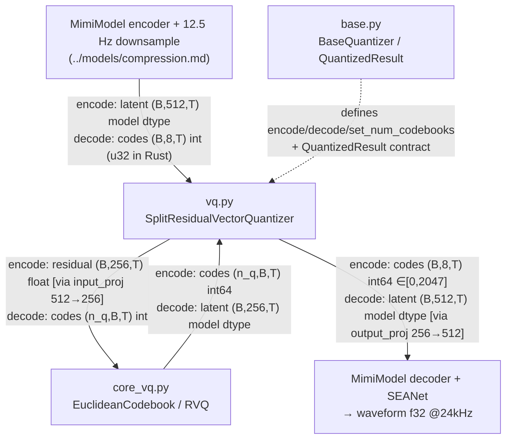

# Residual vector quantization (RVQ)

This folder is the **quantizer head of the Mimi codec** — the only place in the LFM2-Audio pipeline where a continuous audio latent becomes discrete integer tokens and back. It maps the SEANet-encoded 12.5 Hz latent `(B, 512, T)` to an 8-codebook frame `(B, 8, T)` of integers in `[0, 2047]` (encode), and reconstructs that latent from codes (decode). Those 8-codebook frames *are* the audio vocabulary the LFM2-Audio model emits and consumes, so this folder is the bridge between waveforms and tokens. The math is nearest-centroid only — `cdist` + `argmin` to pick a code, `F.embedding` to look it up — with no attention, softmax, or sampling anywhere on the path.

## Component flow

`vq.py` is the top-level quantizer wired into `MimiModel`; it subclasses the `base.py` interface and delegates the actual codebook lookups to `core_vq.py`. The split is semantic-vs-acoustic (1 + 7 codebooks), not a residual chain across the split — both stacks encode the same `x`, and their decoded latents are summed.

## Components

| Component | File | dtype in → out | One-line role | Spec |
|---|---|---|---|---|
| `SplitResidualVectorQuantizer` | `vq.py` | **encode:** latent `(B,512,T)` model dtype → codes `(B,8,T)` int64 ∈`[0,2047]` **decode:** codes `(B,8,T)` int → latent `(B,512,T)` model dtype | Top-level VQ wired into `MimiModel`: `512↔256` projections, semantic `rvq_first` (n_q=1) + acoustic `rvq_rest` (n_q=7) | [vq.md](./vq.md) |
| `EuclideanCodebook` / `ResidualVectorQuantization` | `core_vq.py` | **encode:** latent `[*,256]`/`[B,256,T]` float → codes `[n_q,B,T]` int64 **decode:** codes int (u32 in Rust) → latent `[B,256,T]` model dtype | The codebook engine: `cdist`+`argmin` nearest-centroid encode, `F.embedding` decode, residual loop; EMA/k-means is training-only | [core_vq.md](./core_vq.md) |
| `BaseQuantizer` / `QuantizedResult` / `DummyQuantizer` | `base.py` | latent `[B,512→256,T]` + `frame_rate:int` → `QuantizedResult{ x:`(B,512,T)`, codes:`(B,8,T)` int, bandwidth, penalty, metrics }` | Abstract quantizer interface + result dataclass consumed by `MimiModel`; pure plumbing, no codebooks | [base.md](./base.md) |

## How it fits

**Enters:** on encode, the SEANet-encoded + framerate-downsampled latent `(B, 512, T)` at 12.5 Hz, in model dtype (bf16 on CUDA/Metal, f32 on CPU), arriving from `MimiModel` ([../models/compression.md](../models/compression.md)). On decode, the generated 8-code frame `(B, 8, T)` of integers in `[0, 2047]` (int64 in Python, u32 in Rust) arrives the same way.

**Leaves:** on encode, codes `(B, 8, T)` int64 ∈`[0, 2047]` bubble up through `MimiModel.encode` to the training-data path ([../../data/mapper.md](../../data/mapper.md)), which appends the out-of-band `EOAudio=2048` sentinel — that value is **not** a codebook entry and never reaches this folder. On decode, the reconstructed latent `(B, 512, T)` model dtype flows back to `MimiModel`'s framerate upsample + decoder transformer + SEANet decoder, producing the f32 @24 kHz waveform consumed by [../../processor.md](../../processor.md).

**Upstream/downstream folder:** the sole direct neighbor is the Mimi codec in [`../models/`](../models/compression.md) — `CompressionModel`/`MimiModel` constructs, owns, and drives the quantizer through the `BaseQuantizer` interface. Its build hyperparameters (`dim=256, n_q=32, bins=2048`, `set_num_codebooks(8)`) come from [../models/loaders.md](../models/loaders.md). Nothing else touches this folder directly; the processor, mapper, and detokenizer all go through `MimiModel.encode`/`.decode`.

## On vs. off the inference path

All three files are **on** the LFM2-Audio path — but the directions split:

- **Decode (`vq.py` / `core_vq.py` `decode`):** live inference. Every generated audio frame is dequantized here before the SEANet decoder reconstructs the waveform.
- **Encode (`vq.py` / `core_vq.py` `encode`):** training-data path only — building the `audio_out` target codes from reference speech. It is not exercised when the model is generating.
- **`base.py`:** interface plumbing on the path (the contract `MimiModel` calls through), but does no math.

**Explicitly off-path within this folder:**
- `DummyQuantizer` (`base.py`) — the identity-passthrough baseline whose "codes" are continuous floats. The Mimi checkpoint never instantiates it; a generic consumer assuming `QuantizedResult.codes` is integer-castable would break on it.
- **EMA / k-means / dead-code replacement** in `core_vq.py` (`_run_kmeans`, `_ema_inplace`, `_check_expired_codes`) and the `ema_frozen_` gate in `base.py` — training-only codebook maintenance with no inference counterpart; inference checkpoints ship frozen.
- The `forward(x, frame_rate)` loss/bandwidth path and `penalty`/`metrics` fields — training-only; inference uses only `encode`/`decode`, and `frame_rate` exists solely for the bandwidth metric.

**Rust note:** there is no in-tree Rust port of this folder. The Rust side reuses Kyutai's published `moshi` crate (`moshi::mimi`), chosen because this checkpoint's `quantizer.rvq_first.*` / `quantizer.rvq_rest.*` weight keys match it natively (candle-transformers' Mimi uses different keys and cannot load these weights). See each spec's *Python ↔ Rust* section.
