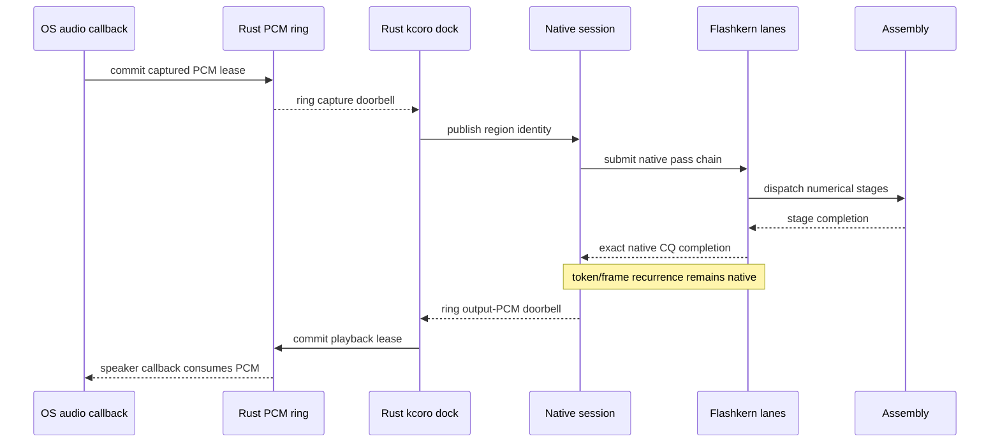

# EmberHarmony Voice Architecture

Status: implementation ledger and product boundary.

Normative detail lives in
[`specs/11-kcoro-native-migration.md`](../../../../../specs/11-kcoro-native-migration.md).
The native integration runbook is
[`docs/native/KCORO_ARENA_INTEGRATION.md`](../../../../../docs/native/KCORO_ARENA_INTEGRATION.md).
This file describes the desktop-facing shape and records unfinished migration
work. Git history, not a second live document, preserves the discarded
Rust/Candle architecture.

## Non-Negotiable Boundary

The local voice system has four ownership layers:

1. **Rust owns audio streams in and out.** It opens the OS microphone and
   speaker, owns callback-safe PCM rings, translates persisted/Tauri settings,
   and projects bounded events to SolidJS.
2. **Rust kcoro owns asynchronous I/O continuations.** It parks and resumes PCM
   and control operations from exact docking-ring callbacks. It does not submit,
   inspect, or recur model passes.
3. **C++ owns native control.** It loads files, validates plans, owns buffers and
   handles, schedules fixed lanes, performs lifetime arbitration, and dispatches
   assembly entry points. C++ contains no model, codec, DSP, sampler, or tensor
   arithmetic in the completed system.
4. **Assembly owns every numerical operation.** AArch64 and x86_64 assembly own
   embedding, convolution, FFT, mel, normalization, attention, activations,
   sampling, codec, recurrence-state transforms, and GEMM. On Apple, a selected
   Accelerate/AMX implementation is an opaque machine-code backend reached
   through an architecture assembly thunk; C++ still performs no arithmetic.

No model progress edge depends on Tauri, the webview, serialized IPC, polling,
or a Rust wake. Native completions resolve native continuations. Rust receives
only PCM/control docking events and observational snapshots.

## Product Flow

```mermaid
flowchart LR
    UI["SolidJS controls and visualization"]
    Tauri["Tauri commands and settings"]
    Audio["Rust audio host: microphone, speaker, PCM rings"]
    Dock["Rust kcoro audio/control dock"]
    Native["C++ control: handles, plans, queues, barriers"]
    Rings["Native model SQ/CQ and exact doorbells"]
    Lanes["Fixed Flashkern lane team"]
    Asm["AArch64 or x86_64 assembly math"]

    UI -->|"start, stop, mic, interrupt, settings"| Tauri
    Tauri --> Audio
    Audio -->|"PCM lease ready"| Dock
    Dock -->|"region and generation"| Native
    Native --> Rings --> Lanes --> Asm
    Asm --> Lanes --> Rings --> Native
    Native -->|"PCM lease ready"| Dock
    Dock --> Audio
    Audio --> UI
    Native -. "sampled telemetry only" .-> Tauri
```



The arrows between Rust and native code carry small control records and retained
buffer identities. They do not carry tensors, logits, KV rows, model tokens, or
per-pass callbacks.

## Callback-Only Progress

The system does not monitor queues. A producer publishes one record, release
advances a generation, and rings one expected-value doorbell. The named consumer
continuation becomes runnable exactly once.



`stop`, `interrupt`, and microphone enablement are control edges. They bump an
epoch or close a scope immediately. An executing assembly operation is never
polled; stale publication is rejected at the next complete pass boundary.

## Buffer Ownership

| Buffer | Owner | Access |
|---|---|---|
| resident safetensors image | native model | immutable assembly source |
| packed weight panels | native model plan | immutable assembly source |
| KV and short-conv state | native conversation | assembly read/write at pass boundaries |
| activation and scratch planes | native session/conversation | fixed lanes and assembly only |
| logits and sampler scratch | native conversation | assembly only |
| Mimi/codec state | native conversation | assembly only |
| microphone PCM ring | Rust audio host | HAL producer, Rust kcoro consumer lease |
| speaker PCM ring | Rust audio host | Rust kcoro producer lease, HAL consumer |
| native PCM ingress/egress regions | docked lease | one side owns mutation; generation fences handoff |
| UI event queue | Tauri host | compact metadata and copied display text only |

Weights and model state never enter Rust. PCM never enters Tauri IPC as the
mechanism that makes audio progress.

## Current Implementation Truth

The migration is active, not complete.

### Implemented

- `native/src/io/safetensors.cpp` owns aligned resident checkpoint images and
  immutable tensor views.
- `native/src/model/lfm_model.cpp` binds native model plans from those views.
- `native/src/engine/flashkern_engine.cpp` owns the fixed lane team, generation
  fences, native bridge submission/completion, and direct native pass dispatch.
- `submit_pass` no longer calls a Rust coordinator. The compatibility Rust
  `NativeEngine` stores only an opaque pointer and a call-serialization mutex.
- PRNG block expansion, RoPE table generation, scalar reductions, BF16 NeoX
  rotation, and sampler leaves including exponentiation have architecture `.S`
  implementations with no external numerical symbol.
- Native sampler fixtures pass on Apple Silicon and x86_64 under Rosetta with
  the same seeded token stream.
- Rust `fanout.rs` and the production Rust coordinator trampoline are deleted.

### Still Migration Debt

- Rust/Candle model, processor, Conformer, and realtime code remains in the tree
  and is still reachable in portions of the current desktop provider.
- Numerical C++ remains in the architecture `.cpp` files, Mimi sources, DD FFT,
  and sampler orchestration. Each family must move into `.S`; the `.cpp` files
  become control-only and then disappear where they have no control role.
- The Rust PCM/control docking ring is designed but not yet the sole desktop
  audio boundary.
- Native model recurrence is not yet fully conversation-owned; some outer turn
  behavior still returns through transitional Rust model code.
- The MLX C++/Metal peer backend is not mounted. Flashkern remains CPU-only.

No compatibility fallback is added for any removed path. A path is deleted only
after its native assembly-backed replacement passes parity and lifecycle gates.

## Desktop Responsibilities

Tauri may:

- persist device/model/audio settings;
- start, stop, interrupt, and enable or disable the microphone;
- own the Rust audio host and Rust kcoro I/O scopes;
- receive bounded state, transcript, level, latency, and error events;
- render a sampled ticket/pipeline visualizer.

Tauri may not:

- open or inspect model tensors;
- choose kernel stages per token;
- wait for a model pass before handling another command;
- carry microphone or playback PCM through serialized IPC;
- poll native progress;
- execute inference, DSP, codec, sampler, or tensor math.

## Settings

Device and model selection are runtime settings, never environment variables or
compile-time product policy. Build metadata such as Cargo target architecture is
allowed only to choose which architecture assembly objects are compiled.

Unsupported runtime selections fail explicitly. There is no silent CPU/Metal,
native/Candle, or model-version fallback.

## Verification

Required local gates while the migration is active:

```bash
cargo test -p liquid-audio --lib -- --nocapture
cargo test -p liquid-audio --tests -- --nocapture
./crates/liquid-audio/scripts/test-rosetta.sh
git diff --check
```

The final cutover additionally requires:

- no Candle or Rust tensor symbol in the production binary;
- no floating-point arithmetic, SIMD intrinsic, libm call, or tensor type in
  production Rust or C++ source;
- all numerical public leaves defined by architecture `.S` objects;
- zero heap allocation, polling, or host callback in a native pass;
- exact stop/interrupt behavior under pass and PCM completion races;
- no idle CPU use from queue monitoring;
- native recurrence continuing while Tauri and the webview are descheduled.

## Source Map

| Responsibility | Source |
|---|---|
| desktop commands/settings/events | `packages/desktop/src-tauri/src/voice/` |
| Rust PCM/control dock | `crates/kcoro/` plus the pending audio-dock module |
| native product lifecycle ABI | `crates/liquid-audio/native/include/lfm_runtime.h`, `lfm_session.h` |
| private numerical oracle ABI | `crates/liquid-audio/native/src/model/lfm_model_legacy.h` |
| native model binding | `crates/liquid-audio/native/src/model/lfm_model.cpp` |
| native queue/doorbell protocol | `native/include/lfm_kernel_bridge.h`, `native/src/runtime/` |
| fixed lane control | `native/src/engine/flashkern_engine.cpp` |
| numerical kernels | `native/kernels/aarch64/*.S`, `native/kernels/x86_64/*.S` |
| resident checkpoint image | `native/src/io/safetensors.cpp` |
| normative migration | `specs/11-kcoro-native-migration.md` and its subdocuments |
