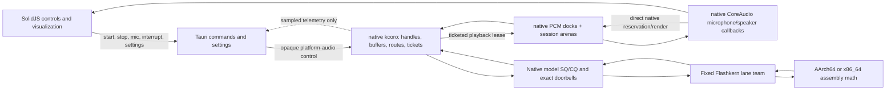
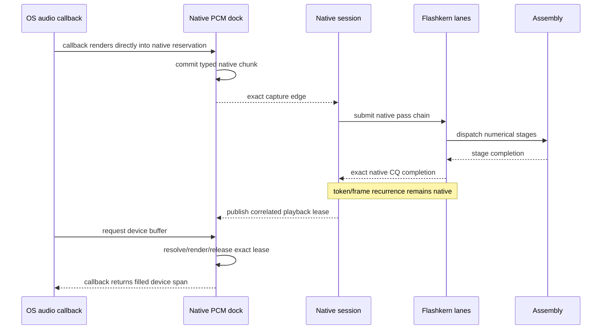

# EmberHarmony Voice Architecture

Status: implementation ledger and product boundary.

Normative detail lives in
[`specs/11-kcoro-native-migration.md`](../../../../../specs/11-kcoro-native-migration.md).
The native integration runbook is
[`docs/native/KCORO_ARENA_INTEGRATION.md`](../../../../../docs/native/KCORO_ARENA_INTEGRATION.md).
This file describes the desktop-facing production shape. Git history, not a
second live implementation, preserves the discarded Rust/Candle architecture.

## Non-Negotiable Boundary

The local voice system has four ownership layers:

1. **Native code owns platform callback endpoints.** It opens the OS microphone
   and speaker, owns the sole capture/playback endpoints, and keeps PCM inside
   native session arenas. Rust translates persisted/Tauri settings, holds an
   opaque platform-audio handle, and projects bounded events to SolidJS.
2. **The safe kcoro Rust seam owns host continuations.** Retained services and
   prebound realtime notifier leases resume control/observer work from exact
   native edges. Suspended work is state, not an attached Rust thread or waiter.
3. **Native C++/kcoro owns callbacks, control, and storage.** It loads files,
   validates plans, owns CoreAudio units, immutable weight views, circular PCM
   arenas, conversation/session state, fixed services/team workers, ticket
   correlation, and assembly dispatch.
4. **Assembly owns every numerical operation.** AArch64 and x86_64 assembly own
   embedding, convolution, FFT, mel, normalization, attention, activations,
   sampling, codec, recurrence-state transforms, and GEMM. On Apple, a selected
   Accelerate/AMX implementation is an opaque machine-code backend reached
   through an architecture assembly thunk; C++ still performs no arithmetic.

No model progress edge depends on Tauri, the webview, serialized IPC, polling,
or a Rust wake. Native completions resolve native continuations. Rust receives
only PCM/control docking events and observational snapshots.

## Product Flow



The arrows between Rust and native code carry only small control records and
bounded observations. They do not carry PCM, buffer identities, tensors,
logits, KV rows, model tokens, or per-pass callbacks.

## Callback-Only Progress

The system does not monitor queues. A producer publishes one record, release
advances a generation, and rings one expected-value doorbell. The named consumer
continuation becomes runnable exactly once.



`stop`, `interrupt`, and microphone enablement are control edges. They bump an
epoch or close a scope immediately. An executing assembly operation is never
polled; stale publication is rejected at the next complete pass boundary.

## Buffer Ownership

| Buffer | Owner | Access |
|---|---|---|
| resident safetensors image | native model | immutable assembly source |
| weight-view descriptors | native model plan | non-owning byte spans into the resident image |
| KV and short-conv state | native conversation | assembly read/write at pass boundaries |
| activation and scratch planes | native session/conversation | fixed lanes and assembly only |
| logits and sampler scratch | native conversation | assembly only |
| Mimi/codec state | native conversation | assembly only |
| microphone circular arena | native session | CoreAudio renders directly into a generation-checked reservation |
| speaker playback pool | native session | Mimi/resampler writes reservation; HAL callback resolves and retires lease |
| capture/playback descriptors | native dock | ticket, epoch, sequence, region/lease generation and span bounds |
| UI event queue | Tauri host | compact metadata and copied display text only |

Weights and model state never enter Rust. PCM never enters Tauri IPC as the
mechanism that makes audio progress.

## Current Implementation Truth

The LFM2 production cutover is complete; supervision and release gates remain
active working-tree work.

### Implemented

- `native/src/io/safetensors.cpp` owns one byte-exact main-plus-codec checkpoint
  image and immutable byte views.
- `native/src/model/lfm_model.cpp` binds native model plans from those views.
- `kc_team` owns the fixed numerical workers; `flashkern_engine.cpp` owns typed
  stage boards, exact generation dispatch, final-member completion, route/pass
  tickets, and direct native recurrence.
- Native retained services own bridge, broker, coordinator, and delivery
  continuations. No Rust model coordinator or blocking pass rim exists.
- PRNG block expansion, RoPE table generation, scalar reductions, BF16 NeoX
  rotation, and sampler leaves including exponentiation have architecture `.S`
  implementations with no external numerical symbol.
- Native sampler fixtures pass on Apple Silicon and x86_64 under Rosetta with
  the same seeded token stream.
- Native CoreAudio plus circular capture and exact Sesame detection own device
  PCM, turn evidence, and endpointing. Rust has no callback endpoint.
- Native playback retains ticket/epoch/generation through final device release;
  no PCM payload enters `VoiceEvent` or Tauri IPC.

### Still Release / Future Debt

- Hard-only team quorum supervision is being wired through correlated monotonic
  deadline children, entered/returned masks, one terminal CAS, and a reserved
  fatal capsule. It must pass the post-change real-checkpoint and lifecycle
  stress gates before release status is claimed.
- Audit and remove residual compiler-owned C++ numerical loops where an assembly
  or explicit Accelerate/AMX stage has not yet taken ownership.
- The current engine is one fixed team. Independent V2 `BlockDomain`s are not
  implemented and must not be inferred from logical lane folding.
- The MLX C++/Metal peer backend and native Moshi are not mounted. Flashkern
  remains the only shipped LFM2 engine; unsupported selections fail explicitly.

No compatibility fallback is added for any removed path. A path is deleted only
after its native assembly-backed replacement passes parity and lifecycle gates.

## Desktop Responsibilities

Tauri may:

- persist device/model/audio settings;
- start, stop, interrupt, and enable or disable the microphone;
- own the Rust audio host and Rust kcoro I/O scopes;
- receive bounded state, transcript, level, latency, and error events;
- render a sampled ticket/pipeline visualizer.

Tauri may not:

- open or inspect model tensors;
- choose kernel stages per token;
- wait for a model pass before handling another command;
- carry microphone or playback PCM through serialized IPC;
- poll native progress;
- execute inference, DSP, codec, sampler, or tensor math.

## Settings

Device and model selection are runtime settings, never environment variables or
compile-time product policy. Build metadata such as Cargo target architecture is
allowed only to choose which architecture assembly objects are compiled.

Unsupported runtime selections fail explicitly. There is no silent CPU/Metal,
native/Candle, or model-version fallback.

## Verification

Required local gates while the migration is active:

```bash
cargo test -p liquid-audio --lib -- --nocapture
cargo test -p liquid-audio --tests -- --nocapture
cargo test -p kcoro-sys --tests -- --nocapture
git diff --check
```

The final cutover additionally requires:

- no Candle or Rust tensor symbol in the production binary;
- no floating-point arithmetic, SIMD intrinsic, libm call, or tensor type in
  production Rust or C++ source;
- all numerical public leaves defined by architecture `.S` objects;
- zero heap allocation, polling, or host callback in a native pass;
- exact stop/interrupt behavior under pass and PCM completion races;
- no idle CPU use from queue monitoring;
- native recurrence continuing while Tauri and the webview are descheduled.

## Source Map

| Responsibility | Source |
|---|---|
| desktop commands/settings/events | `packages/desktop/src-tauri/src/voice/` |
| safe Rust continuation/notifier seam | `crates/kcoro-sys/src/lib.rs` |
| opaque platform callback endpoints | `crates/liquid-audio/src/voice_api.rs`, `src/native_voice.rs` |
| native product lifecycle ABI | `crates/liquid-audio/native/include/lfm_runtime.h`, `lfm_session.h` |
| private numerical oracle ABI | none; the callable Rust/Candle comparison path was deleted |
| native model binding | `crates/liquid-audio/native/src/model/lfm_model.cpp` |
| native queue/doorbell protocol | `native/include/lfm_kernel_bridge.h`, `native/src/runtime/` |
| fixed lane control | `native/src/engine/flashkern_engine.cpp` |
| numerical kernels | `native/kernels/aarch64/*.S`, `native/kernels/x86_64/*.S` |
| resident checkpoint image | `native/src/io/safetensors.cpp` |
| normative migration | `specs/11-kcoro-native-migration.md` and its subdocuments |
