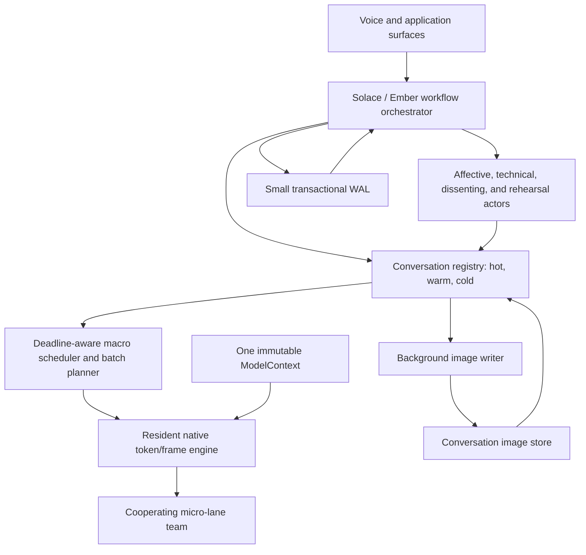
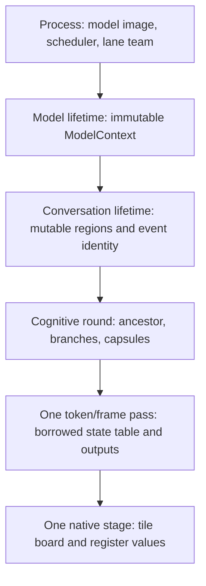
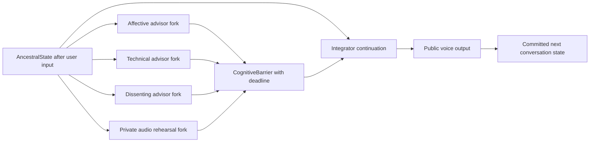
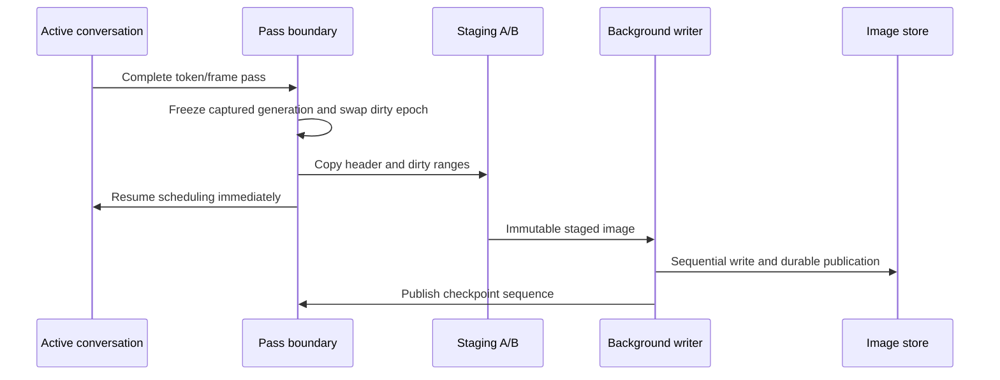
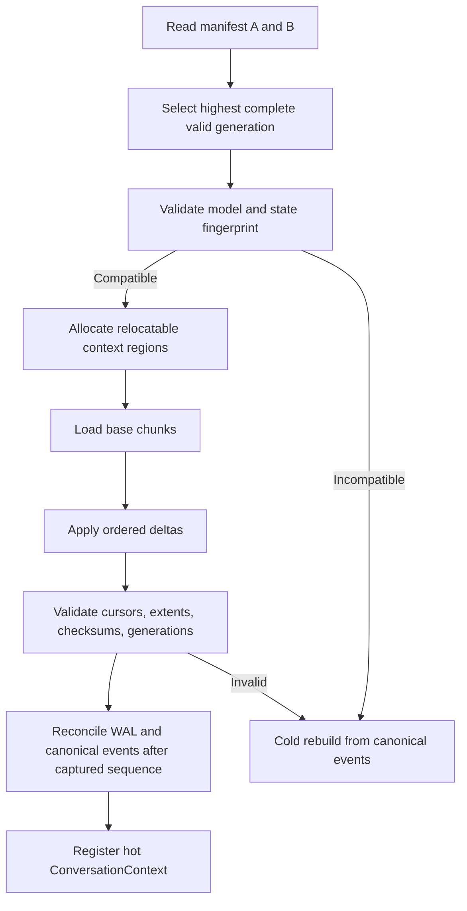
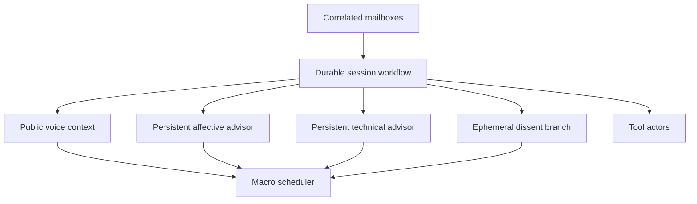

# 10 - Stateful multi-agent voice runtime

One immutable model image, many mutable conversation images, fast context
switching, copy-on-write perspective forks, deadline-aware integration, and
durable hibernation without putting disk work in the speech path.

This is a shared architectural direction for EmberHarmony and Solace Core. It
extends the responsive voice design in
[`09-responsive-voice-turns.md`](09-responsive-voice-turns.md) and depends on
the native scheduling boundary documented in
[`KCORO_ARENA_INTEGRATION.md`](../docs/native/KCORO_ARENA_INTEGRATION.md).
The current voice object graph is mapped in
[`VOICE_ARCHITECTURE.md`](../packages/desktop/src-tauri/src/voice/VOICE_ARCHITECTURE.md),
and the fused CPU target is described in
[`ENGINE_DESIGN.md`](../crates/liquid-audio/docs/ENGINE_DESIGN.md).

Status: design specification. The current engine has several prerequisites,
but it does not yet implement multi-context scheduling or durable conversation
images.

---

## 1. Core thesis

The model is not the conversation.

The model is a shared state-transition function:

```text
(next_state, output) = model(weights, conversation_state, input)
```

The weights are immutable capability. Conversation state is identity.

A serving process should load one model weight image, then operate on many
independent state objects. Switching conversations should select another state
object, not reload weights and not reconstruct the state by replaying a text
transcript.

The operating-system analogy is useful:

| Runtime concept | OS analogy |
|---|---|
| Model weights and native kernels | Shared executable pages |
| Conversation image | Process address space |
| Native lane team | CPU |
| Context scheduler | Kernel scheduler |
| Hibernated context | Swapped process |
| Shared ancestral KV pages | Copy-on-write pages after `fork` |
| Durable workflow log | Journaled filesystem |
| Actor mailbox | IPC |

The practical result is one model serving live voice, dormant conversations,
technical agents, affective advisors, and background workflows without one copy
of the weights per activity.

The short statement is:

> One model, many conversations. Weights are capability; state is identity.

## 2. What this buys us

### 2.1 Fast switching between conversations

A hot conversation already has its KV, convolution, codec, cursor, and sampler
state. Selecting it should cost a pointer/context switch plus normal cache
effects. A warm conversation restores those regions from a conversation image.
A cold conversation replays its canonical event history only when no compatible
image exists.

This allows the user to leave a voice conversation, work elsewhere, and return
without re-prefilling the full history or retaining every inactive KV cache in
RAM.

### 2.2 State instead of transcript replay

Text does not need to be the execution representation of context. The live
model consumes its state image directly.

An inspectable event record still matters for audit, migration, editing,
search, and cold recovery. It may contain text, model token IDs, audio-code
references, tool events, and public outputs. It is not reread on every turn.

The distinction is:

- **Execution context:** opaque, exact, model-specific state.
- **Canonical history:** compact, inspectable events from which state can be
  rebuilt when necessary.
- **Transactional truth:** WAL records describing external commitments.

### 2.3 Multiple agentic activities

Most agents spend much of their lifetime waiting for a user, tool, network
response, timer, or another workflow. A waiting context can park with zero CPU
use and move to warm storage under memory pressure. The shared model advances a
different ready activity.

### 2.4 Cheap cognitive branching

Several advisors can fork from one ancestral context, share its sealed prefix,
add a short perspective prompt, and generate bounded private continuations.
The final voice integrates the results into one public response.

Memory branching can be close to constant time through copy-on-write pages.
Compute is not free; short branches become economical when dynamically batched
over shared weight reads.

### 2.5 Crash recovery and hibernation

Conversation images preserve expensive model state. A small WAL preserves
workflow correctness. Together they restore both where cognition was and what
the system had committed to the outside world.

## 3. Goals and non-goals

### Goals

- Load one immutable model image and serve many isolated conversations.
- Switch hot contexts at full token/frame pass boundaries.
- Support hot, warm, and cold context residency.
- Preserve exact CPU state across compatible hibernate/restore cycles.
- Fork ancestral state with shared immutable prefix pages.
- Run affective, technical, dissenting, and rehearsal perspectives privately.
- Integrate perspective artifacts at a deadline-aware cognitive barrier.
- Batch compatible macro-lanes over one cooperating native micro-lane team.
- Keep filesystem and transport activity off inference and audio threads.
- Preserve external commitments transactionally through the WAL.
- Bound RAM, staging memory, delta-chain length, and on-disk growth.

### Non-goals

- No raw process, stack, allocator, or virtual-address dump.
- No assumption that divergent KV histories can be merged directly.
- No one hardware lane per agent.
- No disk write, WAL record, or cancellation check per SIMD operation.
- No requirement to persist private rehearsal or internal advisor material.
- No claim that a state image is portable across arbitrary model or kernel
  versions.
- No removal of the canonical event record.
- No exposure of private deliberation as public output or debugging telemetry by
  default.

## 4. Terminology

This repository already uses "snapshot" for downloaded model directories and
runtime status objects. New APIs should use more specific names.

| Term | Meaning |
|---|---|
| `ModelContext` | Immutable weights, tokenizer/codec identity, layer table, and native geometry. |
| `ConversationContext` | Mutable neural and conversational state for one activity. |
| `ConversationImage` | Serialized hibernation state for one conversation. |
| `Checkpoint` | A durable base image plus zero or more ordered deltas. |
| `EventRecord` | Inspectable canonical input/output/tool history. |
| `WorkflowState` | Explicit orchestration state protected by the WAL. |
| `MacroLane` | A conversation, advisor, or branch scheduled as model work. |
| `MicroLane` | A native compute lane cooperating on one pass or batch. |
| `PerspectiveCapsule` | Bounded private output from an advisor branch. |
| `CognitiveBarrier` | Deadline-aware join and integration point for perspectives. |
| `AncestralState` | Sealed context prefix from which a cognitive round forks. |
| `ContextMark` | In-memory context ID, generation, and cursor identifying an ancestral state; it is not a disk checkpoint. |

## 5. Current foundation and gap

The CPU engine already has the beginning of this separation:

- model weights are installed once as a resident pointer table;
- the Rust rim captures fresh per-layer KV and convolution pointers for each
  blocking token pass;
- the C++ token program reads weights and mutates supplied state in place;
- `NativeEngine::pass_lock` permits one native pass at a time;
- `KvSlot` appends BF16 K/V rows in place and exposes zero-copy live views;
- speculative prefill rollback moves KV cursors and restores small convolution
  states rather than rebuilding the model;
- generated audio context is represented as codes rather than replayed PCM.

The current `CacheSnapshot` is an in-memory rollback mark. It records KV lengths
and cloned convolution state. It is not a portable hibernation image, does not
own the KV payload, and cannot survive process exit.

Current gaps:

- the model/runtime object graph still assumes one active conversation engine;
- the resident C++ context is single-model-tenant and the Rust pass lock has no
  multi-context scheduler above it;
- mutable state is not represented by stable context handles and relocatable
  region offsets;
- there is no image codec, disk adapter, A/B manifest, or restore path;
- there is no copy-on-write prefix page allocator;
- the engine has no batched token-pass ABI over independent state tables;
- advisor roles and private/public context classes are prompt conventions, not
  typed runtime concepts.

## 6. System architecture



The real-time rule is structural: the scheduler and native engine receive only
memory-resident state. The image writer and WAL storage adapter execute on
separate host threads and never run from CPAL, VAD, model-lane, or playback
callbacks.

## 7. State ownership

### 7.1 Immutable model state

`ModelContext` is shared by every compatible conversation:

- mapped or otherwise stable model weight storage;
- layer and head descriptors;
- tokenizer, audio codec, and prompt grammar identity;
- rotary tables or other immutable model constants;
- native kernel feature selection;
- model and numerical ABI fingerprint.

It contains no conversation cursor, KV row, sampler seed, or pending output.

### 7.2 Mutable conversation state

Each `ConversationContext` owns or leases:

- public input/output token and audio-code sequence positions;
- per-layer backbone KV live rows and cursors;
- convolution carry state;
- Depthformer, Mimi, or other streaming codec state when applicable;
- text/audio sampler RNG state;
- turn grammar, modality, and speaker/provenance markers;
- active speculative-prefill mark;
- cancellation and output epoch;
- private-segment metadata when private context is retained;
- references to persistent advisor contexts;
- the latest durable checkpoint and WAL sequence.

Activation scratch, tile counters, coroutine frames, OS synchronization, and
weights are not conversation state.

### 7.3 Lifetime stack



Every pointer crossing the C ABI must point into an equal or longer lifetime.
Conversation images contain IDs and offsets, never those pointers.

## 8. Context residency and switching

### 8.1 Three residency tiers

| Tier | State | Resume path | Intended use |
|---|---|---|---|
| Hot | Mutable context remains in RAM | Select handle and submit pass | Active speech and near-term agents |
| Warm | Compatible conversation image on disk | Restore regions, validate, register | Recently inactive conversations |
| Cold | Canonical events only | Rebuild through prefill | Old, incompatible, or storage-minimized contexts |

### 8.2 Scheduling quantum

Preemption occurs only at a complete token/frame pass boundary. The scheduler
does not interrupt a matrix kernel or a generation barrier.

At the boundary it may:

- continue the same context;
- select another ready context;
- assemble a compatible dynamic batch;
- fork advisor branches;
- capture a memory checkpoint;
- mark a context for asynchronous hibernation;
- retire a canceled context before its next pass.

### 8.3 Hot context switch

The target switch is:

1. Finish the current pass and publish its state generation.
2. Select another `ConversationContext` under the scheduler lock.
3. Build or reuse its per-layer pointer table.
4. Submit one pass to the resident model engine.

There is no weight installation, model reload, full-history prefill, or state
payload copy in that path.

### 8.4 Residency policy

Eviction should combine:

- hard RAM and context-count budgets;
- current speech and playback deadlines;
- pending tool/timer events;
- recency and predicted reuse;
- image compatibility and last checkpoint age;
- hibernation cost versus cold-rebuild cost;
- user privacy and retention policy.

An explicit user switch can request warm hibernation. Memory pressure may choose
cold eviction when a recent event record is cheaper than writing a large cache.

## 9. Cognitive fork, advise, join, utter

### 9.1 Round shape



The ancestor is sealed at a legal pass boundary. Branches initially share every
sealed prefix page. Each branch adds a private role prompt and allocates only
its divergent tail.

### 9.2 Memory fork versus semantic join

Forking is a memory operation. Joining is a model operation.

Divergent KV caches cannot be concatenated, averaged, or pointer-unioned into a
coherent transformer history. Each branch returns a bounded artifact. The
integrator starts from the ancestor and consumes those artifacts as private
input before generating the public answer.

### 9.3 Perspective capsule

A capsule should carry enough structure to preserve disagreement and provenance
without requiring the integrator to replay an entire branch:

```rust
struct PerspectiveCapsule {
    advisor: AdvisorId,
    ancestor: ContextMark,
    class: PerspectiveClass,
    observations: Vec<Observation>,
    hypotheses: Vec<Hypothesis>,
    confidence: f32,
    recommendation: PayloadRef,
    dissent: Option<PayloadRef>,
    private_payload: Option<PayloadRef>,
    completed_at: u64,
}
```

This is a logical schema, not a public Rust API. Payloads may be model tokens,
audio-code tokens, compact text, or another registered representation.

A cognitive round creates no disk checkpoint merely by forking. Its
`ContextMark` is an in-memory generation fence. Hibernation policy may later
persist that generation, but advisor latency never waits for storage by default.

### 9.4 Affective advisor contract

The affective advisor may ask:

- How might the previous response have been perceived?
- What cues are actually observable in the user's words, prosody, timing, or
  interruption?
- What are at least two plausible theories of mind?
- What confidence belongs to each interpretation?
- How should the next response adjust?
- How can this be restated as the agent's own provisional understanding?

Observation and inference must remain distinct. "The user sounded terse" may
be an observation. "The user felt dismissed" is a hypothesis. Turning that
hypothesis into durable fact creates a self-reinforcing relational error.

Persistent affective state stores evidence, alternatives, confidence, and
trajectory. The voice may internalize the recommendation while the runtime
retains its epistemic provenance.

### 9.5 Technical and dissenting advisors

Technical advisors can advance independent views of architecture, performance,
correctness, security, product impact, or project strategy. Dissenting advisors
should see the ancestor but not other branches before producing their capsule.
That prevents premature consensus.

High disagreement may trigger one bounded second round or a clarifying question
instead of silently averaging incompatible recommendations.

Version 1 can introduce capsules to the integrator with an envelope equivalent
to:

```text
This is a private rehearsal round. The user has not heard any material below
and must not be treated as though they did.

Here are independent affective, technical, and dissenting perspectives rooted
in the same ancestral conversation state. They are advice, not public turns and
not automatically true. Preserve meaningful disagreement.

Given these thoughts and the actual user-visible conversation, what would you
like to say?
```

The integrator synthesizes a response; it does not concatenate a committee
transcript. Runtime segment classes remain authoritative even when the prompt
contains this natural-language explanation.

### 9.6 Private audio rehearsal

A branch may generate private audio tokens representing wording, cadence, or
affective delivery before the final public continuation. These tokens are never
playback data merely because they use the audio vocabulary.

Private/public class must be structural:

```text
USER_OBSERVED
ASSISTANT_PUBLIC
ADVISOR_PRIVATE
AFFECTIVE_HYPOTHESIS
AUDIO_REHEARSAL
TOOL_RESULT
WORKFLOW_FACT
```

Only `ASSISTANT_PUBLIC` may reach the output sink. A private payload reference
must fail type/routing validation if submitted to playback.

The model also needs to know that private rehearsal was not heard by the user.
Version 1 may use an explicit natural-language introduction and context mark.
Longer term, dedicated control tokens, segment embeddings, or fine-tuning should
make the distinction native to the model.

### 9.7 Canonical state after integration

There are two valid policies:

1. **Retain typed private context.** Continue from the integrator state, keeping
   private segments explicitly marked as unspoken.
2. **Public rebase.** Generate using private advice, then rebuild the canonical
   context from the ancestor, which already includes the current user input,
   plus the final public output only.

Retaining is faster and preserves internal continuity. Rebasing gives the
cleanest conversational chronology but costs another prefill. Until private
segment semantics are proven against the actual voice model, public rebase is
the conservative default.

Persistent advisors keep their own state regardless of which voice-context
policy is chosen. Ephemeral rehearsal branches are released after the round.

## 10. Macro-lanes, micro-lanes, and batching

### 10.1 Do not bind an actor to a hardware lane

A macro-lane is logical cognition. A micro-lane is physical compute.

Giving each advisor one hardware lane would make every lane stream the same
weight matrices independently and would starve the SIMD/GEMV kernels of
cooperation. The native lane team should process one macro-lane or a batch of
macro-lanes together.

### 10.2 Serial multiplexing first

The first scheduler should run one conversation pass at a time over the full
lane team. This proves state isolation and switching without changing model
math.

```text
A token -> B frame -> C tool-result token -> A token -> advisor batch -> A output
```

This is simultaneous at the product level and serialized at the native pass
boundary.

### 10.3 Dynamic microbatching

The next step batches compatible contexts:

```text
[A hidden, affective hidden, technical hidden, dissent hidden]
    x shared weight matrix
    -> four independent next states
```

Each batch item carries:

- context and generation ID;
- independent state-region pointers;
- input token/audio-code rows;
- current KV lengths and ragged-attention metadata;
- output buffers;
- sampler RNG and policy;
- deadline, priority, and cancellation epoch.

The stage board claims tiles over batch and output dimensions. Weights remain
shared; every state write is disjoint.

Group by model fingerprint, pass kind, dtype, compatible geometry, and roughly
similar sequence length. Ragged attention must not force short contexts to pay
the full longest-context cost without measurement.

### 10.4 Deadline policy

Suggested priority order:

1. Active speech capture and playback safety.
2. First public response token/frame.
3. Current-turn integration work.
4. Required advisors.
5. Optional advisors and speculative branches.
6. Background agent and maintenance work.
7. Image compaction and compression.

The cognitive barrier has a deadline and required/optional clauses. The
integrator proceeds with completed required capsules and whichever optional
capsules arrived. Late work may update a persistent advisor for the next round;
it does not delay the current voice indefinitely.

Advisor work should begin during user speech, playback, or tool wait when safe.
The pause-to-first-audio budget remains the governing product metric.

### 10.5 Compute truth

Copy-on-write makes branch memory cheap. It does not make generation free.
Every generated branch token still performs model computation. The economic
case depends on:

- short bounded branch outputs;
- prefix sharing;
- dynamic batching and weight reuse;
- useful work hidden behind listening/playback/tool latency;
- strict abandonment of late or low-value branches.

## 11. Conversation image contents

### 11.1 Included regions

A CPU conversation image should contain logical, live extents only:

| Region | Encoding |
|---|---|
| Context header | Canonical little-endian scalar fields |
| Public token/audio-code events needed for exact continuation | Versioned token/code arrays or references |
| Backbone K/V | Per-layer BF16 live rows plus cursor and geometry |
| Convolution state | Per-layer BF16 carried windows |
| Depthformer/Mimi state | Registered versioned codec regions and cursors |
| Sampler | Algorithm ID, version, RNG words, counters, policy |
| Turn state | Speaker/modality, token/audio positions, interrupt epoch |
| Private context | Typed segments only when retention policy permits |
| Advisor references | Context IDs and last accepted capsule/checkpoint IDs |
| Workflow bridge | Last WAL sequence and correlation IDs, not workflow function pointers |

### 11.2 Excluded regions

- Model weights and immutable tables.
- Scratch activations that do not cross a pass.
- Tile counters, barriers, ready queues, or coroutine frames.
- Mutexes, condition variables, thread IDs, and file handles.
- Rust/C++ virtual addresses.
- Allocator metadata that cannot be relocated.
- Playback device handles and network connections.

### 11.3 Model compatibility fingerprint

Exact restore requires a fingerprint over at least:

- model weight identity;
- model configuration and layer geometry;
- tokenizer and special-token grammar;
- audio codec and codebook configuration;
- state-region schema versions;
- dtype and byte order;
- sampler algorithm/version;
- native numerical ABI when bit-exact continuation is required.

An incompatible image is never partially loaded. Use a registered migration or
cold-rebuild from canonical events.

## 12. Image format

The durable format is offset-based and chunked. It is not a dump of the in-memory
struct layout.

### 12.1 Logical header

```text
magic
format_version
header_size
flags
context_id
conversation_generation
model_fingerprint
checkpoint_sequence
base_checkpoint_sequence
captured_wal_sequence
ancestor_context_id
ancestor_checkpoint_sequence
region_count
manifest_generation
header_checksum
```

### 12.2 Region chunk

```text
region_kind
schema_version
layer_or_stream_index
logical_offset
logical_length
stored_length
mutation_generation
encoding
flags
payload_checksum
payload_or_ciphertext
```

CRC32C or an equivalent fast checksum detects accidental corruption. It is not
an authentication mechanism. Encrypted images require an authenticated cipher
and per-file nonce/key metadata supplied by the host key-management layer.

### 12.3 Base and delta

- A **base image** contains every required live region.
- A **delta image** contains the latest bytes for dirty logical ranges plus the
  new cursors/header state.
- Every delta names its base and immediate predecessor sequence.
- Recovery rejects gaps, duplicate sequence ambiguity, incompatible region
  generations, overlaps outside the format rules, and out-of-bounds lengths.

The format should permit applying a chunk directly into a preallocated region
without constructing a tensor graph or retaining the encoded input buffer.

## 13. Dirty tracking

The engine knows its state mutations. Start with explicit semantic dirty ranges,
not page-fault-based virtual-memory tracking.

Examples:

- KV append dirties `[old_len, new_len)` in one K and V plane.
- Convolution advances a known fixed-size carried-state region.
- Sampler advancement dirties a handful of words.
- Turn closure dirties cursors and modality metadata.
- Advisor acceptance dirties a capsule reference and advisor state tail.

### 13.1 Generation rule

Each logical region or bounded page carries a mutation generation. A context
also tracks:

- `durable_checkpoint`: last published durable image;
- `dirty_since_durable`: ranges changed after that image;
- `capture_generation`: generation copied into a staging slot;
- `active_generation`: generation receiving new mutations.

Dirty state is **not cleared when memory is copied**. It is cleared only after
the image segment and manifest referencing it are durably published, and only
when the current range generation still equals the captured generation.

If the range changed again while the writer was active, it remains dirty for
the next image.

### 13.2 Cumulative pending deltas

Periodic captures must be replaceable when the writer falls behind. A pending
delta therefore contains the latest values for every range still dirty relative
to the last durable checkpoint, or the staging layer must merge all superseded
deltas before dropping them.

Never drop an incremental delta and retain a later delta that depends on it.

A cumulative pending delta retains the durable parent from which its contents
are complete. If another descendant of that parent publishes first, the newer
manifest may replace that tail with the cumulative delta rather than append it.
It must not relabel partial bytes as though they were complete relative to a new
parent.

This permits bounded coalescing:

- one image is being written;
- one cumulative image may wait in the second staging slot;
- newer mutations merge into or replace the waiting image;
- no unbounded checkpoint queue exists.

## 14. Capture path

### 14.1 Fast memory capture



The initial implementation should favor a bounded `memcpy` into preallocated
staging memory. Zero-copy is not a goal when a copy buys coherent ownership and
keeps the writer away from live state.

### 14.2 Staging policy

Use an active context plus two staging slots:

- one slot may be owned by the writer;
- one slot may hold the newest cumulative pending checkpoint;
- if both are occupied, periodic checkpoints coalesce or skip;
- explicit hibernation waits at the control layer for a durable image before
  releasing RAM, but never blocks the audio callback or native lane team.

A delta exceeding the staging budget promotes to a full checkpoint or defers to
an explicit hibernation window. Do not allocate an arbitrarily large emergency
buffer in the voice path.

### 14.3 Full hibernation

When a context is deliberately leaving the hot tier, longer capture work is
acceptable after its final pass. Version 1 may copy every live region into a
full staging image. Later versions may seal and reference-count arena pages so
the writer reads immutable pages while a resumed/forked context receives
copy-on-write pages.

Page protection and fault-driven dirty tracking are deferred. Domain-aware
range tracking avoids signal handlers, write faults, TLB disruption, and OS
specificity.

## 15. Durable publication and compaction

### 15.1 Store layout

A practical per-context layout is:

```text
contexts/<context-id>/
  manifest-a
  manifest-b
  base-<sequence>.image
  delta-<sequence>.image
```

The host may implement this in files, a database, an object store, or a fixed
container. The core sees opaque storage handles.

### 15.2 Publication protocol

1. Write a new immutable base or delta with header, chunks, and footer.
2. Durably sync that object.
3. Build a new manifest in the inactive A/B slot. It references a complete base
   and ordered delta chain and carries a higher manifest generation.
4. Durably sync the inactive manifest.
5. Sync required directory/container metadata when publication creates or
   renames host objects.
6. Only now report the checkpoint durable and clear matching dirty generations.
7. Retain every object reachable from the previous valid manifest until the new
   manifest is durable.
8. Reclaim objects unreachable from both valid manifests.

Recovery selects the highest-generation valid manifest whose complete object
graph passes format, checksum, and compatibility validation.

### 15.3 Compaction

Delta chains are bounded by all of:

- maximum delta count;
- cumulative delta bytes relative to base bytes;
- restore-time budget;
- age since the last full image.

Compaction writes a new full base through the same A/B protocol. It never
truncates the only known-good image before the replacement is durable.

The current `kcoro_arena` snapshot store appends each full image and retains all
older complete images. Its tail-only `truncate` contract cannot safely remove
old prefix frames while preserving the previous durable snapshot. Do not use
that append-only snapshot path for long-running conversation images until A/B
publication or atomic replacement/reset has landed.

### 15.4 Platform durability

`kc_store_sync` is a correctness boundary, not a suggestion. On macOS, a
power-loss durability promise requires `fcntl(fd, F_FULLFSYNC)` or a proven
equivalent. Plain `fsync` may not flush the device's volatile cache to media.
Other hosts must define and test an equally explicit contract.

If a product mode requests only crash recovery rather than power-loss recovery,
that weaker promise must be named separately. It must not silently satisfy a
stronger durable-commit API.

## 16. Restore path



Restore is all-or-nothing. A context does not enter the scheduler registry until
all required regions and workflow correlations validate.

WAL replay restores transactional workflow truth. Canonical user/public model
events after the image's captured sequence must also be replayed through the
model when they advance neural state. The WAL may point to those events; it does
not substitute for their model input payloads.

The restored allocator may choose different addresses and capacities. Region
offsets and live lengths, not source addresses, determine placement.

Bit-exact validation compares uninterrupted execution against checkpoint,
destroy, restore, and continue under the same model/numerical fingerprint.

## 17. WAL and image responsibilities

The memorable distinction is:

> The WAL tells us what happened. The conversation image tells us where the
> model machine is now.

### 17.1 WAL records

The WAL is appropriate for small transactional facts such as:

- committed user turn identity;
- workflow state transition;
- tool command publication;
- external delivery attempt and acknowledgement;
- dead-letter or compensation transition;
- context/checkpoint association;
- hibernated/restored lifecycle transition;
- public response commit.

It is not appropriate for each token, PCM frame, KV row, stage, or barrier.

### 17.2 Atomic workflow transition

For an input that advances an agent:

1. Begin WAL transaction.
2. Record input acknowledgement.
3. Record encoded workflow state.
4. Record emitted commands/messages.
5. Append commit record.
6. Durably sync.
7. Only then report the workflow transition committed.

Large conversation-image data is written before the small WAL association that
makes it part of a hibernation transition. A crash between those steps leaves an
unreferenced image that garbage collection may remove; it does not leave a WAL
record pointing at incomplete state.

### 17.3 Lazy versus durable

- Periodic continuity checkpoints may be asynchronous. A crash restores the
  previous published image.
- Explicit hibernation must wait for image publication and its WAL transition
  before releasing the only hot state.
- External commitments must wait for WAL sync before success is reported.
- Group commit may combine small transactions without weakening per-transaction
  durability semantics.

During explicit hibernation, the context remains parked at the captured pass
boundary until publication and WAL association complete. A newly arriving event
either cancels hibernation or remains durably queued for replay after restore; it
must not mutate state that is about to be released without another checkpoint.

## 18. Keeping disk away from speech

Background I/O can still disturb real-time work through scheduling, memory
traffic, cache pollution, filesystem locks, and storage interrupts. Merely using
a thread is insufficient.

Required controls:

- Copy only at legal pass boundaries.
- Use preallocated bounded staging memory.
- Use a dedicated low-priority/utility writer.
- Preallocate storage extents where the host permits it.
- Prefer sequential writes and immutable segments.
- Never compress, encrypt, checksum large regions on inference micro-lanes.
- Make compression optional and measurement-backed; BF16 state may not compress
  enough to justify CPU disturbance.
- Coalesce periodic checkpoints when the writer falls behind.
- Prefer silence, playback, tool wait, app backgrounding, or explicit switching
  as full-image opportunities.
- Measure voice p95/p99 and audio underruns while forcing worst-case image writes
  and compaction.

Image encryption is required when retention policy treats conversation state as
sensitive. Checksums detect corruption; they do not provide confidentiality or
authenticity. Keys belong in the platform keychain or another host security
boundary, never in the image file.

## 19. Orchestration model



Each persistent activity has:

- workflow and context identity;
- mailbox/correlation subscriptions;
- priority and deadlines;
- hot/warm/cold residency state;
- cancellation scope;
- latest durable checkpoint;
- retention and privacy policy.

The scheduler wakes an activity when mail, user input, a timer, or a tool result
makes it runnable. Waiting activities do not poll or self-requeue.

## 20. Private/public safety and epistemics

The architecture gives private cognition more power, so its boundaries must be
reviewable.

- Private rehearsal cannot route to playback or external delivery.
- Debug telemetry defaults to IDs, timing, sizes, and terminal causes, not raw
  private payloads.
- Persistence of private advisor state is opt-in by policy.
- Affective inference retains evidence, alternatives, and confidence.
- The integrator may disagree with advisors and is never required to concatenate
  their text.
- Public output is the only assistant content represented as heard by the user.
- Tool and workflow facts come from durable records, never reconstructed from
  an opaque model state.
- Snapshot deletion must remove manifests, bases, deltas, encryption keys where
  appropriate, and all registry references.

## 21. Internal API sketch

These names illustrate ownership boundaries; they are not committed public API.

```rust
struct ModelRuntime {
    model: ModelContext,
    contexts: ContextRegistry,
    scheduler: MacroScheduler,
    images: ImageService,
    workflows: WorkflowService,
}

enum Residency {
    Hot(ConversationContext),
    Warm(CheckpointRef),
    Cold(EventCursor),
}

struct PassRequest {
    context: ContextId,
    generation: u64,
    input: InputRef,
    deadline: u64,
    priority: Priority,
    cancel_epoch: u64,
}
```

Required operations:

```text
model_install
context_create
context_fork
context_submit
context_checkpoint
context_hibernate
context_restore
context_drop
round_begin
advisor_submit
barrier_join
public_commit
```

Tauri and Bun see stable session/context IDs, status, and commands. They do not
receive native pointers, region offsets, or mutable cache objects.

The first native API remains serialized and blocking under the existing pass
lock. A later batched ABI accepts an array of independent state descriptors
while preserving one resident model program and one completion per batch.

## 22. Implementation phases

### Phase S0: Format and measurement harness

- Define model/state fingerprints, region IDs, image header, and chunk codec.
- Inventory every mutable state field for LFM2 and Moshi paths.
- Add allocation, live-state-byte, dirty-byte, and switch-latency counters.
- Add a writer-interference benchmark that records token/frame p50/p95/p99 and
  audio underruns.

Gate: an empty/synthetic image round-trips with decoder fuzz coverage and no raw
pointer fields.

### Phase S1: One model, many in-memory contexts

- Split immutable model installation from mutable conversation allocation.
- Introduce stable `ContextId` and generation-protected registry entries.
- Move per-conversation KV, convolution, sampler, codec, and turn state behind
  explicit context ownership.
- Serialize access through the existing native pass lock.
- Switch contexts at pass boundaries without reinstalling weights.

Gate: alternating two conversations for 100,000 passes preserves independent
bit-exact outputs, one model weight mapping, bounded state memory, and no stale
pointer use.

### Phase S2: Full warm hibernation

- Export/import CPU state into one full `ConversationImage`.
- Use preallocated staging and a background writer.
- Add A/B manifests and host durable-sync adapter.
- Restore into different virtual addresses.
- Fall back to cold replay on fingerprint mismatch.

Gate: uninterrupted continuation equals hibernate/destroy/restore continuation;
process-kill injection at every publication step recovers the old or new image,
never a mixture.

### Phase S3: Semantic deltas and bounded compaction

- Add region mutation generations and dirty-range tracking.
- Add two-slot cumulative staging and coalescing.
- Write ordered deltas and periodic full bases.
- Bound chain count, bytes, restore time, and disk footprint.
- Add authenticated encryption behind a host policy.

Gate: long checkpoint soak keeps disk and RAM bounded; every crash boundary
restores a complete prefix; writer pressure does not violate voice latency and
underrun thresholds.

### Phase S4: Copy-on-write context fork

- Introduce sealed, reference-counted KV/state pages.
- Fork an ancestral context without copying its live prefix.
- Allocate private tail pages on first mutation.
- Release ephemeral branches without affecting ancestor/persistent advisors.

Gate: fork cost is independent of prefix length within the agreed envelope;
branch writes never alter ancestor or sibling output.

### Phase S5: Perspective rounds

- Add typed private segments and `PerspectiveCapsule`.
- Implement affective, technical, and dissenting branch policies.
- Add deadline-aware cognitive barrier and final integrator.
- Enforce private audio-token routing at the type boundary.
- Start with public rebase until retained private context is proven.

Gate: branch prompts remain private, public chronology stays correct, missing
optional advisors do not block speech, and affective hypotheses retain
uncertainty/provenance.

### Phase S6: Dynamic macro batching

- Add batch planner and batched native pass descriptors.
- Batch branch and multi-conversation work over shared weight reads.
- Support ragged context lengths and independent sampling/cancellation.
- Keep active speech deadline-first.

Gate: batched outputs meet serial numerical policy; throughput improves without
violating first-audio and frame p99 budgets.

### Phase S7: Durable multi-agent workflows

- Bind persistent advisor contexts to serializable workflow instances.
- Add mailbox correlation, retries, fault handling, compensation, and joins.
- Record checkpoint association and public/tool commits in the WAL.
- Hibernate waiting actors and restore on correlated events.

Gate: crash recovery never duplicates a committed message, loses an
unacknowledged message, exposes private rehearsal, or resumes a context against
the wrong workflow generation.

## 23. Required tests

### Context isolation

- Two contexts alternate passes without cross-contamination.
- Dropping one context cannot invalidate another or the model table.
- Stale generation IDs fail closed.
- Shared prefix pages remain immutable.
- Branch tail writes are private.

### Exact continuation

- Save/restore at every legal pass boundary.
- Continue with greedy and seeded sampling.
- Compare tokens, audio codes, state cursors, and waveform oracle according to
  the existing numerical tier.
- Restore into different addresses and capacities.

### Image corruption and compatibility

- Truncated header, chunk, footer, manifest, and delta chain.
- Corrupt lengths, offsets, checksums, generations, and model fingerprints.
- Missing delta, duplicate sequence, stale manifest, and unsupported codec.
- Fuzz every decoder with bounded allocations.

### Crash publication

- Fail every write, sync, manifest publication, directory sync, and reclamation
  boundary.
- Prove recovery selects old or new complete checkpoint only.
- Prove no WAL record references an unpublished image.
- Prove old image is retained until new publication is durable.

### Real-time interference

- Force full and delta writes during active generation.
- Force compaction and encryption under writer backlog.
- Measure CPU, context switches, storage interrupts where observable, token
  latency, frame latency, and audio underruns.
- Prove no filesystem call originates from inference/audio threads.

### Perspective safety

- Private audio tokens cannot enter playback.
- Private advisor payloads do not appear in public event history unless policy
  explicitly requests a summary.
- Integrator proceeds at deadline with optional branch absence.
- Affective hypotheses preserve confidence and alternatives.
- Public rebase contains only user-observed and assistant-public segments.

### Scheduler and batching

- Voice deadlines preempt background macro work only at pass boundaries.
- Canceled contexts run no later pass.
- Ragged batches do not read beyond live KV rows.
- Per-context RNG streams remain independent.
- Batch output satisfies the declared parity/ULP policy against serial passes.

## 24. Metrics and budgets

The implementation is not accepted without measurements for:

- hot context-switch p50/p95/p99;
- warm restore p50/p95/p99 and bytes read;
- full and delta memory-capture time;
- dirty bytes per token, frame, and turn;
- state bytes per hot conversation;
- shared versus private bytes per fork;
- staging high-water memory;
- base/delta chain bytes and count;
- checkpoint and compaction write amplification;
- writer backlog and coalesced/skipped captures;
- token/frame p50/p95/p99 with writer idle and saturated;
- pause-to-first-audio latency;
- audio underruns and VAD deadline misses;
- serial versus batched tokens/second;
- advisor completion rate before barrier deadline;
- cold rebuild time from canonical events.

Initial budgets should be recorded from the current model and target hardware,
then made explicit. "Fast" and "small" are not acceptance criteria.

## 25. Risks and design answers

| Risk | Design answer |
|---|---|
| State image becomes the only history | Keep canonical events and WAL independently. |
| Image silently loads against different model | Fingerprint and fail closed or migrate. |
| Background writer steals speech latency | Bounded staging, utility writer, coalescing, p99 gate. |
| Snapshot disk grows forever | A/B manifests, bounded chains, full compaction, soak assertion. |
| Dirty range cleared too early | Clear only after durable publication and generation match. |
| Dropped pending delta loses state | Pending deltas are cumulative or explicitly merged. |
| Branch memory explodes | Sealed shared pages, tail COW, branch/token budgets. |
| Branch compute overwhelms voice | Deadline scheduling, microbatching, optional abandonment. |
| Divergent KV states are incorrectly merged | Semantic capsules and an integration pass only. |
| Affective theory becomes false fact | Preserve observation, alternatives, confidence, provenance. |
| Private rehearsal leaks to user | Typed routing and output-sink rejection. |
| Opaque state exposes sensitive history | Encryption, retention policy, deletion and telemetry limits. |
| Too many hot conversations exhaust RAM | Hot/warm/cold policy and hard budgets. |
| Worker/runtime internals enter image | Logical region codec with no pointers or thread state. |

## 26. Review invariants

Reject a change if any answer is unclear:

- Are model weights installed once and immutable across conversations?
- Is every mutable value owned by exactly one context or a sealed shared page?
- Can context switch occur without weight reload or full-history prefill?
- Does every native pass borrow state only for its blocking duration?
- Are macro actors scheduled above, not bound to, hardware micro-lanes?
- Is branch merge semantic rather than a KV-memory merge?
- Is private/public context represented structurally?
- Can private audio tokens reach any playback queue?
- Is affective inference stored as hypothesis with provenance?
- Does image encoding contain only IDs, offsets, lengths, and versioned payloads?
- Is dirty state cleared only after durable publication?
- Can pending checkpoint coalescing lose an uncommitted delta?
- Does compaction preserve the previous durable image until replacement sync?
- Is `F_FULLFSYNC` or equivalent used when power-loss durability is promised?
- Are filesystem, compression, encryption, and large checksum work absent from
  inference and audio threads?
- Is the WAL limited to transactional facts rather than model hot-path state?
- Can cold history rebuild recover from image incompatibility?
- Are RAM, disk, delta chain, branch count, and staging queues bounded?
- Do active voice deadlines dominate advisor and maintenance work?

## 27. First implementation slice

The first PR should not begin with advisors or disk.

1. Add `ContextId`, model fingerprint, and an explicit in-memory
   `ConversationContext` owner around the existing cache/state fields.
2. Keep one loaded model and the existing blocking native pass lock.
3. Alternate two in-memory contexts at token boundaries.
4. Prove no weight duplication, no cross-context mutation, and exact output
   against two separately run baseline conversations.
5. Instrument live state bytes and hot-switch latency.

The second slice adds a full in-memory encode/decode round-trip with no
filesystem. The third adds A/B durable publication and full hibernation. Delta
tracking, COW forks, advisors, and dynamic batching follow only after the state
boundary is demonstrably correct.

That ordering preserves the central idea while keeping each proof small:

> First make a conversation a movable state object. Then hibernate it. Then fork
> it. Then let many perspectives think through one shared model.
