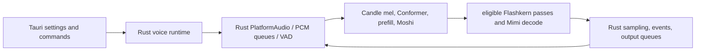
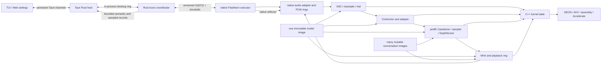
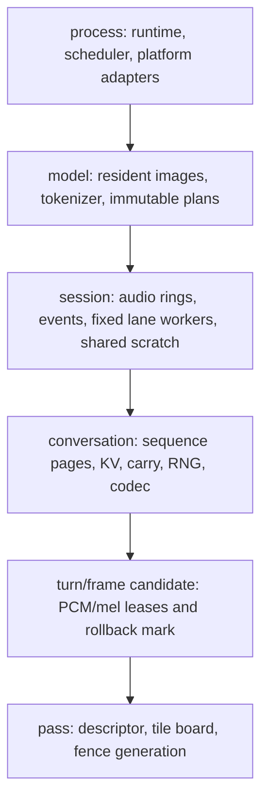
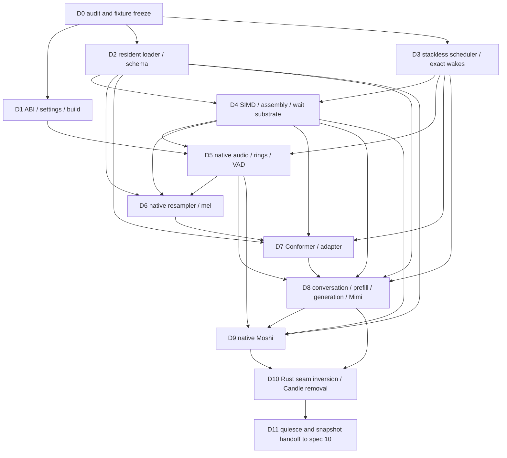

# 11 - kcoro native voice migration

Status: normative design package with committed native and Rust scheduler
substrates. Design text is not implementation evidence unless it cites an
immutable commit.

Audit ancestry: EmberHarmony `321538f11749`; `kcoro_arena` `447d04f0246b`.
Committed substrate: upstream arena `bd530f4c9196` (ticket/wait implementation
`bcdc03d1a073`), Ember vendor `8d510f83`, shared-doorbell executor `d2c43abd`,
percentile harness `3625df4e`, Rust coordinator foundation `3a5b1431`, native
SQ/CQ leaf `2a2adcea`, production bridge mount `95069bd5`, retained descriptor
pool `fa35a624`, and production Rust broker/CQ mount `4f06a3d5`.

## Mission

Move the complete local voice data plane into C++/assembly behind Flashkern's
shared-memory lane team. A dedicated Rust kcoro runtime owns conversation
coordination, promises, tickets, scope control, and broker policy. Tauri remains
a separate host for settings, commands, and sampled views. TypeScript/Bun
remains settings and command UI. Rust never loads model bytes into a Rust tensor
or executes DSP, model math, sampling, or codec math.

The realtime boundary is a persistent submission/completion ring pair with
doorbells. C++ completes a full native pass and publishes one completion; that
edge resolves the named Rust continuation, which may submit the next pass.
Realtime progress never depends on Tauri, webview IPC, polling, telemetry, or a
monitoring loop. A Rust continuation is legal on the progress path only because
the coordinator is a resident runtime kernel with dedicated workers, bounded
draining, and no allocation on publish/wake/resume.

The shipped CPU path will:

- load each model component completely into one immutable resident image;
- bind weights as validated offsets/views into that image;
- keep PCM, mel, activations, KV, convolution carry, sampler state, codec state,
  and conversation state in native-owned memory;
- move descriptors by pointer/offset while kernels mutate declared destinations;
- check stop/interrupt doorbells only between complete model passes;
- recur when a native completion resolves the registered Rust continuation;
- share one immutable model across multiple isolated mutable conversations;
- expose quiescent, relocation-clean state for the snapshot architecture in
  [spec 10](10-stateful-multi-agent-runtime.md).

CPU is the first implementation target. Backend selection is runtime policy
populated from persisted settings. MLX/Metal is a later capability behind the
same model/session ABI, not a compile-time replacement for device choice.

## Review of the Earlier Draft

The earlier draft correctly identified exact wakeups, shared atomic tile fan-out,
full-pass doorbells, and native audio ownership. It incorrectly assumed the
fixed Flashkern lane program should become movable stackless lane frames. The
fine-grained numerical team now remains a persistent fixed-worker service with
ordinary C++ stacks; Rust kcoro owns coarse orchestration, tickets, callbacks,
and recurrence around it. The earlier migration boundary also stopped too early.
Moving device callbacks and PCM rings would still have left resampling, mel,
Conformer, modality scatter, multi-token prefill, sampling, conversation
assembly, most output control, and all Moshi model work in Rust/Candle.

The audit also corrected four easy overclaims:

1. The C++ safetensors image is resident and immutable, but the current Candle
   compatibility bridge still copies 912 tensors / 2,940,616,960 bytes
   (`crates/liquid-audio/native/src/io/README.md:48-66`).
2. The current native engine owns eligible one-token backbone work, not full
   prefill, mel, Conformer, sampling, or the voice lifecycle
   (`crates/liquid-audio/src/compute/flashkern/native_engine.rs:94-170`).
3. Native Mimi decode is real, but Moshi's encoder, LM, generation state,
   Depformer, tokenizer, and frame pipeline remain Rust/Candle
   (`crates/liquid-audio/src/runtime/realtime.rs:1850-2065`).
4. Tauri already supplies runtime settings. Environment variables are not an
   acceptable product configuration or implementation selector
   (`packages/desktop/src-tauri/src/settings.rs:210-250`).

The resulting design is deliberately split by ownership boundary so a partial
port cannot be described as the finished architecture.

## Design Documents

Read these in order. Each subsystem document is normative for its boundary;
this file owns only cross-system decisions and phase order.

| Document | Owns |
|---|---|
| [00 - Current state audit](11-kcoro-native-migration/00-current-state-audit.md) | Verified production owners, copies, threads, existing strengths, and forbidden claims. |
| [01 - Runtime ABI and settings](11-kcoro-native-migration/01-runtime-abi-and-settings.md) | Opaque handles, versioned structs, capabilities, lifecycle, callbacks, statuses, and persisted configuration. |
| [02 - Model residency and loader](11-kcoro-native-migration/02-model-residency-and-loader.md) | Complete-file load, resident image, native schema binding, CPU/MLX residency, tokenizer/config, and codec components. |
| [03 - Scheduler, passes, and recurrence](11-kcoro-native-migration/03-scheduler-passes-and-recurrence.md) | Rust kcoro coordination, persistent fixed Flashkern lanes, zero-spin barriers, SQ/CQ passes, full-pass doorbells, and recurrence. |
| [04 - PCM, audio I/O, and VAD](11-kcoro-native-migration/04-pcm-audio-io-and-vad.md) | Platform adapters, sole callback copy, capture/playback rings, VAD, frame clock, flush, and reference audio. |
| [05 - Native mel frontend](11-kcoro-native-migration/05-native-mel-frontend.md) | Exact resampling, DFT/mel, normalization truth, candidate rollback, layouts, and zero-copy handoff. |
| [06 - Native Conformer and adapter](11-kcoro-native-migration/06-native-conformer-and-adapter.md) | Subsampling, relative attention, Conformer layers, adapter, stage layout, offline-first and later streaming policy. |
| [07 - Conversation, generation, and codec](11-kcoro-native-migration/07-conversation-prefill-generation-and-codec.md) | Native context pages/marks, direct modality embedding, full/suffix prefill, sampler, Depthformer, Mimi, recurrence, and snapshot hooks. |
| [08 - Native Moshi runtime](11-kcoro-native-migration/08-native-moshi-runtime.md) | Mimi encoder, multistream LM, Depformer, frame semantics, no-reset interrupt, tokenizer, load/warmup, and final Moshi Candle gate. |
| [09 - SIMD kernels and wait primitives](11-kcoro-native-migration/09-simd-kernels-and-wait-primitives.md) | C++-to-kernel call graph, house SIMD/assembly, Apple native dispatch, byte-movement law, ISA capability tables, and zero-spin wait words. |
| [10 - Rust host seam and removal](11-kcoro-native-migration/10-rust-host-seam-and-removal.md) | Rust coordination/no-math boundary, native build seam, Tauri/TypeScript seam, deletion policy, and static enforcement. |
| [11 - Verification and rollout](11-kcoro-native-migration/11-verification-and-rollout.md) | Fixture policy, numerical/race/copy/wake/audio/app gates, CI, staged rollout, rollback, and completion definition. |
| [12 - Ticketed orchestration and observability](11-kcoro-native-migration/12-ticketed-orchestration-and-observability.md) | BizTalk-like action/pass tickets, exact callbacks, Tauri snapshot/observer separation, durable readiness, and truthful visualizer updates. |
| [13 - Coordination contract](11-kcoro-native-migration/13-coordination-contract.md) | Authoritative callback-only progress rule, Rust scope tree, docking ring, microphone ownership, and park/pause/cancel semantics. |

The scheduler source-reading companion remains
[KCORO_ARENA_INTEGRATION.md](../docs/native/KCORO_ARENA_INTEGRATION.md). Current
turn behavior remains governed by
[09-responsive-voice-turns.md](09-responsive-voice-turns.md). Stateful
hibernation, deltas, branching, and WAL remain governed by
[10-stateful-multi-agent-runtime.md](10-stateful-multi-agent-runtime.md).

## Current and Target Paths

### Current

### Target

Rust resolves an explicit model path and passes it in configuration. Native
model open owns file reading, safetensors parsing, schema binding, and model
image lifetime. No model layer is streamed from disk during inference.

## Ownership Contract

| Tauri host Rust owns | Rust kcoro coordinator owns | Native runtime owns |
|---|---|---|
| persisted settings and UI validation | sessions, conversations, turns, drafts, and scope trees | complete model/component images and bound weight plans |
| Tauri command registration | exact promises, ticket tables, timers, and broker policy | fixed compute workers, stage boards, and scratch |
| opaque product handle wrappers | pause/cancel epochs and service-class admission | local audio device callbacks and PCM rings |
| panic-safe semantic/observer projection | SQ/CQ control records and descriptor leases | VAD, endpointing, and barge-in reflexes |
| app credentials/download resolution | workflow and checkpoint coordination | mel, Conformer, adapter, prefill, backbone, heads |
| remote provider/network policy | context-switch and recurrence decisions | sampler, Depthformer, Mimi, playback, context state |
| small owned UI event metadata | bounded semantic event ordering | numerical pointers, pass plans, and kernel dispatch |

TypeScript/Bun owns no native handle, PCM buffer, model state, or scheduler
policy. Rust owns no production local inference tensor or payload-bearing math
entry point. The coordinator may copy compact token IDs and control facts in
ring cells; tensors, PCM, weights, KV, mel, and state pages remain native. C++
owns the model loader, numerical pointers, pass plans, and dispatch; production
arithmetic is supplied only by the selected architecture kernel table or an
explicitly approved native Apple adapter.

## Fixed Architecture Decisions

1. **One resident model image.** Complete files are read during synchronous
   model open into stable aligned storage. CPU kernels read validated views
   directly. Backend upload, if used, happens once at open and remains resident.
2. **No inference disk traffic.** Readiness is published only after all files,
   schema checks, backend residency, page faults/warmup, and tokenizer plans are
   complete.
3. **One named hardware copy.** The ephemeral device callback buffer is copied
   once into a preallocated capture ring. After that, retained spans and
   pointer/offset descriptors cross boundaries.
4. **Mutate final destinations.** Kernels write shared scratch, conversation
   pages, cache pages, or reserved playback blocks directly. Queue hops do not
   stage payloads.
5. **Two scheduling levels and two worker policies.** Rust kcoro schedules
   movable coarse continuations, action/pass tickets, timers, and callbacks on
   dedicated Rust workers. A persistent fixed Flashkern worker team retains
   ordinary C++ stacks and fans numerical work across an atomic tile board.
   There is no channel operation per tensor op or tile and no stackless
   `LaneFrame` rewrite.
6. **Full-pass doorbells.** Stop and interrupt request an epoch change and wake
   the coordinator. An active numerical pass completes. The coordinator decides
   whether to commit/publish and whether to dispatch another pass.
7. **Callback-driven recurrence.** At a pass boundary native code publishes the
   selected token/frame facts and terminal disposition to the CQ. The exact wake
   resumes the Rust policy continuation, which may recur, switch contexts, fork,
   or stop. No Tauri or serialized IPC edge is required.
8. **Exact wake before product mount.** `kcoro_arena` remains the C conformance
   oracle and native wait-word substrate. Commit `bcdc03d1a073` proves the C
   terminal/wait behavior. Rust commit `3a5b1431` adds fixed-capacity workers,
   exact-once promises, inherited scope words, and bounded edge-woken SPSC rings.
   Flashkern commit `d2c43abd` keeps a separate shared-address fan-out for its
   fixed lane team.
9. **Zero-spin waits.** Idle, stage barriers, audio doorbells, and coordinator
   waits read once, register/recheck, and block. No bounded spin, `PAUSE`,
   `YIELD`, WFE/UMWAIT budget, or timed polling exists in the product path.
10. **Tickets are readiness truth.** Every accepted action and full pass has a
    generation-protected single-shot ticket. One CQ record after a complete pass
    distinguishes execution, model-state disposition, publication, and terminal
    cause, and may carry up to eight inline token/codebook IDs. The registered
    Rust continuation is scheduled exactly once; observer projection happens
    later and cannot make progress.
11. **Plans immutable, state isolated.** Shared model plans hold weights and
   geometry. Each conversation owns KV, short-conv, frontend/codec carry,
   cursors, PRNG, generations, and dirty ranges.
12. **Offline exact Conformer first.** Production currently encodes one unpadded
    segment with `ConformerEncoder::forward`
    (`crates/liquid-audio/src/model/conformer/encoder.rs:185-205`). Port that
    graph before optional streaming caches.
13. **Whole-segment mel truth.** Current per-bin sample normalization depends on
    every frame (`crates/liquid-audio/src/processor.rs:379-472`). Exact speculative work runs
    at a frozen pause candidate and rolls back if speech resumes; no false claim
    of permanent online normalization is allowed.
14. **Moshi remains continuous.** Frame pressure/soft interrupt may discard stale
    input/output slots but does not reset the stream, preserving tests at
    `crates/liquid-audio/src/runtime/realtime.rs:2852-3019`.
15. **Generated thought is not playback state.** A completed generated token is
    appended to conversation state even if its audio epoch is flushed. Speaker
    consumption never decides model memory.
16. **No production fallback or legacy crate.** Parity fixtures are captured
    before cutover; replaced Rust/Candle sources are deleted. Git history is the
    archive. A native failure returns a typed error.
17. **Persisted runtime configuration only.** Engine, backend, device, paths,
    lane policy, audio, VAD, sampler, seed, and trace arrive in versioned config
    structs. Build flags advertise capabilities; they do not choose the user's
    device.
18. **Delete the custom one-shot LFM2 detokenizer.** It is not on the shipped
    realtime path, which uses native Mimi. A later product need can recover its
    old design from git and requires a separately gated native port.
19. **No Rust math boundary.** Rust invokes control operations on opaque handles
    only. It never receives weights, activations, PCM, mel, KV, logits, sampler
    state, or codec planes. C++ opens model files and dispatches every numerical
    stage through a model-open-selected native kernel table.
20. **One broker per fixed board.** Session and workflow actors admit retained
    tickets to one Rust kernel broker. The broker alone publishes the next
    descriptor ID to a board, applies deadline classes and bounded recurrence
    quanta, and switches among simultaneously resident contexts only at
    full-pass boundaries.

## Memory Lifetime Stack

Teardown proceeds upward: finish/join passes, release candidates, quiesce
conversations, close session audio, release model views, then destroy runtime.
Longer-lived owners retain every borrowed region below them.

Conversation references are logical offsets/generations over aligned pages.
That allows cheap tail rollback now and copy-on-write snapshot/branching later.
Raw pointers, mutexes, callbacks, scheduler handles, and audio device handles
never enter a conversation image.

## Dependency Graph

ABI, loader, and scheduler can be developed in parallel after fixture freeze.
Numerical consumers cannot skip their upstream memory/lifecycle owner. Moshi and
LFM2 both must pass before the production Rust dependency graph is cut.

## Implementation Roadmap

### D0 - Freeze truth

- Review and accept all documents in this package.
- Re-run the source audit and update moved line citations.
- Capture current numerical fixtures, state hashes, app traces, allocations,
  copies, wake/syscall counts, and p50/p95/p99/max latency.
- Mark architecture docs as current-hybrid versus target-native.

Exit: verification gate G0 in document 11.

### D1 - ABI, settings, and build seam

- Add `lfm_voice.h`, opaque handles, versioned config/event structs, statuses,
  capability discovery, and lifecycle operations.
- Add C/C++/Rust layout and link-surface tests.
- Add the canonical native CMake targets while preserving source/build parity.
- Map persisted Tauri settings explicitly; add no environment fallback.

Exit: G1. Public Tauri command names remain unchanged.

### D2 - Resident model binding

- Keep the complete-file aligned loader and bind every required model component.
- Remove per-component name lookup/cast/repack from passes.
- Split immutable codec plans from per-conversation state.
- Establish CPU direct views; add MLX residency only behind a later capability.

Exit: G2. Bound production components report zero compatibility-copy bytes and
zero inference file I/O.

### D3 - Coordination kernel, tickets, and fixed-executor harness

- **Committed native substrate:** vendor `8d510f83` pins arena `bd530f4c9196`;
  tickets, generation-checked completion/cancel IDs, direct prepared wait
  handles, signal-one work, and build-configuration identity are present. The C
  runtime remains a conformance oracle and supplies native wait words; it is no
  longer the product policy scheduler.
- **Committed Rust foundation (`3a5b1431`):** `crates/kcoro` supplies a
  fixed-capacity dedicated executor, exact-once promises, generation-protected
  task reuse, inherited scope words, 128-byte submission/completion records, and
  edge-woken bounded SPSC rings. Its 100,000 terminal races, self-wake,
  stop-admission, wrap/full/close, and scope tests run in CI.
- **Committed bridge (`2a2adcea`, `95069bd5`, `fa35a624`):** the C ABI mirrors Rust's
  fixed records; a native-owned bounded SQ/CQ with prepared doorbells is mounted
  in Flashkern, reserves CQ capacity before admission, retains generation-checked
  descriptor leases through CQ consumption, and replaces the C arena
  ticket/callback detour.
- **Committed first Rust mount (`4f06a3d5`):** one fixed-capacity Rust broker is
  the sole SQ producer and one dedicated zero-poll ingress thread is the sole CQ
  consumer. The C++ compatibility call enters a preallocated Rust result slot
  and blocks only to keep its borrowed tensor pointers live; CQ ingress resolves
  that exact slot and wakes the broker continuation. C++ no longer calls the SQ
  submit or CQ wait leaf directly.
- Connect scope pause/cancel transitions to one root control doorbell and bounded
  continuation propagation; `3a5b1431` implements the inherited words but not
  the mounted wake subscription.
- Add service-class queues, age promotion, and measured callback-to-continuation
  budgets. `ServiceClass` is currently an ABI fact, not implemented scheduling.
- Keep the persistent fixed-worker executor on ordinary C++ stacks with no
  `LaneFrame` PCs. The mounted single-slot compatibility rim copies one bounded
  control record and no payload. Rust now owns SQ/CQ progress; the remaining
  block is the caller-lifetime guard for borrowed Candle pointers, not queue
  ownership.
- Preserve atomic tile claim boards and generation correctness while using the
  committed shared dispatch/fence words and immediate register/recheck/block.
- Move single-shot child ticket ownership into Rust, retain native pass slots by
  generation-protected descriptor ID, and make the CQ doorbell the exact
  progress-bearing Rust wake; Tauri callbacks remain observational.
- Add one kernel broker per fixed board with persisted service classes,
  consecutive-pass limits, context quantum, and age promotion.
- The stackful dispatcher, saved stacks, context-switch assembly, and duplicate
  runtime tree are already deleted in `d2c43abd` ancestry. `REQ_CALL` remains a
  transitional typed-callback boundary on ordinary fixed worker stacks; D8
  removes it after independent parity fixtures.

Exit: the mounted native substrate and first Rust endpoint owner have committed
race, parity, idle, wake-accounting, sanitizer, Rosetta, and percentile evidence.
Scope doorbells, service-class fairness, Rust-owned recurrence/child tickets,
million-pass, and full token/frame gates remain open and run again at D8 product
cutover.

### D4 - Native kernel and wait substrate

- Make the only local numerical call graph native pass descriptor -> C++ fixed
  executor -> immutable kernel table. Rust publishes descriptors and consumes
  completion facts; it never appears in a numerical stack.
- Separate production SIMD/assembly objects from test-only scalar C++ oracles.
- Bind one architecture/capability table at model open; unsupported required ISA
  fails instead of selecting Rust or scalar fallback code.
- Re-home the existing NEON kernels, add the corresponding x86_64 families, and
  gate any Accelerate stage through the same pointer/shape pass contract.
- Implement and measure zero-spin shared dispatch/fence generation words and
  audio doorbells, with separate logical pass/stage identity and unchanged
  full-pass interrupt semantics.

Exit: G4. Kernel parity, release link-map, no-Rust-math, wait latency, and
measured bandwidth gates pass.

### D5 - Native audio and VAD

- Add platform audio capability adapters, capture/playback blocks, span leases,
  output epochs, reference state, and exact wake edges.
- Port turn VAD and Moshi frame assembly without payload vectors.
- Preserve AEC/echo behavior through an actual app gate before removing the
  current local WebRTC loopback.

Exit: G5. The callback copy is the sole PCM payload copy.

### D6 - Native mel frontend

- Port exact windowed-sinc behavior, DFT basis, Slaney filterbank, log guard,
  sample-standard-deviation normalization, mask, and padding.
- First process committed segments exactly; then mount pause-candidate rollback.

Exit: the frontend portion of G6.

### D7 - Native Conformer and adapter

- Port production `dw_striding`, relative-position layers, output projection,
  and exact-GELU adapter as shared-memory stages.
- Write adapter rows directly into assigned prefill positions.
- Defer cache-aware streaming until the offline segment graph is fully proven.

Exit: the model-frontend portion of G6.

### D8 - Native conversation, callback-driven LFM2, and executor cutover

- Add paged sequence/cache state and generation-protected tail marks.
- Replace `Tensor::cat`, combined modality tensors, and index-select with direct
  append/direct embedding writes.
- Add native multi-token full/suffix prefill, sampler, modality recurrence, and
  Depthformer.
- Split native Mimi plans/state and decode into playback reservations.
- Expose quiesce, context switch, and dirty-region hooks.
- Port the final production Rust lane callbacks to typed native passes, capture
  independent parity fixtures, then delete `REQ_CALL` and its Rust trampolines.
- **Implemented substrate (`d2c43abd`):** shared expected-value words now own
  command/fence blocking, and the fixed executor is the sole Flashkern lane
  owner. The committed G0/G3 report is under `docs/native/baselines/`.
- **Implemented deletion (`d2c43abd` ancestry):** the stackful dispatcher, 512
  KiB saved lane stacks, context-switch assembly, and old kcoro source tree are
  gone.
- **Implemented bridge cutover (`2a2adcea`, `95069bd5`, `fa35a624`):** final-lane
  completion now enters the native CQ, and the C arena runtime/ticket/callback
  path is absent from the production engine archive. Descriptor leases survive
  through CQ consumption.
- **Implemented endpoint ownership (`4f06a3d5`):** the Rust broker submits SQ
  cells and dedicated Rust ingress consumes CQ cells and wakes the exact
  continuation. Callback-driven recurrence, scope control, and owned native
  pass slots remain before the borrowed-pointer compatibility handback can be
  deleted. Git history is the only fallback.

Exit: G3, G7, and G8 run on the mounted product path. An entire multiturn LFM2
reply runs without Tauri/webview participation and with no host polling; release
symbols contain no `REQ_CALL` or stackful kcoro context-switch surface.

### D9 - Native Moshi

- Port Mimi encoder, multistream LM, text sampler, Depformer, tokenizer, and
  frame orchestration for the currently supported plain Moshiko subset.
- Preserve first-frame reset, full-duplex frame clock, pressure behavior, and
  soft-output interrupt without stream reset.

Exit: G9. This is mandatory because Moshi is the current default.

### D10 - Invert the production seam

- Make `crates/liquid-audio` the thin production native wrapper.
- Delete replaced Candle/Moshi/model/runtime sources after their fixtures and
  native gates pass; do not move them into a backup crate.
- Replace local Tauri session fields with opaque native handles.
- Add independent reliable semantic and lossy/coalesced kernel observer bridges,
  `voice_kernel_status`/observe commands, and the truthful native activity meter
  specified in document 12.
- Remove local Rust workers/audio loops and the production Candle dependency
  graph.
- Rewrite source-string architecture tests as behavior/ABI/integration gates.

Exit: G10. Release artifacts contain no alternate inference path and no
test-oracle object code.

### D11 - Stateful-runtime handoff

- Alternate multiple hot conversations over one model.
- Prove exact in-memory quiesce/capture/restore and relocation-clean regions.
- Hand the state inventory to spec 10 for base/delta images, WAL association,
  hibernation, copy-on-write branches, and multi-agent orchestration.
- Represent checkpoint accepted and durable publication as separate tickets;
  never use kcoro's current append-only full-snapshot store for long-running
  conversation images.

Exit: G11. Disk durability is not part of this migration gate.

## Deletion Rule

Nothing is deleted because its replacement exists in isolation. Delete an old
owner only after the new owner passes its stage parity, lifecycle, allocation,
copy, latency, dependency, and real-app gates.

The final production deletion set includes:

- Rust `VoiceRuntime`, turn/frame pipelines, VAD/frame loops, PCM consumers, and
  local output workers;
- Candle `ChatState`, conversation tensor snapshots, mel, Conformer, adapter,
  full/suffix prefill, sampler, and generation control;
- Rust Moshi/Mimi model ownership and per-frame Tensor/vector plumbing;
- Candle bridge and `candle-flashfftconv` production use;
- local Tauri `build_engine`, Candle `select_device`, and local model thread
  ownership;
- direct desktop Candle/Moshi/CPAL/Rayon/crossbeam inference dependencies.

Replaced code is deleted. Git history, not a copied tree or Cargo feature, is
the archive.

## Claim Ledger

Until the corresponding gate passes, project documentation must use these
phrases precisely:

| Claim | Allowed when |
|---|---|
| “resident native checkpoint image” | current loader image is being described, with compatibility-copy debt stated |
| “native one-token Flashkern pass” | current eligible pass only |
| “native Mimi decoder” | decoder arithmetic only |
| “native voice data plane” | G8 for LFM2 and G9 for Moshi |
| “zero-copy inference handoff” | G5-G9 copy instrumentation passes; the one hardware callback copy is named |
| “Candle-free production” | G10 dependency/symbol/source audit passes |
| “Rust-free numerical path” | G4 call-stack, ABI, source, and release link-map audits pass |
| “one model, many conversations” | G11 isolation/switch test passes |
| “hibernation/durable state” | the later spec 10 durability gates pass |
| “zero-spin native executor” | G3 source/disassembly, idle CPU, barrier, and wake-count gates pass |
| “ticketed orchestration” | G3 exact callback, retained-pointer reuse, generation-checked ID lookup, and descriptor-lease gates pass |
| “kernel-aware visualizer” | G10 observer-isolation and real-signal UI gates in document 12 pass |

## Design Review Checklist

Before implementation begins, reviewers should be able to answer yes to each:

- Does every current owner have one target owner and deletion gate?
- Are settings runtime data rather than environment or Cargo device policy?
- Is every payload lifetime longer than every descriptor borrowing it?
- Is the hardware callback copy the only accepted PCM payload copy?
- Does each hot stage have a preallocated destination and declared layout?
- Does Rust expose only control/config/event operations while C++ owns model
  loading, numerical pointers, pass dispatch, and all kernel invocation?
- Are scalar C++ oracles test-only objects absent from the release link map?
- Are kcoro macro scheduling and Flashkern micro fan-out kept distinct?
- Are fixed compute lanes stable workers with ordinary C++ stacks rather than
  movable stackless continuations?
- Does one kernel broker own each board and serialize many actors into one
  pointer-only command handoff with explicit fairness/deadline policy?
- Does every wait register/recheck/block immediately with no spin tier?
- Does every accepted pass own one single-shot ticket and publish one native
  callback before any Tauri projection?
- Is the pass descriptor retained by pointer rather than copied through
  `KORO_SEND` or a waiter buffer?
- Is interrupt/stop checked at a named complete pass boundary?
- Does each native CQ edge resolve one named Rust continuation without Tauri,
  serialized IPC, polling, or observer participation?
- Are model plans immutable and conversation states isolated?
- Can speculative work roll back by watermarks/pages rather than full cache copy?
- Does Moshi preserve stream state on soft output interrupt?
- Are replaced Rust/Candle sources deleted rather than retained as a backup?
- Do tests execute integration binaries and the actual Tauri path?
- Are tail latency, wakes, allocations, copies, page faults, and disk I/O measured?
- Does snapshot readiness exclude raw addresses and scheduler/platform objects?
- Are checkpoint acceptance and durable publication distinct, with bounded A/B
  base/delta storage outside the realtime executors?
- Can the Tauri observer disappear, overflow, or panic without changing native
  recurrence or session lifetime?

## Non-Goals

- No per-operation cancellation polling.
- No channel message per numerical tile.
- No stackless lane-frame rewrite of the fixed numerical team.
- No spin, monitor-wait budget, or timed poll before a blocking wait.
- No Tauri event or UI acknowledgement in the ticket completion chain.
- No layer streaming from disk.
- No automatic CPU/Metal/Candle fallback.
- No permanent streaming-mel parity claim under whole-utterance normalization.
- No unsupported conditioned/LoRA/CFG Moshi expansion during the migration.
- No durable disk snapshot/WAL work in audio or model passes.
- No rewrite of unrelated remote networking solely to remove Rust from local
  inference.
