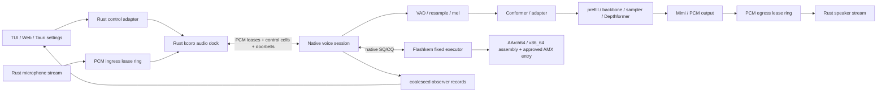

# 11 - kcoro native voice migration

Status: normative architecture and execution plan. Implementation claims below
name either an immutable commit or the current working tree. A design statement
without evidence is a target, not a shipped capability.

Audit ancestry: EmberHarmony `321538f11749`; current base `34f2437f`;
`kcoro_arena` `bd530f4c9196` with ticket/wait repair `bcdc03d1a073`.

## Mission

The local voice product is one resident native model/session runtime with an
asynchronous audio dock:

- Rust owns audio streams entering and leaving the process, explicit settings,
  opaque native handles, and Tauri event projection.
- Native C++ owns model/session lifetime, conversation state, pass recurrence,
  tickets, queues, lanes, barriers, scratch, and buffer leases.
- Architecture assembly owns every production numerical operation.
- Tauri and TypeScript own user intent, settings, commands, and sampled views.

Rust does not own tensors, tokens, logits, sampling, prompt assembly, model
passes, mel, Conformer, Depthformer, Mimi, KV, or numerical progress. C++ does
not evaluate model arithmetic. Tauri is never required for realtime progress.

The CPU backend is Flashkern. It is CPU-only. A future MLX C++/Metal backend is
a peer behind the same session contract, not code inside Flashkern.

## Non-Negotiable Contract

1. **All inference math is assembly.** C++ routes typed operands to an
   architecture symbol and controls stages. Rust never calls a numerical leaf.
2. **Rust owns audio I/O only.** PCM buffers cross the dock by retained lease;
   compact control records may cross inline. No token or model-pass API is a
   production Rust surface.
3. **Callbacks are the only cause of forward progress.** A producer publishes a
   cell, release-rings a doorbell, and resolves a registered continuation. There
   is no polling, monitor loop, bounded spin, or UI wake in the progress path.
4. **The model recurs natively.** A pass completion can schedule the next native
   pass without crossing Rust. Rust learns only audio-buffer, lifecycle, and
   observational facts.
5. **Payloads stay put.** Weights, PCM, activations, KV, sampler state, and
   conversation pages do not ride queue cells. Rings carry IDs, epochs, offsets,
   lengths, causes, and lease generations.
6. **One immutable model, many mutable conversations.** Model bytes are loaded
   once. Each conversation owns isolated state and can be parked, resumed,
   branched, or switched at a legal pass boundary.
7. **No legacy runtime.** Once a replacement gate passes, delete the replaced
   Candle/Rust owner. Git history is the archive.

## Current Implementation Truth

The current working-tree tranche is not an immutable release claim, but its
source and tests establish the direction:

| Boundary | Current evidence | Remaining work |
|---|---|---|
| Native model image | `native/src/io/safetensors.cpp` owns aligned resident bytes; `native/src/model/lfm_model.cpp` binds backbone and Depthformer views. | Bind tokenizer, frontend, Conformer, codec, and every remaining component without Candle copies. |
| Internal command ring | `flashkern_engine.cpp:1894-1951` consumes retained descriptors on the native dispatcher. | Replace the one borrowed request slot with a bounded native pass-slot pool for overlapped conversations. |
| Native completion wait | `submit_pass` at `flashkern_engine.cpp:1954-2003` submits and waits on the native SQ/CQ directly. The Rust submitter callback ABI and `coordinator.rs` are deleted. | Move recurrence from blocking helper calls into a native session state machine. |
| Fixed compute lanes | `lfm_engine_new` at `flashkern_engine.cpp:2013-2050` creates prepared wait words, one dispatcher, and stable lane threads. | Add startup readiness, affinity/QoS policy, service classes, and multi-board admission. |
| Assembly math leaves | `native/kernels/{aarch64,x86_64}/flashkern_math.S` owns RMS scaling, reductions, bias addition, and BF16 NeoX rotary; PRNG and RoPE table assembly are adjacent. | Extract every remaining value-producing C++ loop and every temporary Rust/Candle numerical owner. |
| Rust rim | `native_engine.rs:446-462` now constructs only an opaque native engine plus a temporary serialization lock; no Rust pass broker remains. | Replace the temporary model/token rim with PCM ingress/egress and control leases only. |
| Dead Rust math | `fanout.rs`, the Rust coordinator, and the Rust DD arithmetic body are deleted in the current tranche. | Delete CustomOps, Candle tensors, token recurrence, model modules, and temporary math FFI wrappers after native session gates. |

The source-backed assembly ABI test
`scalar_assembly_math_abi_is_bit_exact_without_simd_feature_gates` executes on
native AArch64 and under Rosetta x86_64 even when AVX2 is unavailable. The
standalone C++23 kcoro contracts prove exact continuation migration, fixed-team
quorum, zero-idle-CPU workers, admission, leases, and typed mailbox retirement.
The native speech gate drives the real checkpoint through that mailbox without
a Rust runtime and requires exact terminal settlement.

## Flow

The two rings have different ownership:

- The **inner native SQ/CQ** carries model-pass descriptors and completions. It
  never crosses Rust and may drive immediate native recurrence.
- The **outer docking rings** carry retained PCM leases and control facts between
  Rust audio streams and the native session. A dock wake can make audio progress,
  but it cannot select a token or run model math.
- The **observer stream** is lossy and sampled. It can never make computation or
  audio progress.

## Ownership

| Rust audio/host layer | Native C++ session | Assembly kernel layer |
|---|---|---|
| input/output stream callbacks | runtime, model, conversation, session handles | BF16/f32 conversion and reductions |
| PCM lease creation/release | native SQ/CQ and pass-slot ownership | GEMM/GEMV and AMX call leaf |
| mic enabled, stop, interrupt, settings cells | tokenizer, prompt and modality assembly | convolution, FFT, mel, attention |
| opaque RAII wrappers | VAD, endpointing, recurrence, sampler policy | norms, activation, residual, RoPE |
| Tauri semantic/observer projection | frontend, Conformer, backbone, Depthformer, Mimi | codec and quantizer numerics |
| remote provider networking | context pages, snapshots, branching, scheduling | architecture feature dispatch |

Compact PCM/control records are allowed to copy inline when copying is cheaper
than manufacturing pointer ownership. Numerical payloads remain in retained
buffers. This is the byte-movement law, not a ceremonial ban on every `memcpy`.

## Design Documents

Read these in order. This file owns cross-system boundaries and phase order;
the subsystem file owns its detailed ABI and gates.

| Document | Boundary |
|---|---|
| [00 - Current state audit](11-kcoro-native-migration/00-current-state-audit.md) | Verified owners and migration gaps. |
| [01 - Runtime ABI and settings](11-kcoro-native-migration/01-runtime-abi-and-settings.md) | Opaque handles, versioned records, lifecycle, settings. |
| [02 - Model residency and loader](11-kcoro-native-migration/02-model-residency-and-loader.md) | Complete-file native loading and bound views. |
| [03 - Scheduler and recurrence](11-kcoro-native-migration/03-scheduler-passes-and-recurrence.md) | Native inner SQ/CQ, fixed lanes, tickets, recurrence. |
| [04 - PCM, audio I/O, and VAD](11-kcoro-native-migration/04-pcm-audio-io-and-vad.md) | Rust stream dock, PCM leases, native VAD and endpointing. |
| [05 - Native mel frontend](11-kcoro-native-migration/05-native-mel-frontend.md) | Resample, FFT, mel, normalization. |
| [06 - Native Conformer and adapter](11-kcoro-native-migration/06-native-conformer-and-adapter.md) | Conformer and adapter plans. |
| [07 - Conversation, generation, and codec](11-kcoro-native-migration/07-conversation-prefill-generation-and-codec.md) | Native context, prefill, sampling, Depthformer, Mimi. |
| [08 - Native Moshi runtime](11-kcoro-native-migration/08-native-moshi-runtime.md) | Continuous Moshi frame session. |
| [09 - SIMD and wait primitives](11-kcoro-native-migration/09-simd-kernels-and-wait-primitives.md) | Assembly ABI, byte movement, zero-spin waits. |
| [10 - Rust host seam and removal](11-kcoro-native-migration/10-rust-host-seam-and-removal.md) | PCM-only Rust boundary and Candle deletion. |
| [11 - Verification and rollout](11-kcoro-native-migration/11-verification-and-rollout.md) | Numerical, race, latency, copy, and product gates. |
| [12 - Tickets and observability](11-kcoro-native-migration/12-ticketed-orchestration-and-observability.md) | Action truth, callbacks, snapshots, visualizer. |
| [13 - Coordination contract](11-kcoro-native-migration/13-coordination-contract.md) | Callback-only progress and scope semantics. |

State hibernation, deltas, branching, and durable facts remain governed by
[spec 10](10-stateful-multi-agent-runtime.md). Responsive interruption remains
governed by [spec 09](09-responsive-voice-turns.md), as narrowed by the native
pass-boundary rule here.

## Execution Order

### N0 - Freeze truth and remove obsolete owners

- Keep independent fixtures and baseline hashes in data, not executable legacy
  modules.
- Delete dead Rust dispatch/math as soon as native gates pass.
- Keep this documentation aligned with source after every ownership cut.

Gate: `git diff --check`, source audit, native and Rosetta smoke.

### N1 - Complete native model binding

- Bind all model, tokenizer, frontend, Conformer, Depthformer, Mimi, and Moshi
  component views from the resident safetensors image.
- Preallocate and prepack every plan-owned scratch/panel before readiness.
- Reject missing or mixed geometry before a pass can publish.

Gate: zero inference file I/O, zero compatibility tensor copies, exact model
fingerprint, all plans ready before session start.

### N2 - Finish assembly ownership

- Extract every value-producing expression from engine/model C++ into typed
  AArch64 and x86_64 assembly symbols.
- Keep AMX/Accelerate behind a narrow architecture leaf; C++ does not prepare
  numerical values inside a pass.
- Remove scalar production fallbacks. Scalar oracles are test-only binaries.

Gate: static source audit, symbol/link map, per-leaf fixtures, AArch64 and
Rosetta execution, no allocation after plan publish.

### N3 - Native conversation and recurrence

- Replace the single borrowed request slot with generation-protected native pass
  slots and descriptor leases.
- Implement tokenizer, prefill, token/frame recurrence, sampling, context marks,
  and native conversation switching inside the session state machine.
- Schedule another pass directly from a native completion when ready work exists.

Gate: 1,000-token run with zero Rust model/token callbacks; interrupt and stop
at full-pass boundaries; two conversations alternate over one model image.

### N4 - Rust audio dock

- Port the general-purpose Rust kcoro executor for stream and host work.
- Add bounded PCM ingress/egress lease rings and one control ring.
- Register exact promise continuations for space/data/terminal edges. No polling
  or serialized IPC participates in audio progress.
- Preserve global pause/cancel scope control over all dock children.

Gate: capture and playback continue while unrelated dock tasks park; stopping a
root scope wakes every child exactly once; no PCM payload copy after the sole
device-callback ingress copy.

### N5 - Frontend, model, and codec cutover

- Wire native VAD/resample/mel -> Conformer/adapter -> model recurrence ->
  Depthformer/Mimi -> PCM egress.
- Port Moshi continuous frame flow under the same session contract.
- Preserve predictive listening as candidate epochs and native terminal
  arbitration, not a second scheduler.

Gate: full turn and continuous-frame audio fixtures, barge-in, no-reset Moshi,
state continuity, latency and wake budgets.

### N6 - Delete Candle and Rust inference

- Delete Rust model tensors, CustomOps, token APIs, samplers, recurrence workers,
  mel/Conformer/Mimi owners, and Candle dependencies.
- Reduce `liquid-audio` Rust production code to PCM stream docking, opaque
  lifecycle/config wrappers, and event projection.

Gate: production dependency/link graph contains no Candle/moshi inference
framework and no Rust numerical FFI. Removed APIs have no fallback feature.

### N7 - Multiconversation, snapshots, and product hardening

- Add fair service classes, conversation quanta, branching, quiescent snapshots,
  delta pages, and lazy durable writing off realtime workers.
- Add million-pass, restart, fault, allocation, copy, idle CPU, and p99 gates.
- Update Tauri visualizer from sampled native ticket/audio snapshots.

Gate: one immutable model serves multiple isolated conversations without weight
duplication or host involvement in native recurrence.

## Completion Definition

The migration is complete only when all of these are true:

- Rust production code contains no tensor, token, logit, model pass, sampler,
  DSP, model, or codec math.
- C++ engine/model/session code contains no production numerical loop or
  floating-point formula; it calls architecture assembly leaves.
- Every local model component loads from one native resident image and remains
  resident for the model lifetime.
- Native inference can progress from one pass to the next while Rust and Tauri
  are descheduled.
- Rust audio streams exchange only retained PCM leases and compact controls with
  the native session through callback-driven rings.
- Stop, interrupt, close, cancellation, timeout, and completion settle each
  accepted ticket and buffer lease exactly once.
- AArch64, x86_64, Rosetta local, sanitizer/race, allocation, copy, idle, and
  latency gates are green.
- Documentation, exported ABI, and product behavior tell this same story.
