# Current State Audit

Status: audited migration baseline with committed scheduler-substrate deltas
recorded through 2026-07-14.

Audited against EmberHarmony commit `321538f11749` and `kcoro_arena` commit
`447d04f0246b`. Scheduler deltas are pinned to upstream `bd530f4c9196`, Ember
vendor `8d510f83`, executor `d2c43abd`, harness `3625df4e`, native bridge
`2a2adcea`, production bridge mount `95069bd5`, retained descriptors
`fa35a624`, and Rust endpoint mount `4f06a3d5`. Line references in this design
point to the named revision for the claim. When a referenced
implementation file moves, the change that moves it must update the
corresponding citation here.

## Claims Policy

`Implemented`, `closed`, `production-tested`, and equivalent status words are
allowed only when the same paragraph cites an immutable commit hash and names
the gate that was run. A working-tree change is called `uncommitted` or
`prototype`; passing design review does not promote it. A baseline citation
describes the audited old behavior, not current implementation. If later code
changes invalidate a line citation or measurement, update the claim and evidence
in the same commit. Git history is the archive; do not retain duplicate source
trees to make an old claim easier to reproduce.

## Purpose

This document says exactly what owns the production voice path and records
completed substrate changes as the native migration advances. It exists to
prevent partial ports from being described as a native pipeline while Rust or
Candle still owns a hidden stage.

The current implementation is a hybrid:

- Tauri settings correctly choose the model, mode, and device at runtime.
- C++ owns an immutable safetensors image and several fused CPU kernels.
- C++/assembly runs eligible one-token backbone and native Mimi decode work.
- Eligible Flashkern passes traverse the mounted Rust SQ broker and CQ ingress,
  but the outer call remains synchronous to retain borrowed Candle buffers.
- Rust still owns audio I/O, VAD, queues, utterance materialization, mel,
  Conformer, conversation assembly, generation control, sampling, and Moshi.
- Candle still owns nearly all model tensor objects and all paths not explicitly
  served by Flashkern.

## Current Production Path

```mermaid
flowchart LR
    UI["Tauri settings and commands"] --> HOST["Rust VoiceRuntime"]
    HOST --> IO["Rust PlatformAudio / CPAL"]
    IO --> RING["Rust PcmRing"]
    RING --> VAD["Rust VAD and utterance Vec"]
    VAD --> TENSOR["Candle PCM tensor"]
    TENSOR --> MEL["Rust/Candle resample and mel"]
    MEL --> CONF["Rust/Candle Conformer and adapter"]
    CONF --> MODEL["Rust/Candle prefill and generation"]
    MODEL --> RIM["blocking native-engine rim"]
    RIM --> CPP["C++ single request slot"]
    CPP -->|"registered callback"| KCORO["Rust result slot and SQ broker"]
    KCORO -->|"SQ doorbell"| FK["C++ Flashkern fixed lanes"]
    FK -->|"CQ doorbell"| INGRESS["dedicated Rust CQ ingress"]
    INGRESS -->|"resolve slot and broker edge"| CPP
    CPP -->|"return logits/status"| GEN["Rust sampler and generation loop"]
    GEN --> MODEL
    GEN --> MIMI["Native Mimi decode through Rust adapter"]
    MIMI --> OUT["Rust output queue and audio device"]
```



## Ownership Map

| Area | Current owner and evidence | Migration consequence |
|---|---|---|
| Product settings | `Lfm2Device`, `LocalVoiceEngine`, and `Lfm2Settings` are defined in `packages/desktop/src-tauri/src/settings.rs:60-250`; `local_runtime_config`, `build_engine`, and `select_device` consume them in `packages/desktop/src-tauri/src/voice/runtime.rs:2712-2829`. | Keep persisted settings as the only product source of truth. Device selection remains runtime policy. |
| Top-level local session | `Lfm2Session::spawn` creates local WebRTC input/output and a `voice-session` thread in `packages/desktop/src-tauri/src/voice/runtime.rs:2312-2369`. | Replace the session body with one opaque native session handle. |
| Rust runtime lifecycle | `VoiceRuntime` owns stop flags and a join handle at `crates/liquid-audio/src/runtime/voice_runtime.rs:637-802`; `session_loop` builds pipelines at `821-1038`. | Delete this lifecycle after the C ABI owns start, interrupt, stop, join, and destroy. |
| PCM queues | `PcmRing` is an SPSC sample ring with a Crossbeam wake channel at `crates/liquid-audio/src/runtime/voice_runtime.rs:163-282`. | Preserve the SPSC shape, but move storage, indices, and wake ownership into native session memory. |
| Local device callbacks | CPAL input copies/converts samples at `crates/liquid-audio/src/runtime/voice_runtime.rs:1820-1870`; CPAL output drains the ring at `1877-2000`. The desktop path instead builds Rust WebRTC/PlatformAudio loopbacks at `packages/desktop/src-tauri/src/voice/runtime.rs:2965-3419`. | A native platform adapter owns callbacks. The callback may perform the one required device-buffer-to-ring copy and nothing else. |
| Turn VAD | `vad_loop` owns accumulation, pause detection, speculative prepare, utterance slicing, and submission in `crates/liquid-audio/src/runtime/voice_runtime.rs:1344-1596`. | Port endpointing and barge-in state into the native session state machine. |
| Frame input | `frame_loop` allocates/resamples frame vectors and submits them to a Rust worker at `crates/liquid-audio/src/runtime/voice_runtime.rs:1599-1775`. | Frames become retained spans in the capture ring; no `Vec<f32>` crosses a queue. |
| Turn/frame workers | `RealtimePipeline::spawn` and `RealtimeFramePipeline::spawn` create dedicated Rust inference workers in `crates/liquid-audio/src/runtime/realtime.rs:488-920`. | Replace both with native continuations over one runtime. Preserve the different interrupt semantics. |
| Committed utterance | `Utterance` stores `Vec<f32>` at `crates/liquid-audio/src/runtime/realtime.rs:146-153`; `vad_loop` creates copies at `voice_runtime.rs:1511` and `1542-1556`. | A committed utterance is a ring span descriptor plus an epoch, never a payload owner. |
| Resampling and mel | `ChatState::add_audio` calls the Rust resampler at `crates/liquid-audio/src/processor.rs:1089-1163`; `FilterbankFeatures::forward` implements the Candle mel path at `crates/liquid-audio/src/processor.rs:311-472`. | Port as a fixed native plan writing directly into a session mel plane. |
| Conformer | `LFM2AudioModel` stores `ConformerEncoder` and `audio_adapter` at `crates/liquid-audio/src/model/lfm2_audio.rs:292-330`; construction is at `391-425`; production prefill calls them at `758-917` and `1172-1305`. | Bind weights once and execute both stages through native passes. |
| Conversation state | Five Candle tensors are held by `ConversationState` at `crates/liquid-audio/src/runtime/realtime.rs:940-1021`; `Lfm2VoiceEngine` also owns cache, pending prepare, and vault state at `1053-1185`. | Replace tensor cloning/cat with one generation-protected native conversation arena. |
| Full and suffix prefill | `prefill_suffix` builds vectors, tensors, concatenations, and scatter indices at `crates/liquid-audio/src/model/lfm2_audio.rs:749-918`; `prefill_inputs` repeats full-context assembly at `1172-1305`. | Port direct modality dispatch into preallocated embedding planes. |
| Generation and sampling | `Sampler` wraps Candle `LogitsProcessor` at `crates/liquid-audio/src/model/lfm2_audio.rs:199-262`; `generate_with_cache` owns recurrence at `1630-1733`. | Sampling/RNG/state append move into native passes. Compact result IDs wake the resident Rust coordinator per declared pass; Tauri and numerical payloads do not cross that edge. |
| Backbone fast path | `lfm_engine_token_pass` is a real fused native pass at `crates/liquid-audio/native/src/engine/flashkern_engine.cpp:1616-1680`; Rust calls it through `crates/liquid-audio/src/compute/flashkern/native_engine.rs:420-465` and the retained-context guard at `706-725`. | Extend this owner outward; do not wrap it in more Rust queues. |
| Scheduler | At `4f06a3d5`, the live engine owns stable pthread lanes, one mechanical SQ dispatcher, one shared dispatch word, one shared fence word, and one native-owned one-slot SQ/CQ at `flashkern_engine.cpp:321-399`. `bridge_main` validates the retained descriptor generation and rings the lanes at `1106-1140`; lane 0 publishes one completion at `1043-1084`. `submit_pass` at `1142-1190` creates a descriptor and invokes the registered Rust submitter; it no longer calls SQ submit or CQ wait. The compatibility caller remains blocked inside that callback so its borrowed request pointers stay live. | Keep ordinary nested C++ lane programs and the native ring leaf. Replace borrowed request storage with owned native pass slots before deleting the blocking compatibility call; do not introduce movable lane frames. |
| Rust coordinator mount | `crates/kcoro` at `3a5b1431` supplies fixed-capacity workers, exact promises, inherited scope words, bounded SPSC rings, and 128-byte records. Retained descriptors landed at `fa35a624`. At `4f06a3d5`, `coordinator.rs:304-431` gives one Rust broker sole SQ ownership and one dedicated ingress thread sole CQ ownership; `native_engine.rs:259-305` registers it and `802-826` clears, stops, and joins it before native destruction. | The first production endpoint owner is connected and zero-poll. Service-class arbitration, scope-change wake propagation, Rust-owned child recurrence, QoS, and removal of the borrowed-pointer block remain open. |
| Mimi output | C++ already owns streaming Mimi decode through `mimi_decoder_step` in `crates/liquid-audio/native/src/mimi/mimi_decode.cpp:776-911`; the Rust adapter allocates output `Vec<f32>` at `crates/liquid-audio/src/mimi_native.rs:92-109`. | Keep the decoder, change it to write into a reserved playback span, and remove the vector adapter. |
| Moshi | `RealtimeMoshi` owns Candle Mimi, the Moshi LM, multistream state, and samplers at `crates/liquid-audio/src/runtime/realtime.rs:1850-1921`; each PCM frame is copied into a Candle tensor at `1954-2026`. | Moshi must be ported to the same native model/session contract before Candle can leave production. |

## Weight Residency Truth

The native loader is real and should be retained:

- `lfm_weights_open` and `lfm_weights_open_files` are declared at
  `crates/liquid-audio/native/include/lfm_safetensors.h:70-82`.
- `load` allocates one aligned image, reads every selected shard into its final
  location, and parses views at
  `crates/liquid-audio/native/src/io/safetensors.cpp:480-519`.
- `fill_view` exposes stable base-relative payload views at
  `crates/liquid-audio/native/src/io/safetensors.cpp:522-536`.
- no disk work occurs after `lfm_weights_open` returns.

The remaining problem is the compatibility bridge. `ResidentWeights` exposes a
`candle_builder`, and `CandleBridge::load` materializes copied tensors at
`crates/liquid-audio/src/compute/weights.rs:449-536`. The checked-in measurement
at `crates/liquid-audio/native/src/io/README.md:48-66` is 912 copied tensors and
2,940,616,960 copied bytes for the current 1.5B checkpoint. Native residency is
therefore the source image, not yet the production compute representation.

## Current Copy and Allocation Boundaries

These are the payload movements that must disappear from the local production
path:

1. The audio callback writes one sample at a time into `PcmRing`
   (`voice_runtime.rs:1842-1855`). The device-to-ring copy is unavoidable, but
   its scalar API is not.
2. `PcmRing::drain_into` appends samples into Rust vectors
   (`voice_runtime.rs:254-260`).
3. VAD slices a new utterance vector (`voice_runtime.rs:1511`, `1542-1556`).
4. Frame mode performs `split_off`, `to_vec`, `drain`, and resampler vector
   returns (`voice_runtime.rs:1663-1686`, `1743-1773`).
5. Moshi copies a PCM slice into `Tensor::from_vec(pcm.to_vec())`
   (`crates/liquid-audio/src/runtime/realtime.rs:1954-1963`).
6. Mel and prefill repeatedly use `Tensor::cat`, host `Vec`, and index tensors
   (`crates/liquid-audio/src/processor.rs:344-397`, `lfm2_audio.rs:758-917`).
7. Generated audio is copied from native PCM to a Rust vector, to a CPU Candle
   tensor, back to a Rust vector, then into a speaker ring
   (`runtime/audio_out.rs:98-156`, `runtime/realtime.rs:1605-1621`).
8. External output drains each ring into a newly allocated vector in
   `PcmRing::drain_all` (`voice_runtime.rs:263-276`).

The target copy budget is defined in the subsystem documents. "Zero copy" does
not mean a hardware callback can lend an ephemeral device buffer forever. It
means that after the one bounded callback copy into owned ring storage, every
handoff is a pointer/offset descriptor and every kernel writes its declared
destination in place.

## Current Thread and Wake Boundaries

The local path currently composes several independent thread systems:

- Tauri `ThreadManager` (`packages/desktop/src-tauri/src/voice/threads.rs:13-92`).
- a top-level `voice-session` (`voice/runtime.rs:2312-2369`).
- turn or frame inference worker (`runtime/realtime.rs:491-922`).
- event consumer and optional output worker (`voice_runtime.rs:1040-1343`).
- WebRTC microphone and media workers (`voice/runtime.rs:2965-3419`).
- Flashkern's fixed pthread lane team and one mechanical SQ dispatcher
  (`flashkern_engine.cpp:1041-1248`).
- one dedicated Rust kcoro broker worker and one blocking CQ ingress owner
  (`coordinator.rs:343-431`, constructed at `463-535`).
- The C arena coordination worker, former
  stackful dispatcher, and saved lane stacks have been deleted from the product
  pass path.

This is why a fast kernel can still stutter: the complete frame/turn crosses
several allocators, queues, condition variables, and ownership domains before
and after the numerical pass.

## What Is Already Correct

The migration must preserve these existing decisions:

- Product settings, not `LFM_*` environment variables, determine engine and
  device. `Lfm2Settings` explicitly documents this at
  `packages/desktop/src-tauri/src/settings.rs:210-250`.
- Native safetensors bytes are immutable and bit exact.
- Flashkern tile fan-out uses a shared atomic claim counter, not one channel
  message per tile (`flashkern_engine.cpp:119-128`, `670-684`).
- At executor commit `d2c43abd`, the generation fence closes the declared-park
  lost-wake race with a precise logical park mask and one prepared shared fence
  handle (`flashkern_engine.cpp:134-138`, `634-662`). At bridge mount
  `95069bd5`, dispatch uses the prepared SQ doorbell at `bridge_main:1106-1140`
  and the lane word at `1041-1081`. `FENCE_SPIN`, stackful
  park/unpark, and the process-global wait registry are gone. G0/G3 percentile
  evidence is pinned under `docs/native/baselines/`; barrier economy remains the
  next measured optimization.
- At `4f06a3d5`, production pass progress crosses only registered edges: the
  C++ callback admits a preallocated slot, the Rust ring wakes its broker, the
  native CQ doorbell wakes dedicated ingress, and ingress resolves the exact
  slot plus broker continuation. The 10,000-pass debug/release/arm64/Rosetta
  soak, no-submitter descriptor cleanup test, and 0.001-0.004% idle gate passed
  locally; remote CI remains the authority for cross-host production status.
- Shutdown wins over queued turn preparation in the Rust worker; that behavior
  remains a regression gate during replacement.
- Frame interruption drops stale frames without resetting the continuous model
  stream (`runtime/realtime.rs:788-849`, `888-895`).
- Native Mimi streaming decode is a required production kernel, not an optional
  accelerator (`runtime/audio_out.rs:77-156`).

## Claims That Are Not Yet Allowed

Until the final gates pass, documentation and status output must not say any of
the following:

- "The native engine owns realtime audio."
- "The model is zero copy."
- "The inference pipeline is Candle-free."
- "kcoro owns the production voice runtime."
- "Interrupt is checked only once per native pass" if a Rust loop still polls
  and arbitrates the same operation.
- "Moshi is native" merely because Mimi decode is native.

## Documentation Drift Found by This Audit

`packages/desktop/src-tauri/src/voice/VOICE_ARCHITECTURE.md:6-11`, `93-101`,
`190-217`, and its thread diagrams correctly describe the current Rust stack but
will be false after seam inversion. They are migration inputs, not the target
architecture. `packages/desktop/src-tauri/Cargo.toml:65-75` also describes the
Rust worker/Candle path as the shipped engine. Both must be updated only when the
corresponding product gate passes.

The current architecture document remains useful for model semantics: its mel,
Conformer, modality, context, and generation explanations describe behavior that
the native port must preserve. At seam inversion it is rewritten in place;
ownership language and removed module maps change, and no legacy copy remains.

## Revalidation Commands

Run these before implementing a phase and update citations if they move:

```bash
rg -n "struct PcmRing|fn vad_loop|fn frame_loop|fn session_loop" \
  crates/liquid-audio/src/runtime/voice_runtime.rs
rg -n "struct ConversationState|struct Lfm2VoiceEngine|fn setup_turn" \
  crates/liquid-audio/src/runtime/realtime.rs
rg -n "fn prefill_suffix|fn prefill_inputs|fn generate_with_cache" \
  crates/liquid-audio/src/model/lfm2_audio.rs
rg -n "lfm_engine_token_pass|lfm_engine_new|lane_fence|run_stage" \
  crates/liquid-audio/native/src/engine/flashkern_engine.cpp
rg -n "candle|moshi|cpal|crossbeam|rayon" \
  crates/liquid-audio/Cargo.toml packages/desktop/src-tauri/Cargo.toml
```

## Exit Condition

This audit is retired as "historical current state" only when every owner in the
table has either moved behind the native C ABI or been removed from the product
path, and the static dependency audit in `11-verification-and-rollout.md` passes.
