# Current State Audit

Status: audited migration baseline with committed scheduler-substrate deltas
recorded through 2026-07-14. Post-baseline gated deltas and ungated working-tree
deltas through 2026-07-17 are recorded in _What Is Already Correct_ and
_Working-Tree Deltas Not Yet Gated_ below. The pinned baseline commit is left
unchanged as the historical anchor.

Audited against EmberHarmony commit `321538f11749` and `kcoro_arena` commit
`447d04f0246b`. Scheduler deltas are pinned to upstream `bd530f4c9196`, Ember
vendor `8d510f83`, executor `d2c43abd`, harness `3625df4e`, native bridge
`2a2adcea`, production bridge mount `95069bd5`, retained descriptors
`fa35a624`, and Rust endpoint mount `4f06a3d5`. Line references in this design
point to the named revision for the claim. When a referenced
implementation file moves, the change that moves it must update the
corresponding citation here.

## Claims Policy

`Implemented`, `closed`, `production-tested`, and equivalent status words are
allowed only when the same paragraph cites an immutable commit hash and names
the gate that was run. A working-tree change is called `uncommitted` or
`prototype`; passing design review does not promote it. A baseline citation
describes the audited old behavior, not current implementation. If later code
changes invalidate a line citation or measurement, update the claim and evidence
in the same commit. Git history is the archive; do not retain duplicate source
trees to make an old claim easier to reproduce.

A committed hash is necessary but not sufficient. A safety or checkpoint commit
whose own message states that no build or test gate was run (for example
`1f6d1c5d` and `8a856160`) is evidence that the bytes existed, not that they
work. Treat such commits as `uncommitted`-equivalent for status purposes: cite
them for provenance and loss-prevention, never as `implemented`, `closed`, or
`production-tested`.

## Purpose

This document says exactly what owns the production voice path and records
completed substrate changes as the native migration advances. It exists to
prevent partial ports from being described as a native pipeline while Rust or
Candle still owns a hidden stage.

The current implementation is a hybrid:

- Tauri settings correctly choose the model, mode, and device at runtime.
- C++ owns an immutable safetensors image and several fused CPU kernels.
- C++/assembly runs eligible one-token backbone and native Mimi decode work.
- Eligible Flashkern passes traverse the mounted Rust SQ broker and CQ ingress,
  but the outer call remains synchronous to retain borrowed Candle buffers.
- Rust still owns audio I/O, VAD, queues, utterance materialization, mel,
  Conformer, conversation assembly, generation control, sampling, and Moshi.
- Candle still owns nearly all model tensor objects and all paths not explicitly
  served by Flashkern.

## Current Production Path

```mermaid
flowchart LR
    UI["Tauri settings and commands"] --> HOST["Rust VoiceRuntime"]
    HOST --> IO["Rust PlatformAudio / CPAL"]
    IO --> RING["Rust PcmRing"]
    RING --> VAD["Rust VAD and utterance Vec"]
    VAD --> TENSOR["Candle PCM tensor"]
    TENSOR --> MEL["Rust/Candle resample and mel"]
    MEL --> CONF["Rust/Candle Conformer and adapter"]
    CONF --> MODEL["Rust/Candle prefill and generation"]
    MODEL --> RIM["blocking native-engine rim"]
    RIM --> CPP["C++ single request slot"]
    CPP -->|"registered callback"| KCORO["Rust result slot and SQ broker"]
    KCORO -->|"SQ doorbell"| FK["C++ Flashkern fixed lanes"]
    FK -->|"CQ doorbell"| INGRESS["dedicated Rust CQ ingress"]
    INGRESS -->|"resolve slot and broker edge"| CPP
    CPP -->|"return logits/status"| GEN["Rust sampler and generation loop"]
    GEN --> MODEL
    GEN --> MIMI["Native Mimi decode through Rust adapter"]
    MIMI --> OUT["Rust output queue and audio device"]
```



## Ownership Map

> **Reconciliation note (2026-07-17):** this table is pinned to the audited
> baseline and describes the state each owner is migrating *from*. Several owners
> below have since moved behind the native ABI. For present committed status read
> the landed/open ledger in `crates/liquid-audio/docs/RUST_DELETION_PLAN.md`
> (rows: typed binding, weight consumption, native model chain,
> conversation/session, context rollover, production graph, Moshi), and read
> _Working-Tree Deltas Not Yet Gated_ below for ungated changes.

| Area | Current owner and evidence | Migration consequence |
|---|---|---|
| Product settings | `Lfm2Device`, `LocalVoiceEngine`, and `Lfm2Settings` are defined in `packages/desktop/src-tauri/src/settings.rs:60-250`; `local_runtime_config`, `build_engine`, and `select_device` consume them in `packages/desktop/src-tauri/src/voice/runtime.rs:2712-2829`. | Keep persisted settings as the only product source of truth. Device selection remains runtime policy. |
| Top-level local session | `Lfm2Session::spawn` creates local WebRTC input/output and a `voice-session` thread in `packages/desktop/src-tauri/src/voice/runtime.rs:2312-2369`. | Replace the session body with one opaque native session handle. |
| Rust runtime lifecycle | `VoiceRuntime` owns stop flags and a join handle at `crates/liquid-audio/src/runtime/voice_runtime.rs:637-802`; `session_loop` builds pipelines at `821-1038`. | Delete this lifecycle after the C ABI owns start, interrupt, stop, join, and destroy. |
| PCM queues | `PcmRing` is a bounded SPSC sample region with block-atomic admission, one release publication, and a shared kcoro expected-value doorbell. The Crossbeam wake token and timed progress waits are gone; payload spans still drain into Rust vectors. | Replace sample storage with retained block leases so callback publication, VAD commit, native capture, and playback release exchange descriptors rather than payload copies. |
| Local device callbacks | CPAL input copies/converts samples at `crates/liquid-audio/src/runtime/voice_runtime.rs:1820-1870`; CPAL output drains the ring at `1877-2000`. The desktop path instead builds Rust WebRTC/PlatformAudio loopbacks at `packages/desktop/src-tauri/src/voice/runtime.rs:2965-3419`. | Rust owns the platform stream callbacks. They perform only the required device-buffer/PCM-block copy and lease publication/release; native code owns VAD, DSP, model, and codec work. |
| Turn VAD | `vad_loop` owns accumulation, pause detection, speculative prepare, utterance slicing, and submission in `crates/liquid-audio/src/runtime/voice_runtime.rs:1344-1596`. | Port endpointing and barge-in state into the native session state machine. |
| Frame input | `frame_loop` allocates/resamples frame vectors and submits them to a Rust worker at `crates/liquid-audio/src/runtime/voice_runtime.rs:1599-1775`. | Frames become retained spans in the capture ring; no `Vec<f32>` crosses a queue. |
| Turn/frame workers | `RealtimePipeline::spawn` and `RealtimeFramePipeline::spawn` create dedicated Rust inference workers in `crates/liquid-audio/src/runtime/realtime.rs:488-920`. | Replace both with native continuations over one runtime. Preserve the different interrupt semantics. |
| Committed utterance | `Utterance` stores `Vec<f32>` at `crates/liquid-audio/src/runtime/realtime.rs:146-153`; `vad_loop` creates copies at `voice_runtime.rs:1511` and `1542-1556`. | A committed utterance is a ring span descriptor plus an epoch, never a payload owner. |
| Resampling and mel | Native mel math has landed and is parity-gated (commit `a1b06fc7`): `native/src/frontend/lfm_frontend.cpp` plus `native/kernels/{aarch64,x86_64}/flashkern_frontend.S`, checked against `crates/liquid-audio/tests/fixtures/mel/`. The Rust/Candle path still owns the **wiring**: `ChatState::add_audio` (`processor.rs:721`) resamples and `FilterbankFeatures` (`processor.rs:120-349`, `forward` at `290`) still holds allocation, `Tensor` materialization, and downstream storage. Math is off Rust; ownership is not. | Move allocation/materialization behind the native plan writing directly into a session mel plane, then retire `FilterbankFeatures` from the production path. |
| Conformer | `LFM2AudioModel` stores `ConformerEncoder` and `audio_adapter` at `crates/liquid-audio/src/model/lfm2_audio.rs:292-330`; construction is at `391-425`; production prefill calls them at `758-917` and `1172-1305`. | Bind weights once and execute both stages through native passes. |
| Conversation state | Five Candle tensors are held by `ConversationState` at `crates/liquid-audio/src/runtime/realtime.rs:940-1021`; `Lfm2VoiceEngine` also owns cache, pending prepare, and vault state at `1053-1185`. | Replace tensor cloning/cat with one generation-protected native conversation arena. |
| Full and suffix prefill | `prefill_suffix` builds vectors, tensors, concatenations, and scatter indices at `crates/liquid-audio/src/model/lfm2_audio.rs:749-918`; `prefill_inputs` repeats full-context assembly at `1172-1305`. | Port direct modality dispatch into preallocated embedding planes. |
| Generation and sampling | `Sampler` wraps Candle `LogitsProcessor` at `crates/liquid-audio/src/model/lfm2_audio.rs:199-262`; `generate_with_cache` owns recurrence at `1630-1733`. | Sampling/RNG/state append and recurrence move into the native session. No model-pass completion or token crosses Rust. |
| Backbone fast path | `lfm_engine_token_pass` is a real fused native pass at `crates/liquid-audio/native/src/engine/flashkern_engine.cpp:1616-1680`; Rust calls it through `crates/liquid-audio/src/compute/flashkern/native_engine.rs:420-465` and the retained-context guard at `706-725`. | Extend this owner outward; do not wrap it in more Rust queues. |
| Scheduler | The working tree owns stable pthread lanes, one mechanical native SQ dispatcher, shared dispatch/fence words, and one native-owned SQ/CQ. `bridge_main` validates retained descriptor generation at `flashkern_engine.cpp:1898-1951`; `submit_pass` directly submits and waits on native CQ at `1954-2003`. | Replace the borrowed single request slot with owned pass slots and a native session continuation; preserve ordinary nested lane programs and zero-spin fences. |
| Rust kcoro role | `crates/kcoro` supplies fixed-capacity workers, exact promises, inherited scope words, and bounded SPSC rings. The inference-pass `coordinator.rs` mount is deleted in the working tree. | Use Rust kcoro only for PCM input/output, control, and observer docking tasks. It does not own tokens, model passes, or recurrence. |
| Mimi output | C++ already owns streaming Mimi decode through `mimi_decoder_step` in `crates/liquid-audio/native/src/mimi/mimi_decode.cpp:776-911`; the Rust adapter allocates output `Vec<f32>` at `crates/liquid-audio/src/mimi_native.rs:92-109`. | Keep the decoder, change it to write into a reserved playback span, and remove the vector adapter. |
| Moshi | `RealtimeMoshi` owns Candle Mimi, the Moshi LM, multistream state, and samplers at `crates/liquid-audio/src/runtime/realtime.rs:1850-1921`; each PCM frame is copied into a Candle tensor at `1954-2026`. | Moshi must be ported to the same native model/session contract before Candle can leave production. **Sequencing decision (2026-07-17):** Moshi stays a supported model, but its native port is a dedicated later Flashkern phase — LFM2-Audio leads the cutover and Moshi may be unwired from the product path meanwhile. Its acceptance gate already exists (G9, native Moshi, in `11-verification-and-rollout.md`), and the decision is already recorded in `crates/liquid-audio/docs/RUST_DELETION_PLAN.md` (rows "Production graph" and "Moshi", and the "Subsequent — Native Moshi" section). The only missing artifact is a dedicated Moshi design spec in the numbered hierarchy, parallel to the LFM2 mel/Conformer/prefill specs (05–07) — not the decision. |

## Weight Residency Truth

The native loader is real and should be retained:

- `lfm_weights_open` and `lfm_weights_open_files` are declared at
  `crates/liquid-audio/native/include/lfm_safetensors.h:70-82`.
- `load` allocates one aligned image, reads every selected shard into its final
  location, and parses views at
  `crates/liquid-audio/native/src/io/safetensors.cpp:480-519`.
- `fill_view` exposes stable base-relative payload views at
  `crates/liquid-audio/native/src/io/safetensors.cpp:522-536`.
- no disk work occurs after `lfm_weights_open` returns.

The remaining problem is the compatibility bridge. `ResidentWeights` exposes a
`candle_builder`, and `CandleBridge::load` materializes copied tensors at
`crates/liquid-audio/src/compute/weights.rs:449-536`. The checked-in measurement
at `crates/liquid-audio/native/src/io/README.md:48-66` is 912 copied tensors and
2,940,616,960 copied bytes for the current 1.5B checkpoint. Native residency is
therefore the source image, not yet the production compute representation.

## Current Copy and Allocation Boundaries

These are the payload movements that must disappear from the local production
path:

1. The audio callback converts a complete device block directly into `PcmRing`
   and publishes it once; admission is all-or-drop. The unavoidable callback
   copy still lands in transitional Rust sample storage rather than the final
   generation-checked capture lease.
2. `PcmRing::drain_into` appends samples into Rust vectors
   (`voice_runtime.rs:254-260`).
3. VAD slices a new utterance vector (`voice_runtime.rs:1511`, `1542-1556`).
4. Frame mode performs `split_off`, `to_vec`, `drain`, and resampler vector
   returns (`voice_runtime.rs:1663-1686`, `1743-1773`).
5. Moshi copies a PCM slice into `Tensor::from_vec(pcm.to_vec())`
   (`crates/liquid-audio/src/runtime/realtime.rs:1954-1963`).
6. Mel and prefill repeatedly use `Tensor::cat`, host `Vec`, and index tensors
   (`crates/liquid-audio/src/processor.rs:344-397`, `lfm2_audio.rs:758-917`).
7. Generated audio is copied from native PCM to a Rust vector, to a CPU Candle
   tensor, back to a Rust vector, then into a speaker ring
   (`runtime/audio_out.rs:98-156`, `runtime/realtime.rs:1605-1621`).
8. External output drains each ring into a newly allocated vector in
   `PcmRing::drain_all` (`voice_runtime.rs:263-276`).

The target copy budget is defined in the subsystem documents. "Zero copy" does
not mean a hardware callback can lend an ephemeral device buffer forever. It
means that after the one bounded callback copy into owned ring storage, every
handoff is a pointer/offset descriptor and every kernel writes its declared
destination in place.

## Current Thread and Wake Boundaries

The production voice path has four ownership boundaries:

- CPAL/platform microphone and speaker callbacks remain OS-owned. They hold the
  sole non-cloneable Rust capture/playback endpoints and perform only bounded
  native span operations.
- The safe `kcoro-sys` Rust layer owns retained host services and prebound
  realtime notifier leases. A suspended action is durable state, not a thread;
  only an otherwise-idle runtime worker may enter indefinite OS-backed
  dormancy.
- Native kcoro services own session coordination, delivery, route brokering,
  and bridge continuations. Bounded records and exact producer edges replace
  Rust inference channels and timeout probes.
- `kc_team` owns Flashkern's stable numerical workers. One dispatched
  generation runs one non-suspending assembly stage; the final member return is
  the quorum/completion edge.

Tauri workers that remain are application/network/device owners, not model-pass
or PCM-transport workers. There is no Rust model broker, CQ ingress thread,
turn-inference worker, stackful dispatcher, saved lane stack, or operation-level
waiter in the LFM2 path.

## What Is Already Correct

The migration must preserve these existing decisions:

- Product settings, not `LFM_*` environment variables, determine engine and
  device. `Lfm2Settings` explicitly documents this at
  `packages/desktop/src-tauri/src/settings.rs:210-250`.
- `native/src/io/safetensors.cpp` loads one immutable main-plus-codec image;
  exact typed byte views bind directly against it and production accounting
  requires `compatibility_copied_bytes == 0`.
- Resampling, frontend, exact Sesame detection, Conformer, backbone,
  Depthformer, recurrence, sampling, and Mimi are native. The deleted
  `processor.rs`, Rust model tree, and Rust PCM resampler are not transitional
  owners and must not be restored.
- Flashkern tile fan-out uses a shared atomic claim counter, not one channel
  message per tile. Assembly owns complete tiles and never yields inside a
  kernel.
- Fixed team members publish generation-stamped entered/returned evidence and
  the final return invokes one completion callback. `FENCE_SPIN`, stackful
  park/unpark, per-stage numerical waiters, and the process-global wait registry
  are absent.
- Production pass progress crosses registered native edges only: pooled routes,
  exact pass slots, callback-driven CQs, session actions, and retained kcoro
  services. Rust receives only opaque lifecycle/control and bounded outward
  events.
- Interrupt advances the publication epoch; accepted state-authoritative work
  may settle, but stale text/PCM cannot publish or recur. Stop closes admission,
  retires endpoints, drains exact leases, joins services/team, then destroys
  owners in order.
- Native Mimi streaming decode and native device-rate resampling write directly
  into retained playback reservations.

## Working-Tree Deltas Under Final Gate (2026-07-19)

These changes exist in the working tree. The real-checkpoint typed/audio/audio
self-chat truth gate has passed on the pre-supervision state, but the complete
post-supervision suite and repeated lifecycle stress remain the authority before
release status is claimed.

- **Flashkern V2.1 eager route broker.** `flashkern_engine.cpp` carries a
  64-entry `AudioRoutePool` served by a retained kcoro service and a
  vocabulary-validated `audio_token_class` map. It replaces the former exclusive
  single-producer `AudioRouteClaim` lease so a route releases its compute slot
  between nodes and the capacity-limited engine stays fair across conversations.
  Text and audio terminal routes now return pooled handles and notify the coordinator's
  expected-value doorbell; exact-generation collection happens there without a
  numerical wait. Starvation promotion is a separate 64-enqueue-epoch policy;
  it no longer changes implicitly with pool capacity, and a route newer than a
  broker snapshot has age zero rather than wrapping to maximum age. Source line
  positions remain intentionally unpinned while supervision is under
  active edit. Design intent lives in
  `specs/11-kcoro-native-migration/16-flashkern-v2-coroutine-grid.md`.
- **Session terminal collection is asynchronous.** The
  coordinator owns a pooled `SessionAction`, submits one route, and re-enters on
  its internal doorbell; it does not wait for the numerical terminal or playback
  capacity. Playback-lease release rings that same work doorbell, closing the
  ordinary playback-saturation wake edge.
- **Direct production PCM transport is mounted.** The non-cloneable Rust
  callback endpoints pass only ephemeral hardware spans into native capture and
  playback operations. Capture reserves a generation-checked region of the
  sealed native circular arena and publishes typed chunk/XRUN records; the exact
  Sesame detector and turn policy consume native views. Playback retains ticket,
  epoch, lease, and buffer generation through the final device callback. No
  `VoiceEvent::Audio`, Rust PCM ring, utterance `Vec`, or Rust VAD buffer remains
  on this path.
- **V2.2 block extraction is not implemented.** The engine has one fixed team,
  one stage board, one scratch mount, `block_count == 1`, and one active
  generation. Its `gang_lease` is exclusive admission for that single team, not
  evidence of two soft completion domains. Real private `BlockDomain` boards,
  CQs, scratch, return accounting, and simultaneous `BLOCK4` execution remain
  future V2.2/V2.4 work.

## Claims That Are Not Yet Allowed

Until the final gates pass, documentation and status output must not say any of
the following:

- "The native engine owns realtime audio."
- "The model is zero copy."
- "The inference pipeline is Candle-free."
- "kcoro owns the production voice runtime."
- "Interrupt is checked only once per native pass" if a Rust loop still polls
  and arbitrates the same operation.
- "Moshi is native" merely because Mimi decode is native.

## Documentation Drift Found by This Audit

`packages/desktop/src-tauri/src/voice/VOICE_ARCHITECTURE.md:6-11`, `93-101`,
`190-217`, and its thread diagrams correctly describe the current Rust stack but
will be false after seam inversion. They are migration inputs, not the target
architecture. `packages/desktop/src-tauri/Cargo.toml:65-75` also describes the
Rust worker/Candle path as the shipped engine. Both must be updated only when the
corresponding product gate passes.

The current architecture document remains useful for model semantics: its mel,
Conformer, modality, context, and generation explanations describe behavior that
the native port must preserve. At seam inversion it is rewritten in place;
ownership language and removed module maps change, and no legacy copy remains.

## Revalidation Commands

Run these before implementing a phase and update citations if they move:

```bash
rg -n "struct PcmRing|fn vad_loop|fn frame_loop|fn session_loop" \
  crates/liquid-audio/src/runtime/voice_runtime.rs
rg -n "struct ConversationState|struct Lfm2VoiceEngine|fn setup_turn" \
  crates/liquid-audio/src/runtime/realtime.rs
rg -n "fn prefill_suffix|fn prefill_inputs|fn generate_with_cache" \
  crates/liquid-audio/src/model/lfm2_audio.rs
rg -n "lfm_engine_token_pass|lfm_engine_new|lane_fence|run_stage" \
  crates/liquid-audio/native/src/engine/flashkern_engine.cpp
rg -n "candle|moshi|cpal|crossbeam|rayon" \
  crates/liquid-audio/Cargo.toml packages/desktop/src-tauri/Cargo.toml
```

## Exit Condition

This audit is retired as "historical current state" only when every owner in the
table has either moved behind the native C ABI or been removed from the product
path, and the static dependency audit in `11-verification-and-rollout.md` passes.
