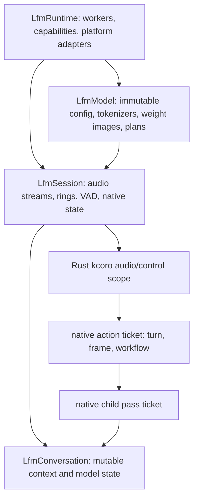

# Runtime ABI and Settings Contract

Status: normative design.

Baselines: EmberHarmony `321538f11749`; `kcoro_arena` `447d04f0246b`.

## Goal

Define one stable product C ABI plus two deliberately separate private queue
contracts. The native model SQ/CQ stays entirely native. The Rust/native docking
ring carries only PCM/control leases. Tauri remains the product host; Rust owns
OS audio streams, persisted settings, opaque handles, and bounded event
projection. Rust kcoro parks and resumes audio/control I/O continuations only.
It does not own model tensors, passes, tokens, recurrence, or numerical state.
C++ opens model files and controls plans, buffers, barriers, and dispatch; every
numerical body called by that control layer is architecture assembly.

## Current Boundary

| Current code | What it does now | Required change |
|---|---|---|
| `packages/desktop/src-tauri/src/settings.rs:60-87` | Defines CPU/Metal and LFM2/Moshi product choices. | Keep as the serialized product schema. |
| `settings.rs:213-250` | Stores model paths, device, VAD, trace, and generation settings. | Map every field explicitly into versioned ABI structs. |
| `packages/desktop/src-tauri/src/voice/control.rs:68-190` | Plans provider and engine mode. | Return capability/load errors from native runtime without fallback. |
| `control.rs:312-516` | Defines UI events and start/stop/interrupt/mic commands. | Preserve command names and event meaning. |
| `packages/desktop/src-tauri/src/voice/runtime.rs:2712-2829` | Converts settings, builds Rust/Candle engines, and returns a Candle `Device`. | Replace model construction with `lfm_model_open` and `lfm_session_create`. |
| `runtime.rs:2301-2450` | Owns `Lfm2Session` and a Rust service thread. | Reduce to opaque handles and callback context. |
| `crates/liquid-audio/src/runtime/voice_runtime.rs:612-802` | Defines another runtime config and lifecycle owner. | Delete after the C ABI is mounted. |

## Fixed Decisions

1. Device selection is runtime policy. A Cargo feature or preprocessor symbol may
   determine which backends are compiled into a binary, but it may not choose the
   user's backend.
2. The macOS desktop release includes both CPU and MLX/Metal backends once the
   MLX port exists. The `Lfm2Device` setting selects between them without a
   rebuild.
3. Unsupported requested backends fail explicitly. There is no CPU-to-Metal or
   Metal-to-CPU inference fallback after model open begins.
4. Product configuration never comes from `LFM_*` or another inherited process
   environment variable. Cargo's `CARGO_CFG_*` build metadata in
   `crates/liquid-audio/build.rs:9-31` is build-system input, not product config.
5. Every public ABI struct begins with `size` and `abi_version`.
6. Every handle is opaque. Rust never stores native internal pointers other than
   the handle value itself.
7. A callback never carries PCM, tensors, KV, or model-owned strings with an
   unbounded lifetime.
8. The ABI is a control plane, not an operator API. It exposes lifecycle,
   commands, bounded metadata events, and snapshots; it has no generic tensor
   operation or numerical payload push/pull function.
9. The native runtime owns model action/pass ticket identity and terminal
   promises. Rust kcoro owns only audio/control I/O operation identity. Native
   pass slots remain generation-protected private handles; Tauri receives only
   bounded value snapshots and metadata events.
10. Reliable semantic callbacks and lossy telemetry observers are separate sink
    classes. Observer failure can never stop or delay a session.
11. A fixed lane may publish one native CQ cell and ring its doorbell, but it
    never invokes Rust. A native continuation consumes that edge. Rust kcoro is
    resumed only by the separate PCM/control dock, never by an internal model
    pass completion.

## Handle Graph



The lifetime order is strict:

1. `LfmRuntime` outlives all objects created from it.
2. `LfmModel` outlives its sessions and conversations.
3. `LfmSession` retains its active conversation.
4. `lfm_session_stop` requests stop; `lfm_session_join` proves callbacks and
   workers are finished; only then may `lfm_session_destroy` succeed.
5. Destroying a parent with live children returns `LFM_BUSY`; it never guesses at
   ownership or blocks indefinitely.

## Canonical Header Layout

Create these production headers under `crates/liquid-audio/native/include/`:

```text
lfm_types.h       status, ABI version, IDs, spans, capability bits
lfm_runtime.h     runtime/model lifecycle, snapshots, and memory accounting
lfm_model.h       compatibility tombstone; includes lfm_runtime.h only
lfm_session.h     audio session, commands, callbacks, statistics
lfm_conversation.h conversation create/attach/reset/snapshot hooks
lfm_observe.h     ticket IDs, bounded kernel snapshots, lossy observer sink
```

Rust FFI declarations are generated or bound from these headers. The current
handwritten private declarations in
`crates/liquid-audio/src/compute/flashkern/native_engine.rs:94-170`,
`crates/liquid-audio/src/compute/weights.rs:25-71`, and
`crates/liquid-audio/src/mimi_native.rs:19-30` are transitional and must not
become three public ABIs.

The transitional synchronous model-info, token-step, numerical prefill, and
audio-code declarations live only in
`crates/liquid-audio/native/src/model/lfm_model_legacy.h`. They remain linkable
for offline oracle gates but are deliberately absent from the product headers.

## Core ABI Types

```c
#define LFM_ABI_VERSION 1u

typedef struct LfmRuntime LfmRuntime;
typedef struct LfmModel LfmModel;
typedef struct LfmSession LfmSession;
typedef struct LfmConversation LfmConversation;

typedef struct LfmTicketIdV1 {
    uint64_t runtime_epoch;
    uint64_t sequence;
    uint32_t generation;
    uint32_t kind;
} LfmTicketIdV1;

typedef enum LfmBackendV1 {
    LFM_BACKEND_CPU = 1,
    LFM_BACKEND_MLX_METAL = 2
} LfmBackendV1;

typedef enum LfmEngineV1 {
    LFM_ENGINE_LFM2_INTERLEAVED = 1,
    LFM_ENGINE_MOSHI_REALTIME = 2
} LfmEngineV1;

typedef enum LfmObserverLevelV1 {
    LFM_OBSERVER_OFF = 0,
    LFM_OBSERVER_SUMMARY = 1,
    LFM_OBSERVER_DIAGNOSTIC = 2
} LfmObserverLevelV1;

typedef enum LfmServiceClassV1 {
    LFM_SERVICE_DEADLINE = 1,
    LFM_SERVICE_INTERACTIVE = 2,
    LFM_SERVICE_BACKGROUND = 3
} LfmServiceClassV1;

typedef enum LfmGenerationModeV1 {
    LFM_GENERATION_ASR = 1,
    LFM_GENERATION_TTS = 2,
    LFM_GENERATION_INTERLEAVED = 3,
    LFM_GENERATION_MOSHI_FRAME = 4
} LfmGenerationModeV1;

typedef struct LfmRuntimeConfigV1 {
    uint32_t size;
    uint32_t abi_version;
    uint32_t coordination_workers;
    uint32_t kernel_lanes;
    uint32_t event_capacity;
    uint32_t observer_capacity;
    uint32_t ticket_capacity;
    uint32_t broker_admission_capacity;
    uint32_t completion_capacity;
    uint32_t callback_capacity;
    uint32_t maximum_consecutive_passes;
    uint32_t observer_level;
    uint32_t observer_maximum_hz;
    uint32_t reserved0;
    uint64_t context_quantum_ns;
    uint64_t flags;
    void *host_context;
} LfmRuntimeConfigV1;

typedef struct LfmModelConfigV1 {
    uint32_t size;
    uint32_t abi_version;
    uint32_t backend;
    uint32_t engine;
    const char *model_dir;
    uint64_t max_context;
    uint64_t flags;
} LfmModelConfigV1;

typedef struct LfmSamplingConfigV1 {
    uint32_t size;
    uint32_t abi_version;
    double text_temperature;
    double audio_temperature;
    uint32_t text_top_k;
    uint32_t audio_top_k;
    uint32_t max_tokens;
    uint32_t reserved0;
} LfmSamplingConfigV1;

typedef struct LfmConversationConfigV1 {
    uint32_t size;
    uint32_t abi_version;
    uint32_t generation_mode;
    uint32_t reserved0;
    uint64_t conversation_id;
    uint64_t max_context_tokens;
    uint64_t seed;
    LfmSamplingConfigV1 sampling;
    uint64_t flags;
} LfmConversationConfigV1;

typedef struct LfmSessionConfigV1 {
    uint32_t size;
    uint32_t abi_version;
    float vad_threshold;
    uint32_t silence_ms;
    uint32_t minimum_utterance_ms;
    uint32_t can_interrupt;
    uint32_t input_device;
    uint32_t output_device;
    uint32_t capture_ring_ms;
    uint32_t playback_ring_ms;
    uint32_t pass_slot_capacity;
    uint32_t reserved0;
    uint64_t flags;
} LfmSessionConfigV1;

typedef struct LfmKernelSnapshotV1 {
    uint32_t size;
    uint32_t abi_version;
    LfmTicketIdV1 active_ticket;
    uint64_t session_id;
    uint64_t conversation_id;
    uint64_t epoch;
    uint64_t pass_id;
    uint32_t phase;
    uint32_t pass_kind;
    uint32_t stage;
    uint32_t active_lanes;
    uint32_t total_lanes;
    uint32_t command_depth;
    uint32_t completion_depth;
    uint32_t ready_deadline;
    uint32_t ready_interactive;
    uint32_t ready_background;
    uint32_t active_service_class;
    uint32_t consecutive_passes;
    uint32_t reserved0;
    uint64_t quantum_remaining_ns;
    uint64_t active_pass_budget_ns;
    uint64_t longest_pass_ns;
    uint64_t deadline_deferrals;
    uint64_t deadline_misses;
    uint32_t ticket_capacity;
    uint32_t ticket_high_water;
    uint64_t coordination_wakes;
    uint64_t dispatch_wake_calls;
    uint64_t fence_wake_calls;
    uint64_t logical_fence_waiters;
    uint64_t spurious_wait_returns;
    uint64_t dropped_telemetry;
} LfmKernelSnapshotV1;
```

String pointers are borrowed only for the duration of the call. `lfm_model_open`
copies small path/config metadata and opens all files synchronously before it
returns. No later operation retains a Rust string pointer.

Sampling and PRNG state belong to the conversation because they must survive
session teardown, fast context switching, and snapshot/restore. A zero
temperature means greedy; zero top-k means no cutoff; `max_tokens` must be
nonzero. `conversation_id == 0` asks native code to allocate a stable ID. The
requested context limit must not exceed the bound model plan. Tauri maps the
selected `Lfm2ModeSampling` group at `settings.rs:99-163` and optional seed at
`241-242` into this struct once; no session-local default silently replaces it.

## Capability and Backend Selection

Expose capability discovery before model open:

```c
typedef struct LfmCapabilitiesV1 {
    uint32_t size;
    uint32_t abi_version;
    uint64_t backend_bits;
    uint64_t engine_bits;
    uint64_t audio_bits;
    uint32_t maximum_coordination_workers;
    uint32_t maximum_kernel_lanes;
} LfmCapabilitiesV1;

int lfm_runtime_get_capabilities(LfmRuntime *, LfmCapabilitiesV1 *);
```

Tauri mapping is exact:

| Persisted setting | ABI value | Failure behavior |
|---|---|---|
| `Lfm2Device::Cpu` (`settings.rs:60-73`) | `LFM_BACKEND_CPU` | Fail if required CPU ISA is unavailable. |
| `Lfm2Device::Metal` | `LFM_BACKEND_MLX_METAL` | Fail if MLX/Metal capability is absent. Never open Candle Metal. |
| `LocalVoiceEngine::Lfm2Interleaved` (`settings.rs:79-87`) | `LFM_ENGINE_LFM2_INTERLEAVED` | Load LFM2 schema and required codec assets. |
| `LocalVoiceEngine::MoshiRealtime` | `LFM_ENGINE_MOSHI_REALTIME` | Load native Moshi schema. No Rust Moshi fallback. |
| target `Lfm2Settings.kernel.coordinationWorkers` | `coordination_workers` | Validate against host capacity; never reinterpret as fixed compute lanes. |
| target `Lfm2Settings.kernel.lanes` | `kernel_lanes` | Validate in ABI v1 as 1-64 and against the selected backend/plan; no compile-time device choice. |
| target `Lfm2Settings.kernel.maximumConsecutivePasses` | `maximum_consecutive_passes` | Bound recurrence before broker reconsideration. |
| target `Lfm2Settings.kernel.contextQuantumUs` | checked `context_quantum_ns` | Bound one hot context without polling inside a pass. |
| target `Lfm2Settings.kernel.observer` and `observerHz` | observer level/rate | `off`, `summary`, or `diagnostic`; never affects native progress. |
| selected `Lfm2ModeSampling` group (`settings.rs:99-163`) | `LfmConversationConfigV1.generation_mode` and `.sampling` | Preserve the ASR, TTS, interleaved, or Moshi regime exactly; reject invalid temperature/top-k/token bounds. |
| `Lfm2Settings.seed` (`settings.rs:241-242`) | `LfmConversationConfigV1.seed` | Seed native conversation PRNG once so switching sessions does not reset sampling history. |

`packages/desktop/src-tauri/src/voice/runtime.rs:2810-2829` currently creates a
Candle `Device`. Replace it with a pure conversion to `LfmBackendV1`. The desktop
Cargo `metal` feature at `packages/desktop/src-tauri/Cargo.toml:65-75` ceases to
be a device selector. The final macOS product build links both native backends.

Add a serde-defaulted `KernelSettings` nested under the existing
`Lfm2Settings` at `packages/desktop/src-tauri/src/settings.rs:210-250`. Tauri
resolves automatic topology choices to concrete counts before calling C; zero
does not silently mean one worker or an unspecified CPU count. The Web/TUI may
offer an advanced editor, but the persisted settings object remains the sole
product source of these values. No native or Rust environment lookup fills
them.

Low-level capacities are deterministic derivatives, not additional expert UI
knobs. The Tauri/native configuration builder computes them from the selected
model plan, number of independent executors, maximum live sessions/actions,
broker admission policy, timer/checkpoint policy, and event/observer settings.
It records the resolved values in `LfmRuntimeConfigV1` and
`LfmSessionConfigV1`, then native creation validates all of these invariants:

- the ticket slab covers parent actions, queued/active/completing pass children,
  callback targets, timers/joins, and checkpoint/durable children;
- pass slots cover every pass child that can be queued, dispatched, or awaiting
  completion-target consumption for the session;
- completion capacity reserves at least one ingress for each independent fixed
  executor sharing it, and a dispatch permit is not returned before that ingress
  is consumed;
- function-backed tickets reserve callback capacity at successful ticket
  creation, before a receipt can be terminally rejected;
- observer capacity is physically independent from reliable `event_capacity`;
- no capacity may grow after readiness, and inconsistent values return a typed
  creation error before workers or audio streams start.

## Runtime Lifecycle

```c
int lfm_runtime_create(const LfmRuntimeConfigV1 *, LfmRuntime **out);
int lfm_runtime_start(LfmRuntime *);
void lfm_runtime_request_stop(LfmRuntime *);
int lfm_runtime_join(LfmRuntime *);
int lfm_runtime_destroy(LfmRuntime *);

int lfm_model_open(LfmRuntime *, const LfmModelConfigV1 *, LfmModel **out);
int lfm_model_close(LfmModel *);

int lfm_conversation_create(LfmModel *, const LfmConversationConfigV1 *,
                            LfmConversation **out);
int lfm_conversation_destroy(LfmConversation *);

int lfm_session_create(LfmRuntime *, LfmModel *, LfmConversation *,
                       const LfmSessionConfigV1 *,
                       const LfmCallbacksV1 *, LfmSession **out);
int lfm_session_start(LfmSession *);
int lfm_session_interrupt(LfmSession *, uint64_t *out_epoch);
int lfm_session_set_microphone(LfmSession *, uint32_t enabled);
int lfm_session_kernel_snapshot(LfmSession *, LfmKernelSnapshotV1 *out);
void lfm_session_request_stop(LfmSession *);
int lfm_session_join(LfmSession *);
int lfm_session_destroy(LfmSession *);
```

Semantics:

- `create` allocates and validates but starts no external audio stream.
- `start` is idempotence-checked and transitions exactly once.
- `interrupt` increments an epoch and rings a coordinator doorbell. It does not
  wait for or inspect an inner kernel operation.
- `request_stop` is nonblocking and callback-safe.
- `join` waits for the terminal edge and returns its status.
- `destroy` performs no implicit unbounded join. It requires a joined object.
- `on_stopped` is the final reliable semantic callback and occurs exactly once
  before join returns. Observer callbacks use their own detach/join contract.
- model action/pass terminal promises finish inside native coordination before
  PCM/control edges or projected telemetry reach the Rust host;
- each pass ticket is single-shot and distinguishes numerical completion from
  committed versus stale publication.

## Callback Contract

```c
typedef enum LfmEventKindV1 {
    LFM_EVENT_STATE = 1,
    LFM_EVENT_TEXT = 2,
    LFM_EVENT_LEVEL = 3,
    LFM_EVENT_TURN = 4,
    LFM_EVENT_ERROR = 5,
    LFM_EVENT_STOPPED = 6
} LfmEventKindV1;

typedef struct LfmEventV1 {
    uint32_t size;
    uint32_t abi_version;
    uint32_t kind;
    uint32_t flags;
    uint64_t session_id;
    uint64_t conversation_id;
    uint64_t epoch;
    uint64_t sequence;
    const void *payload;
    uint32_t payload_bytes;
    uint32_t reserved;
} LfmEventV1;

typedef int (*LfmOnEventV1)(void *context, const LfmEventV1 *event);

typedef struct LfmCallbacksV1 {
    uint32_t size;
    uint32_t abi_version;
    void *context;
    LfmOnEventV1 on_event;
} LfmCallbacksV1;
```

The native runtime serializes calls through one notification continuation. No
two callbacks for one session overlap. Payload memory is valid only during the
callback, so the Rust shim copies bounded text/error metadata before returning.
PCM never appears here; playback stays native.

The Rust handle wrapper pins the callback context for the complete interval from
successful `lfm_session_create` through `lfm_session_join` and observer detach.
Native code borrows that context and never frees it. The wrapper releases it only
after join proves no semantic callback can enter and every observer using it has
completed detach; panic handling does not shorten this lifetime.

The callback returns zero on acceptance and nonzero when the host sink is closed
or full. On failure, native code records a host-sink terminal cause and requests
session stop. Rust catches panics in the shim. It never unwinds across C and
never recursively calls another native callback to report the panic.

Event capacity is bounded. Coalescible level/stat events may be replaced by a
newer value. State, text, error, turn completion, and stopped events are not
silently dropped. If a non-coalescible event cannot be delivered, the session
fails explicitly rather than accumulating unbounded memory.

Kernel ticket observations use a separate optional sink:

```c
typedef struct LfmKernelUpdateV1 LfmKernelUpdateV1;
typedef void (*LfmOnKernelUpdateV1)(void *context,
                                    const LfmKernelUpdateV1 *update);

typedef struct LfmObserverV1 {
    uint32_t size;
    uint32_t abi_version;
    void *context;
    LfmOnKernelUpdateV1 on_update;
    uint32_t maximum_hz;
    uint32_t flags;
} LfmObserverV1;

typedef struct LfmSubscriptionIdV1 {
    uint64_t runtime_epoch;
    uint32_t slot;
    uint32_t generation;
} LfmSubscriptionIdV1;

int lfm_session_observer_attach(LfmSession *, const LfmObserverV1 *,
                                LfmSubscriptionIdV1 *out_subscription);
int lfm_session_observer_detach(LfmSession *,
                                LfmSubscriptionIdV1 subscription);
```

The observer receives fixed-size value snapshots sampled only at accepted,
dispatched, full-pass completion, terminal, and periodic aggregate edges. A full
observer ring coalesces/drops and increments a counter. A closed or panicking
observer is detached. It never changes ticket/session state and never shares the
reliable semantic event capacity.

Attach reserves one generation-protected slot. Detach first invalidates that
generation, stops new projections, waits for an already entered observer call to
return, and then releases the slot. A runtime-epoch or generation mismatch is a
stale-ID error and cannot affect a later observer. Session destruction requires
all observer slots detached; it never frees callback context while an observer
may still enter.

Ticket ID and observer event layout are fully specified in document 12. A 64-bit
ID is never serialized through a JavaScript `number`.

## Status and Error Ownership

Use integer status codes plus a per-object immutable terminal error snapshot.
Do not return pointers into temporary exception strings. C++ catches every
exception at the ABI rim, as the existing loader already does at
`crates/liquid-audio/native/src/io/safetensors.cpp:538-563`.

Required broad status classes:

- `LFM_OK`
- `LFM_INVALID_ARGUMENT`
- `LFM_ABI_MISMATCH`
- `LFM_UNSUPPORTED_BACKEND`
- `LFM_MODEL_FORMAT`
- `LFM_OUT_OF_MEMORY`
- `LFM_BUSY`
- `LFM_CANCELLED`
- `LFM_AUDIO_DEVICE`
- `LFM_HOST_SINK`
- `LFM_INTERNAL`

## Rust Host Shape

The final Rust production surface is intentionally small:

```text
packages/desktop/src-tauri/src/voice/native/
  ffi.rs       generated/private raw declarations
  config.rs    VoiceSettings -> ABI structs
  event.rs     panic-safe event shim -> Tauri VoiceEvent
  observe.rs   lossy/coalesced kernel observer -> Tauri kernel channel
  status.rs    bounded native snapshots -> serializable status values
  handles.rs   Runtime/Model/Conversation/Session RAII wrappers
```

The wrappers may own `NonNull` handles, callback context, and copied UI metadata.
They may not expose a PCM push/write API, a model tensor, or a closure that runs
inside a numerical pass. They also may not invoke a kernel symbol directly;
`lfm_model_open` binds the C++ plan and only that plan dispatches kernels.

## Implementation and Deletion Map

1. Add the headers and ABI layout tests without mounting them.
2. Introduce `native/src/runtime/runtime.cpp`, `model.cpp`, `session.cpp`, and
   `notification.cpp` behind the new handles.
3. Add Rust wrappers beside the existing path and map settings explicitly.
4. Make `build_engine` at `packages/desktop/src-tauri/src/voice/runtime.rs:2738-2808`
   select the native engine and backend, not construct Rust model objects.
5. Replace `Lfm2Session` fields and spawn body at `runtime.rs:2301-2450` with
   native handle lifecycle calls.
6. Delete `select_device` at `runtime.rs:2810-2829` once no production code needs
   `candle_core::Device`.
7. Delete `RuntimeConfig`, `VoiceRuntime`, and Rust runtime callbacks at
   `crates/liquid-audio/src/runtime/voice_runtime.rs:596-819` only after native
   audio and event gates pass.
8. Remove the desktop direct Candle dependency at
   `packages/desktop/src-tauri/Cargo.toml:47`.
9. Add ticket/snapshot/observer ABI layout and lifecycle tests before exposing
   the optional Tauri observer commands in document 12.
10. Prove the semantic callback and observer callback use separate native and
    Rust capacities and failure policies.
11. Add one configuration-budget function that derives pass-slot, broker,
    completion, callback, ticket, event, and observer capacities from the chosen
    model/session topology. Test the same function that production calls; do not
    duplicate its arithmetic in fixtures.

## Acceptance Gates

- ABI layout is checked from C, C++, and Rust for size, alignment, and offsets.
- Older callers with smaller `size` fields receive defaults only for documented
  tail fields; incompatible `abi_version` fails.
- Tauri CPU/Metal and LFM2/Moshi settings map to exact ABI enums in tests.
- No `LFM_*` environment lookup exists in the production call graph.
- Requesting an unavailable backend produces a user-visible error and does not
  execute another backend.
- Header/source/link audits prove the C ABI has no local numerical payload
  operation and production Rust contains no DSP, tensor, sampler, codec, or
  kernel implementation.
- A traced local pass has the numerical stack C++ fixed executor -> architecture
  kernel. Rust appears only before it at SQ publication and after it at CQ
  consumption; no tensor, PCM, mel, KV, logits, RNG, or codec payload crosses
  either edge.
- Callback panic, closed Tauri channel, and full event queue stop cleanly with
  exactly one final `on_stopped` edge.
- Observer panic, closed observer channel, and telemetry flood detach/drop only;
  they do not alter ticket count, generated output, or session lifetime.
- Invalid capacity combinations fail before any worker or audio stream starts.
  Minimum valid capacities survive exhaustion, stop, and joined teardown without
  an allocation, dropped terminal target, or callback after destruction.
- Every accepted full pass delivers one native terminal event to its configured
  completion target before any projected host update; the resumed orchestration
  handler or function callback executes once and never on a compute/audio/store
  thread.
- Bounded kernel snapshots contain value IDs/counters only and expose no pass,
  descriptor, model, or state pointer.
- Stop/join/destroy races run 100,000 times under ASan, UBSan, and TSan without a
  callback after destroy or a leaked handle.
- `voice_start`, `voice_stop`, `voice_interrupt`, and
  `voice_set_mic_enabled` retain their public Tauri command names.
