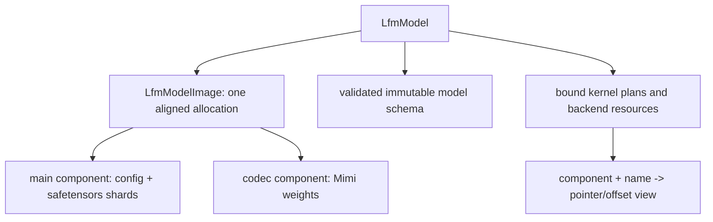

# Model Residency and Loader Design

Status: normative design.

Baselines: EmberHarmony `321538f11749`; local source reference
`/Volumes/stuff/ukm/ember-ml` as inspected with this design.

**Normative terminology:** a "tensor" in this document is only a borrowed
typed view: byte base/span, dtype, shape, and derived strides. It owns no
payload and cannot allocate, convert, align, transpose, repack, or relocate
model bytes. The only weight-byte owner is the sealed resident image.

## Goal

Make native code the sole owner of model files, parsed metadata, immutable weight
bytes, tensor views, and backend binding. Loading is synchronous and complete.
Inference never streams a layer or tensor from disk and never asks Rust or
Candle to materialize a weight.

Rust passes an explicit model directory selected by Tauri. C++ opens the files,
loads all required bytes into resident model storage, validates the complete
bundle, binds kernel plans, and returns an opaque `LfmModel`.

## Current Code Map

| Current symbol | Evidence | Disposition |
|---|---|---|
| `loader::from_pretrained` | `crates/liquid-audio/src/loader.rs:152-258` parses config, opens `ResidentWeights`, builds the model, mel plan, Mimi, and detokenizer in Rust. | Replace with `lfm_model_open`, capture the required fixtures, then delete. Git history is the archive. |
| `parse_encoder` | `loader.rs:113-136` maps JSON into Rust Conformer config. | Move schema validation into native `model_schema.cpp`. |
| `ResidentWeights::open` | Called at `loader.rs:164`; safe owner implemented in `crates/liquid-audio/src/compute/weights.rs:199-448`. | Remove from the product path once `LfmModel` owns the image directly. |
| `ResidentWeights::candle_builder` | `weights.rs:449-503`. | Delete with the last production Candle module. |
| `CandleBridge::load` | `weights.rs:504-536` constructs copied Candle tensors. | This is the measured copy boundary to eliminate, not preserve. |
| Native safetensors ABI | `crates/liquid-audio/native/include/lfm_safetensors.h:13-92`. | Fold behind the private C++ model loader and extend for component bundles; do not generate Rust bindings for tensor views. |
| Native image load | `crates/liquid-audio/native/src/io/safetensors.cpp` opens every source first, then runs up to four 8 MiB positioned-read workers directly into one image; `LfmWeightLoadStatsV1` reports source/resident bytes and the actual team. | Retain the aligned resident-block approach and joined-before-unwind discipline; fold the transitional stats into model memory accounting. |
| Native tensor view | `crates/liquid-audio/native/src/io/safetensors.cpp:522-536`; C ABI lookup at `623-629`. | Bind once at model open, never look up by name in a pass. |
| Mimi load | `loader.rs:406-420` constructs both Rust Moshi Mimi and a native decoder from the same file. | Native model owns codec weights and codec plan; do not reopen the file from a Rust adapter. |
| LFM2 detokenizer load | `loader.rs:424-440` opens a second `ResidentWeights` and Candle model. | Delete with the other replaced Rust owners; it is not on the shipped realtime path. |

The current loader measurement is recorded at
`crates/liquid-audio/native/src/io/README.md:48-66`: 931 tensors and
2,940,724,032 resident bytes, followed by 912 compatibility tensor copies and
2,940,616,960 copied bytes. The native image is already the correct source of
truth; compute binding is the unfinished part.

## Loader Decision

Keep the current whole-file resident-block design. Do not copy the UKM numerical
ingress algorithm into the weight loader.

The ember-ml implementation stages chunks in a reusable host buffer and hands a
`TensorIngressDesc` to a mailbox at
`/Volumes/stuff/ukm/ember-ml/src/ukm/io/safetensors.cpp:276-307`; the worker
consumes that descriptor through `HoloEngine::tensor_ingress` at
`src/ukm/fast/holo.cpp:389` and `562-566`. That design is useful for transformed
numerical ingress. Model weights here must remain bit-exact safetensors payload
bytes. The reusable lessons are:

- one explicit descriptor;
- pointer handoff, not descriptor payload copies;
- a completion edge before a staging buffer is reused;
- backend ingress performed once during load.

For the CPU backend, no numerical ingress is needed. Kernels read the resident
payload directly.

## Target Model Image

Safetensors files for one product model include the main LFM2/Moshi model and
Mimi. Tensor names can overlap across those components. Extend the current image
into one model bundle with component-scoped keys:

```c++
enum class WeightComponent : uint32_t {
    Main = 1,
    Codec = 2,
};

struct TensorView {
    const std::byte *data;
    std::span<const uint64_t> shape;
    uint64_t offset;
    uint64_t elements;
    uint64_t bytes;
    LfmDType dtype;
    WeightComponent component;
    uint32_t shard;
};
```

These are private C++ model types, not declarations in `lfm_voice.h`. Rust sees
only `LfmModel *`, typed status, and bounded nonnumerical metadata. There is no
public tensor lookup, data pointer, shape pointer, or weight-buffer accessor.

`LfmModelImage` owns one 64-byte-aligned allocation containing every selected
file, with padding between complete files. A tensor key is `(component, name)`,
so duplicate names in main and codec checkpoints are legal while duplicates
inside one component remain an error.



The file header bytes may place a payload at an address that is not naturally
64-byte aligned even when the allocation base is aligned. CPU kernels therefore
must support unaligned safetensors loads or handle an alignment prologue. They
must not repack a full weight merely to satisfy an assumed aligned-load contract.

## Synchronous Load Sequence

`lfm_model_open` performs the following before it reports success:

1. Copy the explicit model directory string from `LfmModelConfigV1`.
2. Read and validate `config.json` for the selected engine.
3. Resolve the exact set of main, codec, and tokenizer files.
4. Plan final aligned file offsets and allocate `LfmModelImage` once.
5. Split every open source into 8 MiB positioned-read tasks and run at most four
   transient workers, each writing directly into a disjoint final image slice.
   Join the team, re-stat the same handles, and only then proceed.
6. Parse and validate every safetensors header and payload span.
7. Validate model-family invariants, required tensor names, shapes, dtypes,
   codebook counts, context sizes, and tokenizer control tokens.
8. Build immutable component schemas containing direct views or base-relative
   offsets.
9. Allocate backend-resident immutable resources, if the selected backend needs
   them, and complete that ingress.
10. Allocate no conversation or session state yet.
11. Return only after all file I/O and backend ingress is complete.

Failure unwinds all partial images and backend objects before returning. The
loader never frees a destination while a positioned read may still target it,
and no exception crosses the C ABI. The existing `open_c` catch rim is the
pattern to retain.

## Native Schema

Create `native/src/model/model_schema.cpp` and private headers under
`native/src/model/`. The schema is a graph of plain immutable structs, not a map
consulted in the hot path. Examples:

```c++
struct WeightView {
    const std::byte *data;
    uint64_t bytes;
    uint64_t rows;
    uint64_t cols;
    LfmDType dtype;
};

struct LfmBackboneLayerPlan {
    LayerKind kind;
    WeightView op_norm;
    WeightView ffn_norm;
    WeightView q;
    WeightView k;
    WeightView v;
    WeightView out;
    WeightView w1;
    WeightView w2;
    WeightView w3;
    // Short-conv and q/k norm fields are present according to kind.
};

struct LfmModelSchema {
    LfmArchitecture architecture;
    uint32_t hidden;
    uint32_t layers;
    uint32_t codebooks;
    uint32_t max_context;
    std::span<const LfmBackboneLayerPlan> backbone;
    LfmConformerPlan conformer;
    LfmDepthformerPlan depthformer;
    LfmCodecPlan codec;
};
```

Use typed schema builders for LFM2 and Moshi. Name lookup is permitted only in
these builders. A missing or malformed required tensor fails model open. There
is no per-layer fallback to Candle or a generic operator chain.

## CPU Binding

CPU plans retain the model image and store direct read-only pointers into it.
Activations and mutable state live elsewhere. Required rules:

- weights are never cast or copied after load;
- BF16/F32 interpretation comes from the validated dtype;
- a plan stores shape/stride facts once;
- a pass receives the plan pointer and mutable destination/state pointers;
- no tensor name, JSON value, filesystem path, or allocation is consulted in a
  numerical pass;
- `LfmModelImage` cannot be destroyed while a plan, session, or conversation
  retains it.

The current C++ engine captures pointers from Candle-owned tensor storages through
`LfmLayerDesc` at
`crates/liquid-audio/native/src/engine/flashkern_engine.cpp:180-213` and Rust
capture helpers at `crates/liquid-audio/src/model/lfm2_hf.rs:996-1210`. Replace
those captures with schema views from `LfmModel`; then delete the Rust capture
table.

## MLX/Metal Binding

MLX/Metal is a separately compiled backend capability selected at model open.
The product binary should contain CPU and MLX/Metal together on macOS.

The backend may do one startup-only transfer or allocation if MLX cannot safely
wrap the native image. It must expose load statistics:

```c
typedef struct LfmModelMemoryV1 {
    uint64_t file_bytes;
    uint64_t host_resident_bytes;
    uint64_t directly_bound_bytes;
    uint64_t backend_uploaded_bytes;
    uint64_t compatibility_copied_bytes;
} LfmModelMemoryV1;
```

`compatibility_copied_bytes` must be zero in a production model. A backend upload
is allowed only once during `lfm_model_open`, remains resident for model lifetime,
and is reported separately. Per-pass host/device transfer is a hard failure.

Do not make Metal selection a Rust compile-time branch. The stale comment at
`crates/liquid-audio/Cargo.toml:112-114` and the desktop target dependency at
`packages/desktop/src-tauri/Cargo.toml:65-75` are removed when the MLX backend is
linked as a runtime capability.

## Tokenizer and Config Ownership

Native model open also owns inference tokenizer metadata:

- LFM2 `tokenizer.json` and its required control-token round trips currently
  validated at `crates/liquid-audio/src/loader.rs:200-218`.
- Moshi SentencePiece metadata currently loaded by Rust at
  `crates/liquid-audio/src/runtime/realtime.rs:2574-2594`.

The model stores immutable token ID tables and token-to-piece data needed by the
inference path. Once equivalent fixtures exist, delete the Rust inference
tokenizer/config path with the other replaced owners. The native runtime must
not call Rust to decide a sampled control token or decode a Moshi token fragment.

## Mimi and Detokenizer Ownership

Production constructs `MimiDecodePlan` from the codec component of the same
combined `LfmWeightImage` owned by `LfmModel`; each conversation owns only its
mutable `MimiDecodeState`. Codec weights remain non-owning byte views, and PCM
is written directly into the retained playback reservation.

The legacy `mimi_decoder_new_from_file` route remains solely for offline
Candle/Moshi parity. It is compiled only with `LFM_BUILD_ORACLE`, is absent from
the shared native header, and is not present in the production native archive.
It may own a standalone image because the oracle intentionally compares two
independent implementations; no shipped session can reach it.

The LFM2 custom detokenizer at `crates/liquid-audio/src/detokenizer.rs:219-310`
is not on the shipped realtime path, which requires Mimi. Prove no Tauri command
reaches it, capture any still-required compatibility fixtures, and delete it.
The production loader does not bind or advertise it. Git history is sufficient
if a future native port needs to consult the old implementation.

If a future product requirement needs that one-shot API, port its embedding,
backbone, linear, inverse DFT, and overlap-add behind a separate native
capability and parity gate. It may not reintroduce Candle into the production
package.

## Implementation Map

1. Move `native/include/lfm_safetensors.h` behind a private native include path
   and extend `native/src/io/safetensors.cpp:357-637` with component-scoped
   bundle loading. Export no tensor-view symbol through `lfm_voice.h`.
2. Add malformed bundle, duplicate component-name, alignment, overflow, and
   multi-shard index tests.
3. Add native config/tokenizer readers and an immutable `LfmModelSchema`.
4. Bind current Flashkern backbone and Mimi decoder from schema views.
5. Change `lfm_ctx_build` at
   `native/src/engine/flashkern_engine.cpp:1219-1281` to receive a retained native
   model/plan, not caller-captured Candle pointers.
6. Change native Mimi construction so it does not reopen the file.
7. Mount `lfm_model_open` through the ABI in `01-runtime-abi-and-settings.md`.
8. Port subsystems in documents 05 through 08, reducing compatibility-copy
   counters after each port.
9. Remove `ResidentWeights::candle_builder`, `CandleBridge`, and the replaced
   Rust loader/model sources when the counter reaches zero and independent
   fixtures cover their contracts.
10. Delete production `loader::from_pretrained` and `select_device` call sites.

## Acceptance Gates

- Main and codec files are read before model open returns;
  a syscall trace shows no checkpoint reads during inference.
- CPU weight pointers fall inside the retained model image and remain stable for
  model lifetime.
- Every required tensor is bound by component/name with exact dtype, shape, and
  byte-span validation.
- Native model output matches the reference model at each ported boundary.
- `compatibility_copied_bytes == 0` for both LFM2 and Moshi production opens.
- Repeated model open/close under ASan and TSan leaves no image, plan, or backend
  resource live.
- A session prevents model close with `LFM_BUSY`; close never invalidates an
  in-flight pass.
- CPU and MLX/Metal selection use the same model directory and explicit runtime
  enum, with no environment lookup and no backend fallback.
- Native loader fuzzing covers JSON lengths, tensor spans, dtype/shape overflow,
  shard paths, duplicate names, and truncated files.

## Non-Goals

- No layer-by-layer disk streaming.
- No numerical transformation of raw CPU weights during load.
- No mmap requirement. The current aligned read-owned image is acceptable and
  gives the model one explicit lifetime; mmap may be measured later.
- No durable conversation state in the immutable model image.
- No training optimizer or autograd support in the production native library.
