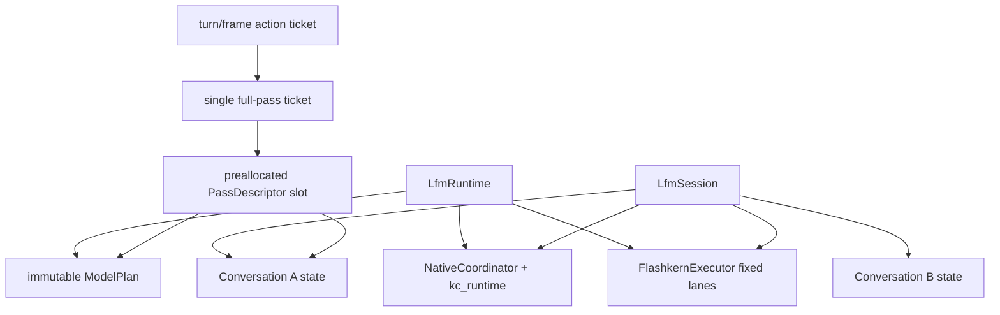
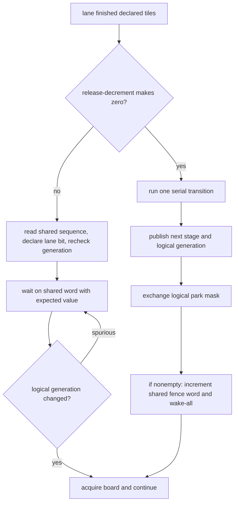
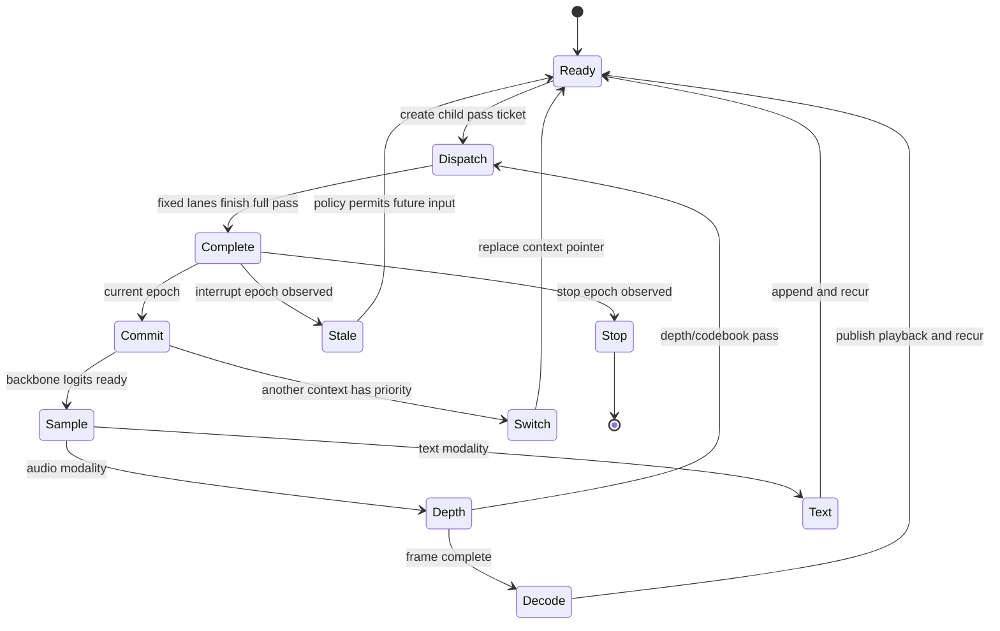

# Scheduler, Passes, Tickets, And Native Recurrence

Status: normative design with the fixed-lane/ticket substrate implemented at
upstream `bd530f4c9196`, vendor `8d510f83`, and executor `d2c43abd`. Native
recurrence remains incomplete.

Baselines: EmberHarmony `321538f11749`; `kcoro_arena` `447d04f0246b`.

Upstream contracts:

- `/Volumes/stuff/Projects/kotlinmania/kcoro_arena/docs/GPU_KERNEL_CONTRACT.md`
- `/Volumes/stuff/Projects/kotlinmania/kcoro_arena/docs/TICKETS_AND_CALLBACKS.md`

## Goal

Use two deliberately different native executors:

- kcoro stackless continuations for coarse orchestration, tickets, timers,
  audio coordination, callbacks, cancellation, and workflows;
- a persistent fixed Flashkern worker team for model stages, shared scratch,
  tile fan-out, SIMD, and assembly.

Move token/frame recurrence into the native coordinator. Rust rings coarse
command doorbells and receives bounded metadata. It is never in the one-token,
one-frame, one-stage, or one-ticket completion loop.

The CPU runtime can do something a static GPU command list cannot: after one
full pass it can inspect live context, modality, workflow, deadline, and
interrupt state, then immediately recur, switch conversations, fork a branch,
or stop.

## Correction To The Earlier Lane-Frame Design

The earlier version of this document proposed N movable stackless lane
continuations and a `LaneFrame` that flattened the current six-deep C++ call
tower. That rewrite is rejected.

The previous engine had N logical lanes on N dispatcher threads. During
an intra-pass barrier, a lane cannot run unrelated model work because the active
pass cannot advance until all required lanes reach the stage boundary. Moving
those lanes onto the general kcoro ready queue would add continuation state,
worker migration, queue arbitration, and wake routing without exposing useful
parallelism.

The fixed team therefore keeps ordinary nested C++ call stacks. kcoro schedules
the coarse pass ticket and receives the completion doorbell. Flashkern schedules
the numerical stage and tiles. No `LaneFrame` rewrite is required.

This also follows from the serialization boundary. Conversation images are legal
only when no pass is active; the capture gate in document 11 requires quiescence,
and spec 10 excludes coroutine frames, barriers, thread IDs, and allocator state
at `specs/10-stateful-multi-agent-runtime.md:602-610`. There is therefore no
conversation-specific numerical call stack to serialize at a valid checkpoint.
Stackless explicit state belongs to the coordinator, workflows, timers, and
conversation image. The persistent compute service keeps ordinary stacks that
are empty of pass work whenever capture is admitted.

## Current Scheduler Map

| Current symbol | Evidence | Design action |
|---|---|---|
| `Pass` | `crates/liquid-audio/native/src/engine/flashkern_engine.cpp:76` stores borrowed pointers and shared scratch. | Current single-pass slot is pointer-stable. Promote it to a generation-protected slot pool when the native coordinator admits multiple producers. |
| `Stage` | `flashkern_engine.cpp:113` uses one atomic tile claim counter. | Preserve as the micro-scheduler; add an active-lane mask only for plans that intentionally use a subset. |
| `Fence` | `flashkern_engine.cpp:128` stores arrival, logical generation, and park mask. | Implemented at `d2c43abd`: last arriver publishes generation and fans declared waiters through one shared expected-value word without spin. |
| Request kinds | `flashkern_engine.cpp:136-145` includes MLP, layer, token, and transitional callback requests. | Replace `REQ_CALL` with typed Depthformer/fan-out passes; keep pass-granularity ticket IDs. |
| Engine ownership | `flashkern_engine.cpp:306-383` stores fixed pthreads, shared doorbells, arena runtime/ticket, request slots, plans, and scratch. | Fixed executor is implemented at `d2c43abd`; split out the multi-session `NativeCoordinator`. |
| `lane_fence` | `flashkern_engine.cpp:622-650`. | Implemented at `d2c43abd`: immediate shared expected-value block preserves generation/last-arriver correctness. |
| `run_stage` | `flashkern_engine.cpp:658-672`. | Keep atomic disjoint tile claiming and one serial transition. |
| Nested lane program | `flashkern_engine.cpp:993-1025`. | Keep ordinary C++ calls; port the remaining Rust callback bodies without flattening this tower. |
| Engine construction | `flashkern_engine.cpp:1154-1195` creates fixed pthreads and two prepared shared wait words. | Implemented at `d2c43abd`; add readiness/affinity policy and million-pass soak. |
| External handback | `submit_pass` at `flashkern_engine.cpp:1085-1141` uses one arena ticket but still blocks the Rust caller; `lfm_engine_call` remains at line 1200. | Move recurrence to native ticket callbacks, then delete the blocking Rust handback and `REQ_CALL`. |

The coordination API is vendored under
`crates/kcoro-sys/vendor/kcoro_arena/include/`. Work and lifecycle conditions are
separate at `core/src/kc_runtime.c:225-324`; work and ticket arrivals signal one
worker. The ticket slab and intrusive completion queue live in
`core/src/kc_ticket.c:20-457`. The POSIX expected-value wait adapter is at
`port/posix.c:156-305`.

## Two Scheduling Levels

| Level | Owner | Unit of work | Worker identity |
|---|---|---|---|
| Macro | kcoro coordination runtime | session command, actor step, timer, action ticket, full pass ticket, callback, context switch, snapshot capture request | movable stackless continuation |
| Micro | Flashkern fixed executor | pass stage, GEMV rows, convolution channels, attention heads, FFT/mel bins, adapter rows | stable logical lane on stable OS worker |

A kcoro channel/ticket per tile, tensor operation, layer, or SIMD block is
forbidden. All fixed lanes observe one read-only pass descriptor, claim disjoint
tiles from one board, and write declared shared destinations.

## Object And Lifetime Graph



`LfmRuntime` owns the coordination and fixed executors. The model plan and
weight image are immutable. Each conversation owns mutable context. A pass
ticket retains its pass slot and context through completion-target consumption.
Session stop joins active tickets and both executors before releasing any owner.

## Coordination Runtime

Each `LfmRuntime` owns an explicit `kc_runtime_t`; no process-global `koro_go`
helper is used.

The upstream repair ledger is:

1. **Done (`bcdc03d1a073`):** split `work_cv` from `lifecycle_cv` in `kc_runtime`.
2. **Done (`bcdc03d1a073`):** signal one work waiter for each newly runnable continuation or
   terminal ticket; lifecycle transitions notify only lifecycle predicates.
3. **Done (`bcdc03d1a073`):** add a preallocated ticket slab, exact intrusive completion queue,
   arena-worker callbacks, cancel/deadline/stop disposition, and snapshots.
4. **Done (`bcdc03d1a073`):** add raw-word atomics and zero-spin expected-value waits with precise
   teardown in the host adapter.
5. **Open:** remove unregistered `KORO_WAIT_UNTIL` at
   `include/kcoro_stackless.h:125-133`; every park owns a retained operation,
   ticket, timer, channel wait, or explicit doorbell subscription.
6. **Open:** add actor message/time quanta because `actor_step` at
   `core/src/kc_actor.c:33-55` can otherwise monopolize a worker while a mailbox
   is continuously replenished.
7. **Open:** make configured capabilities truthful; `core/src/kc_admin.c:11-18` currently reports
   optional durable/transport services unconditionally.

Coordination-worker count and fixed kernel-lane count are separate persisted
runtime settings. The current `kc_runtime_create` default of one at
`core/src/kc_runtime.c:170` is not interpreted as CPU autodetection or reused as
the numerical lane policy.

## Fixed Flashkern Executor

```c++
struct FlashkernExecutor {
    std::vector<NativeThread> workers;
    std::vector<LaneState> lanes;
    StageBoard board;
    SubmissionQueue submissions;
    CompletionQueue completions;
    const ModelKernelTable *kernels;
    void *scratch;
    uint32_t lane_count;
};

struct LaneState {
    FlashkernExecutor *executor;
    uint32_t lane;
    uint32_t wake_sequence;
    uint32_t reserved;
    uint64_t logical_generation;
};
```

`LaneState` is not a coroutine stack replacement. It stores only stable lane
identity and observed doorbell generations. The nested kernel program remains
ordinary C++ and assembly.

Executor creation:

1. Allocate boards, pass slots, ticket capacity, completion capacity, lane
   state, and maximum scratch before readiness.
2. Start exactly `lane_count` persistent workers.
3. Each worker publishes its lane identity and blocks on the command generation.
4. The coordinator waits for all lane-ready edges once during startup.
5. Runtime readiness fails if any worker, required ISA, plan, wait-word adapter,
   or scratch reservation is unavailable.

Thread affinity and performance-core policy are host-adapter settings. Stable
logical lane identity is mandatory even when the OS declines a requested CPU
binding.

## Pass Descriptor And Ticket

```c++
enum class PassKind : uint32_t {
    Mel,
    Conformer,
    Adapter,
    BackbonePrefill,
    BackboneToken,
    Depthformer,
    MimiEncode,
    MimiDecode,
    MoshiFrame
};

struct PassDescriptor {
    uint32_t size;
    PassKind kind;
    uint64_t pass_id;
    uint64_t conversation_id;
    uint64_t epoch;
    const ModelPlan *model;
    ConversationState *state;
    const void *input;
    void *output;
    void *scratch;
    uint32_t input_count;
    uint32_t flags;
    uint32_t slot_generation;
};
```

The slot is preallocated and remains alive through callback. A private
`kc_ticket_t *` owns its descriptor lease. The submission queue carries one pointer,
not a copied descriptor. Weights, activations, KV, PCM, and scratch never enter
either queue.

The upstream baseline `koro_send_begin_ex` always copies through
`kc_descriptor_create_copy` at `kcoro_arena/core/src/kcoro_stackless.c:94-107`.
The product executor must use the new descriptor-transfer/ticket submission
surface, never this copy-mode helper.

### SQ/CQ boundary

The executor boundary is an explicit submission-queue/completion-queue pair,
matching a command processor rather than a general actor channel:

```text
many session/workflow actors
    -> bounded intrusive MPSC broker admission
    -> policy selects one retained ticket
    -> bounded SPSC SQ: broker -> fixed executor
    -> one full native pass
    -> bounded SPSC CQ: final lane -> completion continuation
    -> ticket terminal publication and exact coordinator wake
```

The admission queue is not the SQ. It holds schedulable tickets while one board
is busy. ABI v1 may use a one-slot, generation-protected SQ because a board has
one dispatched pass. The CQ has completion capacity reserved before SQ
publication. SQ release-publication orders the pass descriptor before the first
lane wake; CQ release-publication orders state/output writes before coordination
reads them. Entries are retained pointers, producer/consumer sequences are
cache-line separated, and neither edge calls copy-mode `KORO_SEND`.

SPSC describes logical endpoint ownership. The last-arriving lane may differ
between passes, but only one pass can complete at a time, the dispatch permit is
not restored until coordination consumes the prior CQ entry, and the next SQ
publication transfers completion-producer ownership through acquire/release
edges. If a later design overlaps passes, it must use independent SQ/CQ pairs or
a separately proven multiproducer completion structure.

The CQ rings the native continuation that makes progress. A Tauri or visualizer
callback is a separate, sampled observer after arbitration and can never be the
callback that makes computation progress.

Ticket terminal status distinguishes:

```text
execution:    not_dispatched | completed | failed
state:        none | committed | rolled_back | poisoned
publication:  none | committed | stale
cause:        success | rejected | canceled | timed_out | stale_epoch | stop | fault
```

An interrupt during a continuous-state pass may yield
`completed + state=committed + publication=stale`: generated thought remains in
model context while old-epoch text/audio and recurrence are suppressed. A
speculative candidate may instead yield
`completed + state=rolled_back + publication=stale`. Neither is an imaginary
half-kernel cancellation.

A fatal fault is different. Each pass plan declares discard, boundary-mark
restore, or poison. In-place state that cannot be restored is marked poisoned;
the coordinator cannot recur or snapshot it and may only destroy it or restore
a previously durable image.

## Stage Board

Each immutable plan stage declares:

```c++
struct StagePlan {
    StageKind kind;
    uint64_t active_lane_mask;
    uint32_t tile_count;
    uint32_t claim_grain;
    KernelEntry kernel;
    SerialEntry serial;
    uint32_t next_stage;
};
```

The containing immutable pass plan also carries a measured warm p99 dispatch
budget and a configured admission ceiling. These are scheduler facts, not
kernel branches.

Each plan binds an `extern "C"`, non-throwing fused tile thunk. C++ catches an
exception in that thunk and returns a typed fault; assembly leaf functions see
only raw pointers/shapes/strides and never call kcoro or publish board state.
Public C ABI records contain no `_Atomic` or `std::atomic` layout. The private
board stores cache-line-aligned integer words and uses one lock-free internal
`kc_atomic_*` helper family from both C and C++; it never casts a C11 atomic to a
C++ atomic or exposes the words through the product ABI. Runtime creation fails
the fixed-executor capability if required 32-bit atomic operations are not
lock-free. Assembly never touches board atomics.
One build chooses one board owner/helper implementation. It never mixes C11
atomic objects, compiler builtins, and C++ `atomic_ref` operations on the same
word.

On a typed fault, the first lane claims the board fault record and that lane
stops taking new tiles. Peer lanes do not poll the fault inside their tile loops;
they finish the ordinary stage claim loop, and every active lane still decrements
the stage countdown once. The last lane publishes no next stage, completes the
ticket as failed, and applies the plan's rollback/poison rule. No lane returns
early and strands a barrier. A hardware memory fault or illegal instruction
remains a process fault rather than a fictional recoverable ticket result.

The mutable board stores logical pass/stage generation, active mask, remaining
lane count, tile claim counter, pass pointer, fault word, one cache-line-isolated
shared dispatch word, one shared fence word, and a logical fence park mask. ABI
v1 admits 1 through 64 lanes through one `uint64_t` plan mask; the current mounted
engine admits 1 through 32 because its committed park mask is `uint32_t`.

Every lane:

1. reads the immutable stage plan;
2. claims tile ranges with one atomic fetch-add;
3. invokes the prebound kernel on disjoint destinations;
4. acquire-release decrements the active-lane countdown;
5. either runs the short serial transition as last lane or declares its bit,
   rechecks logical generation, and blocks on the shared fence word.

### Barrier economy and stage fusion

Immediate blocking is not permission to park between tiny operators. The model
plan emits a barrier only for a true cross-lane dependency, active-mask change,
scratch ownership transfer, or one serial transition. Consecutive lane-local
operations execute as one fused stage program.

Bias, residual, activation, elementwise epilogues, local reductions, and format
conversion are fused into their producer stage when numerical parity permits.
One barrier per tensor expression, helper function, or assembly call is
forbidden. Each immutable plan records declared stage/barrier count and active
mask so a model change cannot silently multiply host waits.

## Zero-Spin Barrier

`FENCE_SPIN = 8192` is removed. There is no bounded spin, `YIELD`, `PAUSE`, WFE
budget, UMWAIT budget, timed poll, or repeated atomic-load loop.



The wait-word adapter prepares two opaque handles per executor, one for dispatch
and one for stage fences, and provides expected-value/recheck semantics through
a direct futex, supported platform wait, or condition-variable fallback. Hot
waits and wakes perform no process-global address lookup.
A C++ adapter may use `std::atomic_ref<uint32_t>::wait/notify` over the aligned
raw word only when the selected library implementation is audited to block
immediately without a pre-block spin tier; it cannot reinterpret the word as a
separate `std::atomic<uint32_t>` object. An unsupported adapter disables the
fixed-executor capability; it does not fall back to spinning.

The last arriver exchanges the logical park mask. If it is nonempty, it advances
the shared fence word and issues one host wake-all for threads blocked on that
address. A lane that observes the new logical generation before blocking clears
its declaration and continues; expected-value semantics close the race. The mask
is exact logical waiter accounting, while the host wake is one fan-out operation,
not one syscall per lane. The kcoro coordination domain remains separate and uses
signal-one work permits.

After a non-last arrival decrements the countdown, it reads the shared fence
word, publishes its park bit, and rechecks logical generation. If the last lane
already advanced generation, it clears the bit and continues. If the word
advances during wait entry, the adapter's changed-before-wait check returns
immediately; waiting without the logical recheck would be a lost-wake bug.

### Memory-ordering contract

1. The broker writes the complete pass slot/first stage, release-publishes pass
   generation, advances the shared dispatch word, and wake-alls the fixed team;
   lanes acquire generation before reading any pass field.
2. Every lane finishes declared writes and acquire-release decrements the stage
   countdown; the last lane therefore acquires all prior lane publications
   before the serial transition.
3. The last lane release-publishes serial output and the next logical generation,
   exchanges the park mask, and advances the shared fence word once when that
   mask is nonempty; awakened lanes acquire generation before claiming work.
4. Final output writes happen before release-published ticket completion; the
   coordination continuation acquires completion before commit/stale policy.

The host wait primitive may return spuriously but cannot weaken these edges.
SIMD/assembly kernels inherit synchronized pointer views and add no hidden
publication protocol.

## Full Pass

A full pass starts when the coordinator publishes one pass pointer and ends when
all stages have reached a valid model-state boundary and the ticket completion
has been enqueued.

No host callback, Tauri event, disk write, CRC, cancellation poll, descriptor
allocation, or payload copy occurs during that interval.

The last pass lane performs bounded completion ingress:

1. release-publish final destination writes and pass status;
2. claim the ticket's `DISPATCHED -> COMPLETING` edge;
3. append the ticket pointer to the preallocated CQ;
4. ring one coordinator doorbell;
5. block on the next executor command.

It never invokes arbitrary callbacks. The coordination continuation finishes
the ticket outside executor locks.

## Doorbells And Interrupts

An interrupt is an epoch doorbell:

1. `lfm_session_interrupt` atomically increments `requested_epoch`.
2. It wakes the session coordinator exactly once.
3. A queued old-epoch pass is canceled before dispatch.
4. Lanes finish one already-dispatched full pass.
5. The completion continuation compares the pass epoch to `requested_epoch`.
6. If stale, it discards unpublished output, applies the declared rollback or
   continuous-state policy, flushes old-epoch playback, and publishes the ticket
   as completed with committed or rolled-back state and stale publication.
7. The parent action receives one terminal delivery through its configured
   completion target and does not create another old-epoch child ticket.

Stop follows the same full-pass rule and has priority over queued prepare/start
work. There is no stop load inside `run_tile`, GEMV, attention, FFT, mel, layer,
or barrier code.

Explicit cancellation and hard publication deadlines also act only at a pass
boundary after dispatch. A queue-only deadline may reject before dispatch but
becomes a lateness metric once a pass starts; a soft deadline is always a metric.
A hard deadline or cancellation that arrives during execution allows numerical
completion, then suppresses publication/recurrence with committed or rolled-back
state as declared by the plan. Fault wins if no valid boundary exists. Otherwise
the unclaimed boundary precedence is runtime stop, stale epoch, explicit cancel,
then hard timeout. None of these are polled by a lane.

## Native Recurrence

The current path returns logits to Rust so `Sampler` and
`generate_with_cache` choose the next token at
`crates/liquid-audio/src/model/lfm2_audio.rs:1308-1500` and `1630-1733`.
The target coordinator owns recurrence:



The serial sampler runs on the coordinator or a declared serial stage. It writes
the selected token into native conversation state and submits the next pass
pointer. UI text notification is a separate side effect and never gates the
next pass.

## Conversation Switching And Branches

At any completed child ticket, the coordinator may replace the pass context
pointer while retaining the same immutable model plan and weights. It may:

- continue the active user conversation;
- run an affective, technical, or dissenting advisor branch;
- switch to another live user conversation;
- service a deadline-sensitive Moshi frame;
- capture a quiescent context generation for the snapshot writer.

Copy-on-write context pages make branch memory cheap, not compute free. Policy
uses deadlines and bounded branch token budgets. A cognitive parent ticket joins
required and optional branch tickets and produces a semantic capsule, never a
raw KV merge.

### One broker, many hot contexts

One Flashkern stage board executes one full pass at a time. A native
`KernelBroker` actor is its sole command producer. Session, frame, and cognitive
actors submit retained child-ticket pointers through bounded coordination
queues; the broker publishes one pass pointer through an SPSC command handoff,
and the fixed team returns completions through a separate SPSC pointer ring.

Admission uses intrusive linkage in the retained ticket, not `KORO_SEND` or a
copied pointer descriptor. One ticket can be linked to only one broker; bounded
queue rejection leaves caller ownership and every lease unchanged.

The broker schedules deadline-sensitive audio first within its service class,
then interactive work, then bounded advisor/maintenance work. Runtime settings
define maximum consecutive passes and time quantum per conversation. Recurrence
keeps the current context only if its quantum remains and no more urgent ticket
is ready; waiting tickets receive age promotion. Stop and old-epoch cancellation
are applied before the next dispatch.

The quantum is checked only at full-pass boundaries. The broker compares each
plan's measured pass budget with deadline slack before dispatch; it rejects or
defers work that cannot meet policy rather than polling inside a kernel. Long
prefill is split only at state-valid suffix-cache block boundaries, with one
single-shot child ticket per block. It is never split at arbitrary operators or
SIMD loops. The longest admitted pass is therefore the ordinary stop/context
switch latency floor and must stay inside the release budget.

This is simultaneous conversation residency and interleaved execution, not a
claim that one shared scratch board runs two passes concurrently. Multiple
passes may execute at once only when the runtime creates independent executors
with separate workers, boards, scratch, and broker bindings.

## `REQ_CALL` Disposition

`REQ_CALL` at `flashkern_engine.cpp:1200-1208` lets Rust callbacks execute on the
fixed lane team. Current users enter through `NativeEngine::run_lanes`/`grid`
starting at `crates/liquid-audio/src/compute/flashkern/native_engine.rs:452`.

Migration rules:

1. Treat every current production call site as explicit migration debt; add no
   new caller.
2. A callback is non-suspending, non-reentrant, and cannot unwind
   across C.
3. It runs to completion on its lane's ordinary OS stack and may not call kcoro,
   Tauri, storage, or model recurrence.
4. Port every production callback into a typed native pass.
5. Delete `REQ_CALL`, its Rust trampoline, and production callback request kind
   when the last call site is gone. Do not preserve a legacy mode.
6. At `d2c43abd`, fixed lanes, expected-value waits, and deletion of the
   stackful dispatcher, saved stacks, and context-switch assembly are complete.
   They do not require flattening or preserving `REQ_CALL`.

## Source Changes

1. **Done (`8d510f83`):** vendor arena `bd530f4c9196` explicit runtime, ticket,
   and wait-word contracts into `crates/kcoro-sys`; delete the old runtime tree.
2. **Done (`bcdc03d1a073`, mounted by `d2c43abd`):** split work/lifecycle
   waits, add the ticket slab/completion queue, and mount exact callbacks in
   Flashkern. **Open:** retained-descriptor channel transfer and actor fairness.
3. **Open:** add `native/src/runtime/native_coordinator.{h,cpp}` as the only local layer
   calling `kc_runtime_*`, ticket, timer, actor, or callback APIs.
4. **Open:** port all production `REQ_CALL` users into typed native passes, move
   sampling and recurrence native as specified in document 07, and delete the
   Rust lane trampoline.
5. **Partly done (`d2c43abd`):** `flashkern_engine.cpp:306-383` owns fixed
   workers, one pointer-stable request slot, stage board, two shared zero-spin
   wait words, and ticket CQ ingress. Extract coordinator/executor files when the
   native actor is added; do not flatten `lane_program` into stackless PCs.
6. **Done (`d2c43abd`):** the fence at `flashkern_engine.cpp:622-650` uses the
   shared raw-word atomic helper, logical park mask, and immediate expected-value
   block. Address identity is covered by upstream and Cargo wait-word tests.
7. **Done (`d2c43abd` ancestry):** remove the stackful dispatcher, lane-stack
   allocation, old vendor tree, and context-switch assembly; retain only OS
   worker stacks.
8. **Partly done (`d2c43abd`):** each blocking Rust submission owns a
   generation-protected child ticket and reserved CQ ingress. Native recurrence
   and a multi-producer SQ remain open.
9. **Open:** add post-transition ticket projections and generation-checked periodic board
   sampling per document 12; no UI callback enters this executor, and an
   inconsistent board read is skipped rather than retried.
10. **Open:** delete the blocking Rust request surface and every `REQ_CALL`
    artifact after independent fixtures pass; keep no product or source fallback.

## Acceptance Gates

- Every fixed worker publishes one stable lane identity and immediately blocks
  before runtime readiness.
- One million idle/start/pass/idle cycles produce one terminal child ticket and
  one parent wake each.
- Delay every lane before park-mask publication, after declaration, around
  expected-value wait entry, and around the last arrival; no shared sequence or
  logical generation is missed or consumed twice.
- Compiled wait paths contain no spin loop, `PAUSE`, `YIELD`, WFE/UMWAIT budget,
  or timed polling. Idle and barrier wait CPU are zero within measurement noise.
- C/C++ layout, address-identity, memory-order litmus, and TSan tests prove every
  board word uses one selected atomic helper and the wait adapter blocks on that
  exact storage without reinterpret-casting an atomic object.
- One coordination enqueue wakes one worker. `finish_cont` and `suspend_cont`
  wake no work waiter while lifecycle waiters still observe idle/join/stop
  predicate changes. One nonempty fence park mask causes one shared host wake;
  logical waiter count equals the mask population and no coordination worker is
  touched by that fan-out.
- SQ/CQ full, wrap, stale-generation, stop, and completion races never overwrite
  an entry; each accepted dispatch already owns one CQ reservation.
- Declared barriers correspond one-for-one with audited cross-lane dependencies;
  fused stage, wait-registration, host-block, and wake counts remain within the
  recorded model-plan budget.
- No allocation or payload copy occurs from pass publication through terminal
  callback after warmup.
- Pointer instrumentation proves the pass slot, model region, context pages, and
  output reservations retain the same addresses across submission and lane use.
- Stop before dispatch yields no kernel entry. Stop/interrupt during a pass
  permits one full completion and no old-epoch recurrence.
- Queued prepare/start is skipped when stop has already advanced the epoch.
- Current attention, convolution, MLP, full token, Depthformer, fan-out, and
  temporary `REQ_CALL` parity tests pass during migration.
- The final production symbol/call-graph audit contains no `REQ_CALL`, Rust lane
  trampoline, stackful kcoro context switch, or saved lane-stack allocation.
- A recurrent 1,000-token loop performs zero Rust/Tauri crossings per token and
  responds at the next full-pass boundary.
- Two hot conversations alternate at every pass without changing a weight
  address or corrupting state.
- A callback cannot run on a compute/audio/store thread, overlap itself, or fire
  after joined destruction.
- Actor flood tests cannot starve completion publication, timers, or stop.
- ASan, UBSan, and TSan report no concurrent lane identity, retained-ticket reuse,
  use-after-free, missed wake, or live object after teardown.

## Non-Goals

- No stackless `LaneFrame` rewrite of the nested numerical program.
- No actor or movable continuation masquerading as a hardware lane.
- No channel/ticket per numerical tile or tensor operation.
- No per-operation cancellation polling inside a pass.
- No spin tier, even when a measured barrier is usually short.
- No persistence, WAL, CRC, compression, Tauri callback, or disk write inside a
  model pass.
- No callback from a fixed compute lane into Rust or TypeScript.
