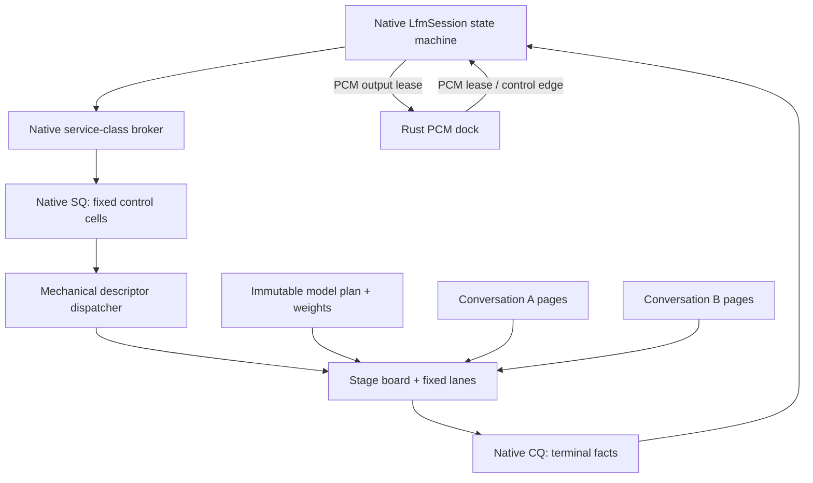

# Scheduler, Passes, And Native Recurrence

Status: normative. This document replaces the earlier design in which a Rust
broker owned every model-pass SQ/CQ edge.

## Goal

Flashkern behaves like a resident command processor that can recur in realtime:

- a native session chooses a typed pass;
- one retained descriptor enters the native submission queue;
- fixed lanes fan out stages over shared scratch;
- the last lane publishes exactly one native completion;
- that completion resolves the waiting native continuation;
- the session may immediately recur, switch conversations, fork a candidate,
  emit PCM, or park for an external audio/control event.

No model progress edge requires Rust, Tauri, polling, or serialized IPC.

## Two Scheduling Domains

| Domain | Owner | Work unit | Forward-progress edge |
|---|---|---|---|
| Audio dock | Rust kcoro | PCM lease, device callback, control request, host projection | audio/control ring doorbell resolves a Rust promise |
| Model runtime | Native session and Flashkern | complete model pass, stage, tile, native recurrence action | native CQ doorbell resolves a native continuation |

Rust kcoro is a general parallelism library and the asynchronous audio dock. It
does not schedule model passes. Flashkern's native ticket language may share
record layouts and terminal semantics with Rust kcoro, but endpoint ownership is
different.

## Current Native Mount

The current working tree has one native executor with one in-flight pass slot:

1. `submit_pass` in
   `crates/liquid-audio/native/src/engine/flashkern_engine.cpp:1954-2003`
   creates a generation-protected descriptor and a 128-byte submission cell.
2. `lfm_kernel_bridge_submit` retains the descriptor for the queue and rings the
   native submission doorbell.
3. `bridge_main` at `flashkern_engine.cpp:1898-1951` validates the descriptor,
   request kind, context identity, and epoch before publishing the lane
   generation.
4. Every fixed lane runs the same nested pass program, claims disjoint tiles,
   and crosses zero-spin generation fences.
5. Lane 0 publishes one `KcCompletionV1` after the final fence.
6. `submit_pass` blocks on `lfm_kernel_bridge_wait_completion`, validates exact
   ticket/context/epoch identity, then releases the owner descriptor lease.

The old `LfmKernelSubmitFn`, `lfm_engine_set_submitter`,
`lfm_engine_clear_submitter`, and Rust `coordinator.rs` path are deleted. The
test `raw_engine_owns_its_sq_cq_without_rust_progress` constructs the raw C++
engine and completes a pass without any Rust callback registration.

This is a correct native ring mount, but not the final asynchronous session. The
current C ABI helper waits synchronously because the engine still exposes one
borrowed request slot. The next scheduler cut replaces that slot with native
owned pass slots and parks a native continuation instead of a host call stack.

## Runtime Graph



## Native Pass Slots

The target executor owns a fixed-capacity pool:

```c++
struct PassSlot {
    uint32_t size;
    uint32_t generation;
    uint64_t pass_id;
    uint64_t conversation_id;
    uint64_t epoch;
    PassKind kind;
    PassState state;
    const ModelPlan *model;
    ConversationState *conversation;
    const void *input;
    void *output;
    void *scratch;
    uint32_t flags;
};
```

The descriptor table retains a slot, not an arbitrary callback/context pointer.
Its generation prevents ABA after recycling. The SQ cell carries only ticket,
slot ID, generation, service class, deadline, and cancellation epoch. The slot
retains every model, conversation, state-page, input, output, and scratch lease
until CQ consumption.

No weight, activation, KV row, PCM sample, or state page is copied into SQ/CQ.

## Native Recurrence State Machine

Each conversation has explicit serializable coordination state:

```text
parked
  -> input_ready
  -> frontend
  -> conformer
  -> prefill_or_token
  -> sample
  -> depthformer_or_codec
  -> output_ready
  -> recur | parked | complete | canceled | faulted
```

A completion callback is the only transition trigger. The callback claims the
terminal result, commits or rolls back state according to pass policy, unlinks
the slot, and enqueues at most one next action. It does not spin, poll another
queue, call Tauri, or allocate.

The native runtime can do something a static GPU command list cannot: inspect
live modality, conversation state, deadline, candidate epoch, and output
pressure at a pass boundary, then recur immediately. This is how one model can
interleave multiple conversations without duplicating weights.

### Fairness

The native broker has bounded service classes:

1. active capture and barge-in reflex;
2. active user response;
3. committed codec/playback production;
4. predictive listening candidate;
5. background agent branch;
6. snapshot and maintenance.

Each conversation receives a configurable consecutive-pass quantum. Expired
quantum returns it to the ready queue; age promotion prevents starvation. A
completion flood has a bounded drain budget before another ready scope is
served.

### Standing orders

A standing order is optional optimization, not a liveness crutch. It allows a
session to chain a measured pass family for budget `N` without returning to the
general broker between each pass. It stops at EOT, epoch change, output
backpressure, deadline, or budget exhaustion. The ordinary completion contract
still publishes every pass terminal fact.

## Fixed Lane Team

The numerical team uses stable OS threads and ordinary C++ call stacks. A parked
lane cannot steal unrelated work from its own incomplete pass, so movable lane
coroutines add no useful parallelism.

Each stage:

1. the last prior arriver publishes immutable stage metadata and resets the
   claim counter;
2. lanes fetch-add disjoint tile ranges;
3. each tile calls a prebound assembly symbol;
4. each lane arrives once at the generation fence;
5. the last lane runs the bounded serial transition and release-publishes the
   next generation;
6. only lanes that declared themselves parked are woken.

Tickets exist at pass/command granularity. Tiles and stages use counters and
barriers; a ticket per tile is forbidden.

## Zero-Spin Fence

`lane_fence` uses the expected-value wait contract:

```text
read logical generation
arrive
if last:
    run bounded serial transition
    publish next generation
    exchange parked mask
    wake declared waiters
else:
    declare lane bit
    recheck generation
    block on shared expected-value word
```

There is no bounded spin tier. Interrupt and stop doorbells are checked only at
complete pass boundaries, not inside an assembly operation or each tile.

## C++ / Assembly Boundary

C++ may:

- validate dimensions, counts, offsets, and generations;
- bind immutable pointers and choose an architecture symbol;
- claim tiles and sequence stages;
- copy already-computed control records or state bytes;
- publish terminal facts and manage leases.

C++ may not:

- add, multiply, normalize, activate, sample, convolve, rotate, transform, or
  quantize model values;
- contain a scalar numerical fallback;
- allocate or grow scratch after plan readiness;
- invoke Rust, Tauri, storage, telemetry, or a general channel from a pass.

The current extraction begins in
`native/kernels/aarch64/flashkern_math.S:9-133` and
`native/kernels/x86_64/flashkern_math.S:9-211`. Existing numerical C++ loops
outside those leaves are migration defects, not an approved permanent tier.

## Terminal Arbitration

Every accepted pass publishes four independent facts:

```text
execution:    not_dispatched | completed | failed
state:        none | committed | rolled_back | poisoned
publication:  none | committed | stale
cause:        success | rejected | canceled | timed_out | stale_epoch | stop | fault
```

An interrupt cannot tear an assembly pass in half. The pass reaches its boundary.
For committed conversational thought, state may remain committed while old-epoch
audio publication becomes stale. Speculative candidate state rolls back as one
subtree. The same terminal claim prevents completion/cancel/timeout/close from
waking one continuation twice.

## Park, Pause, And Cancel

- **Park** suspends one continuation while its children continue. Child
  completion is what resolves the parent promise.
- **Pause** prevents a scope and descendants from starting new work at legal
  boundaries. Existing passes settle first.
- **Cancel** advances the scope epoch, prevents new admission, and resolves every
  outstanding child with one terminal cause.

Stopping speech advances the output epoch immediately. Native playback flushes
old-epoch PCM; active model state follows its declared commit/rollback policy.
Rust learns the transition through the audio/control CQ but is not required to
make it happen.

## Gates

1. Raw native pass succeeds with no Rust submitter symbol or callback context.
2. One million passes settle one owner lease plus one queue lease each, with zero
   live descriptors and zero polling.
3. Stop during submit, dispatch, fence, completion, and CQ consumption settles
   exactly once and joins promptly.
4. 100,000 completion/cancel/timeout/close races produce one winner and one wake.
5. AArch64 and x86_64 assembly fixtures execute; Rosetta runs scalar ABI tests
   even when SIMD features are absent.
6. No allocation occurs after model/session readiness on submit, dispatch,
   stage, completion, recurrence, capture, or playback paths.
7. Two conversations alternate for at least 10,000 passes over one model image;
   state never crosses conversation IDs and weights are not duplicated.
8. Rust/Tauri can be deliberately stalled while native recurrence and buffered
   audio continue within configured deadlines.
