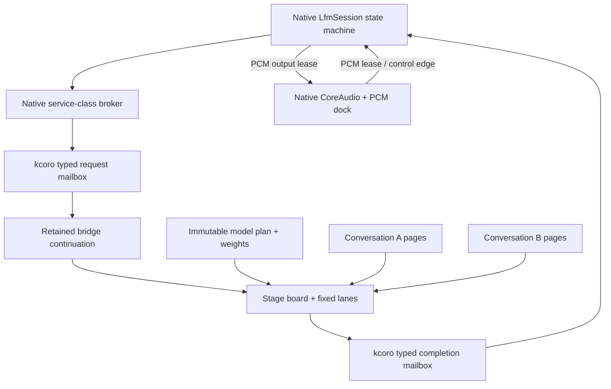

# Scheduler, Passes, And Native Recurrence

Status: normative. This document replaces the earlier design in which a Rust
broker owned every model-pass SQ/CQ edge.

## Goal

Flashkern behaves like a resident command processor that can recur in realtime:

- a native session chooses a typed pass;
- one retained descriptor enters the native submission queue;
- fixed lanes fan out stages over shared scratch;
- the fixed-team final-return callback publishes exactly one native completion;
- that completion makes the suspended native continuation runnable;
- the session may immediately recur, switch conversations, fork a candidate,
  emit PCM, or park for an external audio/control event.

No model progress edge requires Rust, Tauri, polling, or serialized IPC.

## Two Scheduling Domains

| Domain | Owner | Work unit | Forward-progress edge |
|---|---|---|---|
| Audio dock | Native session/kcoro | PCM lease, device callback, control request | native record publication resumes the exact continuation |
| Model runtime | Native session and Flashkern | complete model pass, stage, tile, native recurrence action | native CQ publication resumes a retained continuation |

Rust kcoro owns bounded host control/observation only and does not schedule model
passes or own PCM endpoints. Flashkern and the native audio dock share kcoro's
ticket/continuation semantics inside one native ownership domain.

## Current Native Mount

The current working tree has one native executor with a fixed pass-slot pool:

1. `submit_slot` retains a generation-protected slot and publishes one compact
   request into the embedded `kc::Mailbox`.
2. Mailbox publication resumes the exact retained bridge continuation. It
   validates request kind, slot lease generation, context identity, epoch,
   parent, and pass ticket before dispatching the fixed team.
3. Every fixed lane runs the same nested pass program, claims disjoint tiles,
   and returns at the current stage boundary.
4. The fixed-team final-return callback advances the same ticket to its next
   stage or publishes one terminal typed completion.
5. Completion publication resumes the same retained continuation. It consumes
   the completion, validates exact ticket, parent, slot lease, context, and
   epoch identity, and invokes the pass continuation. No thread waits for that
   fact.

The old `LfmKernelSubmitFn`, `lfm_engine_set_submitter`,
`lfm_engine_clear_submitter`, and Rust `coordinator.rs` path are deleted. The
standalone C++23 mailbox contract covers exact ticket delivery, saturation,
stale-completion rejection, drain-after-stop, endpoint retirement, and
correlated callback counts. The native speech gate exercises the same mailbox
through the complete real-checkpoint engine without a Rust runtime.

The request/completion mailbox is an unversioned in-process C++23 type owned by
kcoro. Its four setup-time endpoint leases are non-copyable, its cells and
ticket ledger are fixed and sequence-stamped, and an accepted request reserves
completion capacity until exact consumption. Empty live endpoints return
`-EAGAIN`; capacity exhaustion dehydrates the producer continuation until the
correlated capacity callback fires. A continuation's durable state lives in
its saved frame: program counter, fixed locals, exact ticket, and retained
generation-leased pass-slot reference. The pass slot owns typed request and
scratch leases, not continuation identity.

## Runtime Graph



## Native Pass Slots

The target executor owns a fixed-capacity pool:

```c++
struct FlashkernRequest {
    kc_ticket_id ticket;
    kc_ticket_id parent;
    uint64_t conversation_id;
    uint64_t epoch;
    uint64_t lease_generation;
    uint32_t slot;
    uint32_t operation;
};
```

The mailbox retains the slot index and exact lease generation, not an arbitrary
payload or registry handle. The generation prevents ABA after recycling. The
owner-held slot retains every model, conversation, state-page, input, output,
and scratch lease until completion consumption.

No weight, activation, KV row, PCM sample, or state page is copied into SQ/CQ.

## Native Recurrence State Machine

Each conversation has explicit serializable coordination state:

```text
parked
  -> input_ready
  -> frontend
  -> conformer
  -> prefill_or_token
  -> sample
  -> depthformer_or_codec
  -> output_ready
  -> recur | parked | complete | canceled | faulted
```

A completion callback is the only transition trigger. The callback claims the
terminal result, commits or rolls back state according to pass policy, unlinks
the slot, and enqueues at most one next action. It does not spin, poll another
queue, call Tauri, or allocate.

The native runtime can do something a static GPU command list cannot: inspect
live modality, conversation state, deadline, candidate epoch, and output
pressure at a pass boundary, then recur immediately. This is how one model can
interleave multiple conversations without duplicating weights.

### Fairness

The native broker has bounded service classes:

1. active capture and barge-in reflex;
2. active user response;
3. committed codec/playback production;
4. predictive listening candidate;
5. background agent branch;
6. snapshot and maintenance.

Each conversation receives a configurable consecutive-pass quantum. Expired
quantum returns it to the ready queue; age promotion prevents starvation. A
completion flood has a bounded drain budget before another ready scope is
served.

### Standing orders

A standing order is optional optimization, not a liveness crutch. It allows a
session to chain a measured pass family for budget `N` without returning to the
general broker between each pass. It stops at EOT, epoch change, output
backpressure, or budget exhaustion. The ordinary completion contract
still publishes every pass terminal fact.

## Fixed Lane Team

The numerical team uses stable logical member identities mounted as kcoro
continuations on one bounded OS-worker pool. A team member is not a thread:
any eligible free worker may execute that member's ordinary C++ call stack for
one non-suspending stage. Numerical state that survives the member return lives
in the ticket's program record and scratch lease, never in a worker stack or
thread-local storage.

Each stage:

1. the retained ticket continuation publishes immutable stage metadata and
   resets the claim counter;
2. one team generation makes every fixed logical member runnable;
3. members fetch-add disjoint tile ranges and each tile calls a prebound
   assembly symbol;
4. every member returns from the generation;
5. the final return runs the bounded serial transition exactly once and invokes
   the ticket completion edge;
6. that edge advances the durable phase and either dispatches the next
   generation or publishes the terminal CQ record.

Tickets exist at pass/command granularity. Tiles use atomic claims and stages
are durable route labels within that ticket; a ticket per tile or stage is
forbidden.

## No Operation Waiters

The numerical progress contract is:

```text
publish durable ticket phase
dispatch one fixed-team generation
all members return
final return -> callback -> advance phase or terminal CQ
```

There is no numerical fence waiter, bounded spin tier, or host-mediated stage
loop. Members may become dormant only after returning to the team's shared idle
dispatch predicate. Interrupt and stop edges are checked only at declared pass
boundaries, not inside an assembly operation or each tile.

## C++ / Assembly Boundary

C++ may:

- validate dimensions, counts, offsets, and generations;
- bind immutable pointers and choose an architecture symbol;
- claim tiles and sequence stages;
- copy already-computed control records or state bytes;
- publish terminal facts and manage leases.

C++ may not:

- add, multiply, normalize, activate, sample, convolve, rotate, transform, or
  quantize model values;
- contain a scalar numerical fallback;
- allocate or grow scratch after plan readiness;
- invoke Rust, Tauri, storage, telemetry, or a general channel from a pass.

The current extraction begins in
`native/kernels/aarch64/flashkern_math.S:9-133` and
`native/kernels/x86_64/flashkern_math.S:9-211`. Existing numerical C++ loops
outside those leaves are migration defects, not an approved permanent tier.

## Terminal Arbitration

The deleted versioned bridge encoded a generic execution/state/publication/
cause taxonomy in every completion. The in-process mailbox does not. One
accepted pass produces one compact completion containing exact lineage, slot
lease, status, and only the bounded model-specific terminal values its
continuation needs. Team completion and hard expiry still race through one
generation-stamped terminal CAS, so a pass cannot publish twice.

An interrupt cannot tear an assembly pass in half. The pass reaches its boundary.
For committed conversational thought, state may remain committed while old-epoch
audio publication becomes stale. Speculative candidate state rolls back as one
subtree. The same terminal claim prevents completion/cancel/timeout/close from
waking one continuation twice.

## Park, Pause, And Cancel

- **Park** suspends one continuation while its children continue. Child
  completion is what resolves the parent promise.
- **Pause** prevents a scope and descendants from starting new work at legal
  boundaries. Existing passes settle first.
- **Cancel** advances the scope epoch, prevents new admission, and resolves every
  outstanding child with one terminal cause.

Stopping speech advances the output epoch immediately. Native playback flushes
old-epoch PCM; active model state follows its declared commit/rollback policy.
Rust learns the transition through the audio/control CQ but is not required to
make it happen.

## Gates

1. Raw native pass succeeds with no Rust submitter symbol or callback context.
2. One million passes settle one owner lease plus one queue lease each, with zero
   live descriptors and zero polling.
3. Stop during submit, dispatch, fence, completion, and CQ consumption settles
   exactly once and joins promptly.
4. 100,000 completion/cancel/timeout/close races produce one winner and one wake.
5. AArch64 and x86_64 assembly fixtures execute; Rosetta runs scalar ABI tests
   even when SIMD features are absent.
6. No allocation occurs after model/session readiness on submit, dispatch,
   stage, completion, recurrence, capture, or playback paths.
7. Two conversations alternate for at least 10,000 passes over one model image;
   state never crosses conversation IDs and weights are not duplicated.
8. Rust/Tauri can be deliberately stalled while native recurrence and buffered
   audio continue within configured deadlines.
