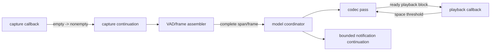

# PCM, Audio I/O, and VAD Design

Status: normative as-built contract for the local LFM2 provider.

## Goal

Keep local capture/playback callbacks, PCM storage, and speech policy native.
CoreAudio renders a complete capture block directly into a preallocated native
reservation; every later handoff is a generation-checked view and each kernel
writes only its declared destination. Rust owns neither platform PCM nor model
progress.

The remote LiveKit provider is a separate product transport and is not an
inference fallback. This design removes the Rust WebRTC loopback used as the
local model's audio device; it does not silently change remote-provider policy.

## Current Code Map

| Current symbol | As-built ownership |
|---|---|
| `lfm_platform_audio.cpp` | Native AUHAL input/output units, callback buffers, device geometry, faults, and teardown. |
| `LfmCaptureProducer` | Sole physical producer over the native circular arena; claim/resolve/commit and explicit gap/XRUN records. |
| `LfmPlaybackConsumer` | Exact ticket/epoch/generation claim, device-buffer render, evidence, capacity release. |
| `voice_session.cpp` | Arena, Sesame microphone/playback state, turn policy, deadlines, capture ranges, playback leases, and native session actions. |
| `voice_runtime.rs` | Opaque native platform-audio handle, controls, and bounded outward event projection only. |

No Rust PCM ring, capture/output trait, utterance vector, CPAL dependency, or
audio payload event remains in the local LFM2 path.

## Platform Adapter Boundary

Native C++ owns the platform API and one producer/consumer endpoint pair per
session. On macOS, `lfm_platform_audio_default_config` captures exact default
device identity, sample rates, and callback geometry before session creation.
`lfm_platform_audio_create` mounts AUHAL units while the session is still
`CREATED`; start admits callbacks only after every arena and record is sealed.
Other platforms return unsupported until an equivalent native adapter lands.

Echo cancellation, noise suppression, and gain control are capabilities, not
assumptions. The native adapter must report what the device path actually
provides and pass the echo/barge-in app gate; raw AUHAL is not declared
equivalent to a processed WebRTC path merely because it produces samples.

## Capture Ring

Use one fixed circular `float` arena allocated at session creation. A capture
chunk carries a monotonic sample cursor, offset, frame count, stream epoch,
ticket, lease identity, and buffer generation; it never carries an enduring
pointer. Native consumers resolve the descriptor only while the generation is
live.

On macOS the page-rounded arena is mapped twice into adjacent virtual ranges.
A callback that crosses the physical wrap therefore receives one contiguous
virtual destination backed by the same pages—no relocation or wrap copy. The
portable arena resolver may return two borrowed spans, but no non-Apple product
adapter is selected until it meets the same callback contract.

Capacity is configured from two simultaneously live 30-second turn ranges plus
detector cadence and callback guards:

```text
2 * forced_endpoint_frames + 2 * cadence_frames + 2 * largest_callback_frames
```

When the ring cannot accept a callback block, it drops the new block, increments
a realtime-safe counter, and rings one error/endpoint doorbell. It does not
allocate, block, evict leased speech, or overwrite unread data.

## Callback Rules

Capture callback:

1. Claim and resolve one complete native callback reservation.
2. Ask `AudioUnitRender` to write mono f32 directly into that destination.
3. Commit the typed chunk record with release ordering, or publish an explicit
   sequenced gap/XRUN after draining an unadmitted hardware block.
4. Return.

Playback callback:

1. Observe a flush generation at callback entry.
2. Drain already-produced PCM directly from the playback ring into the hardware
   buffer, converting/duplicating channels as needed.
3. Fill any underrun remainder with silence.
4. Update played-frame count and actual played RMS.
5. Publish the exact capacity-release edge when a lease retires.
6. Return.

Callbacks may not allocate, lock, emit Tauri events, run VAD, resample, enter
the model, or invoke a continuation inline. Their progress operation is the
bounded native record publication that resumes an existing continuation edge.

## VAD State Machine

```mermaid
stateDiagram-v2
    [*] --> Listening
    Listening --> Candidate: voiced window
    Candidate --> Speaking: minimum speech reached
    Candidate --> Listening: false start
    Speaking --> Pause: silence begins
    Pause --> Speaking: speech resumes
    Pause --> Prepared: tentative endpoint triggers speculative prepare
    Prepared --> Speaking: speech resumes; rollback prepare
    Prepared --> Commit: endpoint duration reached
    Commit --> Listening: utterance span submitted
    Speaking --> BargeCandidate: assistant reference active
    BargeCandidate --> Speaking: insufficient sustained speech
    BargeCandidate --> Interrupt: sustained independent speech
    Interrupt --> Commit: commit overlapping user span
```



`TurnDetector` reads fixed windows directly from capture spans and keeps running
sum-of-squares state. It does not accumulate a second PCM vector. Preserve the
current policies implemented around `voice_runtime.rs:1344-1596`:

- minimum utterance duration;
- configurable endpoint silence;
- pre-roll/start trimming;
- speculative prepare during a pause and rollback if speech resumes;
- playback-aware thresholding;
- two-window sustained barge-in rather than one loud transient;
- a partial assistant turn may be interrupted without erasing generated model
  state.

The exact thresholds continue to come from `LfmSessionConfigV1`, populated by
`Lfm2Settings` at `packages/desktop/src-tauri/src/settings.rs:213-250`.

### Predictive pause as a ticketed candidate

Speculative preparation is an ordinary native coordination action, not a second
VAD or scheduler mechanism. When `Pause -> Prepared` occurs, the native session:

1. freezes a `CandidateMark` containing the conversation/context mark, retained
   PCM end, candidate epoch, and output epoch;
2. creates one parent candidate ticket retaining that mark and input-span lease;
3. submits frontend/prefill work as native full-pass child tickets;
4. keeps completed prepared state private until endpoint commit wins;
5. publishes no user turn, transcript, or playback merely because preparation
   completed.

The parent owns a separate terminal decision operation. Endpoint commit, resumed
speech, stop, and fault race through the same one-winner claim/publish machinery
used by other kcoro operations. Numerical child completion is not that decision:
it may finish before or after the VAD race.

- If endpoint commit wins, the native session adopts a current-generation prepared
  result or continues the missing child work, then submits the real response.
- If resumed speech wins, it advances the candidate epoch and cancels the parent.
  Queued children never dispatch; an active child finishes its full pass and is
  rolled back or marked stale at its declared boundary.
- If a child completion carries an old candidate epoch, it cannot mutate the
  current mark or publish output, regardless of which thread observed it first.
- Parent terminal publication waits until every retained child/lease is drained,
  so cancellation does not free state under an active pass.

The candidate ticket therefore makes predictive listening cleaner: speech
resume is a precise cancellation edge, endpoint is a precise commit edge, and
the full-pass rule remains unchanged. No Tauri event or observer callback decides
the race.

## Turn and Frame Modes

Both modes consume the same capture ring but have distinct state machines.

### LFM2 turn mode

- VAD owns an utterance lease.
- A tentative pause may create a speculative frontend/prefill mark.
- Commit passes the span descriptor and epoch to the frontend continuation.
- The span remains leased until mel consumption completes.
- Interrupt commits overlapping user speech according to the responsive-turn
  policy; it never erases already-generated assistant context because playback
  was cut.

### Moshi frame mode

- No VAD gates model input.
- A frame assembler resolves capture ranges, resamples into one preallocated
  model-frame slot, and publishes a descriptor pointer.
- Silence frames advance the model clock only at the configured frame interval.
- Backpressure drops stale not-yet-submitted capture frames while preserving the
  continuous Moshi stream state.
- An interrupt advances output epoch and flushes playback; it does not reset the
  Moshi LM or Mimi stream. This preserves the behavior currently tested around
  `crates/liquid-audio/src/runtime/realtime.rs:785-849`, `885-895`.

## Playback Ring and Reference Audio

Model/codec kernels reserve a contiguous playback block and write PCM directly
into it. Publication changes block state from `Reserved` to `Ready`; there is no
intermediate event carrying `Vec<f32>`.

Playback reference is true while any of these hold:

- generated PCM for the current epoch is queued;
- the hardware callback reports active playback;
- the measured room/processing tail has not expired.

This preserves the current `reference_audio_active` rule at
`voice_runtime.rs:1777-1811` while making played state come from the native
callback. Flush advances playback generation and makes old ready blocks
unreadable. It does not mutate conversation history.

Stats semantics stay explicit:

- decoded frames: codec successfully published PCM;
- queued frames: playback block became ready;
- dropped frames: no output capacity or stale epoch;
- played frames: reported only by successful platform playback consumption;
- underrun frames: silence inserted by playback callback.

## Wake Topology



No thread sleeps and rechecks ring length. Capture publication and playback
lease retirement are the only data/space edges.

These edges use document 09's callback/dormancy contract. No audio block or
capacity condition owns a waiter. The hardware callback release-publishes its
cursor/generation through the prebound native dock edge. That edge makes the
durable session continuation runnable; it never runs the continuation inline,
allocates, takes the runtime mutex, or invokes a Rust callback. Platforms
without a direct realtime-safe native edge fail microphone setup rather than
falling back to a pthread bridge. The resumed continuation drains a fixed quota
and republishes itself only while its owned predicate remains ready. A complete
utterance creates one parent action ticket, and each model/codec pass reports
readiness through the native completion path in documents 03 and 12.

## Implementation Map

Landed:

1. Native circular capture arena, exact chunk/gap records, lease generations,
   and deterministic wrap/lifetime tests.
2. Native Sesame detector, sample-clock turn policy, playback evidence, and
   correlated deadline children.
3. Native playback reservations, Mimi/device-rate output, flush, underrun, and
   exact capacity-release edges.
4. Native macOS AUHAL capture/playback units with direct capture rendering into
   the page-mirrored arena.
5. Rust PCM traits, CPAL dependency, rings, utterance vectors, VAD, and audio
   payload events deleted.
6. A real-checkpoint, two-native-agent, in-memory speech gate that traverses
   typed input → audio tokens → Mimi PCM → native capture → Sesame → full model
   → Mimi PCM twice with deterministic evidence.

Open release work:

1. Prove microphone, speaker, actual device-rate geometry, echo, and barge-in in
   the desktop app.
2. Report and gate device processing capabilities rather than assuming AEC/NS/AGC.
3. Add native adapters for other platforms; unsupported systems must continue
   to fail explicitly.
4. Keep remote LiveKit isolated under its provider boundary; it is not a local
   inference fallback.

## Acceptance Gates

- AUHAL renders capture directly into the native arena. A copy audit finds no
  intermediate callback, utterance, or model-frame `Vec<f32>`.
- A callback crossing the macOS page-mirrored wrap receives one contiguous view;
  no concatenation or relocation occurs.
- Stale generation, overrun, underrun, and lease exhaustion fail deterministically.
- No allocation, blocking mutex, continuation execution, ticket callback, Rust
  callback, or Tauri callback occurs on an audio callback thread; it only
  publishes fixed native records/lease edges.
- Turn endpoint traces match the current configured behavior on silence, false
  pause, short utterance, long utterance, and barge-in fixtures.
- In 100,000 commit/resume/child-complete/stop races, one candidate decision
  wins, one parent terminal event is delivered, every child/PCM lease drains,
  and no stale prepared state reaches the active conversation.
- Resumed speech before dispatch causes zero candidate kernel entries; resumed
  speech during dispatch permits one full pass and then rolls back or marks stale
  without a second old-epoch child.
- Frame mode preserves Moshi stream state across interrupt and backpressure.
- Flush removes all old-epoch queued/native audio; no old PCM is played after the
  flush edge.
- Played statistics advance only from the platform playback callback.
- Stop while capture is idle, capture is active, playback is full, and playback
  is draining completes with exactly one terminal event and no polling timeout.
- The desktop microphone/speaker/rate/AEC app gate passes before release.

## Non-Goals

- No kernel work in hardware callbacks.
- No claim that the ephemeral hardware buffer itself can be retained zero-copy.
- No VAD gate in Moshi frame mode.
- No use of disk, WAL, or conversation snapshotting in the audio callback path.
