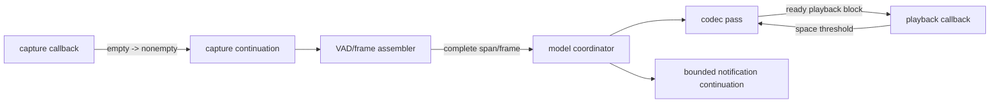

# PCM, Audio I/O, and VAD Design

Status: normative design for the local model provider.

Baseline: EmberHarmony `321538f11749`.

## Goal

Move local capture, playback, PCM storage, VAD, endpointing, barge-in, and frame
clocking into the native session. After the hardware callback copies a device
buffer into a preallocated native ring, PCM is passed only by retained spans and
is mutated only in declared destination buffers.

The remote LiveKit provider is a separate product transport and is not an
inference fallback. This design removes the Rust WebRTC loopback used as the
local model's audio device; it does not silently change remote-provider policy.

## Current Code Map

| Current symbol | Evidence | Required replacement |
|---|---|---|
| `ExternalAudioInput` / writer | `crates/liquid-audio/src/runtime/voice_runtime.rs:85-132` | Native capture adapter writes directly into native ring. |
| `ExternalAudioOutput` | `voice_runtime.rs:94-160` | Native playback adapter drains native ring. |
| `PcmRing` | `voice_runtime.rs:163-282` | Segmented fixed SPSC PCM region with generation-protected spans. |
| `PlaybackReference` | `voice_runtime.rs:284-341` | Native playback/echo-reference state updated by actual playback callback. |
| `PlaybackOutput` / `OutputSink` | `voice_runtime.rs:343-419` | One native output owner, with platform adapter selected at session start. |
| Consumer/output threads | `voice_runtime.rs:421-449`, `1040-1343` | Native notification and playback continuations; no Rust worker. |
| `VoiceRuntime::interrupt` | `voice_runtime.rs:740-748` | Epoch doorbell plus native playback flush. |
| Turn VAD | `voice_runtime.rs:1344-1596` | Native `TurnDetector` continuation reading retained ring windows. |
| Frame clock/resampler | `voice_runtime.rs:1599-1775` | Native frame assembler and resampler writing fixed model-frame slots. |
| CPAL callbacks | `voice_runtime.rs:1820-2000` | Native platform-specific callback adapter. |
| Desktop local WebRTC output | `packages/desktop/src-tauri/src/voice/runtime.rs:2965-3155` | Remove from local model path. |
| Desktop local WebRTC input | `voice/runtime.rs:3158-3419` | Remove from local model path. |

The current implementation is not payload-zero-copy. `PcmRing::drain_into`
pushes into a `Vec` (`voice_runtime.rs:254-260`), VAD slices new utterance vectors
(`1511`, `1542-1556`), frame mode creates a new vector per model frame
(`1663-1686`), and external output drains into a new vector (`263-276`).

## Platform Adapter Boundary

Define a native C++ platform interface, implemented inside the native library:

```c++
struct AudioFormat {
    uint32_t sample_rate;
    uint16_t channels;
    SampleFormat format;
    uint16_t frames_per_callback;
};

class AudioDevice {
public:
    virtual ~AudioDevice() = default;
    virtual AudioCapabilities capabilities() const noexcept = 0;
    virtual Status open(const AudioDeviceConfig &, CaptureSink *, PlaybackSource *) = 0;
    virtual Status start() = 0;
    virtual void request_stop() noexcept = 0;
    virtual Status join() = 0;
};
```

The virtual calls occur only at device lifecycle boundaries. Hardware callbacks
call fixed nonvirtual sink/source functions. Platform files live under:

```text
native/src/platform/audio_device.h
native/src/platform/macos/coreaudio_device.mm
native/src/platform/linux/pipewire_device.cpp
native/src/platform/windows/wasapi_device.cpp
```

Only implemented platform adapters are advertised through capability bits. A
platform build with no local audio adapter may still expose model APIs for an
explicit native transport adapter, but Tauri local voice start fails clearly.

Echo cancellation, noise suppression, and gain control are capabilities, not
assumptions. The current desktop code configures WebRTC audio processing at
`packages/desktop/src-tauri/src/voice/runtime.rs:1964-1973` and uses
`PlatformAudio` in the local loops. The replacement adapter must report which
processing is active and pass an echo/barge-in app gate. A raw CoreAudio path is
not declared equivalent merely because it produces samples.

## Capture Ring

Use a fixed segmented SPSC region allocated at session creation. Fixed-size
blocks make callback writes contiguous while allowing a logical utterance to
span wraparound without copying.

```c
typedef struct LfmPcmSpanV1 {
    uint32_t size;
    uint32_t abi_version;
    uint64_t region_id;
    uint64_t generation;
    uint64_t start_frame;
    uint64_t frame_count;
    uint32_t sample_rate;
    uint16_t channels;
    uint16_t format;
} LfmPcmSpanV1;
```

`start_frame` is a monotonic logical index, not a raw pointer. Native readers
resolve it to one or two physical ranges in the ring. A retained span pins every
covered block generation until the consumer releases the lease. Stale generation
resolution fails; it never reads overwritten PCM.

```c++
struct PcmBlock {
    alignas(64) std::atomic<uint64_t> generation;
    std::atomic<uint32_t> leases;
    uint32_t frames;
    float mono[kFramesPerBlock];
};

struct PcmRing {
    PcmBlock *blocks;
    uint32_t block_count;
    std::atomic<uint64_t> write_frame;
    std::atomic<uint64_t> read_frame;
    std::atomic<uint32_t> wake_armed;
};
```

Capacity is configured from maximum utterance duration, pre-roll, and callback
headroom. The current six-second mic ring (`voice_runtime.rs:36`, `111`) is too
small for the current 30-second utterance cap (`voice_runtime.rs:38`) if a whole
utterance must remain leased. The target defaults to at least:

```text
max_utterance_ms + pre_roll_ms + 2 * largest_callback_ms
```

When the ring cannot accept a callback block, it drops the new block, increments
a realtime-safe counter, and rings one error/endpoint doorbell. It does not
allocate, block, evict leased speech, or overwrite unread data.

## Callback Rules

Capture callback:

1. Convert/downmix the hardware buffer directly into the reserved ring block.
2. Use vectorized conversion where the format permits it.
3. Publish frame count and write index with release ordering.
4. Wake the capture continuation only on empty-to-nonempty transition.
5. Return.

Playback callback:

1. Observe a flush generation at callback entry.
2. Drain already-produced PCM directly from the playback ring into the hardware
   buffer, converting/duplicating channels as needed.
3. Fill any underrun remainder with silence.
4. Update played-frame count and actual played RMS.
5. Wake a blocked producer only when crossing a configured free-space threshold.
6. Return.

Callbacks may not call kcoro, allocate, lock a contended mutex, emit Tauri
events, run VAD, resample, or enter the model. They only copy/convert and ring a
realtime-safe doorbell.

The current CPAL callback behavior at `voice_runtime.rs:1842-1855` and
`1906-1984` is the semantic reference for format conversion, underrun accounting,
flush, and played-sample statistics.

## VAD State Machine

```mermaid
stateDiagram-v2
    [*] --> Listening
    Listening --> Candidate: voiced window
    Candidate --> Speaking: minimum speech reached
    Candidate --> Listening: false start
    Speaking --> Pause: silence begins
    Pause --> Speaking: speech resumes
    Pause --> Prepared: tentative endpoint triggers speculative prepare
    Prepared --> Speaking: speech resumes; rollback prepare
    Prepared --> Commit: endpoint duration reached
    Commit --> Listening: utterance span submitted
    Speaking --> BargeCandidate: assistant reference active
    BargeCandidate --> Speaking: insufficient sustained speech
    BargeCandidate --> Interrupt: sustained independent speech
    Interrupt --> Commit: commit overlapping user span
```



`TurnDetector` reads fixed windows directly from capture spans and keeps running
sum-of-squares state. It does not accumulate a second PCM vector. Preserve the
current policies implemented around `voice_runtime.rs:1344-1596`:

- minimum utterance duration;
- configurable endpoint silence;
- pre-roll/start trimming;
- speculative prepare during a pause and rollback if speech resumes;
- playback-aware thresholding;
- two-window sustained barge-in rather than one loud transient;
- a partial assistant turn may be interrupted without erasing generated model
  state.

The exact thresholds continue to come from `LfmSessionConfigV1`, populated by
`Lfm2Settings` at `packages/desktop/src-tauri/src/settings.rs:213-250`.

### Predictive pause as a ticketed candidate

Speculative preparation is an ordinary native coordination action, not a second
VAD or scheduler mechanism. When `Pause -> Prepared` occurs, the native session:

1. freezes a `CandidateMark` containing the conversation/context mark, retained
   PCM end, candidate epoch, and output epoch;
2. creates one parent candidate ticket retaining that mark and input-span lease;
3. submits frontend/prefill work as native full-pass child tickets;
4. keeps completed prepared state private until endpoint commit wins;
5. publishes no user turn, transcript, or playback merely because preparation
   completed.

The parent owns a separate terminal decision operation. Endpoint commit, resumed
speech, stop, and fault race through the same one-winner claim/publish machinery
used by other kcoro operations. Numerical child completion is not that decision:
it may finish before or after the VAD race.

- If endpoint commit wins, the native session adopts a current-generation prepared
  result or continues the missing child work, then submits the real response.
- If resumed speech wins, it advances the candidate epoch and cancels the parent.
  Queued children never dispatch; an active child finishes its full pass and is
  rolled back or marked stale at its declared boundary.
- If a child completion carries an old candidate epoch, it cannot mutate the
  current mark or publish output, regardless of which thread observed it first.
- Parent terminal publication waits until every retained child/lease is drained,
  so cancellation does not free state under an active pass.

The candidate ticket therefore makes predictive listening cleaner: speech
resume is a precise cancellation edge, endpoint is a precise commit edge, and
the full-pass rule remains unchanged. No Tauri event or observer callback decides
the race.

## Turn and Frame Modes

Both modes consume the same capture ring but have distinct state machines.

### LFM2 turn mode

- VAD owns an utterance lease.
- A tentative pause may create a speculative frontend/prefill mark.
- Commit passes the span descriptor and epoch to the frontend continuation.
- The span remains leased until mel consumption completes.
- Interrupt commits overlapping user speech according to the responsive-turn
  policy; it never erases already-generated assistant context because playback
  was cut.

### Moshi frame mode

- No VAD gates model input.
- A frame assembler resolves capture ranges, resamples into one preallocated
  model-frame slot, and publishes a descriptor pointer.
- Silence frames advance the model clock only at the configured frame interval.
- Backpressure drops stale not-yet-submitted capture frames while preserving the
  continuous Moshi stream state.
- An interrupt advances output epoch and flushes playback; it does not reset the
  Moshi LM or Mimi stream. This preserves the behavior currently tested around
  `crates/liquid-audio/src/runtime/realtime.rs:785-849`, `885-895`.

## Playback Ring and Reference Audio

Model/codec kernels reserve a contiguous playback block and write PCM directly
into it. Publication changes block state from `Reserved` to `Ready`; there is no
intermediate event carrying `Vec<f32>`.

Playback reference is true while any of these hold:

- generated PCM for the current epoch is queued;
- the hardware callback reports active playback;
- the measured room/processing tail has not expired.

This preserves the current `reference_audio_active` rule at
`voice_runtime.rs:1777-1811` while making played state come from the native
callback. Flush advances playback generation and makes old ready blocks
unreadable. It does not mutate conversation history.

Stats semantics stay explicit:

- decoded frames: codec successfully published PCM;
- queued frames: playback block became ready;
- dropped frames: no output capacity or stale epoch;
- played frames: reported only by successful platform playback consumption;
- underrun frames: silence inserted by playback callback.

## Wake Topology



No thread sleeps for 5 ms and rechecks ring length. The current drain polling at
`voice_runtime.rs:429-447` and turn drain loop in the consumer are replaced by
space/drained edges from the playback owner.

These edges use document 09's zero-spin wait-word contract. A waiter reads the
ring generation once, registers/rechecks, and blocks. The hardware callback
only publishes cursors/generation and rings the platform doorbell; it does not
enter kcoro or invoke a ticket callback. A complete utterance/frame creates one
parent action ticket, and each model/codec pass reports readiness through the
native completion path in documents 03 and 12.

## Implementation Map

1. Add native PCM region/ring/span implementation and deterministic wrap/lease
   tests.
2. Add a test audio adapter that uses the real ring and callback contract, not a
   duplicate model of it.
3. Port stats and playback reference semantics from
   `voice_runtime.rs:284-341`, `533-580`, and `1877-2000`.
4. Port turn VAD as a native continuation; compare endpoint and barge-in traces
   against the current Rust implementation on recorded fixtures.
5. Add the candidate parent/decision operation, candidate-epoch check, and
   frontend/prefill child-ticket join before enabling speculative prepare.
6. Port frame assembler/resampler behavior from `voice_runtime.rs:1599-1775`.
7. Mount a native platform adapter and prove AEC/echo behavior in the actual
   desktop app.
8. Replace `start_local_webrtc_input` and `start_local_webrtc_output` calls at
   `packages/desktop/src-tauri/src/voice/runtime.rs:2339-2340`.
9. Remove local WebRTC loopback helpers at `runtime.rs:2965-3419` from the local
   provider path.
10. Remove `ExternalAudioInput`, `ExternalAudioOutput`, `PcmRing`, `vad_loop`,
   `frame_loop`, `spawn_consumer`, and CPAL product code after app gates pass.
11. Keep remote LiveKit code isolated under its provider boundary; it cannot be a
    fallback for local model audio.

## Acceptance Gates

- Callback-to-ring is the only capture payload copy. A copy audit finds no
  utterance or model-frame `Vec<f32>` in the production path.
- An utterance crossing ring wrap is processed from retained spans without
  concatenation.
- Stale generation, overrun, underrun, and lease exhaustion fail deterministically.
- No allocation, blocking mutex, kcoro call, or Tauri callback occurs on an audio
  callback thread.
- Turn endpoint traces match the current configured behavior on silence, false
  pause, short utterance, long utterance, and barge-in fixtures.
- In 100,000 commit/resume/child-complete/stop races, one candidate decision
  wins, one parent terminal event is delivered, every child/PCM lease drains,
  and no stale prepared state reaches the active conversation.
- Resumed speech before dispatch causes zero candidate kernel entries; resumed
  speech during dispatch permits one full pass and then rolls back or marks stale
  without a second old-epoch child.
- Frame mode preserves Moshi stream state across interrupt and backpressure.
- Flush removes all old-epoch queued/native audio; no old PCM is played after the
  flush edge.
- Played statistics advance only from the platform playback callback.
- Stop while capture is idle, capture is active, playback is full, and playback
  is draining completes with exactly one terminal event and no polling timeout.
- The desktop microphone/speaker/AEC app gate passes before Rust local WebRTC or
  CPAL ownership is deleted.

## Non-Goals

- No kernel work in hardware callbacks.
- No claim that the ephemeral hardware buffer itself can be retained zero-copy.
- No VAD gate in Moshi frame mode.
- No use of disk, WAL, or conversation snapshotting in the audio callback path.
