# Native Resampler and Mel Frontend

Status: normative design.

Baseline: EmberHarmony `321538f11749`.

## Goal

Port the exact LFM2 audio-input frontend from Rust/Candle into native plans and
Flashkern stages. A retained PCM span is consumed in place and normalized mel is
written directly into a session-owned mel plane. No waveform tensor, DFT tensor,
or concatenated mel tensor crosses the Rust boundary.

## Current Numerical Contract

The production behavior is distributed across two Rust modules:

| Current function | Evidence | Contract to preserve |
|---|---|---|
| `PreprocessorConfig::mel_config` | `crates/liquid-audio/src/processor.rs:791-827` | Derive sample rate, window, hop, FFT, mel bins, preemphasis, guard, padding. |
| `ChatState::add_audio` | `crates/liquid-audio/src/processor.rs:1089-1163` | Validate mono waveform, resample to 16 kHz, compute mel, trim valid frames, append segment length. |
| `hann` | `crates/liquid-audio/src/processor.rs:82-91` | Symmetric Hann, `periodic=false`. |
| `mel_filterbank` | `crates/liquid-audio/src/processor.rs:118-147` | Librosa Slaney scale and normalization. |
| `dft_conv_kernel` | `crates/liquid-audio/src/processor.rs:166-179` | Onesided real DFT basis with window folded in. |
| `FilterbankFeatures::new` | `crates/liquid-audio/src/processor.rs:181-210` | Precompute filterbank and DFT plan once. |
| `get_seq_len` | `crates/liquid-audio/src/processor.rs:224-252` | Exact centered/exact-pad frame count. |
| `stft` | `crates/liquid-audio/src/processor.rs:254-286` | Center pad and strided DFT cross-correlation. |
| `FilterbankFeatures::forward` | `crates/liquid-audio/src/processor.rs:302-398` | Flatten/cast, exact padding, preemphasis, power, mel matmul, log guard, per-feature normalization, trailing mask, `pad_to`. |
| `normalize_batch` | `crates/liquid-audio/src/processor.rs:401-472` | Per-feature sample standard deviation (`ddof=1`), NaN-to-zero, epsilon. |

The native port is not free to substitute a conventional FFT/mel package with
different window periodicity, padding, mel normalization, variance convention,
or log guard.

## Native Objects

```c++
struct LfmResamplerPlan {
    uint32_t source_rate;
    uint32_t target_rate;
    uint32_t lowpass_width;
    float rolloff;
    // Immutable phase kernels, built at model/session creation.
};

struct LfmResamplerState {
    uint64_t input_cursor;
    uint64_t output_cursor;
    float carry[kMaximumFilterCarry];
    uint32_t carry_count;
};

struct LfmMelPlan {
    uint32_t sample_rate;
    uint32_t window;
    uint32_t hop;
    uint32_t fft;
    uint32_t bins;
    uint32_t pad_to;
    float preemphasis;
    float log_guard;
    bool exact_pad;
    const float *windowed_dft;
    const float *filterbank;
};

struct LfmMelWork {
    float *resampled_pcm;
    float *spectrum_real;
    float *spectrum_imag;
    float *power;
    float *log_mel;
    float *sum;
    float *sum_sq;
    uint32_t frame_capacity;
};

struct LfmMelSegment {
    uint64_t segment_id;
    uint64_t epoch;
    float *data;       // bins x padded_frames
    uint32_t valid_frames;
    uint32_t padded_frames;
    uint32_t bins;
};
```

Plans are immutable model/session state. Work buffers are allocated to the
configured maximum utterance at session creation or grown only at a control
boundary before accepting capture. The hot path does not allocate.

## Stage Graph

```mermaid
flowchart LR
    PCM["retained PCM span"] --> RS["polyphase resample to 16 kHz"]
    RS --> PRE["padding + preemphasis"]
    PRE --> DFT["windowed onesided DFT"]
    DFT --> POW["Re^2 + Im^2"]
    POW --> MEL["Slaney filterbank"]
    MEL --> LOG["log(x + guard)"]
    LOG --> STAT["per-bin sum and sumsq"]
    STAT --> NORM["ddof=1 normalize in place"]
    NORM --> PAD["mask and pad_to"]
    PAD --> OUT["session mel segment"]
```



Each arrow is a shared-memory stage transition, not a channel message. One pass
descriptor names PCM ranges, the plan, work planes, and destination. Lanes fan
out over output samples, DFT bins/frames, mel bins/frames, and normalization bins
using the common atomic tile board.

## Resampling

Port the exact windowed-sinc behavior currently called through
`crate::resample::resample` at `crates/liquid-audio/src/processor.rs:1152-1163`.
The plan precomputes phase
kernels for the configured device rate to 16 kHz. State carries only filter
history and rational phase.

For Moshi's common 48 kHz to 24 kHz frame path, a dedicated measured 2:1 kernel
may be selected, but it must have its own parity gate. The current pair averaging
at `voice_runtime.rs:1757-1773` is a frame-runtime behavior, not automatically the
LFM2 torchaudio-compatible resampler.

The resampler reads a logical ring span that may resolve to two physical ranges.
It writes directly into `LfmMelWork::resampled_pcm`; it does not first concatenate
the input.

## DFT and Mel Kernels

Phase M1 ports the exact DFT-basis algorithm, not an optimized FFT replacement.
That gives the shortest parity path because the Rust reference itself uses a
strided DFT convolution (`crates/liquid-audio/src/processor.rs:254-286`). Implement:

- aarch64 NEON F32 frame/bin tiles;
- x86_64 AVX2/AVX-512 tiles according to runtime ISA;
- scalar C++ oracle kernels only in native tests;
- F32 accumulation and output, matching the existing frontend.

After parity, an FFT implementation may replace the DFT basis only behind a
separate numerical and latency gate. The plan records the selected frontend
kernel, so the choice is made once, never per frame.

Mel filterbank weights are deterministic derived constants, not model weights.
Build them once from config in native model open, matching
`mel_filterbank` at `crates/liquid-audio/src/processor.rs:118-147`, and retain them in the
immutable frontend plan.

## The Streaming Normalization Constraint

The current model normalizes each mel bin using mean and sample standard
deviation over all valid frames of the utterance
(`crates/liquid-audio/src/processor.rs:379-397`, `401-472`). A future frame changes the mean and
standard deviation of every prior normalized frame. Therefore an exact frontend
cannot finalize normalized frames and permanently prefill them while the
utterance is still open.

The migration uses three honest stages:

### M1: exact committed-segment frontend

At endpoint, process the retained utterance span into exact normalized mel and
hand it to Conformer. This removes Rust/Candle and payload copies without making
a false incremental-parity claim.

### M2: pause-candidate speculative frontend

When VAD enters a tentative pause, freeze a candidate end mark and process the
candidate span as if complete. The native conversation/cache records a rollback
mark. If speech resumes, discard that speculative mel/prefill and continue the
utterance. If the endpoint commits, reuse it. This preserves the existing
speculative prepare idea at `voice_runtime.rs:1495-1587` without changing mel
statistics.

### M3: optional true chunk frontend

Only pursue permanent chunk-by-chunk normalization if a separately validated
algorithm reproduces model behavior or the model is retrained/calibrated for
chunk normalization. Running statistics alone do not make prior normalized
frames exact. M3 is not required for the Candle-free migration and may not be
used to claim parity with the current frontend.

## In-Place and Buffer Rules

- Input is a retained `LfmPcmSpanV1`; no waveform tensor is created.
- Resampled PCM is one preallocated destination.
- DFT real/imag and power planes may alias when a stage has consumed the old
  values and the plan declares the alias.
- Log-mel is normalized in place after per-bin statistics are complete.
- Padding writes zeros into reserved tail columns; it does not concatenate a
  second tensor.
- `LfmMelSegment` is published by pointer/offset and generation.
- A speculative segment owns a rollback generation and cannot be attached to a
  different conversation mark.

## Integration with Conformer

The frontend destination layout is `(bins, padded_frames)` row-major, matching
the current `ChatState::audio_in` layout at `crates/liquid-audio/src/processor.rs:1004-1012`.
Conformer consumes the segment directly; there is no transpose/copy at the
subsystem boundary. The first Conformer stage chooses its tile indexing to read
this layout.

Valid frame count is separate from padded frame count. Modality positions use
the same `mel2emb_len(valid_frames)` arithmetic currently used at
`crates/liquid-audio/src/processor.rs:1089-1101`.

## Implementation Map

1. Add `native/src/frontend/resampler.{h,cpp}` and architecture kernels.
2. Add `native/src/frontend/mel_plan.{h,cpp}` for exact config-derived constants.
3. Add F32 reference implementations copied by behavior, not by calling Candle.
4. Add unit fixtures for Hann, filterbank, frame count, DFT real/imag, power,
   log-mel, one-frame normalization, and padding.
5. Add one native frontend pass over a retained PCM span.
6. Wire the result to the native Conformer destination described in document 06.
7. Mount committed endpoint processing, then speculative pause processing.
8. Remove production calls to `ChatState::add_audio`, Rust resampling, and
   `FilterbankFeatures::forward` after end-to-end parity.
9. Once fixtures are independent and stable, delete the Rust implementation.
   Use the baseline git commit if it ever needs to be inspected again.

## Acceptance Gates

- Exact frame counts match `FilterbankFeatures::get_seq_len` across empty,
  sub-window, odd, exact-pad, and maximum utterances.
- Hann and Slaney filterbank coefficients match the Rust reference at stored F32
  precision.
- DFT real/imag, power, log-mel, normalization, valid mask, and padded output
  each pass a recorded boundary tolerance before end-to-end testing.
- One-frame normalization reproduces the existing NaN-to-zero plus epsilon
  behavior.
- A wrapped two-range PCM span produces the same mel as a contiguous fixture
  without concatenating the payload.
- CPU frontend allocates zero bytes after session warmup.
- Pause candidate reuse and rollback preserve the exact conversation/cache mark.
- No Rust or Candle function appears in the capture-to-mel call graph.
- Measured endpoint-to-mel latency and lane utilization are recorded by utterance
  length and compared with the current path.

## Non-Goals

- No hidden change from per-utterance to chunk normalization.
- No BF16 frontend unless a separate model parity gate approves it; current mel
  is deliberate F32.
- No disk or model-weight access during frontend execution.
- No per-frame kcoro message; one frontend pass uses shared stages.
