# Native Resampler and Mel Frontend

Status: normative design with the native committed-segment chain implemented
in the current working tree: `native/src/frontend/lfm_frontend.cpp` +
`kernels/{aarch64,x86_64}/flashkern_frontend.S`, gated by
`tests/native_frontend_parity.rs` over fixtures captured from the deleted Rust
featurizer (`native/tests/fixtures/{mel,resample}/`). A native session prepares
its pair-specific resampler plan, resampler scratch, frontend scratch, BF16 mel
destination, and Conformer scratch before readiness. Hot calls cannot grow
those planes. Equal-rate PCM remains the borrowed capture pointer; differing
rates write convolution values directly into the session plane. The frontend
rounds normalized valid rows directly into the Conformer BF16 destination;
padded F32 output and the Rust/Candle tensor rim remain compatibility/oracle
contracts only. M2 pause-candidate mounting and the atomic production deletion
remain open.

Baseline: EmberHarmony `321538f11749`.

## Goal

Port the exact LFM2 audio-input frontend from Rust/Candle into native plans and
Flashkern stages. A retained PCM span is consumed in place and normalized mel is
written directly into a session-owned mel plane. No waveform tensor, DFT tensor,
or concatenated mel tensor crosses the Rust boundary.

## Current Numerical Contract

The production behavior is distributed across two Rust modules:

| Current function | Evidence | Contract to preserve |
|---|---|---|
| `PreprocessorConfig::mel_config` | `crates/liquid-audio/src/processor.rs:791-827` | Derive sample rate, window, hop, FFT, mel bins, preemphasis, guard, padding. |
| `ChatState::add_audio` | `crates/liquid-audio/src/processor.rs:1089-1163` | Validate mono waveform, resample to 16 kHz, compute mel, trim valid frames, append segment length. |
| `hann` | `crates/liquid-audio/src/processor.rs:82-91` | Symmetric Hann, `periodic=false`. |
| `mel_filterbank` | `crates/liquid-audio/src/processor.rs:118-147` | Librosa Slaney scale and normalization. |
| `dft_conv_kernel` | `crates/liquid-audio/src/processor.rs:166-179` | Onesided real DFT basis with window folded in. |
| `FilterbankFeatures::new` | `crates/liquid-audio/src/processor.rs:181-210` | Precompute filterbank and DFT plan once. |
| `get_seq_len` | `crates/liquid-audio/src/processor.rs:224-252` | Exact centered/exact-pad frame count. |
| `stft` | `crates/liquid-audio/src/processor.rs:254-286` | Center pad and strided DFT cross-correlation. |
| `FilterbankFeatures::forward` | `crates/liquid-audio/src/processor.rs:302-398` | Flatten/cast, exact padding, preemphasis, power, mel matmul, log guard, per-feature normalization, trailing mask, `pad_to`. |
| `normalize_batch` | `crates/liquid-audio/src/processor.rs:401-472` | Per-feature sample standard deviation (`ddof=1`), NaN-to-zero, epsilon. |

The native port is not free to substitute a conventional FFT/mel package with
different window periodicity, padding, mel normalization, variance convention,
or log guard.

## Native Objects

```c++
struct LfmResamplerPlan {
    uint32_t source_rate;
    uint32_t target_rate;
    uint32_t lowpass_width;
    float rolloff;
    // Immutable phase kernels, built at model/session creation.
};

struct LfmResamplerWorkspace {
    // Prepared f64 logical-padding plane. No convolution-output plane: the
    // assembly leaf writes the caller's exact final span, including a partial
    // final phase block.
    double *padded;
    uint64_t padded_capacity;
};

struct LfmMelPlan {
    uint32_t sample_rate;
    uint32_t window;
    uint32_t hop;
    uint32_t fft;
    uint32_t bins;
    uint32_t pad_to;
    float preemphasis;
    float log_guard;
    bool exact_pad;
    const float *windowed_dft;
    const float *filterbank;
};

struct LfmMelWork {
    // Lifetime-aliased planes, not one allocation per stage:
    // A: preemphasis destination -> DFT real+imag -> power -> row stats.
    // B: gathered frames -> transient normalized F32 mel for BF16 output.
    float *plane_a;
    float *plane_b;
    uint64_t plane_a_values;
    uint64_t plane_b_values;
    uint32_t frame_capacity; // sealed before session publication
};

struct LfmMelSegment {
    uint64_t segment_id;
    uint64_t epoch;
    uint16_t *data;    // BF16 bits, bins x valid_frames
    uint32_t valid_frames;
    uint32_t row_stride; // valid_frames in production
    uint32_t bins;
};
```

Plans are immutable model/session state. Work buffers are allocated to the
configured maximum capture lease during session creation. A larger clip or a
different live sample rate is rejected; the hot path never grows or rebuilds a
plan.

## Stage Graph

```mermaid
flowchart LR
    PCM["retained PCM span"] --> RS["polyphase resample to 16 kHz"]
    RS --> PRE["padding + preemphasis"]
    PRE --> DFT["windowed onesided DFT"]
    DFT --> POW["Re^2 + Im^2"]
    POW --> MEL["Slaney filterbank"]
    MEL --> LOG["log(x + guard)"]
    LOG --> STAT["per-bin sum and sumsq"]
    STAT --> NORM["ddof=1 normalize in place"]
    NORM --> CAST["BF16 round into valid destination"]
    CAST --> OUT["Conformer input plane"]
```



Each arrow is a shared-memory stage transition, not a channel message. The
current committed-segment call runs synchronously over the prepared planes. A
future kcoro pass descriptor may fan these same ranges across the common tile
board without changing ownership or introducing stage payload messages.

## Resampling

Port the exact windowed-sinc behavior currently called through
`crate::resample::resample` at `crates/liquid-audio/src/processor.rs:1152-1163`.
The plan precomputes phase kernels for the configured session rate to 16 kHz.
The current committed-utterance path needs no streaming filter history: its
workspace retains only the prepared f64 logical-padding plane. Equal source and
target rates return the input pointer rather than copying it. Other rate pairs
write their exact target count directly from the convolution assembly leaf;
there is no larger convolution buffer followed by `memcpy`.

For Moshi's common 48 kHz to 24 kHz frame path, a dedicated measured 2:1 kernel
may be selected, but it must have its own parity gate. The current pair averaging
at `voice_runtime.rs:1757-1773` is a frame-runtime behavior, not automatically the
LFM2 torchaudio-compatible resampler.

The current capture lease resolves to one contiguous retained span. A future
wrapped-ring integration must extend the convolution leaf to two physical
ranges; it may not concatenate them first. Differing-rate output today lands
directly in the conversation's prepared resampled plane.

## DFT and Mel Kernels

Phase M1 ports the exact DFT-basis algorithm, not an optimized FFT replacement.
That gives the shortest parity path because the Rust reference itself uses a
strided DFT convolution (`crates/liquid-audio/src/processor.rs:254-286`). The
current parity tranche uses Accelerate SGEMM on Apple and the ordered scalar
reference elsewhere for the two matrix stages. This is numerically admitted
but is not the final assembly-only scheduling target. The remaining extraction
is:

- aarch64 NEON F32 frame/bin tiles;
- x86_64 AVX2/AVX-512 tiles according to runtime ISA;
- scalar C++ oracle kernels only in native tests;
- F32 accumulation and output, matching the existing frontend.

After parity, an FFT implementation may replace the DFT basis only behind a
separate numerical and latency gate. The plan records the selected frontend
kernel, so the choice is made once, never per frame.

Mel filterbank weights are deterministic derived constants, not model weights.
Build them once from config in native model open, matching
`mel_filterbank` at `crates/liquid-audio/src/processor.rs:118-147`, and retain them in the
immutable frontend plan.

## The Streaming Normalization Constraint

The current model normalizes each mel bin using mean and sample standard
deviation over all valid frames of the utterance
(`crates/liquid-audio/src/processor.rs:379-397`, `401-472`). A future frame changes the mean and
standard deviation of every prior normalized frame. Therefore an exact frontend
cannot finalize normalized frames and permanently prefill them while the
utterance is still open.

The migration uses three honest stages:

### M1: exact committed-segment frontend

At endpoint, process the retained utterance span into exact normalized mel and
hand it to Conformer. This removes Rust/Candle and payload copies without making
a false incremental-parity claim. The native session working tree now performs
this entire prepared PCM -> BF16 mel -> native Conformer handoff. M1 remains
offline until the full-value end-to-end parity and atomic production cutover;
the Rust compatibility frontend is not evidence of a production fallback.

### M2: pause-candidate speculative frontend

When VAD enters a tentative pause, freeze a candidate end mark and process the
candidate span as if complete. The native conversation/cache records a rollback
mark. If speech resumes, discard that speculative mel/prefill and continue the
utterance. If the endpoint commits, reuse it. This preserves the existing
speculative prepare idea at `voice_runtime.rs:1495-1587` without changing mel
statistics.

### M3: optional true chunk frontend

Only pursue permanent chunk-by-chunk normalization if a separately validated
algorithm reproduces model behavior or the model is retrained/calibrated for
chunk normalization. Running statistics alone do not make prior normalized
frames exact. M3 is not required for the Candle-free migration and may not be
used to claim parity with the current frontend.

## In-Place and Buffer Rules

- Input is a retained `LfmPcmSpanV1`; no waveform tensor is created.
- Equal-rate PCM is borrowed; otherwise resampled PCM is one preallocated final
  destination.
- Exact input padding is a logical gather offset. It is not a copied padded PCM
  plane; preemphasis writes directly at the corresponding workspace offset.
- Signal storage is dead after framing and may become the DFT plane. Gathered
  frames are dead after DFT and may become the statistics plane. Power aliases
  the real DFT half only after each leaf has loaded the corresponding real and
  imaginary values.
- Log-mel is normalized in place after per-bin statistics are complete. In the
  production BF16 seam the dead frame plane holds this transient F32 result and
  each completed row is rounded directly into the Conformer destination. There
  is no published F32 mel plane or second BF16 copy.
- Compatibility F32 mel writes the caller destination at its declared row
  stride. Padding zeros only reserved tail columns; valid-only execution omits
  the tail completely.
- `LfmMelSegment` is published by pointer/offset and generation.
- A speculative segment owns a rollback generation and cannot be attached to a
  different conversation mark.

## Integration with Conformer

The production frontend destination is row-major BF16
`(bins, valid_frames)`. Conformer consumes it directly; no tensor,
transpose/copy, or padded tail exists at the subsystem boundary. The F32
padded/valid APIs survive only for fixture and transitional Rust consumers.

Valid frame count is separate from padded frame count. Modality positions use
the same `mel2emb_len(valid_frames)` arithmetic currently used at
`crates/liquid-audio/src/processor.rs:1089-1101`.

## Implementation Map

1. Keep resampler and mel ownership together in `lfm_frontend.{h,cpp}` with the
   architecture leaves in `flashkern_frontend.S`; split files only if another
   consumer needs an independent plan.
2. Retain exact config-derived constants in the immutable frontend plan.
3. Keep F32 compatibility/reference entry points independent of Candle.
4. Maintain fixtures for Hann, filterbank, frame count, DFT real/imag, power,
   log-mel, one-frame normalization, and padding.
5. Add one native frontend pass over a retained PCM span.
6. Wire the result to the native Conformer destination described in document 06.
7. Mount committed endpoint processing, then speculative pause processing.
8. Remove production calls to `ChatState::add_audio`, Rust resampling, and
   `FilterbankFeatures::forward` after end-to-end parity.
9. Once fixtures are independent and stable, delete the Rust implementation.
   Use the baseline git commit if it ever needs to be inspected again.

## Acceptance Gates

- Exact frame counts match `FilterbankFeatures::get_seq_len` across empty,
  sub-window, odd, exact-pad, and maximum utterances.
- Hann and Slaney filterbank coefficients match the Rust reference at stored F32
  precision.
- DFT real/imag, power, log-mel, normalization, valid mask, and padded output
  each pass a recorded boundary tolerance before end-to-end testing.
- One-frame normalization reproduces the existing NaN-to-zero plus epsilon
  behavior.
- A wrapped two-range PCM span produces the same mel as a contiguous fixture
  without concatenating the payload.
- Frontend and resampler execution allocate zero bytes after session readiness;
  an oversized command returns `-ENOBUFS` rather than growing scratch.
- Equal-rate resampling publishes the exact input address. Differing-rate
  assembly preserves the canary after a partial final phase block.
- Direct BF16 output equals rounding the parity-gated normalized F32 values.
- Pause candidate reuse and rollback preserve the exact conversation/cache mark.
- No Rust or Candle function appears in the capture-to-mel call graph.
- Measured endpoint-to-mel latency and lane utilization are recorded by utterance
  length and compared with the current path.

## Non-Goals

- No hidden change from per-utterance to chunk normalization.
- No BF16 arithmetic substitution inside the frontend. DFT, mel, log, and
  normalization remain F32; only the final valid values round to BF16 at the
  already-required Conformer storage boundary, with a separate exact gate.
- No disk or model-weight access during frontend execution.
- No per-frame kcoro message; one frontend pass uses shared stages.
