# Native Conformer and Audio Adapter

Status: normative design. C1 (offline segment, encoder + adapter) is implemented
in the current working tree: `native/src/model/lfm_conformer.cpp` +
`kernels/{aarch64,x86_64}/flashkern_conformer.S`, bound from the resident image,
gated by `tests/native_conformer_parity.rs` over per-stage fixtures captured
from the deleted Rust (`native/tests/fixtures/conformer/`, real checkpoint, BF16
production ladder; worst relative divergence 5.1e-3). The Rust
`src/model/conformer/*` and the adapter's Candle `MLP` are deleted. Remaining
design: the C2/C3 speculative and streaming paths, and pulling the prefill seam
to a borrowed embedding plane (currently one transport tensor, dies at doc 07).

Baseline: EmberHarmony `321538f11749`.

## Goal

Port the exact production LFM2 Conformer and audio adapter into native model
plans, fixed session workspaces, and Flashkern stages. The native frontend hands
the Conformer a retained `(mel_bin, frame)` plane. The adapter writes final
audio-input embeddings directly into the conversation prefill destination. No
Candle tensor, transpose allocation, segment vector, or Rust callback exists
between those boundaries.

The first implementation is the single-clip offline path production uses now.
The cache-aware streaming API is a later optimization, not a prerequisite for
removing Candle.

## Current Production Contract

| Current symbol | Evidence | Native obligation |
|---|---|---|
| `ConformerEncoder` fields | `crates/liquid-audio/src/model/conformer/encoder.rs:50-82` | Bind subsampling, relative position encoding, layers, and optional output projection once. |
| `ConformerEncoder::new` | `conformer/encoder.rs:85-183` | Preserve dimensions, layer count, heads, convolution kernel, context, and weight names. |
| `ConformerEncoder::forward` | `conformer/encoder.rs:185-205` | This is the production single-unpadded-clip graph and the first port target. |
| `ConformerEncoder::forward_streaming` | `conformer/encoder.rs:208-317` | Inventory and test it, but do not put it on the product path until its own parity gate passes. |
| `ConvSubsampling::new` | `conformer/subsampling.rs:267-308` | Production selects noncausal `dw_striding`. |
| `ConvSubsampling::forward` | `conformer/subsampling.rs:614-630` | Conv2D stem/depthwise stack, flatten, and output linear are one native stage graph. |
| `ConformerLayer::forward_cache` | `conformer/modules.rs:334-374` | Preserve macaron FFN, attention, convolution, second FFN, residual order, and final norm. Offline calls it with no caches. |
| `MultiHeadAttention` | `conformer/mha.rs:169-288` | Preserve projection, scaling, mask, softmax, value aggregation, and output projection. |
| `RelPositionMultiHeadAttention` | `conformer/mha.rs:316-380` | Preserve Transformer-XL relative-position terms and relative shift. |
| audio adapter construction | `crates/liquid-audio/src/model/lfm2_audio.rs:403-419` | LayerNorm, hidden linear, exact GELU, and output linear map Conformer output to backbone hidden size. |
| suffix audio encoding | `lfm2_audio.rs:810-828` | Only uncached segments are encoded, then concatenated today. Native code writes each segment directly to its final range. |
| full prefill audio encoding | `lfm2_audio.rs:1199-1226` | Every `audio_in_lens` segment is independently encoded and adapted. |
| generic `MLP` graph | `crates/liquid-audio/src/model/mlp.rs:9-22`, `35-80`, `84-94` | Adapter activation is exact erf GELU; dropout is absent at inference. |

The current production calls `forward`, not `forward_streaming`. The comments at
`encoder.rs:185-194` make the numerical contract explicit: batch size one, no
padding mask, and one segment per invocation. That contract controls Phase C1.

## Fixed Decisions

1. **Offline exactness comes first.** Phase C1 ports exactly the graph at
   `encoder.rs:195-205`. No streaming-cache design may delay or perturb it.
2. **Plans are immutable; work is session-owned.** Weight descriptors and shape
   facts belong to the shared model. Activations and cache state do not.
3. **No polymorphic hot-op graph.** Initialization may build a compact array of
   stage descriptors. Execution uses stage tags and direct functions, not one
   virtual call per tensor operator.
4. **F32 accumulation is the reference floor.** Storage may remain checkpoint
   dtype where the existing model does, but reductions, normalization, softmax,
   and parity-sensitive activations follow the current F32 ladder.
5. **Layouts are contracts.** A stage writes the exact layout its consumer
   reads. A transpose is an indexing decision or a fused write, not a separate
   payload copy.
6. **Fusion follows boundary parity.** First preserve inspectable outputs at
   subsampling, positional encoding, layer zero, each remaining layer, output
   projection, and adapter. Fuse only after those fixtures are stable.
7. **No automatic fallback.** Native failure is surfaced. During migration,
   compare against committed fixtures or a separate worktree pinned to the
   baseline commit; do not add a runtime Rust fallback.

## Native Object Model

```c++
struct LfmConformerPlan {
    uint32_t mel_bins;
    uint32_t model_dim;
    uint32_t output_dim;
    uint32_t layers;
    uint32_t heads;
    uint32_t conv_kernel;
    uint32_t subsampling_factor;
    LfmSubsamplingPlan subsampling;
    LfmRelativePositionPlan position;
    const LfmConformerLayerPlan *layer;
    LfmLinearPlan output_projection;
};

struct LfmAudioAdapterPlan {
    LfmLayerNormPlan input_norm;
    LfmLinearPlan hidden;
    LfmLinearPlan output;
};

struct LfmConformerWork {
    float *plane_a;
    float *plane_b;
    float *qkv;
    float *attention_scores;
    float *position;
    float *conv;
    float *statistics;
    uint32_t frame_capacity;
};

struct LfmConformerSegment {
    uint64_t segment_id;
    uint64_t epoch;
    uint32_t mel_frames;
    uint32_t embedding_frames;
    float *embedding;       // embedding_frames x backbone_hidden
};
```

Every `LfmLinearPlan` is a validated descriptor into `LfmWeightImage`; it does
not own a repacked tensor. A backend-specific model binding may create a
persistent packed weight view during model open only when measurement proves it
worthwhile. Such bytes are model-lifetime residency and must be reported as
`backend_resident_bytes`, never hidden as a hot-path copy.

`LfmConformerWork` is sized from the configured maximum committed utterance. If
that capacity must grow, capture is paused and the resize happens at a session
control boundary. No lane allocates or grows vectors during a pass.

## Layout Contract

The native mel frontend publishes:

```text
mel[bin * padded_frames + frame]       // F32, feature-major
```

This matches `ChatState::audio_in` at
`crates/liquid-audio/src/processor.rs:1004-1012`. The first subsampling kernel
indexes that source as logical `(B=1, C=1, T=frame, F=bin)` and writes its output
directly in the layout needed by the next convolution. It does not materialize
the `transpose(...).contiguous()` currently performed at
`conformer/encoder.rs:195-197`.

The final encoder stage writes logical `(T', conformer_output)` rows. This
absorbs the current output transpose/contiguous operation at
`lfm2_audio.rs:1217-1219`. The audio adapter consumes those rows and writes
`(T', backbone_hidden)` directly into the preassigned audio-input positions of
the prefill embedding plane.

For a segment with `valid_frames`, `embedding_frames` must equal the existing
`mel2emb_len(valid_frames)` result used at
`crates/liquid-audio/src/processor.rs:1089-1101`. Shape checks
occur before dispatch, never after a partial write.

## Stage Graph

```mermaid
flowchart LR
    MEL["normalized mel: bins x frames"] --> SUB0["subsampling conv stem"]
    SUB0 --> SUBN["depthwise and pointwise subsampling"]
    SUBN --> FLAT["flatten plus output linear"]
    FLAT --> POS["relative positional encoding"]
    POS --> L0["Conformer layer 0"]
    L0 --> LN["Conformer layers 1..N-1"]
    LN --> OUT["optional encoder projection"]
    OUT --> AN["adapter LayerNorm"]
    AN --> AH["adapter Linear plus exact GELU"]
    AH --> AO["adapter output Linear"]
    AO --> PREFILL["conversation prefill embedding range"]
```



One layer expands into these barrier-delimited stages:

1. LayerNorm and FFN1 input projection.
2. Exact GELU and FFN1 output projection.
3. Scale by `0.5` and residual add.
4. Attention LayerNorm and Q/K/V projections.
5. Relative-position projection and score tiles by head/query range.
6. Mask, stable softmax, and value aggregation.
7. Attention output projection and residual add.
8. Convolution LayerNorm, pointwise expansion, GLU, depthwise convolution,
   normalization/activation, pointwise contraction, and residual add.
9. FFN2 using the same macaron `0.5` scale.
10. Final LayerNorm.

That ordering is fixed by `ConformerLayer::forward_cache` at
`conformer/modules.rs:343-373`. A fusion may collapse adjacent stages only if it
preserves that rounding and residual ladder within the approved tolerance.

## Flashkern Dispatch

The coordinator submits one `PassKind::ConformerSegment`. All lanes read one
segment descriptor and claim disjoint tiles from the common stage board:

| Stage family | Tile axis |
|---|---|
| Conv2D/depthwise convolution | output channel x output-time bands |
| Dense projections | output-row bands, with time rows batched where useful |
| Q/K/V and attention | head x query bands |
| Softmax | independent head/query rows |
| LayerNorm | time rows |
| Pointwise activation/residual | contiguous element bands |

The serial transition for a stage only swaps plane roles, advances the stage
index, and resets the tile count. It does not copy a completed plane. Large
matrix stages dispatch per the decision rule in document 09: the measured
profile selects either house SIMD or the Accelerate adapter for each Apple
shape, once in the plan. The pass contract remains the same.

## Offline and Streaming Phases

### C1: exact offline segment

- Port `dw_striding`, relative positional encoding, all Conformer layers,
  optional output projection, and adapter.
- Run exactly one unpadded segment at a time.
- Preserve the existing full and suffix prefill behavior.
- Keep stage fixtures exposed in native test builds.

### C2: speculative pause candidate

- Run C1 against the tentative segment produced by document 05.
- Associate its output range with the candidate conversation mark and epoch.
- Commit by pointer promotion when endpointing confirms the candidate.
- On resumed speech, invalidate the generation and reuse the workspace only
  after every reader has released it.

### C3: optional cache-aware Conformer

Only after C1/C2 ship:

- Port cache geometry from `ConformerEncoder::forward_streaming` at
  `encoder.rs:208-317`.
- Derive cache sizes from `setup_streaming_params` at `encoder.rs:727-750` and
  `get_initial_cache_state` at `encoder.rs:897-930`.
- Give each conversation its own attention-channel and convolution-time cache.
- Prove exact chunk-boundary output parity for the selected streaming policy.
- Coordinate with document 05: streaming Conformer does not solve whole-segment
  mel normalization by itself.

## Weight Binding

During `lfm_model_load`, bind and validate all names currently consumed by:

- `ConformerEncoder::new` (`encoder.rs:85-126`);
- `ConformerLayer::new` (`modules.rs:268-305`);
- attention constructors (`mha.rs:169-203`, `316-350`);
- subsampling construction (`subsampling.rs:267-590`);
- adapter `MLP::new` (`lfm2_audio.rs:411-419`, `mlp.rs:35-80`).

The binder records dtype, dimensions, stride/layout, and byte extent. A missing
or malformed tensor rejects model open before workers start. There is no
`find(name)` in a Conformer pass.

## Implementation Map

1. Add `native/src/model/conformer/conformer_plan.{h,cpp}` and a binder over the
   resident image.
2. Add `native/src/model/conformer/subsampling.cpp`, `attention.cpp`,
   `convolution.cpp`, `layer.cpp`, and architecture-specific kernels under
   `native/kernels/{aarch64,x86_64}/conformer_*`.
3. Add `native/src/model/audio_adapter.cpp` using the same linear, LayerNorm,
   and exact-GELU primitives as the native model core.
4. Add `PassKind::ConformerSegment` and its stage program to the scheduler from
   document 03.
5. Generate oracle fixtures from `subsampling_conv_out` and `forward_stages` at
   `encoder.rs:320-350`, then store inputs and expected full outputs in tests.
6. Mount the native segment behind an explicit test backend and compare full
   and suffix prefill.
7. Route the adapter destination directly into the prefill plane described in
   document 07.
8. Remove production calls at `lfm2_audio.rs:810-828` and `1199-1226` only after
   the app gate passes.
9. Once independent fixtures and format tests cover the boundary, delete the
   Rust Conformer code. Git history is the only archive.

## Acceptance Gates

- Model open rejects every missing, misaligned, wrong-dtype, and wrong-shape
  Conformer/adapter tensor before scheduler start.
- Conv-stack output, post-subsampling output, positional embedding, layer zero,
  every layer boundary, encoder output, and adapter output pass full-shape and
  full-value parity fixtures.
- Empty, minimum, odd-frame, typical, and maximum utterances produce the exact
  expected `embedding_frames` count.
- A wrapped PCM input that becomes a normal mel segment yields the same adapter
  output as the committed contiguous fixture.
- The segment pass performs zero allocation and zero payload copy after warmup.
- Lane writes are disjoint under TSan; fences produce one serial transition per
  generation and no missed wake.
- Full prefill and suffix prefill have identical embedding rows and token output
  relative to the oracle, without concatenating per-segment tensors.
- Product latency records each stage and total mel-to-adapter time by utterance
  length; no known wake herd is present during measurement.
- No Rust/Candle symbol appears in the production PCM-to-adapter call graph.

## Non-Goals

- Do not invent a different Conformer architecture or causal policy.
- Do not make padded multi-clip batches part of the first product path.
- Do not claim streaming parity from the mere existence of cache fields.
- Do not fuse away parity boundaries before the unfused native graph is proven.
- Do not repack weights per utterance or per pass.
