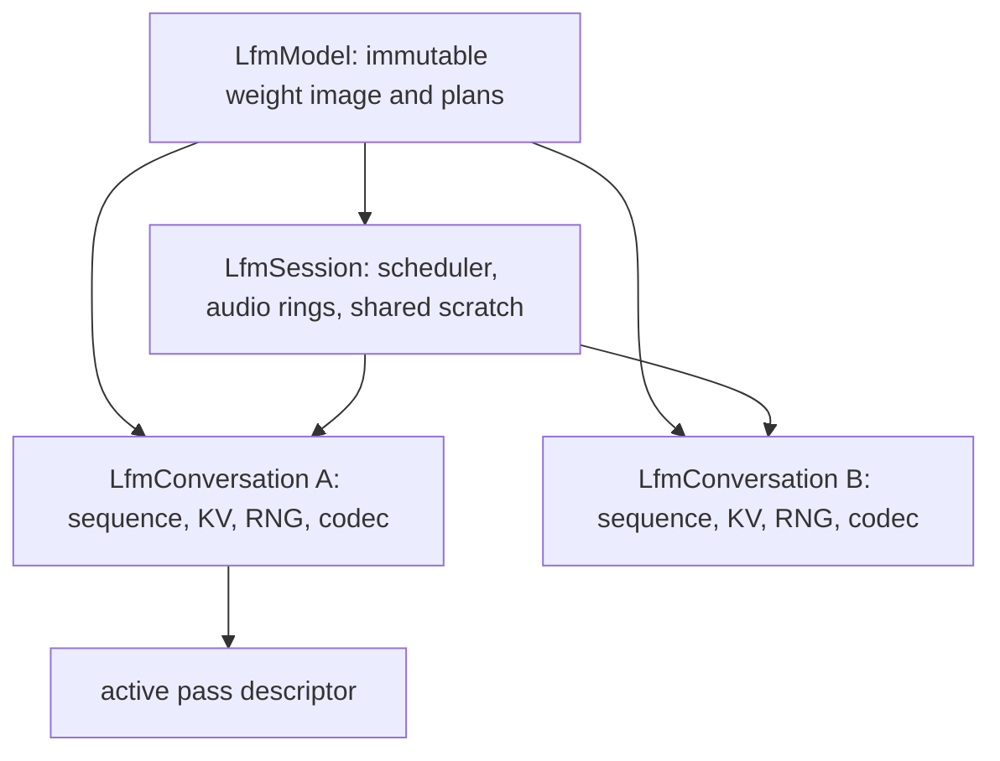
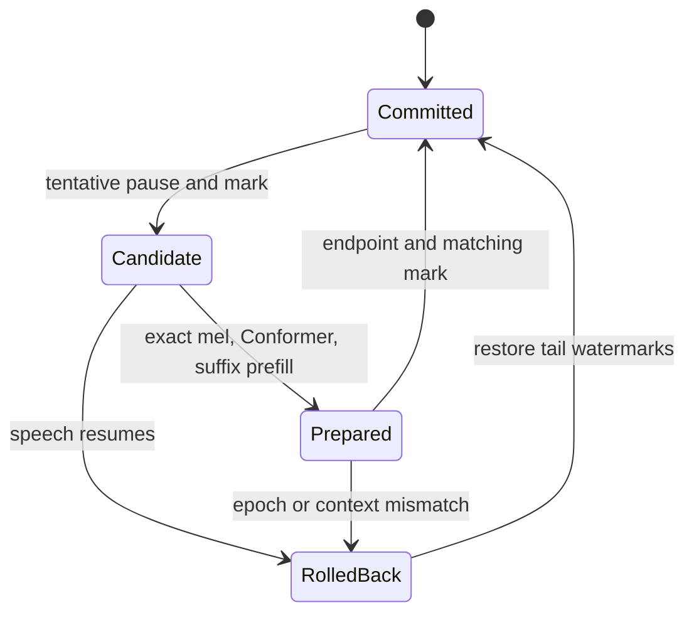
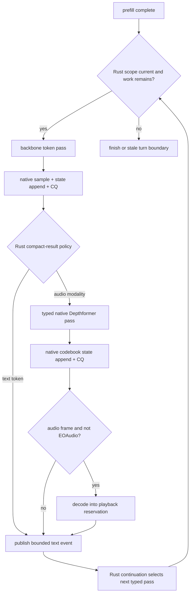

# Conversation, Prefill, Generation, and Codec

Status: normative design.

Baseline: EmberHarmony `321538f11749`.

Related architecture: `specs/10-stateful-multi-agent-runtime.md` defines durable
conversation images, branching, and multi-agent scheduling. This document
defines the native in-memory state that architecture will capture.

## Goal

Create one native `LfmConversation` per live activity. Keep every numerical
step, sampler, and state mutation native while the Rust kcoro continuation owns
the recurrence policy:

```text
append input -> direct embedding assembly -> suffix prefill -> token pass
-> sample -> append generated state -> depth/codec -> publish -> recur
```

The immutable model image is shared. KV, short-convolution carry, sequence
cursors, sampler state, codec state, and speculative marks belong to the
conversation. Switching conversations changes one retained context pointer at a
completed pass boundary; it does not reload weights or replay a text transcript.

## Current Code Map

| Current symbol | Evidence | Design action |
|---|---|---|
| `ChatState` five tensors | `crates/liquid-audio/src/processor.rs:1004-1012` | Replace with capacity-backed native regions and logical lengths. |
| `ChatState::add_text` | `crates/liquid-audio/src/processor.rs:1077-1085` | Tokenize once and append IDs/modality in place; remove `Tensor::cat`. |
| `ChatState::add_audio_16k` | `crates/liquid-audio/src/processor.rs:1089-1116` | Append a native audio-segment record and its modality range; mel data stays in retained native storage. |
| `ChatState::append` | `crates/liquid-audio/src/processor.rs:1241-1293` | Append generated text IDs, audio code frames, and modality runs directly. |
| `PrefillCursor` | `crates/liquid-audio/src/model/lfm2_audio.rs:134-148` | Preserve its four logical counters in the native context mark. |
| full `prefill_inputs` | `lfm2_audio.rs:1169-1305` | Replace combined tensor + index selection with direct per-modality writes. |
| suffix `prefill_suffix` | `lfm2_audio.rs:758-928` | Preserve cursor validation and encode only unforwarded ranges. |
| native one-token rim | `lfm2_audio.rs:1428-1480` | Remove per-token `Vec`, Candle tensor reconstruction, and optional fallback. |
| generation recurrence | `lfm2_audio.rs:1630-1743` | Move token pass, sample, append, and modality result production into C++; let Rust kcoro choose the next typed pass from compact CQ facts. |
| sampling policy | `lfm2_audio.rs:199-281` and `flashkern_engine.cpp:776-896` | Native collective is mounted for greedy, temperature, threshold top-k with ties, and seeded categorical draws. Preserve the single shared draw stream across text and every audio codebook while moving its opaque state into `LfmConversation`. |
| Depthformer fallback | `lfm2_audio.rs:1335-1359` | The native frame graph is mounted; retain only as a parity oracle until the token-exact/e2e gate, then delete it rather than shipping a legacy mode. |
| native Depthformer rim | `lfm2_audio.rs:1361-1390`, `decode.rs:466-551`, and `flashkern_engine.cpp:run_depth_frame` | Typed C++ frame pass is built. Rust lane arithmetic, `REQ_CALL`, `SpinBarrier`, hidden-row copy, logits Tensor reconstruction, and nested sampler ABI are deleted. Move the small token result and RNG image into native conversation state next. |
| cache snapshot/rollback | `crates/liquid-audio/src/model/lfm2_hf.rs:198-276` | Generalize into native tail marks over KV, short-conv, and sequence state. |
| `ConversationState` and mark | `crates/liquid-audio/src/runtime/realtime.rs:940-1038` | Replace tensor identity/shape marks with one generation-protected context mark. |
| `PreparedTurn` / `TurnSetup` | `crates/liquid-audio/src/runtime/realtime.rs:1106-1185` | Become native candidate and turn state, not Rust-owned tensor bundles. |
| speculative consume/rollback | `crates/liquid-audio/src/runtime/realtime.rs:1467-1513` | Preserve exact utterance + conversation-mark matching. |
| generation collection | `crates/liquid-audio/src/runtime/realtime.rs:1522-1628` | Append directly while generated; no `Vec<Vec<u32>>`, tensor stack, or PCM event payload. |
| conversation commit | `crates/liquid-audio/src/runtime/realtime.rs:1637-1733` | Preserve generated-thought semantics and cache cursor truth in native state. |
| native Mimi Rust rim | `crates/liquid-audio/src/mimi_native.rs:35-128` | Split shared plan from per-conversation state and decode into a playback reservation. |
| native Mimi core | `crates/liquid-audio/native/src/mimi/mimi_decode.cpp:674-917` | Retain numerics; replace standalone file/image/arena ownership with model/component and context ownership. |
| LFM2 custom detokenizer | `crates/liquid-audio/src/detokenizer.rs:220-310` | Delete after proving no Tauri reachability; the shipped realtime path uses native Mimi. |

## State Ownership



The model may outlive every session and conversation. A conversation retains
the model fingerprint and model handle. A pass retains its conversation until
completion. Session stop joins active passes before releasing conversation
handles.

Weights are never duplicated per conversation. Mutable state is never stored in
the shared model plan.

## Native Conversation Shape

```c++
struct LfmConversation {
    uint64_t id;
    uint64_t generation;
    uint64_t epoch;
    LfmModelFingerprint model;

    LfmSequenceState sequence;
    LfmBackboneState backbone;
    LfmGenerationState generation_state;
    LfmDepthState depth;
    LfmCodecState codec;
    LfmFrontendState frontend;

    LfmContextMark committed;
    LfmContextMark candidate;
    LfmDirtyMap dirty;
};

struct LfmSequenceState {
    LfmPagedArray<uint32_t> text_ids;
    LfmPagedArray<uint8_t> modality;
    LfmPagedMatrix<uint16_t> audio_codes; // codebook x frame
    LfmPagedArray<LfmAudioSegment> audio_segments;
    uint64_t positions;
};

struct LfmContextMark {
    uint64_t conversation_id;
    uint64_t generation;
    uint64_t epoch;
    uint64_t positions;
    uint64_t text_count;
    uint64_t audio_segment_count;
    uint64_t audio_frame_count;
    uint64_t kv_positions;
    uint64_t short_conv_positions;
    uint64_t arena_tail;
    LfmSamplerMark sampler;
};
```

These names describe native private objects, not new public ABI structs. Public
code sees an opaque `lfm_conversation_t *` as specified in document 01.

### Page pool

The logical arrays use fixed-size pages claimed from a runtime-owned aligned
pool. Capacity is reserved before a numerical pass begins. Claiming a page is a
coordinator operation at a legal pass boundary, never `malloc` inside a lane.
This gives three properties at once:

- append does not copy the established prefix;
- logical offsets remain stable as the context grows;
- [stateful-runtime spec 10](../10-stateful-multi-agent-runtime.md) can later
  seal and copy-on-write pages for snapshots and branches.

The first implementation may use one preallocated contiguous extent if that is
simpler, but every reference must still be base-relative and every mark must use
logical lengths. Raw process addresses cannot become serialized identity.

## Sequence, Cache, and Canonical History

The native context deliberately contains both compact model inputs and computed
state:

| Region | Purpose |
|---|---|
| text IDs and modality runs | Exact model grammar, diagnostics, and full-prefill recovery. |
| audio-input segment records | Locate normalized mel or adapted embeddings retained for recovery until policy evicts them. |
| generated audio codes | Preserve the model's acoustic thought and voice continuity. |
| backbone KV and short-conv state | Fast continuation without transcript replay. |
| cursors and sampler state | Exact next-pass continuation. |
| codec state | Gapless audio continuation when a hot conversation is resumed. |

This does not make the neural blob the only source of truth. Canonical user,
assistant, and tool events remain outside it for inspection and recovery, as
specified by `specs/10-stateful-multi-agent-runtime.md:89-113` and
`875-893`. The fast path does not need to render those events back into text on
every switch.

## Direct Append Contract

Appending a turn never rebuilds a prefix:

1. Ensure tail-page capacity at a coordinator boundary.
2. Record a `LfmContextMark` before speculative work.
3. Append turn-header token IDs directly to `text_ids` and text modality slots.
4. Attach the retained audio segment and reserve its exact modality range.
5. Append turn-footer IDs.
6. Publish new logical lengths with release ordering.

Generated tokens follow the same rule. Text IDs and audio code frames are
written once into their final arrays. The EOAudio frame remains in conversation
state, matching the current collection rule at
`runtime/realtime.rs:1525-1530`; it is not sent to the decoder.

If a context reaches its configured model limit, it returns a specific
`LFM_STATUS_CONTEXT_FULL` or invokes an explicit compaction/summarization policy
at a coordinator boundary. It does not silently realloc, truncate, or replay.

## Direct Modality Embedding

The current `prefill_inputs` constructs text embeddings, a vector of adapted
audio segments, audio-code embeddings, one concatenated `combined` tensor, an
index vector, and finally `index_select` at `lfm2_audio.rs:1196-1305`.

Native prefill writes the destination once:

```text
for each logical sequence position p in the requested suffix:
    Text     -> copy/convert model.text_embedding[text_ids[text_cursor]] to E[p]
    AudioIn  -> conformer/adapter writes its next row directly to E[p]
    AudioOut -> sum model.audio_embedding[codebook_offset[c] + code[c, frame]]
                directly into E[p]
```

This loop is tiled over positions and hidden rows. Cursors are validated against
the modality counts before dispatch. There is no combined tensor and no index
array. Text and audio-code embedding reads come directly from the immutable
weight image.

## Native Full and Suffix Prefill

The existing native engine only owns a one-token pass. Multi-token fallback
still enters Candle at `crates/liquid-audio/src/model/lfm2_hf.rs:778-839` and
`lfm2_audio.rs:1677-1694`. Add `PassKind::BackbonePrefill`:

```c++
struct LfmPrefillPass {
    LfmConversation *conversation;
    uint64_t start_position;
    uint32_t token_count;
    const float *embedding;
    uint32_t embedding_stride;
    LfmContextMark expected_mark;
};
```

For each backbone layer, the pass runs normalization, projection, attention or
short-convolution, feed-forward, and residual stages using shared scratch. It
writes K/V and convolution carry directly into the conversation's reserved
pages. The final hidden row remains in a fixed generation plane; the complete
multi-token hidden sequence is retained only when a downstream training/debug
contract explicitly asks for it.

Full prefill starts at position zero. Suffix prefill starts at
`context.backbone.positions` and must validate the equivalent of all four
`PrefillCursor` fields before touching state. A mismatch is a stale-context
error, not a request to guess or silently rebuild.

## Speculative Turn Protocol

The current prepared turn is valid only when utterance identity and
`ConversationMark` both match (`runtime/realtime.rs:1470-1492`). Preserve that
as a native transaction:



Rollback restores logical lengths, KV/conv tails, sampler marks, and page-pool
watermarks. It does not copy a full previous cache back over the candidate.
Pages first dirtied after the mark are released; previously shared pages are
unchanged.

Prepared work may occupy only a dedicated candidate slot. It cannot take the
descriptor needed by a committed utterance. Stop has priority over queued
prepare, preserving the shutdown rule already covered by the realtime tests.

## Callback-Driven Generation

The resident coordinator owns this state machine. Native passes own every
numerical box; Rust owns the policy edges between boxes:



A **full token pass** includes backbone recurrence, the selected head,
sampling, and append to conversation state. It owns one single-shot child ticket
under the turn action. Flashkern completion publishes terminal facts and compact
result IDs, then rings the Rust coordinator doorbell; the resumed continuation
consumes that authoritative disposition and may create the next child.
Stop/interrupt is inspected
before dispatching the next token pass, not inside GEMV, attention, Depthformer,
or codec kernels. A
token whose pass completed is part of the model's thought even if an output
epoch prevents its audio from being played.

This preserves the current semantic rule at
`runtime/realtime.rs:1637-1645`: generated output is committed based on what the
model produced, not on speaker state, mute, or interruption. Playback blocks and
UI events are independently epoch-tagged and may be discarded when stale.

## Sampling Contract

Native sampling must reproduce `Sampler` at `lfm2_audio.rs:199-270`:

- greedy when temperature is absent/nonpositive or `top_k == 1`;
- otherwise divide logits by temperature;
- threshold top-k retains ties at the kth score, rather than exactly k entries;
- stable softmax and seeded multinomial;
- one shared sampler state initialized from the configured seed; draw order
  crosses text and every audio codebook exactly as the upstream single generator does.

The chosen native PRNG and F32 probability ladder become an explicit ABI-format
fact before cutover. Store golden vectors containing logits, parameters, seed,
draw index, selected token, and post-draw PRNG state. Snapshot/restore must
resume at the next draw exactly.

Sampling writes one token ID to a fixed result slot. The existing Rust callback
inside `sample_audio_frame_flash` at `lfm2_audio.rs:1358-1397` is removed.

### As-built PRNG and sampler foundation (2026-07-14)

`LfmPrngStateV1` at
`crates/liquid-audio/native/include/flashkern_prng.h:33-62` is a pointer-free,
64-byte-aligned, 192-byte ChaCha20 stream image. It contains the original
64-bit-counter/64-bit-nonce core, the current 64-byte output block, and its
cursor. Copying the complete object at a quiescent boundary therefore preserves
the exact next draw; restoring a mark never reconstructs randomness from a draw
count.

`lfm_prng_seed_system` at
`native/src/engine/flashkern_prng.cpp:111-119` obtains 40 bytes once: a 256-bit
key and 64-bit nonce. On Apple, the architecture thunk at
`native/kernels/aarch64/flashkern_prng.S:101-119` calls
`SecRandomCopyBytes(kSecRandomDefault, count, bytes)` with the correct AAPCS64
argument shuffle. The Security framework is the platform entropy boundary.
Direct `RNDR` is not an Apple-Silicon baseline: it is absent on supported Macs
including the audited M2 Max and traps when executed there. No entropy syscall,
feature probe, allocation, or seed copy occurs during a draw.

Hot expansion is assembly on both production architectures:

- aarch64 keeps all sixteen ChaCha words in `w2-w17` and leaves Apple's reserved
  `x18` untouched at `native/kernels/aarch64/flashkern_prng.S:38-96`;
- x86_64 executes a four-row SSE2 block at
  `native/kernels/x86_64/flashkern_prng.S:38-73`.

`REQ_PRNG` at `native/src/engine/flashkern_engine.cpp:159` and
`lfm_engine_prng_fill` at `1663-1675` form a typed conformance leaf. It proves
retained descriptor -> Rust kcoro SQ -> fixed Flashkern lanes -> CQ completion
without moving the state or output payload through a channel. It is deliberately
**not** a ticket-per-draw product design.

The sampler is now mounted. `run_sampler` at
`native/src/engine/flashkern_engine.cpp:831-951` shards pointer-borrowed F32 or
BF16 logits across the fixed lanes. `REQ_SAMPLE`/`lfm_engine_sample` at
`1973-1998` is the standalone prefill, fallback, and conformance entry. The text
head invokes the same collective inside `REQ_TOKEN_PASS`; DepthDecode invokes
it directly from `run_depth_frame` for each codebook inside one
`REQ_DEPTH_FRAME`. There is no extra ticket, Rust callback, or logits Tensor
between an integrated head and its selected token.

One `SamplingStream` at `lfm2_audio.rs:267-281` currently owns the opaque native
state for a generation call and passes its address through the Rust FFI rim; Rust
does not interpret or numerically operate on that state. The target move into
`LfmConversation` remains open so the same next-draw identity survives hot
conversation switching and checkpoint/restore without a Rust owner. Logits,
probability arrays, and random draws never cross the docking ring.

The PRNG conformance tests in
`crates/liquid-audio/src/compute/flashkern/native_engine.rs` pin two
published zero-key/zero-nonce blocks, exact state/cursor advancement, replay
from both empty and partially consumed block snapshots, real SQ/CQ/fence
counters, and Apple system seeding. They pass on aarch64 and through the
repository's local-only x86_64 Rosetta gate
(`crates/liquid-audio/scripts/test-rosetta.sh`). A native x86_64 runner remains
required for ISA features that Rosetta does not advertise; the SSE2 ChaCha block
itself executes and passes under Rosetta.

`native_sampler_is_deterministic_thresholded_and_snapshotable` at
`native_engine.rs:1182-1209` proves greedy does not consume RNG, threshold top-k
retains boundary ties, and copying the state reproduces the next sequence.
`typed_depth_plans_coexist_and_use_one_ticket_per_frame` in
`native_engine.rs` proves two resident Depthformer plans coexist, one frame
produces exactly one SQ submission/completion/bridge dispatch, native fences
advance, and clearing one plan leaves the other runnable.

### Sampler threadgroup program

The probability policy mounts as one native subprogram of the token or
Depthformer pass, not as a serial helper and not as a chain of kcoro tickets.
The fixed Flashkern lanes are its CPU threadgroup. `lane_fence` is the exact
equivalent of a GPU `threadgroup_barrier`: it publishes a logical generation,
blocks declared peers through the zero-spin wait word, and lets the last arriver
perform the bounded serial fold.

The stage plan is:

1. Partition the vocabulary into stable contiguous lane shards. Each lane reads
   logits in place, applies the configured temperature, and writes its local
   maximum to lane-private scratch.
2. Fence. The last arriver folds maxima in lane order. The as-built threshold
   top-k scan uses an engine-owned, preallocated min-heap containing values only;
   it never copies the logits payload, allocates during the pass, sorts a vector,
   or truncates boundary ties. A future measured optimization may shard candidate
   heaps per lane without changing the sampling ABI or draw order.
3. Each lane computes masked `exp(logit - global_max)` weights and one local sum.
   The selected approximation and F32 rounding ladder are fixture-pinned.
4. Fence. The last arriver folds sums in lane order and publishes deterministic
   per-lane prefix intervals plus the total mass.
5. The serial section consumes exactly one value from the conversation's shared
   `LfmPrngStateV1` and maps it into `[0, total_mass)`. The one lane owning
   that interval scans only its shard to resolve the first crossing token.
6. Fence. The winner publishes one token ID; native code appends it and advances
   sampler/context state before the pass completion becomes visible.

Greedy mode uses the same first reduction and deterministic index tie-break,
then skips probability and PRNG stages. Invalid configuration, empty support,
or nonfinite-policy failure is detected before sampler or conversation mutation.
Barrier count is plan metadata and a regression metric; adjacent stages may be
fused only when the same parity fixtures prove the published generation facts
are unchanged.

Kcoro is aware of this work only at pass granularity. Its retained ticket keeps
the conversation and output slot alive, its scope epoch controls whether a
completed result may publish, and its CQ edge resumes recurrence. No logit,
candidate, probability, lane partial, or random draw enters the docking ring.

## Depthformer

The existing native Depthformer graph is mounted as ordinary stages in the same
lane program:

1. project the backbone hidden row into all codebook inputs;
2. for each codebook, run its six-block recurrence using fixed local KV state;
3. produce logits directly in the sampler plane;
4. sample and feed the selected embedding to the next codebook;
5. write all codebook IDs to one fixed frame slot.

`REQ_DEPTH_FRAME` is the product integration. The logits Tensor rebuild, Rust
sampler callback, BF16 hidden copy, Rust lane arithmetic, `SpinBarrier`, and
`REQ_CALL` dependency have disappeared. Each model installs an immutable plan;
multiple plans coexist by identity, while C++ owns mutable frame scratch and KV.
The remaining Candle op chain at `lfm2_audio.rs:1335-1359` is a parity seam to
delete after the token-exact/e2e gate, not a supported final mode.

## Codec Plan and State

The current `NativeMimi` has the right arithmetic and the wrong ownership for
the final runtime:

- `mimi_decoder_new_from_file` opens a second resident image
  (`native/src/mimi/mimi_decode.cpp:776-850`);
- `MimiDecoder` owns a fixed 256 MiB arena (`mimi_decode.cpp:674-729`);
- Rust serializes it with a mutex and allocates `Vec<f32>` per frame
  (`mimi_native.rs:35-45`, `92-109`).

Split it into:

```c++
struct MimiDecodePlan {             // model lifetime
    LfmModelImageRef image;
    MimiWeightBindings weights;
    MimiShape shape;
};

struct MimiDecodeState {            // conversation lifetime
    MimiQuantState quant;
    MimiUpsampleState upsample;
    MimiTransformerState transformer;
    MimiSeanetState seanet;
    MimiScratch scratch;
};

int mimi_decode_into(const MimiDecodePlan *, MimiDecodeState *,
                     const uint32_t codes[8], float *pcm, uint32_t capacity,
                     uint32_t *written);
```

`MimiDecodePlan` binds views into the model component loaded in document 02.
`MimiDecodeState` contains only mutable streaming state and right-sized scratch.
The fixed native executor has exclusive ownership while the codec pass runs, so
no Rust mutex is involved in codec arithmetic or state mutation.

Before decode, reserve a contiguous playback block of at least the codec's
declared maximum output. `mimi_decode_into` writes directly to that reservation;
publication advances its ready state. No PCM `Vec`, CPU Tensor, event payload,
or second ring copy exists. The current stage sequence at
`mimi_decode.cpp:850-889` remains quantizer -> upsample -> transformer -> SEANet.

Codec reset is a conversation operation. Playback flush advances output epoch
and releases stale blocks; it does not reset conversation codec/LM state unless
the engine contract explicitly requests a new stream.

## Text Events

The inference loop stores token IDs first. A native tokenizer plan decodes token
pieces without calling Rust, as required by document 02. The notification
continuation copies only bounded UTF-8 event bytes into the native event ring.
That small host-bound metadata copy is allowed; model payloads and state are not
events.

Invalid UTF-8 joins, control tokens, and split token pieces must match the
current tokenizer fixtures. Event backpressure may coalesce telemetry, but it
cannot reorder text pieces, terminal status, or errors.

## Snapshot and Multi-Conversation Hooks

This migration does not implement disk snapshots, but it must establish the
exact capture and ticket boundaries needed by spec 10:

- all mutable regions have stable type IDs, logical sizes, and base-relative
  offsets;
- every pass dirties declared ranges in `LfmDirtyMap` at stage completion;
- `LfmContextMark` is sufficient for cheap in-memory rollback;
- no serialized region contains function pointers, scheduler handles, mutexes,
  raw addresses, or platform audio state;
- a conversation may be quiesced only at a complete pass boundary;
- the coordinator can detach one hot context and attach another without changing
  model plans or fixed-worker identity;
- a quiesce request owns a checkpoint parent ticket and cannot publish
  `accepted` while a child pass ticket is dispatched;
- `accepted` freezes dirty generations into one of two bounded staging slots;
  it is distinct from the later `durable` ticket edge;
- periodic captures coalesce into a cumulative pending delta or skip when both
  slots are occupied; they never allocate an unbounded queue;
- resumed or branched mutation uses copy-on-write pages or a complete copied
  staging image so the lazy writer never reads concurrently mutated bytes;
- the low-priority writer, CRC, compression, store sync, and manifest publication
  execute outside audio, fixed compute, completion, and coordination workers.

The image, delta, WAL, branch, and compaction protocols remain owned by
`specs/10-stateful-multi-agent-runtime.md:583-949`. In particular, long-running
conversation images use immutable base/delta objects and A/B manifests. They do
not use kcoro's current append-only `kc_wal_snapshot_write` implementation at
`/Volumes/stuff/Projects/kotlinmania/kcoro_arena/core/src/kc_wal.c:535-580`.
The WAL contains small transactional facts and checkpoint associations, not
model-state pages.

## Implementation Order

1. Add native paged sequence/context primitives and exact tail-mark rollback.
2. Bind model token tables, control IDs, embedding tables, and context geometry.
3. Replace `ChatState` concatenation with native append behind an oracle adapter.
4. Implement direct modality embedding for a full context.
5. Add native multi-token backbone prefill and compare every layer/cache boundary.
6. Add suffix prefill with strict cursor/mark validation.
7. **Partly complete:** text-head sampling, probability policy, and PRNG
   consumption now run in the token/frame pass. Move opaque stream ownership,
   state append, and modality result production into `LfmConversation`, then
   route only compact completion facts to the Rust coordinator.
8. **Complete:** mount Depthformer as `REQ_DEPTH_FRAME` without `REQ_CALL`, Rust
   lane arithmetic, `SpinBarrier`, hidden-row copy, or nested sampler ABI. Move
   its small result span and shared RNG image into native conversation state with
   the recurrence work in step 7.
9. Split Mimi plan/state ownership and decode directly to playback blocks.
10. Move native tokenizer piece decoding into the notification continuation.
11. Mount speculative candidate commit/rollback.
12. Expose quiesce, context switch, and dirty-range hooks needed by spec 10.
13. Add checkpoint accepted/durable child ticket hooks and two bounded staging
    slots without mounting a disk writer on a model executor.
14. Prove no Tauri command reaches the one-shot LFM2 custom detokenizer, capture
    any required fixtures, and delete it.
15. Remove production `ChatState`, `ConversationState`, `Lfm2VoiceEngine`,
   Candle cache, generation callbacks, and `NativeMimi` Rust rim only after all
   gates pass.

## Acceptance Gates

- Appending any turn leaves every prefix byte and logical offset unchanged.
- Context growth performs no process allocation inside a numerical pass; page
  claims occur only before dispatch.
- Full and suffix prefill produce identical hidden rows, KV, short-conv state,
  cursors, logits, and tokens relative to the oracle.
- Direct modality embedding matches full output for mixed text/audio-in/audio-out
  contexts and rejects every count mismatch before mutation.
- 100,000 candidate commit/resume/interrupt races yield one terminal outcome,
  no leaked pages, and no stale cache publication.
- Greedy and stochastic sampling match stored seed/draw fixtures, including
  top-k boundary ties.
- ChaCha20 known-answer vectors match on aarch64 and x86_64; copying a quiescent
  sampler state reproduces the exact next draw, while warmed draw paths perform
  no system entropy call, allocation, or coordination ticket per draw.
- Recurrence can produce an entire turn through exact native-CQ-to-Rust edges
  with zero Tauri/webview IPC, polling, or numerical payload crossing.
- Stop and interrupt are observed only between complete token passes; an active
  pass is never left half-mutated.
- A partial generated response is present in conversation state even when its
  playback epoch was flushed.
- Mimi writes directly into the reserved playback block, allocates zero bytes
  per frame, and shares immutable weights across conversations.
- Switching between two hot conversations changes no model-weight address and
  resumes each at its exact next token/codec state.
- Conversation quiesce reports zero active passes before image capture.
- Checkpoint accepted cannot publish while a pass ticket is dispatched;
  checkpoint durable cannot publish before object and A/B manifest sync.
- A slow writer coalesces/skips periodic capture without affecting token-pass or
  playback latency, and staging memory remains bounded to two configured slots.
- No Rust/Candle symbol appears in the production prefill-to-playback call graph.

## Non-Goals

- Do not merge KV memories from sibling branches; later joins are semantic, as
  specified by spec 10.
- Do not write snapshots or WAL records from a token pass.
- Do not treat playback completion as conversation commitment.
- Do not hide context overflow with silent truncation.
- Do not keep a second model image inside each codec instance.
