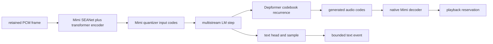

# Native Moshi Realtime Runtime

Status: normative design.

Baseline: EmberHarmony `321538f11749`.

## Goal

Port the supported realtime Moshi path into the same native model/session,
kcoro, audio-ring, settings, and event contracts as LFM2. One retained input
frame flows through Mimi encode, the multistream LM, Depformer sampling, Mimi
decode, and the playback reservation without crossing Rust or constructing a
Candle tensor.

Moshi is the default local engine at this baseline
(`packages/desktop/src-tauri/src/settings.rs:76-87`). The repository cannot
claim a Candle-free production voice runtime until this document is implemented
or Moshi is explicitly removed from product settings. Native Mimi decode alone
does not satisfy this gate.

## Current Production Truth

| Current symbol | Evidence | Consequence |
|---|---|---|
| `RealtimeFramePipeline` | `crates/liquid-audio/src/runtime/realtime.rs:704-920` | Rust owns a bounded channel, inference thread, epochs, event backpressure, and shutdown. |
| frame submission | `crates/liquid-audio/src/runtime/realtime.rs:725-739`, `866-882` | Every PCM frame is an owned `Vec<f32>` sent through crossbeam. |
| soft interrupt | `crates/liquid-audio/src/runtime/realtime.rs:741-748`, `885-895` | Queued stale frames are dropped without resetting the model stream. Preserve this behavior. |
| `MoshiVoiceEngine` | `crates/liquid-audio/src/runtime/realtime.rs:2552-2681` | Rust owns SentencePiece, output resampling, model invocation, and event conversion. |
| `RealtimeMoshi` state | `crates/liquid-audio/src/runtime/realtime.rs:1850-1921` | Mimi encoder/decoder, LM, generation state, text token, and frame counters are Candle/Rust objects. |
| warmup/reset | `crates/liquid-audio/src/runtime/realtime.rs:1932-1951` | Native load must preserve warmup and deterministic post-warmup reset. |
| PCM input step | `crates/liquid-audio/src/runtime/realtime.rs:1954-1978` | The frame is copied into a Candle tensor; first-frame Mimi reset has special semantics. |
| LM/Depformer/decode step | `crates/liquid-audio/src/runtime/realtime.rs:1981-2026` | Tensor-to-vector, per-frame vectors, Tensor reconstruction, and PCM vector events occur every step. |
| model load | `crates/liquid-audio/src/runtime/realtime.rs:2030-2065` | `moshi::mimi::load_b` and `moshi::lm::load_streaming` create Candle models. |
| checkpoint validation | `crates/liquid-audio/src/runtime/realtime.rs:2083-2142` | Rust/Candle mmap and name inspection decide supported dtype/layout. |
| supported snapshot subset | `crates/liquid-audio/src/runtime/realtime.rs:2186-2271` | Plain Moshi only; LoRA, conditioning, CFG, and incompatible PyTorch layout are rejected. |
| continuous frame loop | `crates/liquid-audio/src/runtime/voice_runtime.rs:1599-1655` | Rust waits, resamples, assembles frames, injects timing silence, and owns interrupt handling. |
| current native codec | `crates/liquid-audio/native/src/mimi/mimi_decode.cpp:674-917` | Only the decoder half is native; encoder and Moshi LM/Depformer are not. |

The comment “Native Moshi realtime engine” at
`runtime/realtime.rs:1736` means a native desktop-local integration rather than
a native numerical stack. Documentation must not use that phrase without this
distinction until the migration completes.

## Supported Product Scope

The first native implementation supports exactly the subset current code admits:

- `model_type == "moshi"`;
- unconditioned Moshiko Candle-layout checkpoints;
- no LoRA fuse path;
- no CFG or condition tensors;
- the current v0.1 multistream configuration and generated codebook count;
- one full-duplex stream per conversation;
- runtime-selected CPU backend first, MLX/Metal later through the same ABI.

The rejection logic at `crates/liquid-audio/src/runtime/realtime.rs:2106-2142` and `2216-2239` moves
into native model binding. Unsupported capability returns a typed load error. It
does not silently ignore configuration or fall back to Candle.

## Native Objects

```c++
struct MoshiModelPlan {
    LfmModelImageRef lm_image;
    LfmModelImageRef mimi_image;
    MoshiConfig config;
    MoshiLmPlan lm;
    MoshiDepformerPlan depformer;
    MimiEncodePlan encoder;
    MimiDecodePlan decoder;
    SentencePiecePlan tokenizer;
};

struct MoshiConversation {
    uint64_t id;
    uint64_t generation;
    uint64_t input_epoch;
    uint64_t output_epoch;
    MimiEncodeState encoder;
    MoshiLmState lm;
    MoshiDepformerState depformer;
    MimiDecodeState decoder;
    MoshiSamplerState text_sampler;
    MoshiSamplerState audio_sampler;
    uint32_t text_token;
    uint32_t skip_frames;
};

struct MoshiFramePass {
    MoshiConversation *conversation;
    LfmPcmSpanV1 input;
    LfmPlaybackReservation output;
    uint64_t input_epoch;
    uint64_t output_epoch;
};
```

The model plans contain immutable weight views. Encoder, LM KV, Depformer,
decoder carry, token state, and PRNG state belong to each conversation so a hot
Moshi activity can be detached and resumed without changing another activity.

`MoshiFramePass` is a preallocated descriptor. Its PCM span points into the
session frame ring; channel payloads never contain frame samples.

## Full Frame Pass



A **full Moshi frame pass** includes every stage above for all codec token frames
produced by one input PCM frame. A stop or soft output interrupt is observed
before dispatching another frame pass. Lanes do not check it inside convolution,
attention, sampling, or codebook loops.

The immutable `PassKind::MoshiFrame` plan has this audited stage order:

| Stage | Reads | Mutates/writes | Collective edge |
|---|---|---|---|
| frame ingress | retained PCM span, input epoch, frame clock | frame-local cursors only | validate and retain before numerical dispatch |
| Mimi encode | PCM span, encoder plan/carry | encoder carry and latent plane | one edge after all encoder writes required by quantization |
| input quantize | latent plane, codebooks | fixed input-code slot | fuse codebook-local work; edge only before LM consumes the complete code tuple |
| Moshi LM | current text/audio input IDs, LM KV | LM KV and hidden plane | one streaming-position commit |
| text head/sample | hidden plane, conversation sampler | next text token and PRNG state | no host callback; metadata remains native |
| Depformer recurrence | hidden plane, prior generated code, Depformer state | generated audio-code slot and PRNG state | recur natively across codebooks; no stop poll inside the loop |
| Mimi decode | complete generated code tuple, decoder plan/carry | decoder carry and reserved playback span | one edge before publication |
| frame commit | text token, playback reservation, input/output epochs | conversation frame counters, playback cursor, bounded event metadata | complete one child ticket as committed or stale |

This is a stage table, not a command-per-row contract. Adjacent rows remain one
lane program wherever dependency analysis permits; the planner records every
actual barrier so a model revision cannot silently add host waits.

Input ownership is released only after Mimi encode has consumed the retained
span. Output is committed only by publishing a filled playback block. Text and
audio-code metadata are written to conversation state before notification.

## Mimi Encoder Port

The decoder files under `native/src/mimi/` are not an encoder implementation.
Add the missing inverse path as explicit stages:

1. SEANet encoder convolution/residual/downsampling stack.
2. Encoder transformer with its streaming KV state.
3. Downsample/project into quantizer latent rate.
4. Split residual vector quantization producing input codebooks.

Use the supported Mimi config read at model open; do not infer fixed dimensions
from the decoder header unless the loaded schema validates them. Reuse primitive
numerics where the algorithms truly match, but keep encoder and decoder state
separate.

The first input-frame behavior is load-bearing. Current code encodes the frame,
then resets Mimi state, decrements `skip_frames`, and still feeds those codes to
the LM (`crates/liquid-audio/src/runtime/realtime.rs:1954-1978`). Preserve this sequence exactly and
pin it with a fixture. Resetting before encode or discarding the codes changes
the stream.

## Multistream LM and Depformer

Freeze the supported `moshi` crate version and generate a native inventory of
every weight name, shape, dtype, layer, cache dimension, control token, and
sampling parameter reached by:

- `lm_generate_multistream::Config::v0_1` construction at
  `crates/liquid-audio/src/runtime/realtime.rs:1873-1880`;
- generation state creation at `161-184`;
- `step_without_ca_src` at `254-257`;
- `last_audio_tokens` at `261-267`.

That inventory is checked into the native schema tests before numerical porting.
The product graph then becomes:

- embed current text token and input audio codebooks directly from resident
  tables;
- run one streaming LM position into conversation KV;
- generate the next text token with the configured sampler;
- run Depformer codebooks sequentially, retaining only fixed scratch and its
  declared state;
- write generated audio IDs into one fixed frame slot;
- send those IDs directly to `mimi_decode_into` from document 07.

No `Vec<u32>`, `RealtimeMoshiEvent` vector, or Tensor exists between stages. One
typed native frame pass can advance its sequential internal codebook stages
immediately at a barrier. That is fixed-executor stage sequencing, not a policy
callback or another Rust ticket.

## Frame Clock and Input Backpressure

Moshi receives continuous model frames and does not use turn VAD. Preserve the
current full-duplex rule at `voice_runtime.rs:1622-1627`:

- user frames continue while the assistant speaks;
- echo handling belongs below the model;
- mic disable pauses frame submission rather than synthesizing unlimited silence;
- configured silence/frame-clock behavior is explicit session policy.

The native frame assembler from document 04 writes model-rate frames into fixed
slots. A ready-slot transition wakes the Moshi coordinator once. If all
not-yet-submitted slots are full, policy may drop stale capture frames and
increment a counter; it may not reset Mimi/LM state or block the hardware
callback.

Tests at `runtime/realtime.rs:2042-2191` establish the compatibility contract:
stale queued frames do not reach the engine after an epoch change, and queue
pressure does not reset the stream.

## Soft Interrupt, Stop, and Reset

Keep these operations distinct:

| Operation | Input stream | Model state | Playback |
|---|---|---|---|
| soft output interrupt | continue accepting current/future input epochs | preserve Mimi encoder, LM, Depformer, and decoder state | advance output epoch and flush stale blocks |
| mic pause | stop submitting capture frames | preserve state | unchanged |
| explicit new stream | reset all mutable Moshi state and frame counters | reset | flush |
| session stop | reject new frames, finish active full pass, join workers | destroy after join | flush and close |

`RealtimeFramePipeline` deliberately does not call `interrupt_stream` for a soft
interrupt (`runtime/realtime.rs:744-751`, `888-895`). Although
`MoshiVoiceEngine::interrupt_stream` resets at `1866-1869`, that method is for a
hard stream reset. The native ABI must use separate commands so this distinction
cannot be lost in one ambiguous `interrupt()` method.

Output blocks carry `output_epoch`. If an interrupt lands during a full frame
pass, the pass completes and advances conversation state, but an old-epoch
playback reservation is discarded instead of published. This prevents audible
stale output without rewinding the model's continuous stream.

## Resampling and Playback

The native audio adapter negotiates device rate independently from model rate.
Input conversion writes directly into a model frame slot. Decoder PCM is written
into a contiguous playback reservation, then a stateful native resampler writes
the device-rate block if rates differ.

The current `StreamingPcmResampler` exists because resetting an offline filter
on every tiny output chunk caused discontinuities
(`runtime/realtime.rs:1873-1882`). Preserve continuity across every frame and
store its carry in the session/conversation output state. No `Vec<f32>` event
carries audio to a consumer.

## Tokenizer and Notifications

Bind SentencePiece metadata during native model open. The current token-piece
rule is `id_to_piece`, replace the SentencePiece word-boundary marker with a
space, and suppress empty strings (`runtime/realtime.rs:1786-1793`). Pin this
behavior, including split UTF-8 and control tokens, before replacing the Rust
processor.

Notification events contain bounded text bytes, token IDs for tracing when
enabled, timing, and terminal/error metadata. Input/output audio code events are
debug telemetry only and remain disabled or sampled in production. PCM is never
an event payload.

## Load and Warmup

Native `lfm_model_open` for a Moshi manifest:

1. Parse model config and validate the supported subset.
2. Open complete LM and Mimi resident images through document 02's loader.
3. Bind every LM, Depformer, Mimi encoder, and Mimi decoder tensor.
4. Validate checkpoint layout and floating dtype without Candle.
5. Build SentencePiece tables.
6. Allocate one test conversation and run the configured warmup frames.
7. Reset all mutable state exactly as `RealtimeMoshi::warmup` does at
   `crates/liquid-audio/src/runtime/realtime.rs:1939-1951`.
8. Report readiness only after warmup, reset, and scheduler idle are complete.

Warmup may fault pages and establish backend residency. It may not leave token,
KV, convolution, frame-count, or PRNG state in the product conversation.

## Snapshot Readiness

Moshi conversation images may later include encoder/decoder convolution carry,
LM KV, Depformer state, current text token, sampler states, frame counters, and
resampler carry. They exclude audio device handles, scheduler continuations,
ring addresses, and callbacks.

Quiesce only at a full frame boundary. An output epoch and canonical event
sequence reconcile any completed state whose playback was not heard. Durable
format work remains in spec 10 and must not add disk activity to frame passes.

## Implementation Order

1. Freeze and document the exact supported Moshi/Mimi schema and golden fixtures.
2. Extend the native model loader for LM, Mimi, and SentencePiece components.
3. Add Mimi encoder reference stages and parity fixtures through emitted input
   codebooks, including first-frame reset behavior.
4. Port one LM streaming step and compare every layer/KV boundary.
5. Port text sampling and Depformer recurrence with deterministic RNG fixtures.
6. Reuse the shared Mimi decoder plan/state and direct playback output.
7. Add `PassKind::MoshiFrame` to the fixed Flashkern executor plan and submit
   each frame as a pointer descriptor with one child pass ticket.
8. Mount native frame slots, epochs, and exact wake behavior from document 04.
9. Add native output resampling and SentencePiece notification decoding.
10. A/B the complete native frame pass against the current Rust/Candle oracle.
11. Make native Moshi the explicit configured backend only after the app gate.
12. Remove production `RealtimeFramePipeline`, `RealtimeMoshi`,
    `MoshiVoiceEngine`, and the `moshi`/Candle dependencies after rollback soak.

## Acceptance Gates

- Model open accepts and rejects exactly the current supported checkpoint subset,
  with typed errors and no Candle code.
- Mimi encoder stage outputs and input codebooks match golden fixtures across
  first frame, steady state, silence, chunk boundaries, and cache wrap.
- First-frame encode/reset/feed ordering is token-exact.
- LM hidden rows, KV, text logits/tokens, Depformer logits/codes, and sampler
  states match the oracle at every stored boundary.
- Decoder PCM remains within the existing native Mimi parity tolerance and
  writes directly to playback storage.
- One hour of continuous full-duplex frames produces no allocation after warmup,
  no growing queue, no reset under pressure, and no audio discontinuity.
- Soft interrupt drops all old output without resetting input/model stream state.
- Stop during encode, LM, Depformer, decode, playback-full, and idle states joins
  once without polling or deadlock.
- The Tauri app passes microphone, simultaneous speech, soft interrupt, device
  switch, long-run, and teardown tests on the native path.
- The production dependency graph no longer contains the Rust `moshi` crate or
  Candle through the Moshi feature path.

## Non-Goals

- Do not add conditioned Moshi, LoRA, CFG, or unsupported checkpoint layouts in
  the first migration.
- Do not use turn VAD to simplify the continuous Moshi stream.
- Do not treat dropped playback as a reason to rewind LM state.
- Do not call Rust tokenization or sampling from a native pass.
- Do not retain the label “native Moshi” for a Rust/Candle numerical path after
  this design is adopted.
