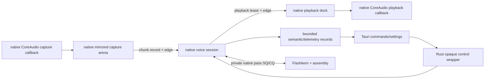

# Rust Host Seam And Native Audio Ownership

Status: normative as-built boundary. Rust is the product host, not the audio
stream, model coordinator, or numerical runtime.

## Boundary

Production Rust may own:

- explicit settings mapping and backend capability requests;
- opaque runtime/model/conversation/session handles;
- an opaque native platform-audio handle and lifecycle controls;
- Rust kcoro tasks for bounded host control/observation;
- Tauri command adapters and bounded observer projection;
- remote-provider networking, download, authentication, and persistence.

Production Rust may not own:

- a tensor, logits vector, token stream, sampler, KV/cache plane, model state, or
  prompt assembly;
- a microphone/speaker callback, PCM pointer, PCM lease pool, capture/playback
  endpoint, resampler, or speech detector;
- mel, resampling, VAD, Conformer, adapter, backbone, Depthformer, Mimi, Moshi,
  codec, or quantizer arithmetic;
- model-pass tickets, pass recurrence, stage scheduling, or assembly dispatch;
- a pointer into the resident model image or any numerical scratch plane;
- a callback whose return is required for the native model to recur.

There is no high-rate Rust/native payload boundary. PCM, audio callbacks, and
model progress stay native; Rust crosses only control and bounded observation.

## Target Flow



Native capture, playback, session, and model continuations become runnable from
their exact data/capacity callbacks on the shared bounded kcoro pool. No
operation owns a waiter or Rust audio task.

## Production Rust API

The final crate surface is intentionally small:

```rust
pub struct Runtime(NonNull<lfm_runtime_t>);
pub struct Model(NonNull<lfm_model_t>);
pub struct Conversation(NonNull<lfm_conversation_t>);
pub struct Session(NonNull<lfm_session_t>);
pub struct PlatformAudio(NonNull<lfm_platform_audio_t>);
```

Allowed methods are lifecycle, settings/control, opaque platform-audio control,
status snapshot, and observer subscription. There is no public or
private Rust method named `step`, `prefill`, `sample`, `token_pass`,
`depth_frame`, `mel`, `encode`, or `decode` in the production local-inference
call graph.

`Model` opens an explicit path. Native code reads and binds the complete model;
Rust never allocates or fills the weight image. `Conversation` is an opaque
native state owner. `Session` runs native recurrence. `PlatformAudio` never
exposes its native PCM endpoints.

## Private Native PCM Lease ABI

The ring cell is compact and versioned:

```c
typedef struct LfmPcmLeaseV1 {
    uint32_t size;
    uint32_t abi_version;
    uint64_t lease_id;
    uint64_t stream_epoch;
    uint64_t buffer_generation;
    uint32_t frames;
    uint32_t channels;
    uint32_t sample_rate;
    uint32_t format;
    uint32_t offset_bytes;
    uint32_t length_bytes;
    uint32_t flags;
    uint32_t reserved;
} LfmPcmLeaseV1;
```

The cell does not contain an unscoped raw pointer. A native dock endpoint resolves the
lease ID against its fixed buffer pool and generation. The producer retains the
lease before release-publishing the cell. The consumer releases it after use or
flush. Recycle occurs only after the final release callback returns.

On macOS, `AudioUnitRender` writes capture directly into a free reservation in
the page-mirrored arena. Playback makes the final block-to-hardware movement
required by the platform API. The native session mutates/consumes retained
blocks in place between those edges.

## Rust kcoro Role

`kcoro-sys` supplies the Rust host's bounded callback-resumed service. In this
product that service owns:

- control and observer tasks;
- exact terminal/fault notification;
- fixed worker/task capacity and bounded drain fairness.

It does not receive PCM or native model-pass completions. The shared vocabulary
of ticket, epoch, terminal cause, and exact callback exists so global control is
coherent, not so audio or math crosses the language boundary.

No Tokio, async-std, runtime vtable, polling stream adapter, or serialized IPC
is allowed in the local realtime dock.

## Lifecycle

Creation order:

1. validate persisted settings and compiled capabilities;
2. create native runtime;
3. open and warm the native model image;
4. create native conversation and session;
5. query native device geometry and create native platform audio while the
   session is `CREATED`;
6. start the native session and AUHAL units;
7. publish ready only after native endpoints, callbacks, and kcoro services are
   mounted.

Teardown order:

1. advance root cancel/output epoch;
2. close capture/control admission and retire native platform callbacks;
3. native session flushes stale playback and settles accepted work;
4. settle the Rust host observer/control service;
5. prove all native PCM leases returned;
6. stop/join/destroy native session;
7. release conversation, model, and runtime handles.

No Rust `Drop` calls native code from a native callback. Panic is caught at the
Tauri/observer edge and cannot unwind across C.

## Settings

Persisted TUI/Web/Tauri settings are the sole product configuration source.
Map every field explicitly into versioned ABI records:

- backend and device ordinal;
- absolute model/component paths;
- lane, pass-slot, conversation, and memory budgets;
- input/output device IDs, formats, rates, and PCM pool capacity;
- VAD, endpoint, interrupt, sampling, and output policy;
- service classes, conversation quantum, trace level, observer capacity.

No model, device, scheduler, sampling, or trace choice is read from an
environment variable in production. Cargo/CMake target variables remain build
inputs only. An unavailable backend returns a typed error; it never silently
falls back.

## Tauri Mapping

Public command names remain stable, but their implementation becomes a dock
control operation:

| Command | Action |
|---|---|
| `voice_start` | open/retain native owners, create PCM dock, attach, start |
| `voice_stop` | cancel root scope, close rings, join dock and native session |
| `voice_interrupt` | advance native publication/output epoch through control ring |
| `voice_set_mic_enabled` | update capture privacy/admission gate |
| `voice_begin_typed_input` | pause capture and submit a high-level native input command; Rust does not tokenize |
| `voice_status` | map one bounded native+dock snapshot |
| `voice_kernel_observe` | attach lossy/coalesced observer subscription |
| `voice_kernel_unobserve` | detach and settle an in-flight observer callback |

TypeScript sees small owned JSON values. It never sees a PCM lease, model
pointer, token ID, pass ticket, or scheduler object.

## Repository End State

```text
crates/liquid-audio/
  Cargo.toml                  # no Candle/moshi inference dependencies
  build.rs                    # native source/link manifest
  src/
    lib.rs                    # public opaque host API
    native_voice.rs           # private lifecycle/control/platform-audio FFI
    handles.rs                # RAII only
    runtime/voice_runtime.rs  # retained host control/observer service
  native/
    include/
      lfm_voice.h             # sole public native ABI
      lfm_audio_dock.h        # private native PCM/control ABI
      lfm_platform_audio.h    # native platform-audio lifecycle ABI
    src/
      runtime/                # session, platform audio, native SQ/CQ, pass slots
      model/                  # model/conversation binding and recurrence
      frontend/               # VAD, resample, mel
      conformer/
      mimi/
      moshi/
    kernels/
      aarch64/*.S
      x86_64/*.S
    tests/oracles/            # test-only, never release-linked

crates/kcoro-sys/
  src/                        # safe host control/observer wrappers
  vendor/kcoro_arena/         # native runtime, scopes, teams, continuations

packages/desktop/src-tauri/src/voice/native/
  config.rs
  event.rs
  observe.rs
  session.rs
  status.rs
```

The former workspace-only Rust/Candle model and training crate was deleted after
native ownership landed. No feature restores it as a runtime fallback.
Production gates are native implementation tests, not a second execution path
kept beside the product.

## Deletion Ledger

### Completed in the current working-tree tranche

- Rust inference-pass `coordinator.rs` and callback registration ABI;
- obsolete Rust `fanout.rs` threadgroup implementation;
- Rust DD arithmetic/twiddle implementation, leaving only a test ABI record;
- Candle fallback inside `sample_audio_frame`;
- C++ RMS/strided reduction/bias/NeoX rotary formulas moved to assembly leaves.

### Delete after native conversation/session ownership is complete

- `src/compute/bf16_gemm.rs` and Rust numerical leaf wrappers;
- `src/compute/flashkern/candle_ops.rs`;
- production `native_engine.rs` pass methods and token-facing structs;
- `src/model/**` local inference owners;
- `src/processor/mel.rs`, Rust resample/VAD numerical owners;
- Rust Mimi/Moshi inference owners and realtime model workers;
- Candle, candle-nn, candle-transformers, moshi inference dependencies;
- public re-exports for tokens, tensors, model steps, and generators.

### Keep

- audio device stream adapters;
- PCM lease/dock tasks;
- opaque lifecycle/config/status wrappers;
- Tauri command and observer projection;
- download/auth/persistence and remote network providers;
- independent data fixtures and test-only scalar oracles.

## Static Enforcement

Release gates fail on:

- `candle_core`, `candle_nn`, `candle_transformers`, or `moshi` in the local
  production dependency/link graph;
- Rust FFI taking `f32`, BF16 bits, token IDs, logits, weights, KV, or model-pass
  descriptors outside test-only modules;
- C++ engine/model/session source containing floating-point arithmetic loops or
  calls to `sqrt`, `exp`, `sin`, `cos`, BLAS, or numerical intrinsics directly;
- any numerical symbol referenced by the Rust release object graph;
- `try_recv`, timed receive, sleep, spin, or periodic progress timers in the
  dock/session progress paths;
- runtime environment-variable reads for product configuration;
- release linkage of scalar oracle objects or fallback implementations.

## Gates

1. Native CoreAudio streams continue bidirectionally while capture/playback
   continuations suspend and resume on exact ring edges.
2. Root cancel settles all native dock children and session work once.
3. Capture renders directly into the native arena and no intermediate PCM copy
   occurs; playback performs only the final device movement.
4. Native recurrence completes 1,000 tokens/frames with zero Rust model callbacks.
5. Tauri/webview stall does not affect native or buffered audio progress.
6. Full workspace and Tauri builds pass with Candle removed.
7. AArch64 and x86_64/Rosetta, ASan/UBSan/TSan, idle CPU, allocation, copy, and
   p99 latency gates are green.
