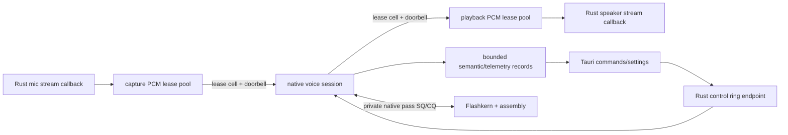

# Rust Audio Dock, Host Seam, And Inference Deletion

Status: normative. Rust is the audio-stream and host boundary, not the model
coordinator or numerical runtime.

## Boundary

Production Rust may own:

- microphone and speaker stream objects required by the platform audio crate;
- preallocated PCM lease pools and docking-ring endpoints;
- Rust kcoro tasks that park on audio/control ring promises;
- explicit settings mapping and backend capability requests;
- opaque runtime/model/conversation/session handles;
- Tauri command adapters and bounded observer projection;
- remote-provider networking, download, authentication, and persistence.

Production Rust may not own:

- a tensor, logits vector, token stream, sampler, KV/cache plane, model state, or
  prompt assembly;
- mel, resampling, VAD, Conformer, adapter, backbone, Depthformer, Mimi, Moshi,
  codec, or quantizer arithmetic;
- model-pass tickets, pass recurrence, stage scheduling, or assembly dispatch;
- a pointer into the resident model image or any numerical scratch plane;
- a callback whose return is required for the native model to recur.

The only high-rate bidirectional boundary is PCM/control docking. All model
progress stays native.

## Target Flow



Rust PCM tasks can run concurrently and park independently. A capture wait does
not block playback, a playback wait does not block control, and none blocks the
native model unless it has exhausted the relevant bounded buffer contract.

## Production Rust API

The final crate surface is intentionally small:

```rust
pub struct Runtime(NonNull<lfm_runtime_t>);
pub struct Model(NonNull<lfm_model_t>);
pub struct Conversation(NonNull<lfm_conversation_t>);
pub struct Session(NonNull<lfm_session_t>);
pub struct AudioDock { /* private ring endpoints and PCM leases */ }
```

Allowed methods are lifecycle, settings/control, PCM lease publication and
consumption, status snapshot, and observer subscription. There is no public or
private Rust method named `step`, `prefill`, `sample`, `token_pass`,
`depth_frame`, `mel`, `encode`, or `decode` in the production local-inference
call graph.

`Model` opens an explicit path. Native code reads and binds the complete model;
Rust never allocates or fills the weight image. `Conversation` is an opaque
native state owner. `Session` runs native recurrence. `AudioDock` only attaches
PCM/control rings.

## PCM Lease ABI

The ring cell is compact and versioned:

```c
typedef struct LfmPcmLeaseV1 {
    uint32_t size;
    uint32_t abi_version;
    uint64_t lease_id;
    uint64_t stream_epoch;
    uint64_t buffer_generation;
    uint32_t frames;
    uint32_t channels;
    uint32_t sample_rate;
    uint32_t format;
    uint32_t offset_bytes;
    uint32_t length_bytes;
    uint32_t flags;
    uint32_t reserved;
} LfmPcmLeaseV1;
```

The cell does not contain an unscoped raw pointer. A dock endpoint resolves the
lease ID against its fixed buffer pool and generation. The producer retains the
lease before release-publishing the cell. The consumer releases it after use or
flush. Recycle occurs only after the final release callback returns.

Capture makes the single hardware-buffer copy into a free preallocated block.
Playback makes the single block-to-hardware copy required by the platform API.
The native session mutates/consumes retained blocks in place between those
edges.

## Rust kcoro Role

`crates/kcoro` remains a general-purpose callback executor for Rust functions
and threads. In this product it supplies:

- independent capture, playback, control, and observer tasks;
- exact-once promises for ring data/space/terminal events;
- inherited pause/cancel scope words;
- bounded SPSC endpoints and custom wakers;
- fixed worker/task capacity and bounded drain fairness.

It does not mirror the native lane scheduler. It does not receive native
model-pass completions. The shared vocabulary of ticket, epoch, terminal cause,
and exact callback exists so global control is coherent, not so math crosses the
language boundary.

No Tokio, async-std, runtime vtable, polling stream adapter, or serialized IPC
is allowed in the local realtime dock.

## Lifecycle

Creation order:

1. validate persisted settings and compiled capabilities;
2. create native runtime;
3. open and warm the native model image;
4. create native conversation and session;
5. allocate PCM pools and rings;
6. start Rust audio streams and kcoro dock tasks;
7. attach dock endpoints to the native session;
8. publish ready only after both sides acknowledge their doorbells and leases.

Teardown order:

1. advance root cancel/output epoch;
2. close capture/control admission and stop platform callbacks;
3. native session flushes stale playback and settles accepted work;
4. join Rust dock tasks;
5. detach and prove all PCM leases returned;
6. stop/join/destroy native session;
7. release conversation, model, and runtime handles.

No Rust `Drop` calls native code from a native callback. Panic is caught at the
Tauri/observer edge and cannot unwind across C.

## Settings

Persisted TUI/Web/Tauri settings are the sole product configuration source.
Map every field explicitly into versioned ABI records:

- backend and device ordinal;
- absolute model/component paths;
- lane, pass-slot, conversation, and memory budgets;
- input/output device IDs, formats, rates, and PCM pool capacity;
- VAD, endpoint, interrupt, sampling, and output policy;
- service classes, conversation quantum, trace level, observer capacity.

No model, device, scheduler, sampling, or trace choice is read from an
environment variable in production. Cargo/CMake target variables remain build
inputs only. An unavailable backend returns a typed error; it never silently
falls back.

## Tauri Mapping

Public command names remain stable, but their implementation becomes a dock
control operation:

| Command | Action |
|---|---|
| `voice_start` | open/retain native owners, create PCM dock, attach, start |
| `voice_stop` | cancel root scope, close rings, join dock and native session |
| `voice_interrupt` | advance native publication/output epoch through control ring |
| `voice_set_mic_enabled` | update capture privacy/admission gate |
| `voice_begin_typed_input` | pause capture and submit a high-level native input command; Rust does not tokenize |
| `voice_status` | map one bounded native+dock snapshot |
| `voice_kernel_observe` | attach lossy/coalesced observer subscription |
| `voice_kernel_unobserve` | detach and settle an in-flight observer callback |

TypeScript sees small owned JSON values. It never sees a PCM lease, model
pointer, token ID, pass ticket, or scheduler object.

## Repository End State

```text
crates/liquid-audio/
  Cargo.toml                  # no Candle/moshi inference dependencies
  build.rs                    # native source/link manifest
  src/
    lib.rs                    # public audio dock and opaque handles
    ffi.rs                    # private lifecycle/control/PCM declarations
    handles.rs                # RAII only
    audio/
      input.rs                # platform input stream -> capture leases
      output.rs               # playback leases -> platform output stream
      dock.rs                 # kcoro ring tasks, no DSP
    tauri.rs                  # small control/event mapping when shared
  native/
    include/
      lfm_voice.h             # sole public native ABI
      lfm_audio_dock.h        # private PCM/control ring ABI
    src/
      runtime/                # session, native SQ/CQ, pass slots
      model/                  # model/conversation binding and recurrence
      frontend/               # VAD, resample, mel
      conformer/
      mimi/
      moshi/
    kernels/
      aarch64/*.S
      x86_64/*.S
    tests/oracles/            # test-only, never release-linked

crates/kcoro/
  src/                        # general Rust callback executor and rings

packages/desktop/src-tauri/src/voice/native/
  config.rs
  event.rs
  observe.rs
  session.rs
  status.rs
```

There is no legacy/reference crate and no feature that restores Candle. Test
oracles are independent fixture readers or native test-only objects, not a
second production implementation.

## Deletion Ledger

### Completed in the current working-tree tranche

- Rust inference-pass `coordinator.rs` and callback registration ABI;
- obsolete Rust `fanout.rs` threadgroup implementation;
- Rust DD arithmetic/twiddle implementation, leaving only a test ABI record;
- Candle fallback inside `sample_audio_frame`;
- C++ RMS/strided reduction/bias/NeoX rotary formulas moved to assembly leaves.

### Delete after native conversation/session ownership is complete

- `src/compute/bf16_gemm.rs` and Rust numerical leaf wrappers;
- `src/compute/flashkern/candle_ops.rs`;
- production `native_engine.rs` pass methods and token-facing structs;
- `src/model/**` local inference owners;
- `src/processor/mel.rs`, Rust resample/VAD numerical owners;
- Rust Mimi/Moshi inference owners and realtime model workers;
- Candle, candle-nn, candle-transformers, moshi inference dependencies;
- public re-exports for tokens, tensors, model steps, and generators.

### Keep

- audio device stream adapters;
- PCM lease/dock tasks;
- opaque lifecycle/config/status wrappers;
- Tauri command and observer projection;
- download/auth/persistence and remote network providers;
- independent data fixtures and test-only scalar oracles.

## Static Enforcement

Release gates fail on:

- `candle_core`, `candle_nn`, `candle_transformers`, or `moshi` in the local
  production dependency/link graph;
- Rust FFI taking `f32`, BF16 bits, token IDs, logits, weights, KV, or model-pass
  descriptors outside test-only modules;
- C++ engine/model/session source containing floating-point arithmetic loops or
  calls to `sqrt`, `exp`, `sin`, `cos`, BLAS, or numerical intrinsics directly;
- any numerical symbol referenced by the Rust release object graph;
- `try_recv`, timed receive, sleep, spin, or periodic progress timers in the
  dock/session progress paths;
- runtime environment-variable reads for product configuration;
- release linkage of scalar oracle objects or fallback implementations.

## Gates

1. Rust audio streams continue bidirectionally while capture/playback tasks park
   independently on exact ring edges.
2. Root cancel wakes and settles all dock children and native session work once.
3. No PCM payload copy occurs after the device callback copy.
4. Native recurrence completes 1,000 tokens/frames with zero Rust model callbacks.
5. Tauri/webview stall does not affect native or buffered audio progress.
6. Full workspace and Tauri builds pass with Candle removed.
7. AArch64 and x86_64/Rosetta, ASan/UBSan/TSan, idle CPU, allocation, copy, and
   p99 latency gates are green.
