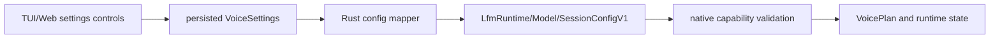

# Rust Host Seam and Candle Removal

Status: normative design.

Baseline: EmberHarmony `321538f11749`.

## Goal

Reduce production Rust to a host control plane around opaque native handles.
Rust reads persisted Tauri settings, resolves app-owned resources, calls the
versioned C ABI, converts bounded native notifications into existing Tauri
events, and owns orderly handle destruction. It does not own model tensors,
audio buffers, inference recurrence, local audio callbacks, local voice workers,
conversation state, or polling loops.

The direction of every local inference call is fixed:

```text
TypeScript/Tauri command -> Rust control wrapper -> C ABI -> C++ runtime
    -> immutable native plan -> architecture kernel table -> SIMD/assembly
```

Rust passes paths, enums, scalar settings, callbacks, and opaque handles. C++
opens and binds the model files, owns every numerical pointer, dispatches every
pass, and invokes the selected architecture kernels. No Rust function accepts a
weight, activation, KV, PCM, mel, logits, token-sampling, or codec payload for
local inference. Rust is not a slow-path math fallback.

Keep the TypeScript/Bun boundary equally clear: web code edits settings and
invokes Tauri commands. It never receives a model pointer or PCM payload and
never participates in scheduling or turn-taking.

## Scope Boundary

This design removes Rust ownership from the **local native model data plane**.
It does not require unrelated desktop work to be rewritten in C++:

- remote LiveKit transport may retain its Rust async/network implementation;
- model download, authentication, keychain, and Tauri persistence remain host work;
- delegation/tool orchestration remains outside numerical passes;
- the webview continues to receive small text/state/level/error events.

`ThreadManager` is used by local voice, remote LiveKit, delegation, and model
tasks (`packages/desktop/src-tauri/src/voice/threads.rs:13-105` and call sites in
`voice/runtime.rs`). Remove its local-model uses; do not delete the type until a
separate audit proves no remaining host work needs it.

## Current Host Surface

| Current symbol | Evidence | Target |
|---|---|---|
| `VoiceStartResult` and `VoicePlan` | `packages/desktop/src-tauri/src/voice/control.rs:65-101` | Preserve serialized public shape; redefine `running` as native session state rather than “service thread.” |
| `VoiceEngineMode` | `voice/control.rs:103-117` | Map directly to the native engine enum. |
| readiness `plan` | `voice/control.rs:131-186` | Query compiled capabilities and persisted settings, not Candle devices. |
| Tauri commands | `voice/control.rs:372-520` | Preserve command names and frontend contract. |
| Tauri runtime actor | `packages/desktop/src-tauri/src/voice/runtime.rs:217-440` | May remain a bounded control actor; it stores opaque native handles only for local voice. |
| `Lfm2Session` | `voice/runtime.rs:2301-2450` | Replace Rust audio/thread/runtime fields with one native session wrapper. |
| `local_runtime_config` | `voice/runtime.rs:2725-2736` | Map all persisted fields into `LfmSessionConfigV1`. |
| `build_engine` | `voice/runtime.rs:2738-2808` | Replace model object construction with native model/conversation open. |
| `select_device` | `voice/runtime.rs:2810-2829` | Delete; backend choice is an ABI enum selected at runtime. |
| local WebRTC I/O | `voice/runtime.rs:2965-3419` | Replace with the native platform-audio adapter. |
| Rust `VoiceRuntime` | `crates/liquid-audio/src/runtime/voice_runtime.rs:637-1038` | Delete from production after native session lifecycle passes. |
| Rust turn/frame workers | `crates/liquid-audio/src/runtime/realtime.rs:488-920` | Delete from production after native continuations pass. |
| direct desktop Candle dependency | `packages/desktop/src-tauri/Cargo.toml:47` | Remove. |
| liquid-audio Candle graph | `crates/liquid-audio/Cargo.toml:18-93` | Capture fixtures, then delete; the production package has no inference framework. |
| current public module fanout | `crates/liquid-audio/src/lib.rs:14-57` | Replace with native handles/status/config only; removed APIs remain available through git history, not a backup crate. |
| source-assertion TS tests | `packages/app/src/context/voice.test.ts:74-202`, `353-461`, `533-555` | Replace implementation-string assertions with IPC contracts and native integration gates. |

## Target Repository Boundary

Keep the active native source where the earlier folder migration placed it and
delete replaced Rust inference sources once their gates pass:

```text
crates/
  liquid-audio/
    Cargo.toml                 # thin production Rust package, no Candle
    build.rs                   # builds/links the native library
    src/
      lib.rs                   # status/config/opaque wrappers only
      ffi.rs                   # private raw declarations
      handles.rs               # Runtime/Model/Conversation/Session RAII
    native/
      CMakeLists.txt
      include/lfm_voice.h      # sole public native ABI
      src/{runtime,model,...}/
      kernels/{aarch64,x86_64}/
      tests/
        oracles/               # test-only scalar C++ implementations
        fixtures/              # committed data, not executable old code

packages/desktop/src-tauri/src/voice/native/
  mod.rs
  config.rs                    # persisted settings -> ABI structs
  event.rs                     # panic-safe callback -> Tauri events
  observe.rs                   # lossy/coalesced ticket snapshots -> kernel channel
  status.rs                    # bounded runtime/ticket/executor snapshots
  session.rs                   # desktop-local lifecycle policy
```

The package name `liquid-audio` remains the production dependency so Tauri path
churn is limited. There is no legacy/reference crate and no optional feature
that restores the removed Candle stack. During implementation, old and new code
may coexist only long enough to capture and verify a boundary. The phase that
passes the replacement gate deletes the old owner. Git commits are the archive.

## Native Build Boundary

Add `crates/liquid-audio/native/CMakeLists.txt` as the canonical native source
manifest. `build.rs` invokes it and emits the resulting library/link metadata to
Cargo. CMake defines:

```text
lfm_voice_coord      stackless coordination, operations/tickets, actors, timers,
                     channels, cancellation, and the selected host port adapter
lfm_voice_exec       fixed executor shell, private SQ/CQ, stage board, wait adapter,
                     completion ingress, and libkcoro_kernel
lfm_voice_kernels    numerical C++/SIMD/assembly leaf kernels and approved Apple
                     numerical adapters; no kcoro or host callback symbols
lfm_voice_core       C++ model/session/frontend/codec coordinator and plans
lfm_voice_durable    WAL/workflows/image association and storage adapter; excluded
                     from the realtime dependency graph unless explicitly enabled
lfm_voice            final archive/shared library with approved C ABI exports
lfm_voice_oracles    test-only scalar C++ kernels; never linked into lfm_voice
lfm_voice_tests      native unit/parity/race tests plus lfm_voice_oracles
```

The link direction is one-way: `lfm_voice_core` submits through
`lfm_voice_coord` to `lfm_voice_exec`; the executor invokes
`lfm_voice_kernels`; durable services depend on coordination but never on the
executor or numerical kernels. The executor shell necessarily owns ticket/CQ
completion integration. The numerical Flashkern target does not link kcoro and
never routes a fence through a channel.

Requirements:

- C++23 is set once at target level, matching the existing rationale at
  `crates/liquid-audio/build.rs:61-79`.
- `-ffp-contract=off` remains on parity-sensitive targets until a measured
  numerical contract says otherwise; the Mimi rationale is at
  `crates/liquid-audio/build.rs:81-102`.
- platform and architecture sources are selected by the build target;
  runtime ISA dispatch chooses among compiled kernels where supported.
- C++ runtime/model code may coordinate passes and perform bounds/index
  arithmetic, but production numerical loops live only in the selected kernel
  target or an explicitly approved Apple native-library adapter.
- the fixed executor's hot lane call graph may enter only board/wait helpers,
  prebound numerical kernels, and bounded ticket completion ingress. It cannot
  enter general channels, actors, workflow code, WAL, storage, Tauri callbacks,
  or the movable coordination ready queue.
- a release link-map audit rejects `kc_*`, channel, ticket callback, WAL, store,
  and workflow symbols from `lfm_voice_kernels`. The executor target may link the
  narrow kernel/ticket completion core but not durable services.
- test oracles are separate object code and absent from the release link graph.
  A missing production ISA returns `LFM_UNSUPPORTED_BACKEND`; it never selects a
  scalar C++ or Rust implementation.
- default symbol visibility is hidden; only declarations in `lfm_voice.h` are
  exported.
- warnings are enabled for owned native code and promoted in CI after existing
  debt is classified. Vendor headers use system-include treatment.
- sanitizers, scalar-reference modes, trace, and fault injection are test build
  options. They are not runtime product configuration.
- no source glob determines the library. Every translation unit is listed so a
  missing kernel cannot silently disappear.

The current `cc::Build` list at `crates/liquid-audio/build.rs:34-119` remains the
source inventory until CMake parity is proven. Move build systems in its own
gate; do not combine it with a numerical rewrite.

## Production Rust Wrapper

The wrapper owns only lifetimes and type conversion:

```rust
pub struct Runtime(NonNull<lfm_runtime_t>);
pub struct Model(NonNull<lfm_model_t>);
pub struct Conversation(NonNull<lfm_conversation_t>);
pub struct Session(NonNull<lfm_session_t>);
```

Each constructor validates `size`/`abi_version`, converts a returned status, and
takes ownership only on success. Each `Drop` follows explicit lifecycle rules:

- `Session::drop` requests stop, joins, then destroys;
- `Runtime::drop` is legal only after sessions/models are gone and joins before
  destroy;
- `Model` outlives every retained conversation;
- callback context outlives native join and is freed after destroy;
- no `Drop` calls into an object from one of its own callbacks.

The wrappers do not implement `Clone` for unique state handles. Shared model
ownership uses a native retain/release operation or `Arc<Model>` whose final
drop calls one native release. Raw FFI remains private.

The wrapper exposes control operations only. It has no `Tensor`, `Vec<f32>`,
sample slice, raw model-region pointer, kernel callback, or per-token/per-frame
method. `Model` is returned by `lfm_model_open`; Rust never allocates or fills
the resident weight image.

## Settings Flow



Persisted settings are the sole product source of truth. Current definitions are
at `packages/desktop/src-tauri/src/settings.rs:60-87` and `210-250`. Map every
field explicitly; do not serialize a Rust struct wholesale across C.

Required explicit values include:

- engine (`lfm2_interleaved` or `moshi_realtime`);
- backend (`cpu`, `mlx_metal`, later capabilities) and device ordinal;
- absolute model/component paths;
- lane/worker policy, maximum context/utterance, and memory budgets;
- input/output device IDs and rates;
- VAD, endpoint, interrupt, and output policy;
- sampling parameters and seed;
- trace/telemetry level and bounded event capacity.

No `LFM_*`, device, model, scheduler, sampling, or trace setting is read from an
environment variable in production. Build tools may read Cargo/CMake target
variables. The app may use `HOME` while deriving a default path, but the stored
setting handed to native code is an explicit absolute path; native code does not
expand environment variables.

Requesting an unavailable backend returns `LFM_UNSUPPORTED_BACKEND`. It never
selects CPU, Metal, or MLX silently. Device selection is
runtime policy; Cargo features advertise compiled capability only.

## Tauri Command Mapping

Keep the public command names used by
`packages/app/src/lib/voice-settings.ts:161-240`:

| Command | Native action |
|---|---|
| `voice_start` | open/retain model and conversation, create session, register callback, start |
| `voice_stop` | request stop, await native join off the async executor if needed, destroy session |
| `voice_interrupt` | ring session interrupt/output-epoch doorbell |
| `voice_set_mic_enabled` | set native capture policy and wake coordinator |
| `voice_begin_typed_input` | atomically pause mic plus interrupt through one native control operation |
| `voice_status` | read bounded native snapshot and map to `VoicePlan` |
| `voice_kernel_status` | read one bounded ticket/executor snapshot; never required for progress |
| `voice_kernel_observe` | register a lossy/coalesced observer and return a generation-protected subscription ID |
| `voice_kernel_unobserve` | detach the observer and wait for an in-flight observer callback |

The webview sees the same serialized result/event names. It does not know which
native thread, lane, or backend implements them.

`VoicePlan.running` currently describes “an active service thread” at
`voice/control.rs:84-87`. Keep the JSON field for compatibility but change its
Rust/TypeScript documentation to “an active native session.”

## Callback and Event Seam

Native code owns a bounded notification ring. A notification continuation calls
one registered host sink with small immutable event views. Rust immediately
copies text/error/state metadata it needs beyond the callback and returns a
status. It never retains the native pointer.

The callback shim:

1. validates event `size`, version, kind, length, and UTF-8 contract;
2. catches every Rust panic;
3. sends or coalesces according to the event policy in document 01;
4. returns success, full, closed, or fatal to native code;
5. never recursively invokes native error callbacks.

No audio samples, weight bytes, activations, KV, or codebook matrices cross this
seam. Audio level/stat snapshots are fixed scalar structs. Text is bounded
metadata required by the UI.

Kernel observations use a second sink and capacity as specified in document 12.
They carry fixed-size ticket IDs, phases, lane counts, queue depths, and timing
counters. Native sampling is capped, the Rust bridge keeps only the newest
generation, and the webview receives at most the configured UI rate. Full or
closed observer channels coalesce/drop and unregister; they never enter
`send_or_cancel`, stop the native session, retain a pass descriptor, or delay
recurrence.

The prompt visualizer consumes truthful sources: capture RMS while listening,
coalesced fixed-lane activity while thinking, playback/reference RMS while
speaking, and zero while idle. No fabricated periodic animation or per-tile
event is added. The browser LiveKit track visualizer remains separate.

## Local and Remote Provider Separation

The current local path uses Rust WebRTC/PlatformAudio helpers at
`voice/runtime.rs:2965-3419`. Once document 04's native platform adapter passes,
local `Lfm2Session` no longer starts those helpers.

Remote LiveKit remains a separate provider and may continue to own network media
threads in Rust. It must not become an implicit fallback for failed local audio,
and local native session state must not be routed through remote provider queues.
Shared UI events pass through an explicit provider-tagged adapter.

## Fixture and Git Rules

Do not preserve the old implementation as a second crate, feature, copied tree,
or long-lived test dependency.

- Before replacing a boundary, capture complete fixtures with shape, dtype,
  hashes/tolerances, model fingerprint, and baseline commit.
- When a live comparison is temporarily useful, build the old commit in a
  separate clean git worktree. Do not copy its sources into the new tree.
- Native tests consume stable fixture data and native scalar implementations,
  not calls back into Rust/Candle.
- The replacement change deletes the old owner after its independent fixtures,
  lifecycle tests, and product gate pass.
- If a future investigation needs old behavior, retrieve it from git history.

## Architecture Documentation Cutover

Rewrite the existing architecture document in place; do not preserve a second
"old architecture" copy.

The ownership statements that must change are concrete:

| Current text | Location | G10 replacement truth |
|---|---|---|
| “native Rust voice stack” | `packages/desktop/src-tauri/src/voice/VOICE_ARCHITECTURE.md:6-11` | Native C++/assembly local voice data plane controlled through a thin Tauri Rust host; remote LiveKit remains a separate Rust provider. |
| local Candle/Metal path in the philosophy diagram | `VOICE_ARCHITECTURE.md:93-101` | Local model path enters the versioned C ABI, stays in C++ plans/kernels, and returns only bounded metadata events. |
| “Why native Rust” decision and realtime-audio ownership | `VOICE_ARCHITECTURE.md:190-217` | Rename the layer around native in-process ownership; C++ platform adapters own local realtime audio and C++ kernel tables own math. Rust owns commands, settings, handles, and events. |
| desktop Cargo comment describing pure-Rust realtime and Candle Metal | `packages/desktop/src-tauri/Cargo.toml:65-75` | Describe the linked native runtime and runtime-selected backend capability without claiming a Rust numerical owner. |

Keep and update the model-semantic sections for mel, Conformer, interleaved
generation, context, and Mimi. Replace their file/module maps with the final
native plan/kernel paths and opaque host seam. Remove sections that document
deleted Candle/Rust owners; Git already preserves them. During G0-G9, add one
clear status banner linking to this target spec so current-hybrid truth is not
mistaken for completed-native truth.

## Deletion Sequence

Delete by proven owner, not by file count:

1. Add the C ABI and thin wrappers beside the current implementation.
2. Capture independent fixtures for the boundary being replaced; use a separate
   baseline worktree for temporary live comparison when needed.
3. Mount native loader/model handles in the native integration harness. Do not
   add an in-process old/new runtime selector; comparisons run against committed
   fixtures or a separate baseline worktree.
4. Mount native LFM2 turn session, then native Moshi frame session.
5. Replace local PlatformAudio/WebRTC ownership with the native adapter.
6. Change `Lfm2Session` at `voice/runtime.rs:2301-2450` to opaque handles.
7. Remove local uses of `ThreadManager`, `build_engine`, `select_device`, and
   `local_runtime_config` object construction.
8. Delete `runtime/voice_runtime.rs`, `runtime/realtime.rs`, `loader.rs`,
   `processor.rs`, `model/`, `moshi/`, `detokenizer.rs`, and Candle bridge code
   after their corresponding native gates pass. Do not move them elsewhere.
9. Remove `candle-core`, `candle-nn`, `candle-transformers`, `moshi`, Rayon,
   `candle-flashfftconv`, CPAL, and crossbeam from the production package when
   static reachability proves no remaining owner.
10. Remove `packages/desktop/src-tauri/Cargo.toml:47` and the `metal` feature
    wiring at `68-75`; native capabilities are linked independently.
11. Rewrite architecture docs and source-assertion tests to describe the shipped
    native boundary.

## CI and Static Enforcement

Add release-graph checks that fail when:

- `cargo tree --manifest-path packages/desktop/src-tauri/Cargo.toml --target all`
  reaches any Candle/Moshi package from the desktop production target;
- a production Rust file imports `candle_*`, `moshi`, `cpal`, model modules, or
  raw kcoro APIs;
- a production Rust local-voice function accepts or returns a weight, tensor,
  PCM, mel, KV, logits, codebook, or sampling payload;
- a production numerical symbol is implemented in Rust, linked from the
  test-only scalar oracle target, or exported through the C ABI;
- `lfm_voice_kernels` links a kcoro/channel/WAL/callback symbol, or an executor
  fence/stage routes through a general coordination channel;
- `std::thread::spawn` or `ThreadManager::spawn` appears in the local native
  session path;
- a product source reads `LFM_*` or a voice backend/device env var;
- exported native symbols exceed the approved `lfm_voice.h` surface;
- a C ABI declaration lacks a linked symbol or Rust declaration;
- TypeScript/Bun source refers to native pointers, model layouts, PCM queues, or
  implementation-specific worker names.
- ticket telemetry shares the reliable semantic queue or a telemetry failure
  reaches a native session stop path.

The current workflow builds all Rust targets, runs library and hermetic
integration tests on Linux and macOS, and repeats both suites with Metal on
macOS at `.github/workflows/rust-voice.yml:62-94`. Checkpoint-dependent and
audible-output e2e tests remain explicit `--ignored` host gates. The replacement
workflow must retain those executions and add native ABI tests, Tauri integration
tests, and the actual desktop-local smoke path. Merely compiling integration
tests is not a gate.

## Acceptance Gates

- The desktop public Tauri command and event schemas remain compatible.
- Every persisted engine/backend/device/sampling/audio setting maps to a
  versioned ABI field and round-trips through status snapshots.
- No product voice configuration comes from environment variables.
- Rust callback panic, closed channel, full event ring, and app shutdown each
  produce one terminal native outcome with no callback after destroy.
- Local `voice_start` creates no Rust audio, inference, consumer, drain, or stop
  worker.
- The local inference call graph is Rust control wrapper -> C ABI -> C++
  coordinator -> selected native kernel; Rust appears in no numerical stack.
- Release link maps contain architecture kernels and approved native adapters,
  but no test oracle object and no scalar or Rust fallback.
- Release link maps prove numerical kernel objects are kcoro-free, the executor
  contains only the narrow SQ/CQ/ticket completion dependency, and durable
  objects are absent from the realtime graph unless the configured capability is
  enabled.
- TypeScript/Bun receives no PCM or model-state payload.
- The optional Tauri kernel observer can overflow, close, panic, and detach
  without changing ticket outcomes, generated output, or session lifetime.
- The native visualizer reflects real capture/compute/playback activity and
  shows no synthetic work while idle.
- Remote LiveKit continues to work and is provably separate from the local
  native session.
- Production `cargo tree` contains no Candle or Rust Moshi,
  `candle-flashfftconv`, Rayon model pool, or CPAL local runtime.
- Native build and tests run independently through CMake and through Cargo/Tauri
  integration on aarch64 and x86_64.
- Architecture documentation and settings UI describe runtime capability and
  actual ownership accurately.
- `VOICE_ARCHITECTURE.md` contains none of the superseded Rust/Candle ownership
  claims above and no duplicate legacy architecture document is added.

## Non-Goals

- Do not rewrite remote networking merely to remove Rust from local inference.
- Do not expose the C ABI directly to TypeScript.
- Do not retain Candle behind a production feature or silent fallback.
- Do not equate build-time target detection with runtime device selection.
- Do not delete shared host utilities without auditing their nonlocal users.
