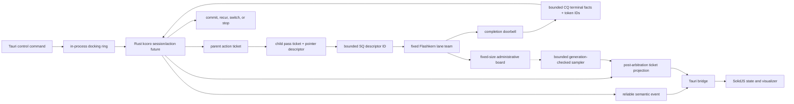
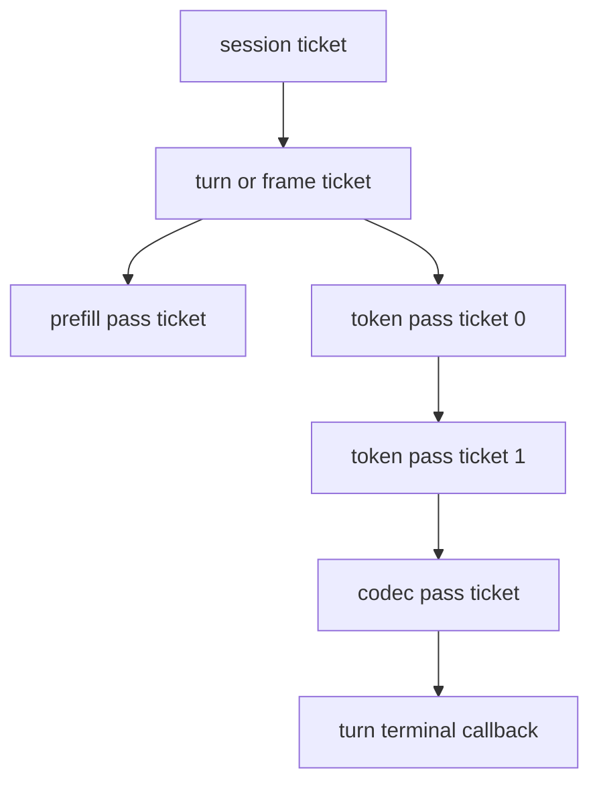
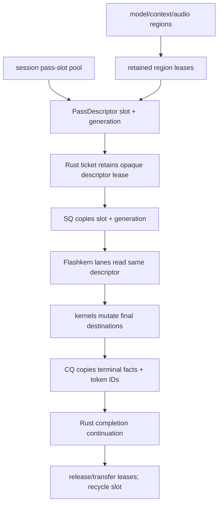
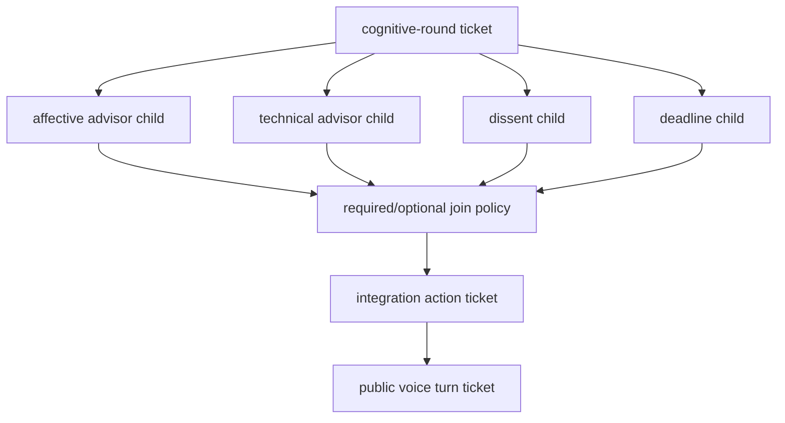

# Ticketed Orchestration, Tauri Observability, And Visualizer Contract

Status: normative design. The C arena ticket machinery is retained as a
conformance oracle at upstream `bd530f4c9196`; the Rust coordination foundation
is implemented at `3a5b1431`, and the native SQ/CQ leaf is implemented and
mounted at `2a2adcea` and `95069bd5`. Retained descriptors land at `fa35a624`,
and first Rust broker/CQ ownership lands at `4f06a3d5`. Parent actors,
service-class policy, recurrence, Tauri projection, and the visualizer remain
open.

Baselines: EmberHarmony `321538f11749`; `kcoro_arena` `447d04f0246b`.

Upstream contracts:

- `/Volumes/stuff/Projects/kotlinmania/kcoro_arena/docs/GPU_KERNEL_CONTRACT.md`
- `/Volumes/stuff/Projects/kotlinmania/kcoro_arena/docs/TICKETS_AND_CALLBACKS.md`

## Goal

Give every native action a stable, exact readiness edge without involving
Tauri, webview IPC, polling, or monitoring in realtime progress. A BizTalk-like
Rust ticket represents accepted work, retains a generation-protected native
descriptor lease through completion, and wakes one Rust orchestration
continuation when the next decision is legal.

Tauri receives a bounded projection of that truth for status, diagnostics, and
the voice visualizer. It is never the callback that permits recurrence.

## Initial Implementation Status

The first exact-terminal oracle is committed at upstream `bd530f4c9196` and
vendor `8d510f83`:

- `kcoro_arena/include/kc_ticket.h` defines the versioned ticket/event/completion
  ABI and generation identity;
- `kcoro_arena/core/src/kc_ticket.c:20-457` owns a preallocated slab, descriptor
  leases, cancel/deadline/stop disposition, an intrusive completion queue, and
  one reserved terminal-delivery reference;
- `kcoro_arena/core/src/kc_runtime.c:327-370` delivers callbacks on coordination
  workers, separate from numerical lanes;
- a one-slot, 100,000-iteration complete/cancel race and the Cargo integration
  test prove one callback and no slot-reuse gap after `run_until_idle`.

The dispatched-ticket cancel return is a request-arbitration result, not a
second terminal publisher. A newly accepted cancel and the later full-pass
completion may both return `1`; completion then publishes the sole terminal
event with canceled/stale disposition. Tests therefore correlate both return
codes with the one callback cause rather than asserting their sum is one.

Commit `3a5b1431` adds the matching Rust-side primitives: exact promises,
generation-fenced task slots, bounded SPSC edge semantics, inherited scope
words, and 128-byte command/completion records. The CQ record preserves the
four terminal facts and up to eight inline token/codebook IDs; it intentionally
contains no timing telemetry.

Commits `2a2adcea` and `95069bd5` add the C mirror and mount one native-owned
SQ/CQ in Flashkern. `submit_pass` publishes one fixed command cell;
`bridge_main` validates the native descriptor generation and rings the lanes;
lane 0 publishes one exact completion after the program-final fence. The
production engine archive no longer imports `kc_ticket_*` or `kc_runtime_*`.

At `4f06a3d5`, the Rust executor owns SQ admission and dedicated CQ ingress owns
exact result routing. The compatibility caller still blocks on its preallocated
result slot because the current pass borrows Candle pointers; it does not own or
poll the CQ. Parent orchestration, service queues, recurrence, and ticket
telemetry across Tauri are not mounted.

The exact current mount is narrower than the target ticket model:

- C++ mints each pass ticket; `parent`, deadline, flags, and inline results remain
  zero;
- every submission is `RUN_PASS`, `INTERACTIVE`, and `pass_budget = 1`;
- the native descriptor pool is real, but each descriptor currently retains only
  `Engine*` plus request kind while the single engine request slot borrows the
  numerical pointers;
- production completion routing uses one pending identity and a preallocated
  Condvar-backed result slot, not the foundation's exact-once `Promise` or a
  production parent/child ticket table;
- successful CQ cells currently contain
  `completed + committed + committed + success` and no token/codebook IDs;
  sampled IDs are written to borrowed result spans, sampling occurs inside the
  typed native token and Depthformer passes, and outer turn recurrence remains
  in the Rust caller.

The source-exact sequence and capacities are in
[`KCORO_ARENA_INTEGRATION.md`](../../docs/native/KCORO_ARENA_INTEGRATION.md#mounted-pass-sequence-4f06a3d5).

### Target Orchestration Flow

The following diagram is the intended parent-ticket, recurrence, observer, and
Tauri flow. Only its Rust-broker/native-SQ/CQ segment is mounted today.



## Current Code Map

| Current surface | Evidence | Required change |
|---|---|---|
| Voice event schema | `packages/desktop/src-tauri/src/voice/control.rs:304-326` defines state, transcript, scalar level, audio clip, ended, and error. | Preserve this reliable semantic stream. Do not overload it with per-pass telemetry. |
| UI event buffer | `packages/desktop/src-tauri/src/voice/runtime.rs:359-385` uses one bounded Tokio channel and drops the bridge task on destruction. | Keep for reliable voice semantics; add an independent coalescing kernel observer path. |
| Runtime event mapping | `voice/runtime.rs:2669-2705` maps runtime events directly to `VoiceEvent`. | Replace local LFM2 mapping with native semantic callback translation; do not map ticket telemetry here. |
| TypeScript event union | `packages/app/src/lib/voice-settings.ts:179-212`. | Preserve `NativeVoiceEvent`; add a separate `NativeKernelEvent` and observer functions. |
| Desktop state reducer | `packages/app/src/context/voice.tsx:88-164` stores state, transcript, and scalar level. | Add an optional coalesced activity snapshot without making voice connection depend on it. |
| Native visualizer selection | `packages/app/src/components/prompt-input.tsx:2128-2147` prefers `NativeVoiceMeter` over a LiveKit track. | Feed truthful phase-specific activity while keeping audio RMS semantically distinct. |
| Native meter | `prompt-input.tsx:2253-2274` renders five bars from one scalar. | Extend it to render the current signal source: capture level, kernel activity, or playback level. |
| Regression guard | `packages/app/src/context/voice.test.ts:516-531` asserts native level wins over LiveKit tracks. | Expand the implementation-backed source/interaction tests for kernel observer isolation and signal selection. |

The current event queue is a correctness boundary: some send failures ultimately
request cancellation (`voice/runtime.rs:2673-2678`). Kernel telemetry must not
enter that failure path. A hidden full webview queue may close an observer, but
it cannot stop a native session or delay the next pass.

## Three Planes

Keep three communication planes separate:

| Plane | Carries | Reliability | May gate native work? |
|---|---|---|---|
| Control | start, stop, interrupt, mic, typed input, settings, status | request/reply | Yes, at the coordinator boundary only. |
| Semantic event | state, ordered text, turn completion, terminal error, stopped | bounded and reliable; explicit failure | It reports decisions already made; sink failure may stop the session cleanly. |
| Kernel observer | ticket phase, pass/stage summary, lane activity, queue depth, latency counters | sampled, coalesced, lossy | Never. |

PCM, weights, activations, KV, mel, codebooks, model pages, pass descriptors,
and ticket handles cross none of these host planes.

## Ticket Model

### IDs and phases

The local voice ABI exposes ticket value records, not mutable ticket handles:

```c
typedef struct LfmTicketIdV1 {
    uint64_t runtime_epoch;
    uint64_t sequence;
    uint32_t generation;
    uint32_t kind;
} LfmTicketIdV1;

typedef enum LfmTicketKindV1 {
    LFM_TICKET_SESSION = 1,
    LFM_TICKET_TURN = 2,
    LFM_TICKET_FRAME = 3,
    LFM_TICKET_PASS = 4,
    LFM_TICKET_CONTEXT_SWITCH = 5,
    LFM_TICKET_CHECKPOINT = 6,
    LFM_TICKET_WORKFLOW = 7
} LfmTicketKindV1;

typedef enum LfmTicketPhaseV1 {
    LFM_TICKET_CREATED = 1,
    LFM_TICKET_ACCEPTED = 2,
    LFM_TICKET_DISPATCHED = 3,
    LFM_TICKET_COMPLETING = 4,
    LFM_TICKET_TERMINAL = 5
} LfmTicketPhaseV1;

typedef enum LfmTicketExecutionV1 {
    LFM_TICKET_NOT_DISPATCHED = 0,
    LFM_TICKET_EXECUTION_COMPLETED = 1,
    LFM_TICKET_EXECUTION_FAILED = 2
} LfmTicketExecutionV1;

typedef enum LfmTicketStateV1 {
    LFM_TICKET_STATE_NONE = 0,
    LFM_TICKET_STATE_COMMITTED = 1,
    LFM_TICKET_STATE_ROLLED_BACK = 2,
    LFM_TICKET_STATE_POISONED = 3
} LfmTicketStateV1;

typedef enum LfmTicketPublicationV1 {
    LFM_TICKET_PUBLICATION_NONE = 0,
    LFM_TICKET_PUBLICATION_COMMITTED = 1,
    LFM_TICKET_PUBLICATION_STALE = 2
} LfmTicketPublicationV1;

typedef enum LfmTicketCauseV1 {
    LFM_TICKET_CAUSE_SUCCESS = 0,
    LFM_TICKET_CAUSE_REJECTED = 1,
    LFM_TICKET_CAUSE_CANCELED = 2,
    LFM_TICKET_CAUSE_TIMED_OUT = 3,
    LFM_TICKET_CAUSE_STALE_EPOCH = 4,
    LFM_TICKET_CAUSE_STOP = 5,
    LFM_TICKET_CAUSE_FAULT = 6
} LfmTicketCauseV1;
```

In the target runtime, Rust kcoro owns the mutable ticket table and terminal
promises. Native C++ sees only the ticket value ID embedded in the command and
the generation-protected pass descriptor ID. Tauri and TypeScript see only
bounded IDs and snapshots. A generation mismatch makes a stale ticket or
descriptor invalid.

The mounted path does not yet instantiate this production ticket table; it
correlates the C++-minted pass value through one pending Rust result slot.

### Target Parent And Child Tickets

One session action owns a parent ticket. Every model pass is a single-shot child
ticket:



A child pass ticket is never reset and reused as another pass. The runtime
returns its Rust slab slot only after CQ consumption, terminal promise delivery,
native descriptor release/transfer, and any fixed-size observer value has been
copied or dropped. It never waits for Tauri or webview delivery. This removes
ABA and makes each completion an unambiguous "you may decide what comes next"
edge.

The turn/frame parent can remain active over many child passes. Its Rust
continuation uses each child completion to recur through the fixed ring ABI,
without a one-shot host call or serialized IPC.

### Target Execution And Publication

An active pass always reaches a valid full-pass boundary unless a fatal kernel
fault occurs. Its terminal value records four independent facts:

```text
execution_status   completed | failed | not_dispatched
state_status       none | committed | rolled_back | poisoned
publication_status none | committed | stale
terminal_cause     success | rejected | canceled | timed_out | stale_epoch | stop | fault
```

The ABI enums and four fields exist now, but the mounted success path always
publishes `completed + committed + committed + success`; dispatcher validation
can publish `not_dispatched + none + none + rejected`. Scope-driven stale,
cancel, timeout, rollback, and poison disposition remain target behavior.

If interrupt arrives during a pass, `execution_status=completed` and
`state_status=committed` with `publication_status=stale` is valid for a
continuous model: the numerical program and generated thought remain in model
context, but old-epoch output is suppressed and no old-epoch recurrence is
dispatched. A speculative pass can instead report `state_status=rolled_back`.
Both are more truthful than claiming an inner kernel cancellation.

For a codec pass, committed publication means a native PCM block entered the
current playback epoch. It does not claim the device played the samples. Played
frames/reference RMS and a later output flush remain separate audio-transport
facts and never rewrite the ticket's model-state disposition.

A fatal executor fault is not an interrupt. The pass plan declares whether its
reserved outputs can be discarded, a boundary mark can restore in-place state,
or the conversation/session must be poisoned. Poisoned state cannot recur,
switch back into service, or be snapshotted; it is destroyed or restored from a
previously durable image.

## Target Pointer Descriptor Lifetime

The target pass slot is preallocated inside the native session. Its descriptor retains
the model, conversation, scratch, input, output, and any provider regions by
lease. Rust retains an opaque lease while the ticket is admitted. Submission
copies a fixed command cell containing the descriptor's slot/generation into a
bounded SPSC SQ; it never copies descriptor or payload bytes into a waiter
buffer. Many Rust actors first enter the broker's bounded service-class
admission queues, which are a scheduling frontier and are not the executor SQ.



The mounted private bridge provides generation-checked retain/release operations
for native descriptor IDs. Target owned pass slots use those operations and may
not fall back to `KORO_SEND`, whose C baseline implementation copies
at `kcoro_arena/core/src/kcoro_stackless.c:94-107`.

## Target Completion Callback Path

The completion edge that informs Rust orchestration is exact:

1. The final active Flashkern lane release-publishes output and final stage
   generation.
2. It fills the reserved CQ cell with ticket ID, pass ID, four terminal facts,
   status, and any compact token/codebook results. Sampling and native state
   append already happened inside the pass.
3. It release-publishes the CQ cell; capacity was reserved before SQ publication.
4. It rings one coordinator doorbell and returns to the fixed executor wait.
5. The named Rust kcoro continuation validates descriptor generation, ticket
   generation, and scope epoch.
6. It claims the exact-once terminal promise, releases/transfers the native
   descriptor lease, and wakes the parent action continuation once.
7. The parent decides whether to dispatch another typed pass, switch
   conversations, complete a cognitive barrier, or stop.
8. Only after that decision does the notification continuation project host
   semantic and observer events.

No compute lane invokes arbitrary Rust, Tauri, TypeScript, storage, tokenizer
display formatting, or a host callback. Its only upward operation is bounded CQ
publication plus one doorbell.

The CQ has one logical producer, not one permanently designated lane. The
one-active-pass permit prevents concurrent final-lane publication, and the next
pass cannot dispatch until coordination consumes the prior CQ entry. A design
that overlaps passes uses independent SQ/CQ pairs or a separately proven
multiproducer structure.

Rust continuations run outside native executor locks and terminal arbitration
locks. They are bounded and measured. A continuation can enqueue a future
action but cannot recursively call the native executor on the completing stack.

## Target Full-Pass Stop And Interrupt

Stop and interrupt are epoch doorbells:

- a command advances `requested_epoch` and wakes the action coordinator once;
- queued old-epoch passes are canceled before dispatch;
- one already dispatched pass finishes;
- the completion callback compares ticket epoch with requested epoch;
- stale output is released or rolled back by the declared context mark;
- no additional old-epoch child ticket is created;
- stop wins over queued prepare/start work;
- a Moshi soft interrupt may discard output while retaining continuous model
  state, as required by document 08.

The coordinator checks the epoch once per complete pass. SIMD loops, tile
claims, stage barriers, and assembly kernels do not poll it.

Predictive pause preparation uses the same contract. A candidate parent ticket
retains its context mark and PCM span; frontend/prefill passes are child tickets.
Endpoint commit and resumed-speech cancellation race through one parent decision
operation, while an already dispatched child still reaches its full-pass
boundary. Candidate epochs prevent a late child from adopting prepared state or
publishing output. The complete VAD ownership and join rules are in document 04;
no new scheduler or callback class is introduced here.

The same boundary rule applies to explicit cancellation and hard publication
deadlines. Before dispatch they may produce `not_dispatched`; after dispatch the
pass completes and reports committed/rolled-back state with stale publication.
Queue-only deadlines become miss metrics after dispatch, and soft deadlines
never claim terminal state. If a fault prevents a valid boundary, fault/poison
policy wins over every pending control request.

## Target Cognitive And Workflow Tickets

The same primitive supports the multi-agent design in
`specs/10-stateful-multi-agent-runtime.md`:



The parent owns required and optional clauses. Late optional work cannot mutate
an already published parent result. Perspective branches return bounded capsule
descriptors. The integrator performs a semantic join, not a KV-memory merge.

Durable workflow records persist stable ticket/action IDs, workflow type and
version, state, correlation, and commands. They never persist callbacks or raw
ticket pointers.

## Durable Snapshot Tickets

Checkpoint acceptance and durable publication are separate single-shot child
tickets. One ticket is never terminally published twice:

```text
CHECKPOINT_ACCEPTED
  context is quiescent at a full-pass boundary
  dirty generations are frozen into one of two bounded staging slots
  speech/model work may resume under copy-on-write or copied staging policy

CHECKPOINT_DURABLE
  immutable base/delta object is written and synced
  inactive A/B manifest is written, synced, and published
  WAL association is committed and synced when required
  matching dirty generations may now clear
```

Periodic continuity capture may acknowledge `ACCEPTED` and publish `DURABLE`
later. Explicit hibernation waits for `DURABLE` before releasing hot context
memory. External commitments wait for their WAL durable edge. Disk activity
runs on a bounded low-priority writer and cannot occupy the audio, fixed compute,
completion, or coordination executors.

The image format, cumulative delta rule, A/B manifests, compaction, and macOS
`F_FULLFSYNC` requirement remain normative in
`specs/10-stateful-multi-agent-runtime.md:628-949`. The current kcoro append-only
snapshot function at `core/src/kc_wal.c:535-580` is not used for long-running
conversation images.

## Native Event ABI

Keep semantic events and kernel observations as separate callbacks or sink
classes:

```c
typedef enum LfmEventClassV1 {
    LFM_EVENT_CLASS_SEMANTIC = 1,
    LFM_EVENT_CLASS_TELEMETRY = 2
} LfmEventClassV1;

typedef struct LfmKernelUpdateV1 {
    uint32_t size;
    uint32_t abi_version;
    LfmTicketIdV1 ticket;
    LfmTicketIdV1 parent;
    uint64_t session_id;
    uint64_t conversation_id;
    uint64_t epoch;
    uint64_t pass_id;
    uint32_t phase;
    uint32_t pass_kind;
    uint32_t stage;
    uint32_t active_lanes;
    uint32_t total_lanes;
    uint32_t queue_depth;
    uint32_t completion_depth;
    uint32_t service_class;
    uint32_t ready_deadline;
    uint32_t ready_interactive;
    uint32_t ready_background;
    uint32_t consecutive_passes;
    uint32_t reserved0;
    uint64_t queued_ns;
    uint64_t compute_ns;
    uint64_t callback_ns;
    uint64_t quantum_remaining_ns;
    uint64_t timestamp_ns;
    uint32_t execution;
    uint32_t state;
    uint32_t publication;
    uint32_t cause;
    uint32_t flags;
    int32_t status_code;
    uint32_t reserved1;
} LfmKernelUpdateV1;
```

Semantic callback rules remain those in document 01: ordered state/text/error
events are bounded and reliable, and an irrecoverable sink failure stops the
session explicitly.

Telemetry rules differ:

- no update contains payload or mutable pointers;
- native code samples only accepted, dispatched, full-pass completed, terminal,
  and periodic aggregate states, never tiles or SIMD operations;
- updates coalesce by session/ticket and are capped at 30 Hz for the UI sink;
- a full observer ring overwrites/coalesces the newest value and increments a
  drop counter;
- closed/full/panicking telemetry sinks unregister themselves and do not alter
  session or ticket state;
- observers are detached before native runtime destruction; no callback occurs
  after detach completion.

### Live activity sampling

There is no observer callback from a fixed lane. At pass and stage publication,
the executor writes only the administrative words already owned by its private
board: logical generation, ticket/pass ID, phase, active mask, stage, and bounded
timing/counter fields. A telemetry continuation scheduled at the configured
observer rate reads those fields with a generation-before/copy/generation-after
protocol. If the generation changes, it skips the sample; it does not retry-spin
or lock the board.

Accepted, dispatched, completing, and terminal ticket updates are projected by
coordination after their authoritative transition. Periodic running updates come
from the sampled board value. Both feed the same coalescer, which retains only
the newest fixed-size value per session/ticket. The telemetry sink invokes Rust
only from its dedicated bounded notification task, never from a compute lane,
audio callback, timer service, storage writer, or terminal-arbitration lock.

Observer level `summary` includes phase, active-lane fraction, service class,
queue depth, and aggregate timings. `diagnostic` may add stage/pass kind and
bounded wake/barrier counters. Neither level emits tile identities, payload
addresses, tensor names, or one record per stage transition; the sampler still
enforces the configured maximum Hz.

## Tauri Command Surface

Existing product commands remain unchanged. Add a separate optional observer
surface:

| Command | Result |
|---|---|
| `voice_kernel_status` | One bounded `KernelSnapshot`; no subscription required. |
| `voice_kernel_observe(channel)` | Registers a lossy observer and returns a generation-protected subscription ID. |
| `voice_kernel_unobserve(id)` | Detaches, waits for any in-flight observer callback, and invalidates the ID. |

`voice_kernel_observe` accepts a dedicated
`tauri::ipc::Channel<NativeKernelEvent>`, matching the existing `voice_start`
channel style at `voice/control.rs:365-378`. It returns
`KernelSubscription { id: String }`; the string is a lossless encoding of the
native slot/generation identity. The desktop voice context retains both the
JavaScript `Channel` object and subscription ID, calls `voice_kernel_unobserve`
when observation is no longer wanted, awaits detach, and only then releases the
channel. Native `voice_stop` remains authoritative: it detaches all session
observers even when webview cleanup never runs. Repeating unobserve for the same
ID is a harmless stale result and cannot detach a newer subscription in the same
slot.

`voice_stop` detaches observer subscriptions after native session join and
before handle destruction. Webview destruction closes only its observer; it
does not stop voice unless the reliable semantic channel also fails according
to existing session policy.

The Rust bridge shape is:

```text
packages/desktop/src-tauri/src/voice/native/
  event.rs       reliable semantic callback -> VoiceEvent
  observe.rs     lossy native snapshot -> KernelEvent coalescer
  status.rs      bounded Lfm/Kcoro snapshots -> serializable KernelSnapshot
```

`observe.rs` stores the latest fixed-size update and schedules at most one
pending async send. It does not enqueue every native event in Tokio. At the UI
rate limit it sends the newest value, then checks whether a newer generation
arrived. Closing the channel drops the observer task and unregisters the native
sink.

No environment variable enables telemetry. Persisted Tauri settings select
`off`, `summary`, or `diagnostic` level and the UI sample cap. Native pass
execution is identical at every level except bounded timestamp/counter writes.

Add a serde-defaulted `KernelSettings` under
`packages/desktop/src-tauri/src/settings.rs:210-250` with coordination-worker
count, fixed lane count, maximum consecutive passes, context quantum,
observer level, and observer Hz. The default observer level is `summary` so the
native thinking meter has a truthful source; `off` is an explicit user choice.
The Tauri layer resolves any `auto` topology selection to concrete values before
constructing `LfmRuntimeConfigV1`.

The advanced local-voice settings UI uses an `Auto` toggle plus numeric steppers
for coordination workers and lanes, a bounded quantum control, an observer-level
segmented control, and a sample-rate control. Invalid combinations are rejected
by `voice_settings_set` or runtime creation with a typed error; the native layer
does not silently clamp them or consult process state.

## TypeScript Contract

Add beside `NativeVoiceEvent` in
`packages/app/src/lib/voice-settings.ts:179-212`:

```ts
export type NativeKernelPhase =
  | "accepted"
  | "dispatched"
  | "completing"
  | "terminal"

export type NativeKernelEvent = {
  type: "kernel"
  ticket: string
  parent?: string
  conversation: string
  epoch: string
  pass: string
  phase: NativeKernelPhase
  execution: "notDispatched" | "completed" | "failed"
  state: "none" | "committed" | "rolledBack" | "poisoned"
  publication: "none" | "committed" | "stale"
  cause: "success" | "rejected" | "canceled" | "timedOut" | "staleEpoch" | "stop" | "fault"
  statusCode: number
  kind: string
  stage: number
  activeLanes: number
  totalLanes: number
  queueDepth: number
  serviceClass: "deadline" | "interactive" | "background"
  readyDeadline: number
  readyInteractive: number
  readyBackground: number
  consecutivePasses: number
  queuedUs: number
  computeUs: number
  callbackUs: number
  quantumRemainingUs: number
  atUs: number
}
```

IDs and epochs serialize as fixed strings or lossless bigint-safe components.
Do not put a 64-bit native ID into a JavaScript `number`. `atUs` is a checked,
session-relative microsecond duration produced by the Rust projection; it is
not the native absolute `timestamp_ns` cast to a number.

The desktop voice context adds optional derived values:

```text
agentActivity  0..1 from activeLanes/totalLanes and phase
agentSignal    capture | compute | playback | idle
kernelState    newest coalesced snapshot for diagnostics
```

The voice context remains connected when the observer is absent or closed.
With observer level `off`, thinking activity is zero rather than synthesized;
voice state and semantic output continue normally.

## Visualizer Contract

The five-bar native meter becomes a truthful activity meter instead of a scalar
RMS-only imitation:

| Voice state | Signal source | Meaning |
|---|---|---|
| listening | native capture RMS | The user signal entering VAD. |
| thinking | coalesced lane activity plus ticket phase | Native passes are actually queued/running/completing. |
| speaking | native playback/reference RMS | Audio actually queued/played by the native output path. |
| idle | zero | No fabricated periodic animation. |

`NativeVoiceMeter` at `prompt-input.tsx:2253-2274` receives `state`, `level`, and
`activity`. It keeps stable five-bar dimensions. Thinking intensity uses actual
`activeLanes / totalLanes`; a terminal callback may produce one bounded decay
frame so the visual transition is readable, but there is no timer-driven fake
work animation. Speaking and listening levels never masquerade as compute
utilization.

The compact prompt widget displays no ticket IDs, stage names, queue labels, or
instructions. Detailed ticket fields belong in an optional diagnostics view fed
from `voice_kernel_status` and the observer stream.

The browser LiveKit `BarVisualizer` path remains unchanged. Native activity is
used only when `isDesktop()` selected the local Tauri provider, preserving the
branch ordering guarded at `voice.test.ts:516-531`.

## Backpressure And Failure Matrix

### Capacity and dispatch invariants

All capacities are resolved from persisted settings and model/runtime topology
before native readiness. Runtime creation rejects an inconsistent budget; it
does not allocate an emergency node after start.

For one fixed executor, the configured pass-ticket bound includes the broker's
admission capacity, one dispatched pass, and the completion-delivery reserve.
Each additional independent executor adds one dispatched slot and its own
reserved completion ingress. A broker does not return an executor's dispatch
permit until the previous completion pointer has been removed from that ingress,
so a correctly sized completion path cannot become full. Function-backed ticket
targets reserve a callback-delivery permit when ticket creation succeeds;
continuation-backed pass tickets embed their retained wake subscription at
creation. If either reservation is unavailable, no ticket is created and no
callback is owed. Broker `EAGAIN` leaves an existing ticket in its created,
retryable state with caller-owned leases; a terminal rejection after a receipt
exists uses the target already reserved.

The total ticket slab also budgets parent turn/frame/workflow tickets, queued and
active pass children, timers/deadlines, checkpoint/durable children, and terminal
targets not yet consumed. Administration exposes each live class and the
high-water mark so a model plan cannot silently consume the lifecycle reserve.

| Failure | Required behavior |
|---|---|
| Kernel-broker admission queue full | Return bounded `EAGAIN` before descriptor ownership transfer; keep the created ticket retryable and parent-owned, with no terminal callback yet. The parent applies its declared retry/deadline/cancel policy. |
| Fixed executor command slot busy | Broker parks on the active completion ticket and does not publish another command; overwrite/full is a native invariant failure, not caller backpressure. |
| Ticket pool exhausted | Reject before descriptor ownership transfer or release every acquired lease. |
| Reserved completion ingress unexpectedly occupied | Latch a native invariant failure and wake the coordinator without dropping or overwriting the completing ticket. Dispatch-permit accounting and one reserved slot per independent executor make this unreachable in a conforming build. |
| Reliable native event ring full | Coalesce only permitted events; ordered semantic event failure stops cleanly. |
| Telemetry ring full | Coalesce/drop and count; no native state change. |
| Tauri semantic channel closed | Existing explicit host-sink terminal stop. |
| Tauri kernel channel closed | Unregister observer only. |
| Rust telemetry callback panic | Catch, count, unregister observer; do not stop session. |
| Rust semantic callback panic | Catch and follow host-sink terminal policy. |
| Webview slow | Latest kernel snapshot replaces older telemetry; semantic order remains bounded/reliable. |
| Disk writer slow | Coalesce cumulative pending delta or skip periodic capture; speech continues. |

## Source Changes

1. **Implemented oracle (`bd530f4c9196`, vendored by `8d510f83`):** the upstream
   `kc_ticket` and expected-value wait contracts are vendored and built by
   `crates/kcoro-sys`; raw ticket/runtime APIs remain a conformance oracle, not
   the product policy path.
2. **Implemented native leaf (`2a2adcea`, `95069bd5`):** Flashkern owns one
   private bounded SQ/CQ, admits only with reserved completion capacity, and
   binds final-fence completion to one CQ publication. The former C arena
   ticket/callback path is deleted from the production engine.
3. **Implemented foundation (`3a5b1431`):** `crates/kcoro` owns exact promises,
   bounded workers/rings, scope words, and the 128-byte SQ/CQ record definitions.
4. **Implemented endpoint mount (`fa35a624`, `4f06a3d5`):** the private bridge
   retains descriptor leases through CQ consumption; one Rust broker owns SQ,
   one ingress thread owns CQ, and exact preallocated result slots close the
   callback-to-continuation edge. Parent/child recurrence policy remains open.
5. Extend the private bridge ABI with bounded kernel snapshots, observer
   registration, and capability bits. Do not export pass descriptors or ticket
   handles.
6. Add semantic and telemetry sink classes to coordinator/notification code. Give
   telemetry independent capacity, coalescing, and drop counters.
7. Add `native/observe.rs` and `native/status.rs` under
   `packages/desktop/src-tauri/src/voice/`; keep the existing reliable
   `VoiceEvent` bridge logically separate.
8. Add `voice_kernel_status`, `voice_kernel_observe`, and
   `voice_kernel_unobserve` commands beside the current command definitions in
   `voice/control.rs:365-516` and register them in the command list at
   `packages/desktop/src-tauri/src/lib.rs:293-316`.
9. Add nested `KernelSettings` defaults/validation/round-trip tests in
   `packages/desktop/src-tauri/src/settings.rs`, then add the corresponding
   advanced controls to `packages/app/src/components/settings-voice.tsx` and
   localized labels.
10. Add TypeScript observer types/functions beside
   `packages/app/src/lib/voice-settings.ts:179-240`.
11. Add coalesced kernel state to `createDesktopVoice` at
   `packages/app/src/context/voice.tsx:88-164`; do not add it to the browser
   provider.
12. Extend the `NativeVoiceMeter` invocation at
   `prompt-input.tsx:2130-2144` and implementation at `2253-2274` with truthful
   signal selection.
13. Add diagnostics only through bounded snapshots. Do not render or serialize
    region pointers, payload bytes, per-tile events, or raw native structs.
14. Update `VOICE_ARCHITECTURE.md` and `FRONTEND_DESIGN.md` in place at product
    cutover; Git history is the old architecture record.

## Acceptance Gates

- Every accepted pass has one CQ delivery. It claims one Rust terminal promise,
  produces one parent wake, and invokes the bounded completion handler once; no
  independent duplicate callback is scheduled.
- Stop/interrupt before dispatch produces no kernel entry; during dispatch it
  permits one complete pass and no old-epoch recurrence.
- One recurrent 1,000-token run has exactly the declared native-CQ-to-Rust edges
  and zero Tauri/webview IPC, polling, or observer edges per token while still
  reporting bounded sampled progress.
- Descriptor addresses are identical from pass submission through lane reads;
  payload-copy instrumentation remains zero after the named hardware callback.
- Telemetry flood, closed observer channel, Rust observer panic, and webview
  destruction do not change generated tokens, pass count, session lifetime, or
  callback latency outside the approved measurement noise.
- Reliable text/state/error events remain ordered and are never silently
  displaced by telemetry.
- The UI receives at most the configured sample rate and memory remains bounded
  during a long soak.
- Thinking bars move only when a real accepted/dispatched/completing/terminal ticket
  update exists. Idle shows no synthetic work.
- Speaking/listening bars use the correct audio source and do not display lane
  utilization as RMS.
- `voice_kernel_status` returns a bounded snapshot when no webview observer is
  registered.
- A stale subscription ID cannot detach a newer observer.
- Observer detach and session destroy produce no callback-after-free under
  100,000 races with ASan, UBSan, and TSan.
- Checkpoint accepted/durable child tickets remain distinct; a slow or failed disk
  writer causes no playback underrun or token-pass p99 regression.
- Mixed deadline, interactive, and background ticket floods obey configured
  quanta and age promotion, never overwrite the active command slot, and cannot
  starve stop or a waiting context indefinitely.
- TypeScript/Bun source contains no native pointer, model layout, pass
  descriptor, or raw ticket handle.

## Non-Goals

- No ticket, callback, Tauri event, or UI update per tile or SIMD operation.
- No webview acknowledgement required to dispatch the next native pass.
- No telemetry failure promoted to a model/session failure.
- No durable write in an audio callback, compute lane, completion ingress, or
  recurrence callback.
- No reuse of one terminal ticket for multiple recurrent passes.
- No synthetic visualizer animation presented as kernel activity.
- No retained legacy event bridge or second visualizer after cutover; update the
  existing files in place.
