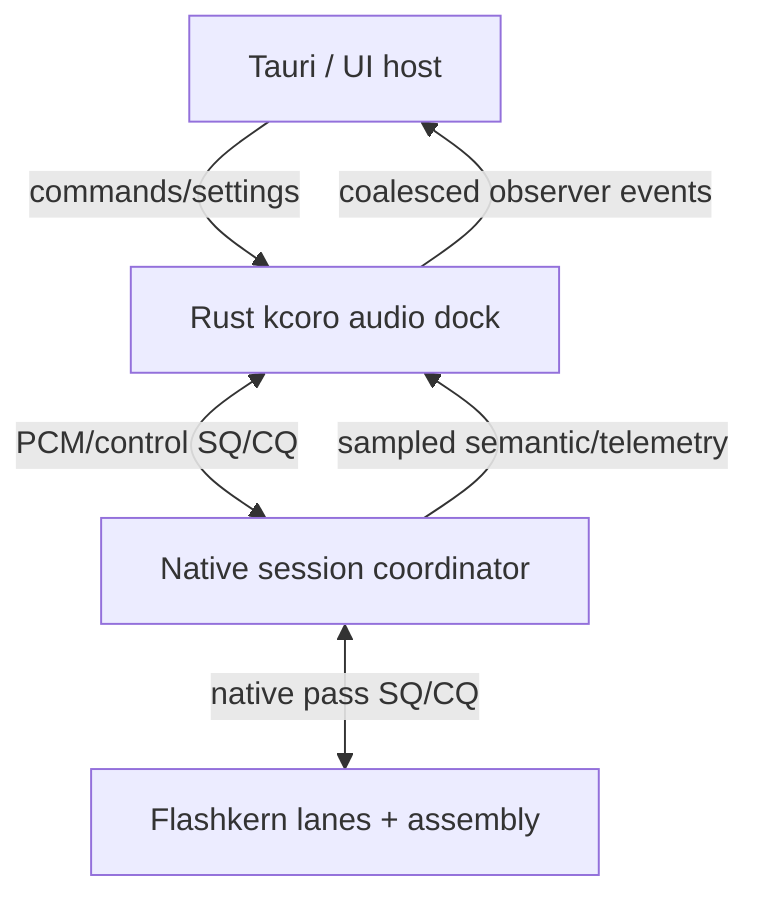

# Coordination Contract

Status: normative. This file owns the meaning of callback-driven progress,
scope control, and the Rust/native docking boundary.

## One Sentence

Rust kcoro docks asynchronous PCM streams and controls to a self-recurring
native voice session; every forward step is caused by an exact event callback,
and no model math or model-pass decision crosses Rust.

## The Three Planes



1. **Realtime data plane:** PCM lease rings, native model session, fixed lanes,
   assembly kernels, playback ring.
2. **Control plane:** start, stop, interrupt, mic gate, settings, conversation
   selection, snapshot request.
3. **Observer plane:** text/state summaries, levels, queue depths, ticket phases,
   latency counters, errors.

Observer traffic is never progress-bearing. A full observer queue drops or
coalesces. It cannot cancel inference, block audio, retain a pass slot, or wake a
model continuation.

## Callback-Only Progress

A continuation can become runnable only because one registered source publishes
an edge:

- PCM capture data became available;
- PCM playback space became available;
- a native pass completion became terminal;
- a child operation completed;
- a deadline fired;
- a cancellation/stop epoch advanced;
- a control command was accepted;
- a storage operation completed outside the realtime worker set.

The producer writes data, release-publishes the sequence, then rings the exact
doorbell. The continuation records its expected sequence and rechecks its full
predicate before returning `Dormant`; no thread remains attached to that
operation. A resident runtime worker may enter indefinite OS-backed dormancy
only when the runtime's complete ready predicate is empty. There is no
monitoring loop, timed queue probe, sleep/retry, bounded spin, or periodic UI
tick that discovers work.

This is promise semantics in systems form: the continuation is registered once
and resumes because the promise resolves, not because a scheduler keeps asking.

## Docking Ring Contract

The Rust/native dock has three bounded rings:

| Ring | Producer -> consumer | Cell | Payload ownership |
|---|---|---|---|
| capture | Rust audio callback -> native session | lease ID, epoch, format, offset, frames | preallocated PCM block retained until native release |
| playback | native session -> Rust audio callback | lease ID, epoch, format, offset, frames | native PCM block retained until device consumption/release |
| control/completion | Rust host <-> native session | command/result ID, scope, epoch, cause, small scalar fields | inline fixed record; no numerical payload |

The device callback may perform the one unavoidable copy from an ephemeral
hardware buffer into a preallocated capture block, or from a playback block into
an ephemeral device buffer. No additional PCM copy is introduced by the dock.

Rust may inspect PCM only as required by the platform stream API. It does not
resample, compute VAD, mel, features, codec values, or model values.

## Inner Native Contract

The model pass ring is private to native code. C++ creates and retains a typed
pass descriptor, publishes its ID to the native SQ, and leaves the continuation
as durable ticket state. Fixed lanes execute assembly stages. The final member
return publishes the exact completion edge; a runtime worker then resumes the
continuation and may submit another pass immediately.

No pass completion calls Rust. No Rust future owns a token, logits plane, KV
lease, sampler state, or next-pass decision.

## Scope Tree

The Rust audio dock and native session each expose the same scope semantics over
their own children. Control records carry scope ID and epoch so a root action can
affect both sides without walking a linear call path.

```text
voice session
|- capture stream
|- playback stream
|- native conversation
|  |- active response
|  |- predictive candidate
|  `- background branch
`- observer projection
```

### Suspend

Suspend one continuation as durable state because it awaits a registered event.
It owns no thread or waiter while suspended, and its children keep running. A
parent awaiting child completions must not freeze those children.

### Pause

Pause blocks new work in a scope and descendants at legal boundaries. Existing
native passes and active device callbacks settle. Buffered data remains owned and
can be resumed without reconstruction.

### Cancel

Cancel advances the scope epoch, closes admission, and resolves every pending
operation exactly once. Native assembly is never interrupted mid-operation; an
active pass reaches its full boundary and then applies its terminal policy.

### Stop

Stop is root cancellation plus ordered teardown:

1. advance control/output epoch;
2. close new PCM and pass admission;
3. flush stale playback leases;
4. let accepted native passes publish terminal records;
5. resolve and join dock children;
6. join native dispatcher and lane team;
7. prove zero live tickets, descriptors, PCM leases, callbacks, operation
   waiters, and deadline children;
8. destroy session/model/runtime in owner order.

## Interrupt And Barge-In

Barge-in is native-originated when VAD detects resumed speech:

1. native advances the publication/output epoch;
2. stale queued PCM is released and playback is flushed;
3. the active numerical pass reaches its boundary;
4. committed conversational thought can remain in context with
   `publication=stale`;
5. speculative candidate state rolls back as one subtree;
6. the native session schedules the listening path;
7. Rust and Tauri learn the result later through completion/observer records.

A UI stop or interrupt sends the same epoch-bearing control command through the
dock. Native behavior does not wait for a Tauri event round trip.

## Ticket Facts

Tickets report independent facts:

```text
execution:    not_dispatched | completed | failed
state:        none | committed | rolled_back | poisoned
publication:  none | committed | stale
cause:        success | rejected | canceled | timed_out | stale_epoch | stop | fault
```

One atomic terminal claim chooses completion, close, cancellation, timeout, or
shutdown. The winner unlinks the operation and publishes one callback. Losers
observe terminal state and do nothing.

At PCM granularity the same law applies to leases: accepted, consumed, flushed,
canceled, or failed is terminal exactly once. Release callbacks run before slot
generation recycling.

## Multitasking And Conversation Switching

One immutable model image can serve many conversation actors. At each native
pass boundary the broker can choose another ready conversation, while the prior
conversation's KV, convolution carry, sampler, codec, and workflow state remain
parked in owned pages.

Branches share immutable ancestor pages and copy only changed state pages. A
branch may add a technical, affective, or rehearsal prompt, run a bounded number
of native passes, and publish a small state delta. A later integration actor can
consume those deltas and ask the ancestor model for the final utterance.

None of these actors duplicates model weights or routes thought tokens through
Rust. Rust sees audio and high-level lifecycle/observer facts only.

## Scheduling Discipline

### Rust dock

- fixed capacity and explicit worker count;
- no Tokio or generic work-stealing executor in the realtime dock;
- one setup-time retained notifier edge per producer/continuation relation;
- no allocation on publish/wake/resume;
- bounded drain per wake with fairness across scopes;
- platform QoS appropriate for audio I/O;
- no model or numerical FFI symbols in its link surface.

### Native session

- fixed-capacity pass slots, descriptor leases, and completion cells;
- service-class and conversation-quantum fairness;
- exact native callback-to-continuation wake;
- no allocation after readiness;
- no host callback, storage write, telemetry sink, or general actor channel from
  a pass or audio callback;
- stop checks only at complete pass boundaries.

### Assembly lanes

- stable lane identity;
- shared stage board and disjoint destinations;
- generation-stamped entered/returned masks and one final-return callback;
- no operation member blocks, parks, or carries a waiter at a stage boundary;
- no channels, tickets, callbacks, allocation, exceptions, syscalls, or stop
  checks inside an operation;
- every value-producing operation is architecture assembly or an explicitly
  approved AMX entry behind an assembly ABI leaf.

## Tauri Contract

Tauri may:

- start and stop sessions;
- enable/disable the microphone;
- request interrupt, typed input, conversation switch, or snapshot;
- update persisted runtime settings;
- subscribe to sampled status and visualizer records.

Tauri may not:

- own the microphone or speaker callback;
- submit model passes or tokens;
- inspect native numerical buffers;
- acknowledge a pass so recurrence can continue;
- poll runtime state to discover progress.

The visualizer consumes coalesced audio levels and native ticket snapshots at UI
rate. Its callback is observational and can be removed without changing audio or
model behavior.

## Verification Gates

1. Stall the Tauri/webview thread for five seconds while buffered native model
   and audio progress continues within capacity.
2. Stall the Rust dock worker after native input admission; native recurrence
   continues until it genuinely needs another PCM lease or output space.
3. Stop every scope from every parked state; each child resolves once and joins.
4. Flood completion and observer sources; bounded drain preserves fairness and
   observer loss never affects progress.
5. Assert zero timed waits, sleeps, spins, `try_recv` loops, and periodic progress
   timers in production source.
6. Assert no Rust symbol receives token IDs, logits, model-pass descriptors, or
   numerical pointers in the production link graph.
7. Assert no C++ engine/model/session source contains a production numerical
   loop; assembly symbol tests run on AArch64 and x86_64/Rosetta.
