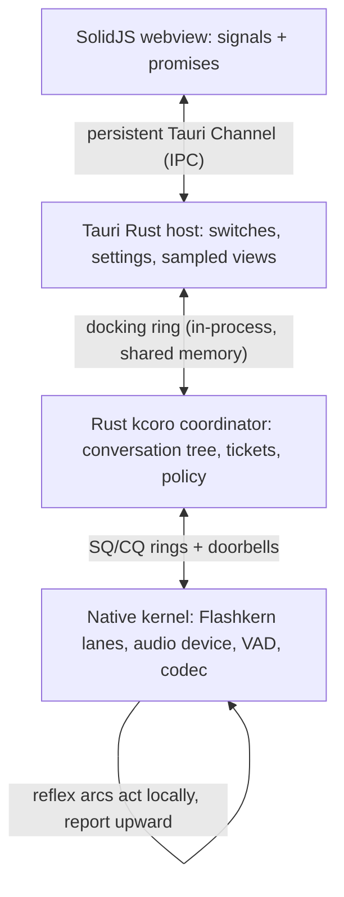

# Coordination Contract: Callbacks, the Docking Ring, and Structured Control

Status: normative contract. This document governs the Rust coordinator
direction and binds every layer boundary. Subsystem documents own their
mechanics. The package head and documents 00, 01, 03, 07, 10, 11, and 12 are
reconciled to this contract in the same implementation series.

## Implemented Foundation And First Production Mount

Commit `3a5b1431` adds `crates/kcoro` as a dependency-free Rust coordination
kernel:

- fixed task capacity, dedicated workers, bounded drain per wake, and
  generation-protected slot reuse;
- one preallocated waker per spawned task, with no coordinator allocation on
  publish, wake, or resume;
- exact-once promise arbitration with a 100,000-iteration two-cause race;
- inherited O(1)-update pause/cancel words that descendants observe by lineage;
- bounded single-owner SPSC rings with register/recheck/wake behavior;
- cache-aligned 128-byte submission and completion records. Submission carries
  only descriptor identity and policy. Completion preserves execution, state,
  publication, and cause plus up to eight inline token/codebook IDs.

Commits `2a2adcea`, `95069bd5`, and `fa35a624` add the native SQ/CQ leaf,
Flashkern mount, and retained descriptor pool. Commit `4f06a3d5` mounts the
first production Rust endpoint owner:

- one fixed-capacity broker future is the sole native SQ producer;
- one dedicated ingress thread is the sole native CQ consumer and blocks in
  the expected-value wait adapter without polling;
- callback admission uses preallocated generation-protected result slots;
- ingress validates ticket, conversation, and epoch before resolving exactly
  one slot and waking the broker continuation;
- teardown clears the C++ callback, closes bridge admission, joins ingress and
  the Rust executor, then permits native bridge/lane destruction;
- the C++ compatibility call remains synchronously blocked only because its
  current pass descriptor borrows Candle-owned tensor pointers.

The following remain open:

- replace borrowed request storage with retained native pass slots and remove
  the blocking compatibility caller;
- connect scope transitions to one exact control doorbell and bounded wake
  propagation;
- implement service-class fairness, age promotion, pinned QoS, and measured
  callback-to-continuation budgets;
- move child ticket identity and recurrence policy out of `flashkern_engine.cpp`;
- mount Tauri's persistent docking ring, native audio, and the full scope tree.

### Foundation source map

| Contract | Implemented source | Evidence |
|---|---|---|
| explicit bounded runtime lifecycle | `crates/kcoro/src/executor.rs:197-313` | zero workers/capacity/drain are rejected; stop admission is serialized before join and teardown |
| no concurrent resume and no wake-time allocation | `executor.rs:324-573` | one waker is created at spawn; state arbitration distinguishes scheduled, running, and notified |
| exact terminal claim and lost-wake-safe promise | `crates/kcoro/src/promise.rs:68-139` | one CAS winner, register/recheck future, and blocking wake ordered before user waker invocation |
| single-owner bounded SQ/CQ semantics | `crates/kcoro/src/ring.rs:141-307` | release/acquire cells, full/closed results, register/recheck async waits, no endpoint cloning |
| inherited pause/cancel epochs | `crates/kcoro/src/scope.rs:61-110` | one local word update; descendants derive the strongest ancestor control at a pass boundary |
| fixed control records | `crates/kcoro/src/protocol.rs:135-260` | 128-byte aligned cells, generation-protected descriptor identity, four terminal facts, eight inline results |
| race and lifecycle gates | `crates/kcoro/tests/terminal_race.rs:30`, `edge_runtime.rs:19`, `scope_control.rs:4`, `sq_cq.rs:20` | 100,000 terminal races plus wake, panic, stop, scope, capacity, wrap, and ABI tests |
| sole SQ producer and exact slot admission | `crates/liquid-audio/src/compute/flashkern/coordinator.rs:155-380` at `4f06a3d5` | fixed slots/ring, nonwrapping generations, no per-pass allocation, one pending native command |
| sole CQ ingress and teardown | `coordinator.rs:383-431`, `542-568`; `native_engine.rs:802-826` at `4f06a3d5` | blocking edge wait, exact identity validation, callback clearing, endpoint joins before bridge destroy |
| mounted lifecycle gates | `native_engine.rs:1551-1625` at `4f06a3d5` | missing broker rejects without a descriptor leak; 10,000 mounted passes prove SQ/CQ/descriptor/result accounting |

The exact mounted sequence, fixed capacities, synchronous borrowed-pointer
guard, and current completion facts are recorded in
[`KCORO_ARENA_INTEGRATION.md`](../../docs/native/KCORO_ARENA_INTEGRATION.md#mounted-pass-sequence-4f06a3d5).

## The Contract

1. **Everything is an edge.** The only legal waits anywhere in the stack are
   hardware callbacks, doorbell-armed ring waits, and promise/ticket
   resolution. No layer — kernel, coordinator, host, webview — discovers
   progress, completion, queue state, or lifecycle by asking again. The
   kernel's zero-spin wait words, the ticket's exactly-once terminal
   delivery, and the UI's signal subscriptions are the same rule at three
   altitudes.
2. **One open channel per boundary.** Kernel ↔ coordinator: submission and
   completion rings with doorbells. Coordinator ↔ host UI: one persistent
   in-process docking ring — command tokens down, sampled records up.
   Webview ↔ host: one persistent Tauri Channel each way; one-shot commands
   resolve as promises. No boundary grows per-action plumbing; a new
   capability is a new token kind on an existing channel.
3. **The real-time path never crosses a process boundary.** The docking ring
   is shared memory between the Tauri host and the coordinator in one
   process. The only true IPC is webview ↔ host, which carries policy bits
   and sampled state — both latency-tolerant by design.
4. **The microphone is a kernel device.** Capture, VAD, endpointing, and
   barge-in live below the ring. The host owns switches, with two distinct
   semantics that must never be conflated:
   - **privacy gate** (the user's mic switch): the device is stopped, the OS
     capture indicator is honest, zero samples enter any ring;
   - **attention gate** (coordinator policy): capture continues so barge-in
     and reference-audio logic still work, but no frame is submitted to a
     model.
   The Tauri mic control is the privacy gate. Attention gating is a
   coordinator policy token.
5. **Reflexes live below the brain.** Barge-in detection, output-epoch
   flush, and drain completion are native reflex arcs: they act first and
   inform the coordinator through the completion ring. The UI stop button is
   the slow path with global reach; the reflex is the fast path with local
   reach. Neither waits on the other.
6. **Rust coordination is monolingual.** The policy tree — sessions,
   conversations, turns, drafts, advisor branches, persistence tasks — is
   plain Rust coroutines owned by the Rust kcoro executor. FFI appears only
   at ring leaves. No cross-language frame exists anywhere in the control
   tree, which is what makes suspension and cancellation structural rather
   than negotiated.
7. **Control is structural, and it is three operations, not one.** Every
   activity is a node in a scope tree; each scope carries a shared control
   word (mode + epoch) that descendants inherit. **Park**: a parent awaits a
   promise; its children keep running, because they are what resolves it.
   **Pause**: an external freeze of a scope and all descendants — state
   kept, standing work parked at the next boundary, resumable exactly there
   (spec 10's hibernation primitive). **Cancel**: terminate the subtree,
   invalidate its epoch, release its resources. Collapsing these into one
   "suspend" deadlocks parents waiting on children they froze. Stop is O(1)
   to initiate — one control-word change plus one doorbell — and bounded by
   the longest admitted pass to complete. No teardown walks a linear chain.
8. **Realtime progress never depends on Tauri, serialized IPC, polling, or
   a monitoring loop.** Progress occurs only when an event resolves a
   registered continuation. The Rust kcoro scheduler is part of the
   resident runtime, not the host: dedicated thread(s) at pinned QoS, no
   allocation on publish/wake/resume, bounded drain per wake, exact-once
   scheduling. A Rust continuation on the token path is legitimate;
   *arbitrary* Rust on a native realtime thread is not. Standing orders
   remain the deadline instrument — a chain whose measured
   callback-to-continuation budget cannot hold becomes one native unit —
   not an ideology.
9. **Big payloads never cross; control is inline tokens.** Weights, KV,
   activations, PCM, mel, and snapshot pages stay in native memory and move
   as generation-tagged handles. Token IDs, epochs, causes, and policy bits
   are copied by value into ring cells — zero-copy is for tensors, not for
   four-byte integers.
10. **Observation is not monitoring.** Clock-driven sampling exists to serve
    eyes (the visualizer, diagnostics) and is pushed at a configured rate.
    It may be lossy, coalesced, and late. It may never gate, wake, retain,
    or backpressure anything that computes.

## Target Layer Diagram

Only the coordinator-to-kernel SQ/CQ segment has its first production mount.
The Tauri docking ring, native microphone/audio reflexes, conversation scope
tree, and observer projection in this diagram remain open.

## Target Cancellation And Suspension Semantics

- The tree: session → conversation → turn → pass / draft / branch / task.
- Each node holds a child cancellation token; a parent's cancel is a
  broadcast, observed by Rust coroutines at their next await and by the
  kernel at its next pass boundary via the epoch word.
- A cancelled speculative subtree (drafts, advisor branches) vanishes
  wholesale: marks restored, reservations released, nothing published.
- A cancelled committed turn keeps its completed passes as model thought
  (`execution=completed, state=committed, publication=stale`) — the
  four-fact terminal record from document 12 survives into the CQ record
  unchanged.
- Pause differs from cancel: state is kept, standing work is parked at the
  next boundary, and the subtree resumes exactly where it stopped. This is
  the same primitive spec 10 needs for conversation hibernation. Park is
  neither: a parked parent's children must keep running — they are what
  resolves its promise.

## Reconciliation Map

| Document | Delta |
|---|---|
| 01 | The serialized host-callback table remains for lifecycle/semantic events; the hot boundary becomes the ring ABI. Ring layout, doorbell words, and token kinds become versioned structs. |
| 03 | Coordinator ownership is Rust; native passes sample and mutate state, then CQ facts resolve the next Rust policy decision. Standing orders are an optional measured deadline tool. The fixed-lane executor contract is unchanged. |
| 07 | Sampling, state append, Depthformer, and codec stay native. Rust receives compact result IDs and chooses the next typed pass without receiving logits or payload state. |
| 10 | Rust is the coordination owner, while Tauri is only the host. Static enforcement requires zero Tauri/serialized-IPC progress edges, zero arbitrary Rust on native realtime threads, and zero numerical payload or math in Rust. |
| 12 | Ticket lifecycle ownership moves to the Rust coordinator; the three planes, the four-fact terminal record, and the observer rules carry over verbatim. |
| Mission (spec 11 head) | Realtime progress never depends on Tauri, serialized IPC, polling, or monitoring; progress occurs only when an event resolves a registered continuation. |

## Non-Goals

- No Tokio, async-std, or generic executor in the coordinator. The Rust
  kcoro executor preserves the arena semantics: fixed preallocated slots,
  exact-once completion, generation fencing, blocking worker waits,
  bounded draining, no allocation on wake paths. The committed C substrate
  is its conformance oracle; its race suites are the port's fixtures.
- No webview participation in any completion path, ever.
- No second control channel per feature. Tokens, not plumbing.
- No mic semantics where "off" means "captured but ignored."
