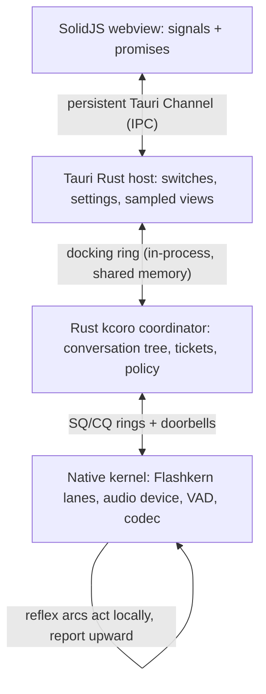

# Coordination Contract: Callbacks, the Docking Ring, and Structured Control

Status: normative contract. This document governs the Rust coordinator
direction and binds every layer boundary. Subsystem documents own their
mechanics; where an older document conflicts with this contract, the delta
list at the end names the reconciliation owed.

## The Contract

1. **Everything is an edge.** The only legal waits anywhere in the stack are
   hardware callbacks, doorbell-armed ring waits, and promise/ticket
   resolution. No layer — kernel, coordinator, host, webview — discovers
   progress, completion, queue state, or lifecycle by asking again. The
   kernel's zero-spin wait words, the ticket's exactly-once terminal
   delivery, and the UI's signal subscriptions are the same rule at three
   altitudes.
2. **One open channel per boundary.** Kernel ↔ coordinator: submission and
   completion rings with doorbells. Coordinator ↔ host UI: one persistent
   in-process docking ring — command tokens down, sampled records up.
   Webview ↔ host: one persistent Tauri Channel each way; one-shot commands
   resolve as promises. No boundary grows per-action plumbing; a new
   capability is a new token kind on an existing channel.
3. **The real-time path never crosses a process boundary.** The docking ring
   is shared memory between the Tauri host and the coordinator in one
   process. The only true IPC is webview ↔ host, which carries policy bits
   and sampled state — both latency-tolerant by design.
4. **The microphone is a kernel device.** Capture, VAD, endpointing, and
   barge-in live below the ring. The host owns switches, with two distinct
   semantics that must never be conflated:
   - **privacy gate** (the user's mic switch): the device is stopped, the OS
     capture indicator is honest, zero samples enter any ring;
   - **attention gate** (coordinator policy): capture continues so barge-in
     and reference-audio logic still work, but no frame is submitted to a
     model.
   The Tauri mic control is the privacy gate. Attention gating is a
   coordinator policy token.
5. **Reflexes live below the brain.** Barge-in detection, output-epoch
   flush, and drain completion are native reflex arcs: they act first and
   inform the coordinator through the completion ring. The UI stop button is
   the slow path with global reach; the reflex is the fast path with local
   reach. Neither waits on the other.
6. **Rust coordination is monolingual.** The policy tree — sessions,
   conversations, turns, drafts, advisor branches, persistence tasks — is
   plain Rust coroutines owned by the Rust kcoro executor. FFI appears only
   at ring leaves. No cross-language frame exists anywhere in the control
   tree, which is what makes suspension and cancellation structural rather
   than negotiated.
7. **Control is structural, and it is three operations, not one.** Every
   activity is a node in a scope tree; each scope carries a shared control
   word (mode + epoch) that descendants inherit. **Park**: a parent awaits a
   promise; its children keep running, because they are what resolves it.
   **Pause**: an external freeze of a scope and all descendants — state
   kept, standing work parked at the next boundary, resumable exactly there
   (spec 10's hibernation primitive). **Cancel**: terminate the subtree,
   invalidate its epoch, release its resources. Collapsing these into one
   "suspend" deadlocks parents waiting on children they froze. Stop is O(1)
   to initiate — one control-word change plus one doorbell — and bounded by
   the longest admitted pass to complete. No teardown walks a linear chain.
8. **Realtime progress never depends on Tauri, serialized IPC, polling, or
   a monitoring loop.** Progress occurs only when an event resolves a
   registered continuation. The Rust kcoro scheduler is part of the
   resident runtime, not the host: dedicated thread(s) at pinned QoS, no
   allocation on publish/wake/resume, bounded drain per wake, exact-once
   scheduling. A Rust continuation on the token path is legitimate;
   *arbitrary* Rust on a native realtime thread is not. Standing orders
   remain the deadline instrument — a chain whose measured
   callback-to-continuation budget cannot hold becomes one native unit —
   not an ideology.
9. **Big payloads never cross; control is inline tokens.** Weights, KV,
   activations, PCM, mel, and snapshot pages stay in native memory and move
   as generation-tagged handles. Token IDs, epochs, causes, and policy bits
   are copied by value into ring cells — zero-copy is for tensors, not for
   four-byte integers.
10. **Observation is not monitoring.** Clock-driven sampling exists to serve
    eyes (the visualizer, diagnostics) and is pushed at a configured rate.
    It may be lossy, coalesced, and late. It may never gate, wake, retain,
    or backpressure anything that computes.

## Layer Diagram

## Cancellation and Suspension Semantics

- The tree: session → conversation → turn → pass / draft / branch / task.
- Each node holds a child cancellation token; a parent's cancel is a
  broadcast, observed by Rust coroutines at their next await and by the
  kernel at its next pass boundary via the epoch word.
- A cancelled speculative subtree (drafts, advisor branches) vanishes
  wholesale: marks restored, reservations released, nothing published.
- A cancelled committed turn keeps its completed passes as model thought
  (`execution=completed, state=committed, publication=stale`) — the
  four-fact terminal record from document 12 survives into the CQ record
  unchanged.
- Pause differs from cancel: state is kept, standing work is parked at the
  next boundary, and the subtree resumes exactly where it stopped. This is
  the same primitive spec 10 needs for conversation hibernation. Park is
  neither: a parked parent's children must keep running — they are what
  resolves its promise.

## What This Changes (deltas owed)

| Document | Delta |
|---|---|
| 01 | The serialized host-callback table remains for lifecycle/semantic events; the hot boundary becomes the ring ABI. Ring layout, doorbell words, and token kinds become versioned structs. |
| 03 | Coordinator ownership moves to Rust; native recurrence is re-expressed as standing orders. The fixed-lane executor contract is unchanged. |
| 07 | Recurrence mechanics stay native and unchanged; the decision inputs (budgets, priorities, epochs) arrive as standing-order parameters. |
| 10 | Rust is no longer "control-only"; it is the coordination owner. Static enforcement rewords from "no per-token FFI" to "zero Tauri crossings and zero serialized IPC for realtime progress; zero arbitrary Rust on native realtime threads," and the no-math rule is unchanged. |
| 12 | Ticket lifecycle ownership moves to the Rust coordinator; the three planes, the four-fact terminal record, and the observer rules carry over verbatim. |
| Mission (spec 11 head) | "Recur inside the native coordinator without returning to Rust per token/frame" becomes "realtime progress never depends on Tauri, serialized IPC, polling, or monitoring; progress occurs only when an event resolves a registered continuation." |

## Non-Goals

- No Tokio, async-std, or generic executor in the coordinator. The Rust
  kcoro executor preserves the arena semantics: intrusive storage,
  exact-once completion, generation fencing, address-based sleeping,
  bounded draining, no allocation on wake paths. The committed C substrate
  is its conformance oracle; its race suites are the port's fixtures.
- No webview participation in any completion path, ever.
- No second control channel per feature. Tokens, not plumbing.
- No mic semantics where "off" means "captured but ignored."
