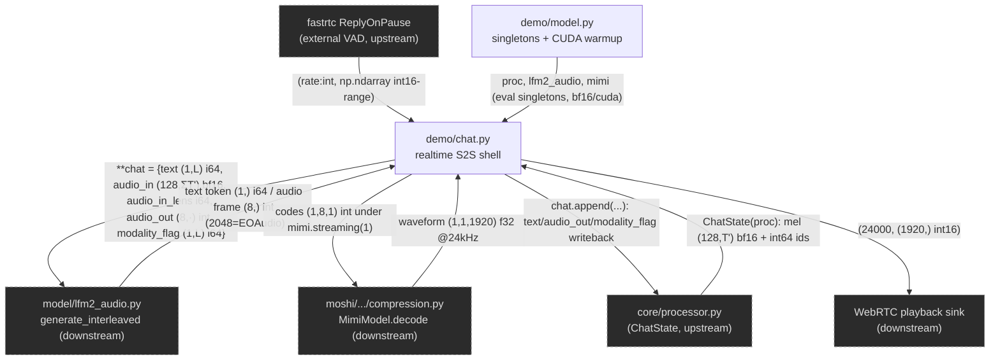

<!-- topic: Runtime & Demo -->
# Realtime runtime + turn-taking

This folder (`liquid_audio/demo/`) is the **orchestration shell** that lets a human talk to the 1.5B LFM2-Audio model in real time. It owns turn-taking (mic VAD), assembles the `ChatState` prefill bundle, drives `LFM2AudioModel.generate_interleaved` as a synchronous streaming generator, and routes each yielded item to either text display or streaming Mimi audio decode. **Neither file contains model math** — `model.py` is a singleton loader + CUDA warmup, `chat.py` is producer/consumer glue. Both are explicitly *off* the LFM2-Audio inference tensor path; they exist so the expensive loads happen once and a turn streams out frame-by-frame instead of batching to a single WAV.

## Component flowchart

> Dashed nodes are neighbors in other folders (edge stubs); solid nodes (`model.py`, `chat.py`) are this folder's components and hyperlink to their specs.

## Components

| Component | File | dtype in -> out | Role | Spec |
|---|---|---|---|---|
| `demo_chat` | `demo/chat.py` | **in:** mic `(rate:int, np.ndarray int16-range)` + persistent `ChatState` `{text (1,L) i64, audio_in (128,ΣT') bf16, audio_in_lens i64, audio_out (8,·) int, modality_flag (1,L) i64}` -> **out:** streamed text token `(1,)` i64; audio code frame `(8,)` int (0..2048, 2048=EOAudio); decoded waveform `(1920,)` f32 @24kHz yielded as `(24000, (1920,) int16)` | Realtime S2S demo shell: fastrtc `ReplyOnPause` turn-taking (external VAD, `can_interrupt=False`), Thread + `queue.Queue` producer/consumer, `ChatState` prefill assembly, drives `generate_interleaved` as a sync streaming generator, streaming Mimi decode per audio frame | [./chat.md](DM01-Realtime-Chat) |
| `demo_model` | `demo/model.py` | **in:** `HF_DIR` str + snapshot weights (bf16 backbone `model.safetensors`, fp32 Mimi module); warmup `torch.randint` -> i64 codes `(1,8,1)` device=cuda -> **out:** three `eval()` singletons `proc` (`LFM2AudioProcessor`), `lfm2_audio` (`LFM2AudioModel`, bf16/cuda, attn=flash\|sdpa), `mimi` (`MimiModel` alias); warmup `mimi.decode` -> f32 `(1,1,1920)` @24kHz discarded | Singleton loader / warmup: constructs `proc`, `lfm2_audio`, `mimi` (=`proc.mimi`) at import time and runs a 5-iteration CUDA warmup of Mimi streaming decode. Pure orchestration, no model math | [./model.md](DM02-Demo-Singletons) |

## How it fits

**Enters this folder:** a mic turn as `(rate:int, np.ndarray int16-range)` (24 kHz from the WebRTC stream), gated by `fastrtc.ReplyOnPause`'s external VAD — the demo never implements VAD itself, and `can_interrupt=False` means a turn must complete before the next is accepted (no barge-in). `chat.py` normalizes that to f32, mel-encodes it through the upstream **[core/processor.py](CO01-Processor-ChatState)** (`ChatState(proc)` → `audio_in (128,T')` bf16 + int64 text ids), and splats the 5-key bundle into the model.

**Leaves this folder:** per turn, a streamed pair of (a) text tokens `(1,)` i64 decoded incrementally for the Gradio textbox, and (b) waveform chunks yielded as `(24000, (1920,) int16)` to the WebRTC playback sink (1920 = 24000 Hz ÷ 12.5 Hz Mimi frame). The assistant's emitted `text`/`audio_out (8,·) int`/`modality_flag` are also written back via `chat.append(...)` so the next turn's prefill carries conversation history.

**Upstream/downstream wiring:**
- **Upstream:** `fastrtc.ReplyOnPause` (mic + external VAD) and **[core/processor.py](CO01-Processor-ChatState)** (`ChatState`, mel front-end, tokenizer, Mimi handle). `demo/model.py` is the internal upstream that constructs the three singletons `chat.py` imports.
- **Downstream:** **[model/lfm2_audio.py](MD01-LFM2AudioModel)** `generate_interleaved` (the real inference engine this shell drives), **[moshi/.../compression.py](MM01-Mimi-Codec)** `MimiModel.decode` under `mimi.streaming(1)` for per-frame waveform, and the WebRTC sink for playback. Writeback returns to **[core/processor.py](CO01-Processor-ChatState)**.

## Off the inference path

Both components in this folder are **off the LFM2-Audio inference tensor path** — flagged "On the LFM2-Audio inference path: no" in their specs:
- **`demo/model.py`** is pure load-ordering + a CUDA warmup loop (5× throwaway `mimi.decode` on random codes to pay CUDA-graph / `torch.compile` / cuDNN-algo costs eagerly). No forward pass, attention, conv, quantization, or sampling. It is **not ported to Rust**.
- **`demo/chat.py`** is producer/consumer glue: turn-taking, queue plumbing, `ChatState` assembly, and routing — the neural math lives in the components it *drives* (`generate_interleaved`, the conformer/mel front-end, Mimi). `demo/` is explicitly outside the Python↔Rust parity surface; its Rust counterpart (`examples/mic_chat.rs`) is a faithful headless re-expression, not a numerically-graded port.

Both files are also **CUDA-pinned** as shipped (`device="cuda"` hard-coded in `model.py`'s warmup and `chat.py`'s writeback), so the Python demo will not boot CPU-only; the Rust port is the device-agnostic equivalent.
