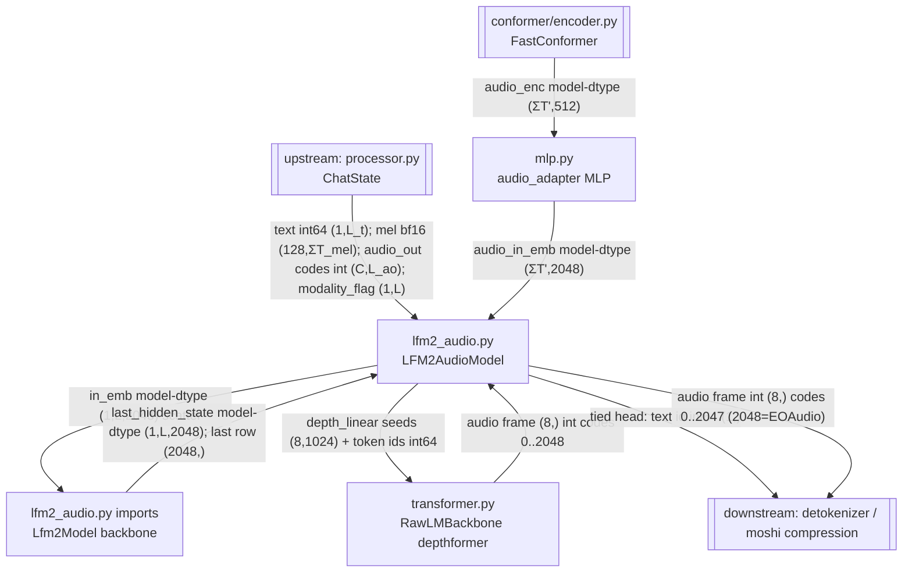

<!-- topic: Model -->
# LFM2-Audio model graph

This folder is the **neural core** of LFM2.5-Audio: the modules that turn an assembled mixed-modality `ChatState` into an interleaved stream of text tokens and 8-codebook audio frames. `lfm2_audio.py` (`LFM2AudioModel`) is the top-level orchestrator — it owns the HF `Lfm2Model` hybrid backbone, the `audio_adapter` MLP that bridges the FastConformer encoder into embedding space, the flat audio-token `SharedEmbedding`, and the depthformer audio head — and wires them into one autoregressive loop (`_prefill` modality-scatter → backbone step → tied text head **or** depthformer `_sample_audio_frame`). Everything here is **on the LFM2-Audio inference path**; the FastConformer audio encoder lives in the `conformer/` subfolder (upstream), and codec/waveform synthesis lives one level up (downstream).

## Wiring (this folder)

Reading the loop: `_prefill` scatter-assembles `in_emb (1,L,2048)` from three sources (text via `embed_tokens`, audio-in via conformer→MLP, audio-out via summed `audio_embedding`), the **backbone** returns the all-position hidden, the **last row** drives either the tied text head (reusing `embed_tokens.weight`) or `depth_linear` → the **depthformer**, and each emitted text id / audio frame is re-embedded and fed back to the backbone for the next step.

## Components

| Component | File | dtype in -> out | Role | Spec |
|---|---|---|---|---|
| `LFM2AudioModel` | `model/lfm2_audio.py` | in: ChatState — text int64 `(1,L_t)`, mel bf16 `(128,ΣT_mel)`, audio_out int `(C,L_ao)`, modality_flag `(1,L)`; out: stream of text id int64 `(1,)` and audio frame int `(8,)` codes 0..2048 (2048=EOAudio) | Top model: `_prefill` modality-scatter; `generate_interleaved`/`generate_sequential`; tied text head + depthformer 8-codebook audio head; `_sample_audio_frame`. Owns the modality state machine and special tokens (7/128/130, EOAudio=2048). | [./lfm2_audio.md](MD01-LFM2AudioModel) |
| `Lfm2Model` (HF backbone) | `model/lfm2_audio.py` imports `transformers.Lfm2Model` | in: `inputs_embeds` model-dtype `(1,L,2048)` (int64 ids via `embed_tokens`); out: `last_hidden_state` model-dtype `(1,L,2048)` post `embedding_norm` | HF LFM2 hybrid backbone: 16 layers (10 gated short-conv + 6 GQA attention), RMSNorm (f32 weight-multiply order), qk-RMSNorm, half-split RoPE θ=1e6, SwiGLU FFN, final `embedding_norm`. Bare model, **no lm_head** — consumers project the hidden themselves. | [./lfm2_backbone.md](MD02-LFM2-Backbone) |
| `MLP` (`audio_adapter`) | `model/mlp.py` | in: model-dtype (bf16 GPU / f32 CPU) `(ΣT',512)`; out: model-dtype `(ΣT',2048)` | `LayerNorm(512) → Linear(512→2048) → GELU(exact-erf) → Linear(2048→2048)`; bridges FastConformer `feat_out` into the LFM2 backbone embedding space. Also the generic `MLP` class. | [./mlp.md](MD03-Audio-Adapter-MLP) |
| `RawLMBackbone` (depthformer) | `model/transformer.py` | in: model-dtype hidden `[1,1,1024]` per step; backbone hidden `(2048,)` via `depth_linear` seeds `[8,1024]`; token ids int64. out: audio frame `(8,)` int codes 0..2048 (2048=EOAudio); per-step logits `(2049,)` | Depthformer audio head: RMSNorm (f32 weight-multiply order) + SwiGLU GLU + GQA MHA with qk-RMSNorm + interleaved RoPE (θ=1e6) + `StandardBlock`/`SharedEmbedding`/`ConcatKvCache`. 6 layers × 1024 dim, 32 q-heads / 8 kv-heads, head_dim 32; sampled 8 codebooks/frame coarse-to-fine in `_sample_audio_frame`. | [./transformer.md](MD04-Depthformer) |

## How it fits

**Enters this folder:** a `ChatState` from the upstream [core processor](CO01-Processor-ChatState) — `text int64 (1,L_t)`, concatenated `mel bf16 (128,ΣT_mel)`, `audio_out` codes `int (C,L_ao)`, and a `modality_flag (1,L)` (TEXT=1 / AUDIO_IN=2 / AUDIO_OUT=3). Audio-in mel is encoded by the sibling [FastConformer](CF01-Conformer-Encoder) (`(B,128,T)` → `(B,512,T')`, 8× subsample) and reshaped to a flat `(ΣT',512)` before it reaches the `audio_adapter` MLP; everything else flows in directly.

**Leaves this folder:** the `generate_*` generator yields, per step, either a **text id** `int64 (1,)` (detokenized to a string) or an **audio frame** `int (8,)` of codes `0..2047` (a `2048`/EOAudio in codebook 0 forces the whole frame to 2048 and ends the audio turn). Those audio frames flow downstream to the [core detokenizer](CO02-Detokenizer) (LFM2 ISTFT vocoder) or the [moshi compression](MM01-Mimi-Codec) `MimiModel.decode`, routed via the processor's `decode()`, producing an f32 waveform @ 24 kHz.

**Internal dtype contract:** the backbone and depthformer run in model dtype (bf16 on CUDA/Metal, **f32 on CPU** — candle has no CPU bf16 matmul) with f32 islands for every RMSNorm (normalize → **weight-multiply in f32** → cast), attention softmax, and RoPE. Weights ship bf16 on disk. Audio codes are `int` (Python int64 / Rust u32); mel arrives bf16 in the `ChatState`.

## What's NOT here / off-path notes

- All four components in this folder are **on the LFM2-Audio inference path**. There is no Moshi LM, conditioner, transport, or training-only module in this folder.
- The **FastConformer encoder** is a real upstream dependency but lives in the `conformer/` subfolder (its own doc set under `./conformer/`), not at this folder level.
- Within these files, the **training surface is off the inference path**: `LFM2AudioModel.forward`/`logits` (teacher-forced loss, `audio_loss_weights`) in `lfm2_audio.py` exist for inventory only and are never called during generation.
- The **Moshi stack** (`../moshi/models/lm.py` Moshi LM, conditioners, SEANet/Mimi quantization, transport/server) is a *separate* model family. Only the Mimi **codec `decode`** path is referenced from here, as one of two downstream waveform synthesizers; the Moshi LM itself is not on the LFM2-Audio graph.
