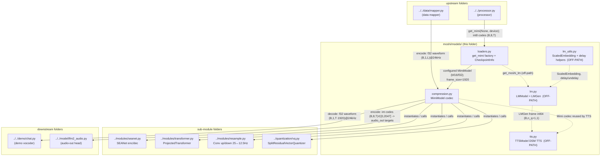

<!-- topic: Mimi Codec — Models -->
# Mimi codec model + Moshi LM

`liquid_audio/moshi/models/` is the **top-level model layer of the vendored Kyutai `moshi` package**. It holds two distinct things: (1) the **Mimi neural audio codec** (`compression.py` + its `loaders.py` factory) — the learned, streaming residual-VQ transform between a 24 kHz waveform and 8 integer codebook streams that LFM2.5-Audio borrows as a peripheral codec; and (2) the **Moshi 7B multi-stream LM** (`lm.py`, `lm_utils.py`, `tts.py`) — a *different* model that LFM2-Audio does **not** run. Only Mimi (`compression.py` + `loaders.py`) is on the LFM2-Audio inference path; everything LM-shaped here is reference-only and carried solely because the package is imported wholesale for the codec.

## Component flowchart

Solid edges are the on-path Mimi codec wiring; dotted edges are the off-path Moshi-LM cluster (reference only, see below).

## Components

| Component | File | dtype in → out | One-line role | Spec |
|---|---|---|---|---|
| Mimi codec | `compression.py` | **decode:** int codes `(B,8,T)` ∈ `[0,2047]` (Rust u32) → f32 waveform `(B,1,T·1920)`@24kHz · **encode:** f32 waveform `(B,1,L)`@24kHz → int codes `(B,8,T)` | `MimiModel` orchestrator: SEANet enc/dec + enc/dec transformers + split-RVQ + conv framerate bridge (25↔12.5 Hz); `encode`/`decode`/`forward` + CUDA-graphed streaming. `frame_size=1920`. | [./compression.md](MM01-Mimi-Codec) |
| Mimi factory | `loaders.py` | `filename: Path\|None`, `device`, `num_codebooks=8` → configured `MimiModel` (bf16/f32 weights) | Assembles SEANet + 2× `ProjectedTransformer` + `SplitResidualVectorQuantizer` from frozen kwargs dicts; pins `SAMPLE_RATE=24000`, `FRAME_RATE=12.5`, `hop_length=960`, `encoder_frame_rate=25`, resample stride 2; `set_num_codebooks(8)`. Off-path `CheckpointInfo` + `get_moshi_lm` live here too. | [./loaders.md](MM02-Mimi-Loaders) |
| Moshi LM **(off-path)** | `lm.py` | `codes` int64 `[B,n_q+1,T]` (train) → `LMOutput.logits` `[B,dep_q,T,card]` + `text_logits` `[B,1,T,text_card]`; `LMGen.step` frame int64 `[B,n_q+1,1]` or `None` (warmup) | Moshi 7B multi-stream LM (text + `n_q` audio streams) + depformer audio head + `LMGen` streaming driver. A **different model** from LFM2-Audio; reference only. | [./lm.md](MM03-Moshi-LM) |
| Moshi LM helpers **(off-path)** | `lm_utils.py` | int64 token ids `(...,)` → model-dtype embeddings `(...,D)`; codes `(B,K,T)` → undelayed + bool mask | `ScaledEmbedding` (zero-mask / optional LayerNorm / low-rank / second-stream demux), acoustic-codebook delay/undelay shifters, trunc-normal init. Consumed only by the Moshi LM + TTS. | [./lm_utils.md](MM04-Moshi-LM-Utils) |
| Moshi TTS **(off-path)** | `tts.py` | script `list[str]` + voice safetensors `speaker_wavs` f32 `[1,S,D]` → `TTSResult.frames` list of int64 `[B,1+Q,1]` (acoustic-delay-corrected audio+text codes) | DSM text-to-speech wrapper: script tokenization, `StateMachine` word-alignment co-generation, acoustic delays, prefix/voice conditioning over the Moshi LM + Mimi codec. Vendored Moshi; no Rust port. | [./tts.md](MM05-Moshi-TTS) |

## How it fits

**On-path (Mimi only).** What *enters* this folder on the LFM2-Audio inference path is one of two things: the processor calls `get_mimi(None, device)` (`loaders.py`) to build an uninitialized `MimiModel` and then injects the bf16→model-dtype Mimi state dict itself; and the data mapper feeds **f32 waveform `(B,1,L)` @ 24 kHz** into `MimiModel.encode` (`compression.py`). What *leaves* is symmetric: `encode` emits **int codes `(B,8,T)` ∈ `[0,2047]`** (the canonical 8-codebook `audio_out` training targets), and `decode` emits **f32 waveform `(B,1,T·1920)` @ 24 kHz** (one 1920-sample chunk per frame in the streaming demo). Upstream connects to `../../processor.py` (codec owner) and `../../data/mapper.py` (target encoder); downstream connects to `../../model/lfm2_audio.py` (the depthformer audio head whose codes feed back here for loss/decode) and `../../demo/chat.py` (the fallback streaming vocoder used when no LFM2 ISTFT detokenizer ships). The codec body delegates its actual signal path to the sub-module folders: `../modules/seanet.py`, `../modules/transformer.py`, `../modules/resample.py`, and `../quantization/vq.py`. Note that Mimi is **audio-out only** — microphone input never touches it (it goes through the conformer mel front-end); Mimi-encode exists solely to build training targets.

**Off-path (everything LM-shaped).** `lm.py` (`LMModel` + `LMGen`), `lm_utils.py` (`ScaledEmbedding` + delay/undelay), and `tts.py` (`TTSModel`) are **not on the LFM2-Audio inference path**. They implement the standalone **Moshi 7B** model and its DSM TTS, a different architecture: LFM2-Audio brings its own HF `Lfm2Model` backbone and its own depthformer head and never instantiates `LMModel`, never tokenizes a "script", and emits its 8 audio codebooks in lockstep with **no inter-codebook delay** (the `[0,0,1,1,…]` delay pattern in `loaders.py` belongs to the Moshi LM, not Mimi and not LFM2-Audio — do not conflate). These three files are carried only because the whole `moshi` package is imported for the codec. In the Rust port they are reused as the published Kyutai `moshi` crate (or, for `lm.py`/`lm_utils.py`/`tts.py`, not ported at all); the `core` parity scope excludes all of `moshi/**` beyond what the codec needs. The off-path `CheckpointInfo` and `get_moshi_lm` helpers also physically live in `loaders.py`, but only its `get_mimi` builder is reached at LFM2-Audio inference time.
