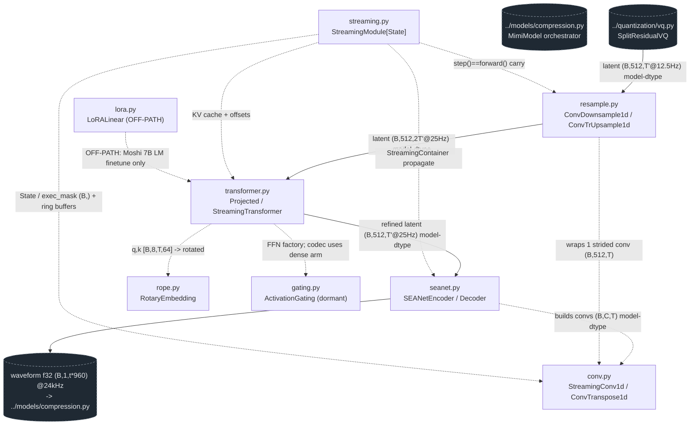

<!-- topic: Mimi Codec — Modules -->
# Codec / transformer building blocks

This folder holds the **leaf neural primitives of the Mimi codec** — the convolutional, transformer, positional, resampling, and streaming-state building blocks that the higher-level `MimiModel` ([../models/compression.md](MM01-Mimi-Codec)) wires together into the audio tokenizer/detokenizer for LFM2.5-Audio. Nothing here is the LFM2-Audio language model; these modules turn a 24 kHz waveform into a 512-dim continuous latent (and back), which the split-RVQ quantizer ([../quantization/vq.md](QZ01-Split-RVQ)) codes into the 8-codebook frames the LM generates over. On the live inference path the **decode** direction is what runs: generated code frames → quantizer decode → resample up → decoder transformer → SEANet decoder → 24 kHz audio, frame-by-frame inside `mimi.streaming(1)`. The encode direction (waveform → codes) runs only at training-data prep.

## Component wiring

Solid arrows = the on-path decode signal flow (continuous latents, model dtype). Dashed arrows = substrate/composition (one module instantiates or is a pure function called by another) and the no-tensor streaming-state plumbing (`streaming.py` hands every leaf its `State`/`exec_mask` + ring buffers). The encode direction is the mirror of the solid path (waveform → SEANet encoder → transformer → downsample → quantizer) and runs only at training-data prep.

## Components

| Component | File | dtype in -> out | One-line role | Spec |
|---|---|---|---|---|
| SEANetEncoder/Decoder | `seanet.py` | dec: latent (B,512,t) model-dtype @25Hz -> waveform (B,1,t·960) f32 @24kHz; enc: waveform (B,1,T) f32 @24kHz -> latent (B,512,T/960) model-dtype @25Hz | Causal conv-stack codec ends (waveform⇄512-dim 25Hz latent, hop 960); ELU + dilated residual, weight-norm folded. Decoder runs at inference, encoder at training prep. | [./seanet.md](MO01-SEANet) |
| StreamingConv1d / ConvTranspose1d | `conv.py` | model-dtype (B,C,T) -> (B,C_out,T'); enc input waveform f32 (B,1,T)@24kHz; dec transpose -> waveform f32 (B,1,T')@24kHz | Mimi's 1-D conv primitives: causal asymmetric padding, streaming-state ring buffers, weight-norm fold. The conv substrate of SEANet and the resamplers. | [./conv.md](MO02-Streaming-Conv) |
| ProjectedTransformer / StreamingTransformer | `transformer.py` | model-dtype latent [B,512,T'] (conv_layout) + int64 positions -> refined latent [B,512,T'] | Mimi codec enc/dec transformer: RoPE + SDPA streaming MHA (8 heads, d_model 512, head_dim 64), pre-LN LayerNorm, LayerScale 0.01, 250-step ring KV cache, gelu FFN. Also defines off-path `StreamingTransformer` for the Moshi LM. | [./transformer.md](MO03-Codec-Transformer) |
| ConvDownsample1d / ConvTrUpsample1d | `resample.py` | model-dtype (B,512,T@25Hz) -> (B,512,T/2@12.5Hz) down; (B,512,T'@12.5Hz) -> (B,512,2T'@25Hz) up | Learnt strided-conv frame-rate bridge: 25Hz⇄12.5Hz between SEANet latent and split-RVQ (downsample before quantize, depthwise transposed-conv upsample after decode). | [./resample.md](MO04-Framerate-Resample) |
| RotaryEmbedding / apply_rope | `rope.py` | q/k model-dtype [B,8,T,64] + int64 offset [B] -> rotated qo/ko (v untouched) | RoPE primitive: interleaved GPT-J rotary, theta 10000, rotation math in f32; injects relative position into q/k before SDPA in the codec transformer. | [./rope.md](MO05-RoPE) |
| StreamingModule[State] | `streaming.py` | no tensor in/out; allocates bool exec_mask (B,) + subclass ring buffers (model-dtype) | Base streaming state-machine API (State / StreamingModule / StreamingContainer): per-stream buffers + exec_mask, context-managed `streaming()`/`reset_streaming()` state tree the codec submodules inherit. | [./streaming.md](MO06-Streaming-Module) |
| ActivationGating / make_gating | `gating.py` | model-dtype (B,T,dim) -> (B,T,dim); codec dim=512 | Gated FFN (GLU/SwiGLU) factory for the Kyutai TransformerLayer. **Dormant on this path**: the codec sets `gating="none"` so the dense `linear1/act/linear2` arm runs; the gated arm is reached only by the off-path Moshi 7B LM. | [./gating.md](MO07-Gating) |
| LoRALinear | `lora.py` | bf16 (B,T,in) -> bf16 (B,T,out); merged weight bf16 (out,in) | Low-rank adapter + fuse helpers for the Moshi 7B LM finetune. **OFF the LFM2-Audio path** (LFM2-Audio uses its own HF backbone/depthformer); no Rust port. | [./lora.md](MO08-LoRA) |

## How it fits

**What enters this folder (decode / on-path):** reconstructed continuous latent `(B,512,T'@12.5Hz)` in model dtype (bf16 on CUDA/Metal, f32 on Rust CPU) handed up by the split-RVQ quantizer's `.decode()` ([../quantization/vq.md](QZ01-Split-RVQ)), orchestrated by `MimiModel.decode`/`_decode_frame` ([../models/compression.md](MM01-Mimi-Codec)). Those latents originate one stage further up as the 8-code frames the LFM2-Audio depthformer head emits (codes 0..2047, 2048=EOAudio) — but the integer codes are gone by the time they reach this folder; only continuous latents flow through these modules.

**What leaves (decode):** waveform `(B,1,t·960)` **f32 @ 24 kHz** out of the SEANet decoder, returned to `MimiModel` and ultimately to `core_processor` / the demo audio sink (one `(1,1,1920)` chunk per streaming step). Internally the path is `resample.py` (12.5→25 Hz upsample) → `transformer.py` (decoder transformer, RoPE via `rope.py`) → `seanet.py` (latent → waveform, built on `conv.py`), with `streaming.py` supplying every leaf's per-frame ring buffers so chunked decode is bit-identical to a one-shot pass.

**Upstream / downstream folders:** upstream is the quantizer ([../quantization/vq.md](QZ01-Split-RVQ)); both directions are driven by the codec orchestrator ([../models/compression.md](MM01-Mimi-Codec)), which is what the rest of the system (`core_processor`, the demo/server loops) actually calls. The encode mirror connects the same folder back to the quantizer (latent → downsample → RVQ) and runs only at training-data prep.

## Off the LFM2-Audio inference path

Two of the eight modules do not run on the live LFM2-Audio path:

- **`lora.py` (LoRALinear) — fully off-path.** It is Kyutai's LoRA adapter for the Moshi 7B LM finetune. LFM2.5-Audio uses its own HF `Lfm2Model` backbone and depthformer, neither of which contains a `LoRALinear`; this module is reached only through the reference Moshi LM loader and has no Rust port.
- **`gating.py` (ActivationGating) — on-path file, dormant arm.** The codec transformer dispatches FFN construction through `make_gating`, but the Mimi config pins `gating="none"`, so the gated GLU/SwiGLU branch is never instantiated for codec inference (the dense `linear1 → act → linear2` arm runs instead). The gated arm is exercised only by the off-path Moshi 7B LM (`gating="silu"`).

Additionally, `transformer.py` also *defines* a `StreamingTransformer` used by the off-path Moshi LM, and the **encoder** halves of `seanet.py` / `resample.py` / `transformer.py` run only at training-data prep, not at live inference — the decode halves are the on-path ones.

> Implementation note: this entire folder is **reused, not re-ported**, in the Rust runtime — `liquid-audio-rs` depends on Kyutai's published `moshi` crate (v0.6.4) for the Mimi codec rather than re-implementing the vendored Python here (the `rvq_first`/`rvq_rest` weight naming this checkpoint uses can't load via candle-transformers' Mimi). See each spec's "Python ↔ Rust" section for the symbol map and deliberate divergences (device/dtype-agnostic, no CUDA graphs, no-reflect padding, depthwise→block-diagonal conv rewrite).
